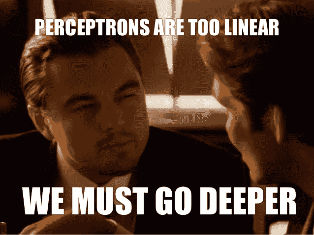

# 激活功能——神经元是死是活！！

> 原文：<https://medium.com/analytics-vidhya/activation-functions-neuron-is-dead-or-alive-c336dca09570?source=collection_archive---------18----------------------->

大家好！在这篇中型文章中，我们将讨论激活函数。

> **什么是激活功能？**

现在，神经网络得到了很多关注。原因是，他们能够解决许多现实生活中的问题，如人脸识别，狗猫分类器，手语识别等等。

**神经网络如何学习的基本思想是**

我们有一些输入数据，我们把它输入到网络中，然后我们一层一层地执行一系列操作，得出一个输出。对于特定层的一个简单情况是，我们将输入乘以权重，添加偏差并应用激活函数(简单的数学函数),然后将输出传递给下一层。我们不断重复这个过程，直到我们到达最后一层。最终值是我们的输出。然后，我们计算“计算输出”和“真实输出”之间的误差，然后计算该误差相对于每层参数的偏导数，并相应地不断更新参数！


现在想象一下，如果没有激活功能呢？

> **一个没有激活功能的世界！！**
> 
> **神经元读新闻标题**
> 从现在开始我们将简单地执行简单的线性运算即:将输入乘以权重，加上偏差，并对到达神经元的所有输入求和。
> 
> **神经元思考标题**
> 
> 1.我想不想被激活怎么办？
> 
> 2.在某些情况下，上面导出的输出可能会取较大的值。当这个输出被输入到下一层时，它们可以被转换成更大的值，使得计算变得不可控。我的天啊。！
> 
> 3.如果我需要对数据进行非线性处理呢？

因此，神经元似乎很担心，但这是一个假新闻，神经元现在放心了！！

阅读新闻标题给我们一个想法，激活功能是什么，它做什么？让我们试着去理解。

**了解 1 号担忧**

想象一下，你不小心把手放在火里，现在在人体内，发生的事情是某组神经元被激活，信号被发送到大脑，所以我们把手收回，这样手就不会受到进一步的伤害！！

但是，神经元是如何被激活的呢？对应于热量的输入，该组特定的神经元被激发/激活。

类似地，当我们得到某个输入，可以是图像、文本、语音、任何数据，那么在经过训练的神经网络中，一些神经元将被激发，一些不被激发。激活功能决定了这一点。好吧，为了更好地理解，让我们假设我们有猫的分类问题，我们的神经网络简单地有一个输入层，一个隐藏层，一个输出层(只是为了理解)，输入层有 2 个神经元，隐藏层有 2 个神经元，输出层有一个神经元，它告诉它是否是猫。现在，当它是猫时，可能会选择红色路径(如下图所示),如果它不是猫，则采用绿色路径。


因此，当输入是猫图像时，红色路径的神经元必须被激活，如果输入不是猫图像，绿色路径的神经元必须被激活。这种激活是由激活函数决定的。

> **结论:** 激活函数决定神经元是否必须被激活。

**解忧二号**

简单地将输入乘以权重，加上一个偏差，并对到达神经元的所有输入求和，将得到从-无穷大到+无穷大的值，这肯定会使事情在计算上不可控。因此，激活功能限制了输出值。

> **结论:** 激活功能将输出限制在一定范围内。范围取决于选择的激活功能。
> 简单地说，我们可以说激活函数使数据标准化。

**了解 3 号担心**

当我们将输入乘以相应的权重，然后添加一个偏差时，这只是一个线性方程，如果我们正在解决线性回归问题，这将是可行的，但我们也有机器学习！因此，实际工作中的 max 问题具有非线性数据，因此激活函数将使数据非线性化。好的，让我们看一下用例，数据是这样的(如下图所示)。


现在，如果没有激活函数，那么它将尝试拟合直线，就像这样(如下所示)，因为如果没有激活函数，就不会有非线性。


在这里，我们可以看到，它符合一条线性线，但由于可能有错误分类的情况。这里，我还是画了一个非线性程度较低的数据集，但实际上，非线性程度会更高。

如果，我应用了一些激活函数(比如 sigmoid —将只在这篇中等文章中讨论)，那么它是更好的分类(如下所示)。


> **结论:** 激活函数可以线性化和非线性化数据。

因此，这给了我们主要 3 个激活功能的任务

> 1.决定神经元是否会被激发
> 2。使数据正常化，防止计算失控。
> 3。线性化或非线性化数据。

注:如果激活函数应用于输出层，则称为输出函数。

**良好激活功能的属性**

> 1.它必须是可微的，即它的导数必须存在，因为我们需要在反向传播中找到导数。
> 2。它必须是单调的，也就是说，它要么完全不增加，要么完全不减少。单调性标准有助于神经网络更容易地收敛到更准确的分类器中。

希望你对激活功能有所了解。现在，我们将讨论不同类型的激活函数。


主要有 3 种类型

> 1.二元阶跃函数
> 2。线性函数
> 3。非线性函数

1.  **二元阶跃函数**

二元阶跃函数俗称“阈值函数”。这是一个非常简单的功能。

如果输入值为负，则输出为零，否则输出为 1。

如果我们想把输出分成两类，这是我们想到的最常见的激活。它更像是一个 if-else 条件。


**方程式:**


**‘x’的范围:** (-∞，+∞)

**‘y’的范围:** {0，1}

**导数(dy/dx) =** 0

**Python 代码:**

```
def binary_step(x):
        if x>=0:
            return 1
        else:
            return 0
```


现在，在我们看到的缺点中，它只能处理两类，这意味着如果我们正在进行癌症测试，那么它将预测一个人是否患有癌症，但如果一个人患有癌症，它将无法判断癌症处于哪个阶段？

**2。线性函数**


我们看到了阶跃函数的问题，函数的梯度变为零。这是因为二进制阶跃函数中没有 x 的分量。我们可以用线性函数代替二元函数。

**方程式:** y = mx + c

**x 的范围:** (-∞，+∞) |这里的“x”表示激活函数的输入，它是输入与权重相乘然后加上偏差的总和

**y 的取值范围:** (-∞，+∞) |这里的‘y’表示输入‘x’时激活函数的输出。换句话说，它是下一层神经元的输入。

**导数(dy/dx) =** m

**Python 代码:**

```
c = int(input())
m = int(input())def linear(x):
    return m*x + c
```


> 具有线性激活函数的神经网络是简单的线性回归模型。



**3。非线性函数**

现在，谈到非线性函数，它们是我们将在深度学习中大量使用的函数。最棒的是

*   它们是非线性的，因此可以处理复杂的数据。
*   导数是可能的，它不是零或常数，像二元阶跃函数(导数是零)和线性函数(导数是斜率，斜率是常数)，所以权重更新会很好地发生。
*   通常使用这些激活功能。

现在，主要有 10 个非线性激活函数，如:sigmoid，tanh，relu，elu，leaky relu，prelu，softmax，softplus，swish，maxout。

谈这 10 个，都各有特点。

**注:**没有激活函数的好坏，只是看用例、数据集和实验。