# 激活函数、优化技术和损失函数

> 原文：<https://medium.com/analytics-vidhya/activation-functions-optimization-techniques-and-loss-functions-75a0eea0bc31?source=collection_archive---------5----------------------->

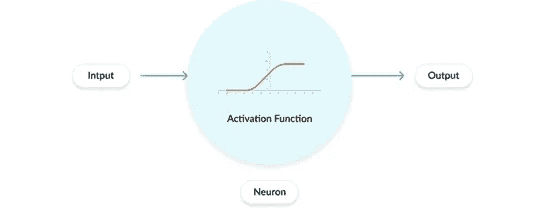

# 激活功能:

神经系统激活函数的一个重要部分是决定神经系统产量的数值条件。该能力连接到系统中的每个神经元，并基于每个神经元的信息是否适用于模型的预期来决定它是否应该被启动(“激发”)。起始工作同样有助于将每个神经元的产量标准化到 1 和 0 之间或-1 和 1 之间的某个范围。

逐渐地，神经系统使用线性和非线性激活函数，这可以使系统能够学习复杂的信息，计算和适应几乎任何能力的询问，并给出精确的预测。

## 线性激活函数:

**升压:**激活函数是神经系统的动态单元。他们计算出一个神经节点的净产量。其中，亥维赛梯级工作是神经系统中最广泛认可的起始工作之一。产能产生成对的产量。这就是为什么它又被称为成对高级容量的原因。

当信息通过边界限制时，容量产生 1(或有效),而当信息不通过边界时，容量产生 0(或假)。正因为如此，它们对于成对次序的研究极其有价值。每一种理性能力都可以通过神经系统来实现。这样，步进工作通常用于没有隐藏层的原始神经系统，或者通常称为单层感知。

*   最简单的激活函数
*   考虑一个阈值，如果净输入值比如 x 大于该阈值，那么神经元被激活

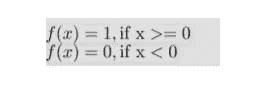

升压功能

这种系统可以将直接可区分的问题分组，例如与门和或门。可以说，所有的类(0 和 1)都可以用一条单独的直线隔开，就像假设我们的激励为 0 时那样。此后，伴随的单层神经系统模型将满足这些基本原理能力。

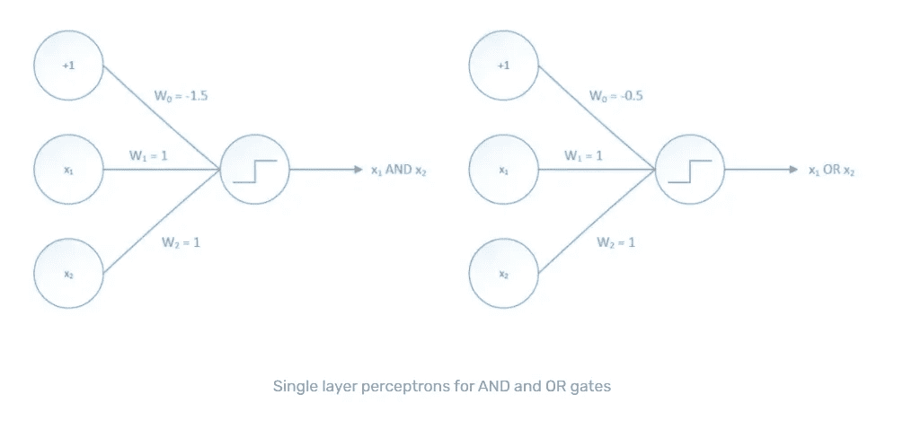

与门和或门

然而，线性激活函数有两个主要问题:

1.  **利用反向传播**(斜率骤降)来准备模型是不现实的——能力的从属是一致的，与信息 x 无关，因此返回并理解信息神经元中的哪些负载可以给出更优的期望是不现实的。
2.  **神经网络的所有层都用线性激活函数坍缩成一个**，无论神经网络有多少层，最后一层都将是第一层的线性函数(因为线性函数的线性组合仍然是线性函数)。所以一个线性激活函数把神经网络变成一层。

## 非线性激活函数:

当今的神经系统模型使用非直线激活能力。它们允许模型在系统的信息来源和产出之间进行复杂的映射，这是学习和展示复杂信息的基础，例如，图片、视频、声音和非直线的或具有高维度的信息索引。

假设初始功是非直线的，实际上任何可以想到的过程都可以说是神经系统中有用的计算。非直能力解决了直接制定工作的问题:它们允许反向传播，因为它们具有与信息源一致的从属能力。它们允许“堆叠”各层神经元，以形成一个复杂的神经系统。

不同的神经元覆盖层被期望学习复杂的信息索引，并具有显著的精确水平。因此，非线性激活函数的类型是:

1.  **乙状结肠:**

我们使用 sigmoid 容量的根本动机是它存在于(0 到 1)之间。以这种方式，它特别适用于我们需要预见产量可能性的模型。因为任何事情的可能性都存在于 0 和 1 之间，所以 sigmoid 是正确的决定。

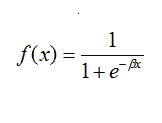

Sigmoid 函数

*优势:*

*   平滑的斜坡，防止产量反弹。
*   输出值介于 0 和 1 之间，使每个神经元的产量正常化。
*   清晰的预测——对于大于 2 或小于-2 的 X，通常会将 Y 值(期望值)带到拐点的边缘，特别是接近 1 或 0。这赋予了清晰的期望。

*缺点:*

*   消失梯度-对于异常高或低的 X 估计值，预测实际上没有变化，从而导致消失坡度问题。这可能会导致系统拒绝进一步学习，或者过于迟缓，甚至无法考虑做出准确的预测。
*   输出不是零聚焦，计算成本高。

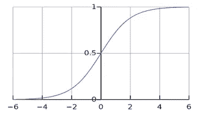

s 形曲线

**2。谭:**

tanh 工作的特点是:它是非线性的，所以我们可以层叠。它被限制在(- 1，1)的范围内。tanh 的角度比 sigmoid 的角度更稳定(下属更极端)。与 sigmoid 一样，tanh 还有一个蒸发倾斜的问题。

*优点*

*   **以零为中心**更容易对具有强负值、中性值和强正值的输入进行建模。
*   否则就像 Sigmoid 函数。

*缺点*

*   比如 Sigmoid 函数

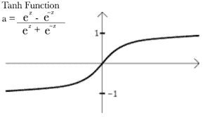

正切函数

3.**整流线性单元(** **RELU):**

在算术中，一个容量被视为在函数 f: A→B 的任意一点都是直的，如果对于面积 A 中的每个 x 和 y，都有相应的性质:f(x)+f(y)=f(x+y)。根据定义，ReLU 是 max(0，x)。因此，如果我们将该点的面积从(∞，0]或[0，∞)分开，则电容是直线。尽管如此，很难看出 f(1)+f(1)≠f(0)。随后，根据定义，ReLU 不是直的。

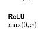

ReLU 函数

渐渐地，ReLU 是如此的接近于直，以至于经常使人困惑，并且奇迹般地，它怎么可能被用作一个包罗万象的近似词。我会说，考虑它们的最理想的方法类似于黎曼整体。你不能用一堆小正方形来精确表示任何一致的容量。ReLU 启动可以创造一堆小正方形。说实话，实际上来说，热卢可以使相当混乱的形状和估计许多纠缠不清的领域。

我同样想解释另一点。就像以前的一个回答提出来的，神经元不是在乙状结肠里咬灰尘，而是，蒸发。这背后的目的是因为最大乙状结肠容量的从属是 0.25。从今以后，在如此大数量的层之后，你最终会复制这些角度，并且在 1 以下的极小数量的结果通常会迅速变为零。

随后，如果你正在构建一个有很多层的深奥的学习系统，你的乙状结肠容量将会很快变得陈旧，最终变得非常无用。关键是蒸发源于倾斜度的增加，而不仅仅是坡度。

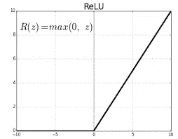

关系曲线

*优势*

*   精通计算—允许系统快速满足
*   非直接—即使看起来是直接容量，ReLU 也有辅助容量，并考虑了反向传播

*劣势*

*   垂死的 ReLU 问题——当数据源接近零或为负时，容量的角度变为零，系统无法执行反向传播，也无法学习。

4.**漏水的 RELU**


漏重函数

LEAKY**ReLU 是解决“死亡 ReLU”问题的一种努力。当 x < 0 时，容量不是零，泄漏的 ReLU 会有一点负的倾斜(大约 0.01)。也就是说，容量寄存器 f(x)= 1(x<0)(αx)+1(x>= 0)(x)，其中α有点一致**

**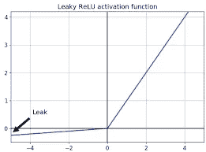**

**渗漏曲线**

***优点***

*   **防止咬灰尘 ReLU 问题——这种类型的 ReLU 在负面区域有一点积极的倾向，所以它在任何情况下都支持负面信息的反向传播**
*   **否则像 ReLU**

***缺点***

*   **结果不稳定——LEAKY ReLU 不能对负面信息做出可靠的预测。**

# **优化功能**

****梯度下降更新规则**:梯度下降是一种流线型计算，用于通过迭代地向以负斜率为特征的最陡下降移动来限制一些容量。在人工智能中，我们使用斜率骤降来刷新模型的边界。边界暗指线性回归中的系数和神经系统中的负荷。**

****

**下山步行**

**从山顶开始，我们冒险走向由负倾角决定的道路。接下来，我们重新计算负倾角(朝着我们新的点的方向)，并朝着它确定的路径迈出另一大步。我们反复进行这个过程，直到我们到达图表的底部，或者到达一个我们不能再向下移动的点——最少一个邻域。**

**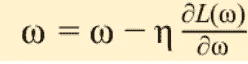**

**渐变-更新-规则 _ 功能**

*****学习率:*** 这些步长的大小称为学习率。随着学习率的提高，我们可以在每一次进步中取得更大的进步，然而，我们可能会越过绝对的底部，因为斜率的倾斜度在不断地变化。由于学习率特别低，我们肯定会走向负斜率，因为我们经常重新计算它。较低的学习率更准确，然而计算倾斜度是乏味的，所以我们要花很长时间才能到达底部。**

*****成本函数:*** 损失函数让我们知道我们的模型在对给定的边界安排做出预期方面“有多好”。工作成本有它的曲线和斜坡。这个弯曲的倾斜向我们揭示了如何刷新我们的边界，使模型更加精确。**

*****逐步:*** 现在我们应该利用新的成本工作运行梯度下降。在我们的成本工作中有两个界限我们可以控制:m(权重)和 b(偏差)。由于我们必须考虑每个人对上次预测的影响，我们必须利用部分子公司。我们计算每个边界的成本工作的中途子公司，并以一个角度存储结果。**

****数学****

**给定成本函数:**

**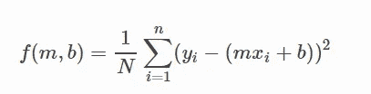**

**成本函数**

**为了求解梯度，我们使用新的 m 和 b 值迭代数据点，并计算偏导数。这个新的梯度告诉我们在当前位置(当前参数值)的成本函数的斜率，以及我们应该移动以更新参数的方向。我们更新的大小是由学习率控制的。**

## **优化技术的类型:**

1.  ****基于动量的物品:****

*   **基于动量的梯度下降更新规则:梯度下降的一个主要问题是，它花费大量时间来导航具有平缓坡度的区域，因为在这些区域中梯度非常小**
*   **一个直观的解决方案是，如果算法被反复要求朝同一个方向前进，那么它可能会获得一些信心，并开始朝那个方向迈出更大的步伐**
*   **现在，我们必须把这种直觉转换成一组数学方程梯度下降更新规则，**

**→ **ωt+1 = ωt — η∇ωt****

**→υt =γ*υt 1+η∇ωt**

**→ωt+1 =ωtυt**

**→ωt+1 =ωtγ*υt 1 η∇ωt**

**→如果γ*υt1 = 0，则与常规梯度下降更新规则相同**

**→简而言之，υt1 是一个方向上的运动历史，γ的范围为 0-1**

***有几点需要注意:***

***a .基于动量的梯度下降在极小值谷内外振荡(u 形转弯)***

***b .尽管有这些 u 形转弯，它仍然比普通梯度下降收敛得更快***

***现在，我们将着眼于减少基于 GD* 的动量振荡**

****2。内斯特罗夫加速梯度下降(NAG):****

**在基于动量的梯度下降中，我们可以看到运动分两步进行:第一步是历史项γ*υt1，第二步是重量项η∇ωt。考虑先用历史项运动，然后从第一步(ωtemp)后的位置计算第二步。**

**利用上述直觉，内斯特罗夫加速梯度下降解决了过冲和多次振荡的问题**

**→ωtemp =ωtγ*υt 1 根据历史运动计算ωtemp**

**→ωt+1 =ω温度η∇ωtemp**

**→继续向ωtemp 的导数方向移动**

**υt =γ*υt 1+由于ωtemp 的导数导致的运动的η∇ωtemp 更新历史**

****3。自适应梯度(Adagrad ):****

**直觉:与参数的更新历史成比例地衰减参数的学习速率(更新越少，衰减越少)。Adagrad(自适应梯度)是一种满足上述直觉的算法 Adagrad:**

**→υt =υt1+(∇ωt)2——平方，忽略导数的符号**

**→该值根据特定迭代的梯度递增，即特征值非零。**

**→在密集特征的情况下，它在大多数迭代中递增，导致更大的υt 值**

**→对于稀疏特征，不会增加太多，因为梯度值通常为 0，导致υt 值较低。**

**→该值根据特定迭代的梯度递增，即特征值非零。在密集特征的情况下，它在大多数迭代中递增，导致更大的 *v* t 值**

**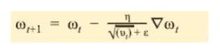**

**→分母项√ (υt)用于调节密集特征的学习速率η，υt 越大，(√υt)变得越大，从而降低η**

**→对于稀疏特征，υt 更小，(√υt)变小，降低η的程度更小。ε项被添加到分母√ (υ t ) + ε中，以防止在非常稀疏的特征的情况下出现被零除的误差，即在测量实例之前所有数据点都为零。**

****优势**:稀疏特征对应的参数得到更好的更新**

****缺点**:随着分母的增长，学习率急剧下降(对于与密集特征相对应的参数来说并不好)。**

****4。RMSProp:****

**梯度的历史乘以衰减率。Adagrad 在接近收敛时卡住了(由于学习率衰减，它不再能够在垂直方向上移动)，RMSProp 通过减少衰减来克服这个问题:**υt =β*υt1+(1β)(∇ωt)2****

****5。自适应矩估计(ADAM):****

**→自适应矩估计(Adam)结合了 RMSProp 和动量的思想。它计算每个参数的自适应学习率，工作方式如下。**

**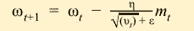**

**亚当法则**

**它计算过去梯度的指数加权平均值(vdWvdW)。它还计算过去梯度的平方的指数加权平均值，并且这些平均值偏向零，并且为了抵消这一点，应用了偏差校正。使用来自计算出的平均值的信息来更新参数。**

# **损失函数:**

**机器通过损失函数的方法来学习。这是一种评估显式计算如何模拟给定信息的策略。如果预测与真实结果相差甚远，那么不幸容量将会是一个异常巨大的数字。一步一步，在一些改进工作的帮助下，不幸的工作想出了如何减少期望中的失误。它将通过几个损失函数及其在机器/深度学习领域的应用。**

**大体上，损失函数可以根据我们正在处理的学习任务的类型分为两大类，即**回归损失**和**分类损失**。在分类中，我们试图从一组有限的分类值中预测输出，即给定手写数字图像的大数据集，将它们分类为 0-9 个数字中的一个。另一方面，回归处理预测给定楼层面积、房间数量、房间大小的连续值，预测房间的价格。**

```
**NOTE** 
        n        - Number of training examples.
        i        - ith training example in a data set.
        y(i)     - Ground truth label for ith training example.
        y_hat(i) - Prediction for ith training example.
```

## **回归:**

1.  ****均方误差/二次损失/L2 损失:****

*   **均方差(MSE)是最常用的回归损失函数。MSE 是我们的目标变量和预测值之间距离的平方和。**

**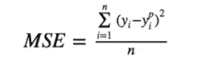**

**均方误差**

*   **下面是一个 MSE 函数图，其中真实目标值为 100，预测值在-10，000 到 10，000 之间。MSE 损失(Y 轴)在预测值(X 轴)= 100 时达到最小值。范围是 0 到∞。**

**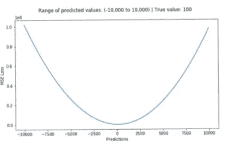**

**2.**平均绝对误差/L1 损失:****

**平均绝对误差(MAE)是用于回归模型的另一个损失函数。MAE 是我们的目标变量和预测变量之间的绝对差值的总和。因此，它测量一组预测中误差的平均大小，而不考虑它们的方向。(如果我们也考虑方向，这将被称为平均偏差误差(MBE)，它是残差/误差的总和)。范围也是 0 到∞。**

**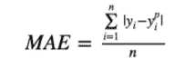**

**绝对平均误差**

**3.**胡伯损失/平滑平均绝对误差:****

**与平方误差损失相比，Huber 损失对数据中的异常值不太敏感。它在 0 也是可微的。它是一个绝对误差，误差小的时候就变成二次误差了。误差必须小到二次，这取决于一个可以调整的超参数𝛿(δ)。当𝛿 ~ 0 时，胡贝尔损失接近 MSE，当𝛿 ~ ∞(大数)时，MAE 接近 MSE。)**

**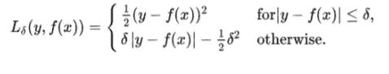**

**胡伯损失**

**4.**日志 Cosh 损失****

**Log-cosh 是回归任务中使用的另一个函数，它比 L2 函数更平滑。Log-cosh 是预测误差的双曲余弦的对数。**

**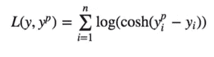**

**对数损失**

# **分类:**

1.  ****交叉熵损失:**交叉熵损失，或对数损失，衡量分类模型的性能，其输出是 0 到 1 之间的概率值。交叉熵损失随着预测概率偏离实际标签而增加。因此，当实际观测值标注为 1 时，预测概率为 0.012 将是错误的，并会导致高损失值。完美的模型的对数损失为 0。**
2.  ****分类交叉熵损失:**分类交叉熵是在多类分类任务中使用的损失函数。在这些任务中，一个示例只能属于许多可能类别中的一个，模型必须决定属于哪一个。从形式上来说，它被设计用来量化两个概率分布之间的差异。**

**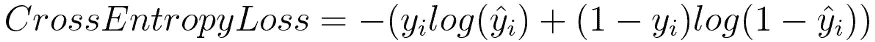**

**分类交叉熵损失**

****3。二进制交叉熵损失/对数损失:**二进制交叉熵是在二进制分类任务中使用的损失函数。这些任务回答一个只有两个选择的问题(是或否，A 或 B，0 或 1，左或右)。可以同时回答几个独立的此类问题，如在多标签分类或二值图像分割中。**

**希望这有所帮助:)**

**如果你喜欢我的帖子，请关注。请留下任何澄清或问题的评论。**

```
**Additional Resources I found Useful**:
1\. [https://towardsdatascience.com/common-loss-functions-in-machine-learning-46af0ffc4d23](https://towardsdatascience.com/common-loss-functions-in-machine-learning-46af0ffc4d23)
2\. [https://ieeexplore.ieee.org/document/8407425](https://ieeexplore.ieee.org/document/8407425)
3\. [https://www.researchgate.net/publication/228813985_Performance_Analysis_of_Various_Activation_Functions_in_Generalized_MLP_Architectures_of_Neural_Networks](https://www.researchgate.net/publication/228813985_Performance_Analysis_of_Various_Activation_Functions_in_Generalized_MLP_Architectures_of_Neural_Networks)
```

**通过*LinkedIn*[*https://www.linkedin.com/in/afaf-athar-183621105/*](https://www.linkedin.com/in/afaf-athar-183621105/)连接**

**快乐学习😃**