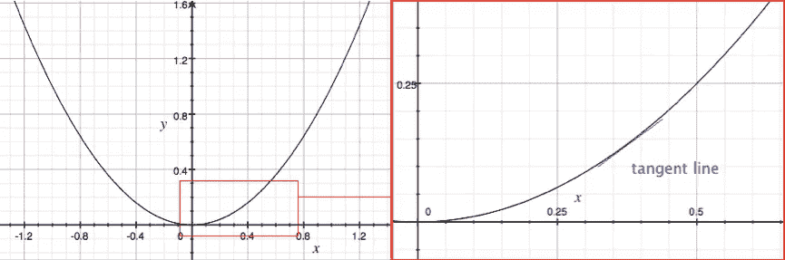
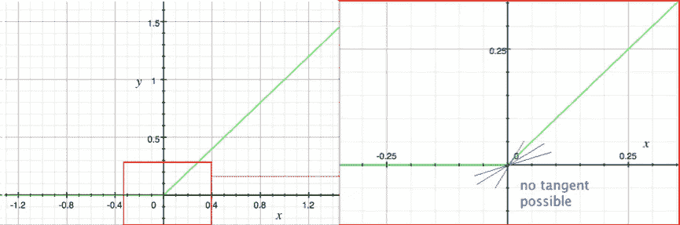
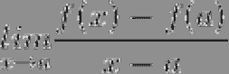
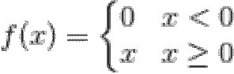
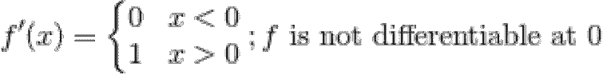
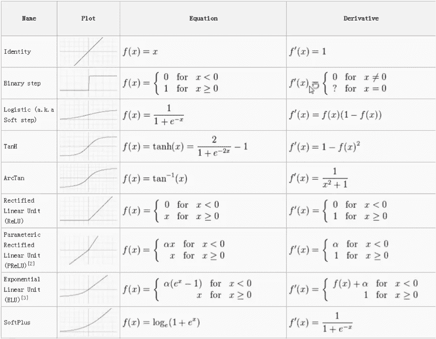

# 深度学习用的激活函数，可微不可微？

> 原文：<https://medium.com/analytics-vidhya/activation-functions-used-in-deep-learning-are-they-differentiable-or-not-e1a94e2c67ef?source=collection_archive---------15----------------------->

多米尼克等待着

# 介绍

在最近的一次[演讲中](https://dwaithe.github.io/presentations/2017April_back_propagationWaitheDv2.pdf)，我给出了关于神经网络优化的反向传播算法，关于某些激活函数的可微性问题出现了。反向传播算法要求所涉及的所有函数都是可微的，然而一些最常用的激活函数(例如 ReLU)实际上在函数输入范围内的某些点上是不可微的。那么这些函数实际上是如何用于反向传播的呢？简单的答案是，从数学的角度来看，我们通过忽略这些函数在不可微点的输出来作弊，并用更易管理的值重写输出。这篇博文深入探讨了这种差异的背景，以及它在这种情况下是如何应用的。我还将描述一种方法，通过这种方法，人们可以处理整体上不可微的函数，以及反向传播和神经网络的含义。为了做到这一点，我大量借鉴了劳拉·阿尔科克的《如何思考分析》一书，以及其他资料，该书被证明对理解这个主题是不可或缺的。

# 微分和可微性

首先是一些关于微分的背景知识，以及微分的含义。比如函数𝑓(𝑥) = 𝑥就是一个把实数映射成实数的函数(𝑓 : **ℝ →** **ℝ** )。函数𝑓(𝑥) = 𝑥是光滑的，在每一点都是可微的。

**上图**𝑓(𝑥)=𝑥函数的可视化。缩放区域用切线(蓝色)显示在右侧。

函数𝑓(𝑥) = 𝑥是连续且可微的:这意味着在𝑓(𝑥的每一点，我们可以画一条切线并逼近梯度。解析地，我们可以推导出𝑓(𝑥的导数，这在整个 x 上都有效，𝑓(𝑥的导数是𝑓ʹ(𝑥) = 2𝑥.如果将上述功能与另一个功能进行比较，整流线性单元(ReLU)功能通常用作激活功能。ReLU 也是连续的，映射(𝑓:**ℝ→**ℝ)所以任何实数输入都会产生一个实数输出。不像𝑓(𝑥) = 𝑥，然而这个函数有一部分是不可微的。当我们放大函数时，可以清楚地看到它是不平滑的(有一个尖角 x=0)。尖角是函数上非微分点的典型标志:

**上图**显示 ReLU 功能(绿色)。缩放区域显示在右侧，切线不正确(蓝色)。

在一个尖角处，很容易画一条与两条相交线等距的切线，或者甚至画多条切线，就好像想象一条线从一条线旋转到另一条线，然而这些都是不正确的。在任何一点上，一个图形要么有一个有意义的梯度(因此有一个切线)，要么没有。在这个角上，在极限处，没有有意义的切线，所以函数的这个点是不可微的。这样做的原因是，对于在每一点都可微的函数，其差商必须满足以下标准:

f 仅在𝒂可微当且仅当

存在。𝒂和𝑓.非常相似如果我们从上面用𝒂逼近𝑥，我们可以看到差商趋于无穷大，这意味着在这一点上的正切不存在。

如果你把𝑓(𝑥)in 分解成它的组成部分，并对其进行解析微分，它似乎应该是完全可微的:

然而这是不正确的。该函数在零点不可微，应该将该函数的导数写成如下形式:

。总之，具有尖角的非光滑函数将具有不可微的区域。尖角上不能有有意义的切线，并且不能满足微分的核心标准，即极限存在。

# 深度学习的激活功能

经典的激活函数 tanh 和逻辑 sigmoid 函数始终是平滑函数，但是，如果您将一些最近引入的激活函数可视化，您会发现它们并不平滑，并且有拐角，尽管它们始终不可微，但在互联网上很容易找到这些函数的表示，表明它们是:

以上中的**激活函数导数使用传统符号表示，尽管事实上一些函数上有不可微的点[ [2](https://dwaithe.github.io/blog_20170508.html#two) ]。**

从上面的例子中[[2](https://dwaithe.github.io/blog_20170508.html#two)]ReLU 和 PReLU 函数是不可微的，尽管有符号。二元阶跃函数也是不可微的，但是上图的作者用线“？”表示了这一点。对于𝑥= 0”。那么这怎么可能呢？我们如何使用不完全可微的函数来构造神经网络，该神经网络由许多这样的函数组成，并且对于要执行的训练过程必须是可微的？

# 使用包含不可微点的激活函数进行深度学习

像 ReLU 这样的函数被用在神经网络中，因为使用这些简单的方程比更传统的激活函数(如 tanh 或 logistic sigmoid 函数)具有计算优势。用于优化神经网络的反向传播算法在系统中包含的所有函数都是可微分的前提条件下工作。如前所述，ReLU 和其他变量在特定点上是不可微的，那么如何使用它们呢？本质上，在它们不可微的点上，函数不被评估，输出被替换为可感知的值。例如，对于𝑓ʹ(𝑥的 ReLU，我们只指定输出为 0 或 1，这对于我们的使用是合理的。例如，在 ano [ [3](https://dwaithe.github.io/blog_20170508.html#three) ]中，它指定不评估𝑥，并将其视为𝑥 > = 0 时的 1。这在数学上并不纯粹，人们可以想象这将导致问题的场景，然而现实情况是，由这些函数组成的神经网络工作良好且稳定，因此这个问题被忽略，有利于计算效率。

# 结论

有些人可能会说，如果我们无论如何都要指定不可微点的输出，为什么要花额外的文字和符号来解释这个点是不可计算的。其他人会说我们在滥用记谱法，对于外行人来说，我们把事情简单化了。我可以从两个角度理解这一点，从简洁和简单的角度来看，这并不经常出现，这就是为什么像上面这样的文本对于任何感兴趣的人来说，对于完全理解某些情况是如何发生的是有用的。

# 参考

[1][https://www . Amazon . co . uk/Think-About-Analysis-Lara-Alcock/DP/0198723539](https://www.amazon.co.uk/Think-About-Analysis-Lara-Alcock/dp/0198723539)

[2][https://www . quora . com/Why-do-we-not-use-a-differentiable-approximation-of-ReLUs](https://www.quora.com/Why-do-we-not-use-a-differentiable-approximation-of-ReLUs)

[3]https://groups.google.com/forum/#

*最初发布于*[*https://dwaithe . github . io*](https://dwaithe.github.io/blog_20170508.html)*。*