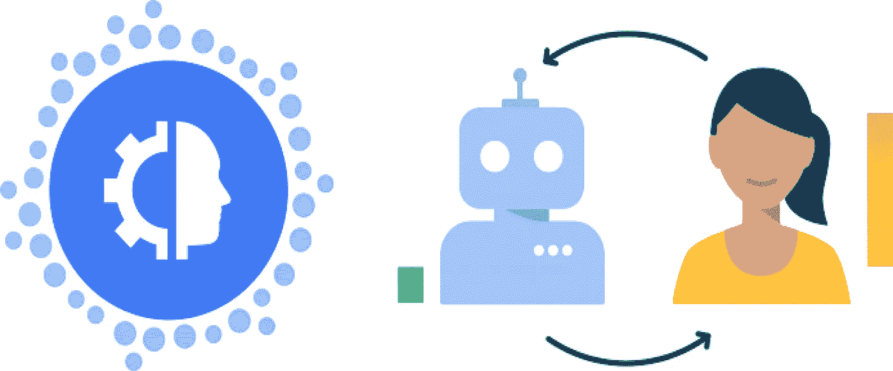

# 机器学习中的主动学习和人类参与

> 原文：<https://medium.com/analytics-vidhya/active-learning-and-human-involvement-in-machine-learning-71284b3683a?source=collection_archive---------5----------------------->

鸣谢:谷歌

# 什么是主动学习？

主动学习是机器学习的一个子领域，其中随着训练过程的进行，模型可以询问用户想要的信息。然后，用户(或 Oracle)标记所需的数据，并将其添加到训练样本中。这样，模型可以通过与人的积极互动和不必要的数据学习…