# 基于主动学习的多领域改进

> 原文：<https://medium.com/analytics-vidhya/active-learning-based-improvement-for-multiple-domains-1d228da50f40?source=collection_archive---------13----------------------->

深度学习中的模型需要大量的标记数据来获得比其他方法更高的精度和性能。然而，如此大量的标记数据的可用性是各种领域的瓶颈。一种之前被证明可以获得更准确结果的新方法是一种称为 Tri-training [6]的方法，其中使用部分训练数据训练 3 个独立的模型，以在无监督数据上生成代理标签。

在此之后，应用多种轮询策略(见下文)根据生成的预测对数据进行采样，三个模型以循环方式在扩充的数据分割上进行再训练，因此称之为主动学习。我们的目标是使用半监督学习对深度学习模型进行迭代微调，以提高模型性能，并分析不同领域的策略结果，以获得一般方向和规则的例外。

改进主要集中在减少对大型带注释数据集的需求，同时保持与具有相似数据样本大小的模型接近或更好的性能的最佳策略上。

# **动机:**

我们可以通过在相对较小的数据集上进行微调，来提高在大型数据集上训练的机器学习模型的准确性。存在大量无监督的数据，可以利用这些数据来增加训练数据的大小。这可以提高测试数据的性能，并可以调整模型以在看不见的数据上表现良好。无监督数据的手动标记是一个繁琐的过程，因此我们希望测试 tri-training [6]来从以前没有探索过的领域(如 VQA 等多模态领域)的无监督数据中生成代理标签。Tri 训练被表征为用于无监督域适应的模型不可知代理标记方法。我们还想测试 tri-training 是否可以用于从无监督的数据集中识别重要的例子。这个过程可以反复重复，以提高模型的准确性(主动学习)。

# **相关工作:**

在 tri-training 论文[1]中，在 UCI 数据集上训练的三个分类器用于产生对未标记数据的预测，然后使用模型之间多数一致的轮询策略来决定是否将数据扩充回原始数据分裂。然而，在这里，采样数据被附加到属于不一致模型的数据分割中。在另一篇 tri-training 论文[2]中，在 Amazon Reviews 数据集上使用了两个经过训练的模型来对未标记的数据进行投票，并使用第三个模型来对原始和增强的拆分一起进行训练。

他们还在图像数据集 MNIST、SVHN、SYN Digits 和 SYN Signs 上进行了相同的实验，并注意到与基线相比，准确性有了显著提高。在另一篇论文[9]中，诸如在训练和目标域中最大化信息增益的策略被用于智能地采样数据并扩充回训练分割。我们发现，与基本试运行中的两个模型相比，当所有三个模型都一致时，当预测被反馈时，方法[1]导致相对较差的性能。

因此，我们选择采用三种模式协议作为我们的战略。我们对[2]中使用的思想做了进一步的贡献。我们采用了[9]中的循环训练思想，尽管必须注意的是，他们没有采用三种决策模型，而是仅仅依赖于策略。

# **方法:**

用于所有不同领域的模型都是相对经典的，因为这里的目的不是提出一个新的模型来改进现有的基线，而是提出通过利用无监督数据来提高模型性能的方法。此外，为实现我们的方法而为每个域选择的基础模型是在考虑计算约束的情况下选择的，因此该模型可能不会给出该特定数据集的 S.O.T.A .结果。

主动学习是机器学习的一种特殊情况，在这种情况下，学习算法能够交互式地询问用户(或一些其他信息源)以在新的数据点获得期望的输出。有些情况下，未标记的数据非常丰富，可以用来改进现有的模型。在这种情况下，学习算法可以主动向用户/教师查询标签。这种类型的迭代学习被称为主动学习。由于学习者选择例子，学习一个概念的例子的数量通常比正常的监督学习所需的数量少得多。

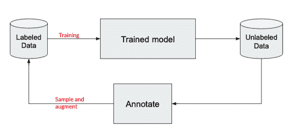

(图 1)主动学习

我们已经使用三元训练来标注未标记的数据。Tri-training 是最著名的多视图训练方法之一，它利用三个独立训练的模型的一致性来减少对未标记数据的预测偏差。三训的主要要求是初始模型多样。这可以通过使用三个模型中每个模型的三分之一的输入数据来实现。然后执行一个轮询策略，将来自无监督数据集的示例扩充回我们的输入数据集。

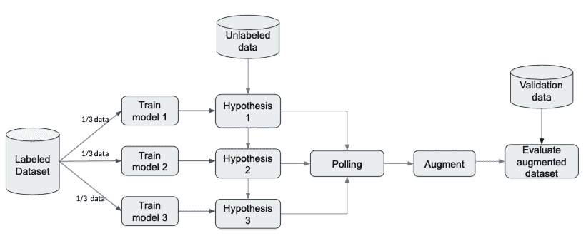

(图 2)三元训练

按照下面的算法，我们使用 bootstrap 采样来训练原始训练数据的 3 个模型。然后在这些样本上训练三个模型 m1、m2 和 m3。基于 3 个模型如何就其标签达成一致，将未标记的数据点添加到模型的训练集中。在我们的实验中，这个过程重复了 3 次。

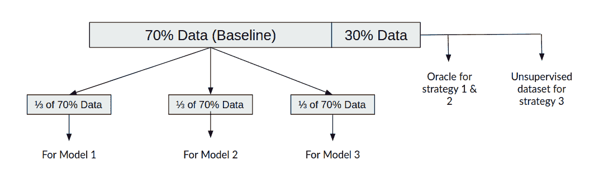

(图 3)数据分割

# **抽样(轮询)策略:**

**抽样策略 1** :任意两个模型同意一个样本。用事实标签代替他们的预测。

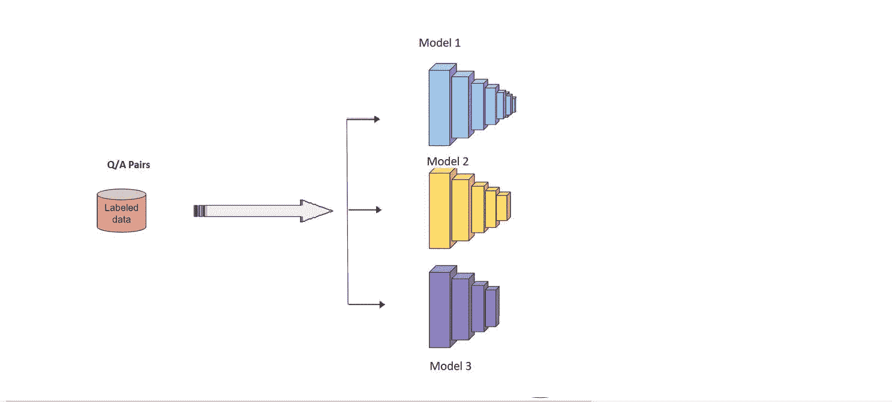

(图 4)采样策略 1

**采样策略 2:** 所有 3 个模型预测样本上的同一标签。用基本事实标签替换他们的预测(即使预测不同)。

(图 5)采样策略 2

**采样策略 3:** 所有 3 个模型预测样本上的同一标签。用他们的预测作为样本的标签。

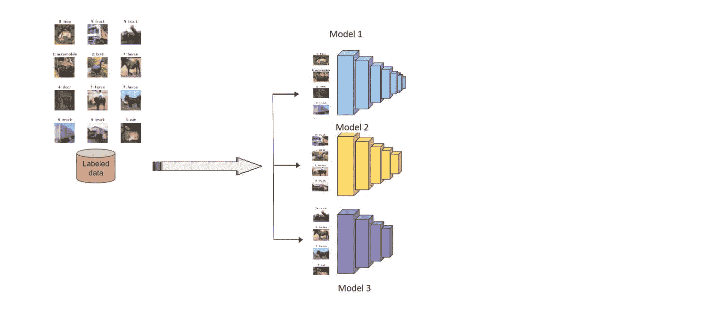

(图 6)采样策略 3

# **域和数据集:**

我们使用以下模型在以下领域进行了实验:

1.  **视觉问答**:使用“神经 VQA”的 VQA 2.0 数据集【3】
2.  **问题回答**:斯坦福问题回答数据集(SQuAD) 2.0 [12]使用“双向注意力流”[8]
3.  **音频分类**:使用“扩张 CNN”的城市声音数据集
4.  **图像分类**:使用“VGG16”的 CIFAR10
5.  **图像分类**:使用“VGG16”的 CIFAR100

# **程序:**

1.  为相应的域训练 100%的训练数据集。评估验证数据集并记录准确性。我们将这种模型称为“Oracle”
2.  将输入训练数据集分成 70% — 30%的比例。30%的分割是我们的无监督数据集
3.  使用所有 70%的训练数据训练 n 个时期的模型。评估验证数据集，并记录准确性和训练数据集大小。在我们的结果中，用 70%的数据训练的这个模型被称为“基线”。
4.  使用上述 3 种策略来训练模型:

a.使用所有三个模型一致的预测。

b.使用所有三个模型都一致的预测。用地面实况替换所有预测，将它们添加到训练数据集中。

c.使用两个模型一致的预测。用地面实况替换所有预测，将它们添加到训练数据集中。

5.针对上述 3 种采样策略情况中的每一种，重复以下步骤进行 3 次主动学习迭代:

a.将基本数据集分成 3 个子集。

b.基于每个 1/3 数据分割训练 3 个模型..

c.使用所有 3 个模型从我们的无监督数据集中为剩余的示例生成预测

d.将结果(基于当前聚合方法)附加到所有 3 个案例的培训数据中

e.使用原始的 70%数据+n 个时期的新附加数据来训练新的模型。评估验证数据集的性能，并记录准确性和当前训练数据集的大小。

6.最后，用随机采样的数据训练一个新模型，其样本数等于迭代 3 中的样本数。在这个模型上做预测。这个模型在结果中被称为“随机模型”。

# **用于加速模型训练的多 GPU 并行化:**

我们创建了一个新颖的架构，在谷歌云平台(GCP)上托管的多个虚拟机(VM)上并行化和自动化我们的 tri-training。我们通过创建三个支持 GPU 的虚拟机以及一个存储桶(用于存储预测、模型、评估等)和两个数据存储属性来跟踪训练和结果聚合的进度(应用策略后增加的数据)，从而启动了该流程。我们的基本想法是让三个虚拟机分别独立地并行训练一个模型，一旦虚拟机完成了训练，它就将其模型和预测(在未标记的数据集上)上传到存储桶，然后在 Google DataStore 上将它的状态更新为“已完成”。然后，其中一个虚拟机(被指定为聚合结果)将不断轮询数据存储库(用于训练状态属性),当它发现所有虚拟机的状态都为“已完成”时，它将下载所有虚拟机的预测，对这些虚拟机运行聚合脚本(基于使用的策略),并将聚合结果上传回存储桶。此时，所有三个虚拟机下载聚合结果，将数据扩充到已标记的数据集，并将其从未标记的数据集中删除。然后重复整个过程，直到需要多少次主动学习迭代。以下是我们方法的伪代码:

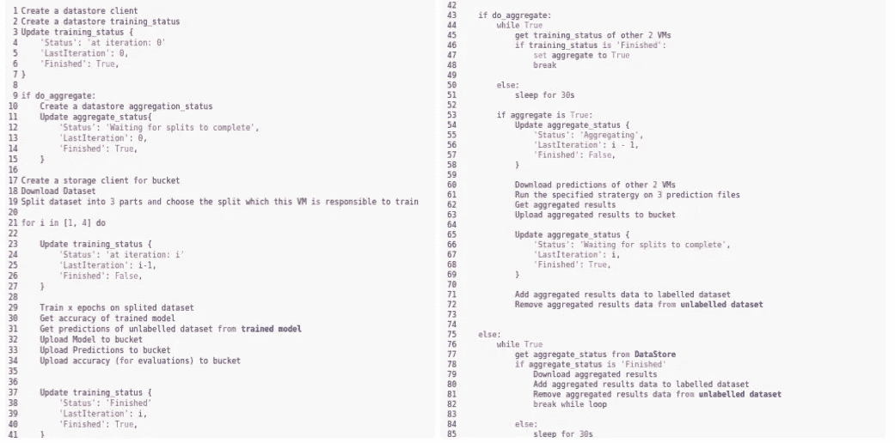

(图 8) GCP 设置伪代码

# **不同领域的实验:**

## **领域 1:视觉问答:**

VQA v2 数据集由来自 COCO 数据集的 82，783 幅训练图像组成。每张图片有 3 到 5 个相关的问题，总计 443，757 个问题。对于数据集中的每个问题，有 10 个基本事实答案，累积到 4，437，570 个训练注释。验证集有 40，504 幅图像，214，354 个问题和 2，143，540 个答案。

***基线解释:***

我们使用 VIS+LSTM [3]模型进行可视化问答。在 ImageNet 2014 挑战赛上训练的 19 层牛津 VGG Conv 网[5]的最后一个隐藏层用于为我们的图像生成特征向量。对于这些问题，我们使用了[3]中的单词嵌入模型。单词嵌入用模型的其余部分来训练。图像被用作句子的第一个单词。使用线性 or 变换将 4096 维图像特征向量映射到与单词嵌入的维度相匹配的 300 或 500 维向量。这些将作为输入传递给 LSTM。LSTM 输出在最后一个时间步被馈送到 softmax 层以生成答案。

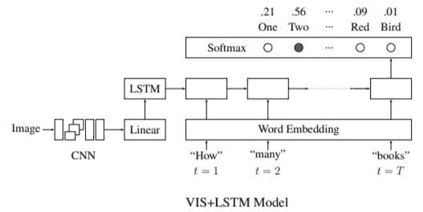

(图 9) VIS+LSTM 模型

***结果:***

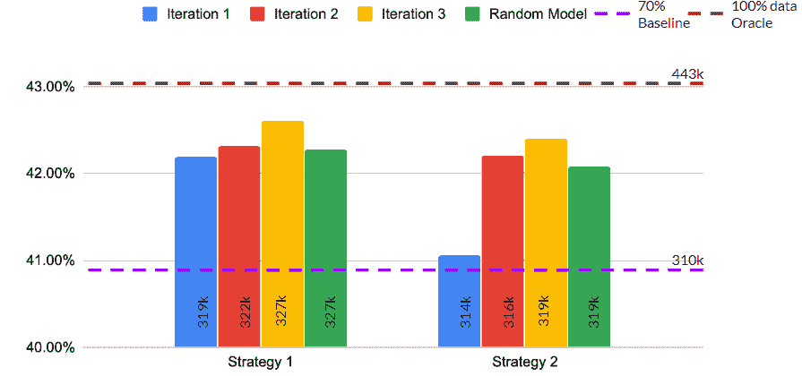

(图 10) VQA v2 主动学习结果。

上图图例:

> 策略 1:任何两个同意
> 
> 策略 2:3 个人都同意。使用基本事实
> 
> 随机模型:与迭代 3 具有相同样本数的模型，用于比较性能改进

***推论:***

策略 1 和 2 都能够在三个主动学习迭代的每一个中超过 70%的基线。随着更多的数据被增加到我们的原始数据集，该模型在每次主动学习迭代结束时都会迭代地增加准确性。此外，对于两种策略，3 次迭代后的模型优于随机模型。这使我们得出结论，两种三训练轮询策略都选择了重要的增强示例。

***样本证据:***

三元训练模型在“答案类型”=“是/否”的问题上表现良好。其中一些如下所示:

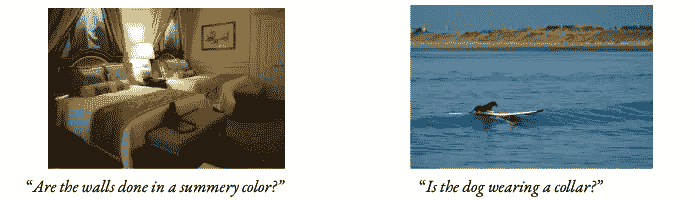

(图 11)由 tri-training 选择的用于增强的图像和问题

在 tri-training 中不一致的大多数图像/问题对的基本事实是“答案类型”=“其他”，这意味着它不属于流行的答案类型“是/否”或“数字”。这可能是因为我们的三训练模型可能没有看到与我们的未标记数据集中的给定图像/问题对相关联的基础事实词汇。因此，不可能正确预测该数据点的标签。这种情况的一些例子如下所示

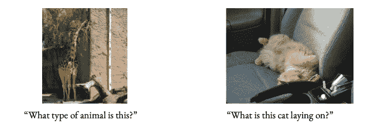

(图 12)3 个模型之间不一致的图片/问题

## **领域二:问答:**

SQuAD 2.0 数据集[12]是由大约 130000 个问题组成的机器阅读理解数据集。该数据集在最高级别上由 442 篇文章构成，每篇文章都有一系列段落，每段包含一组问题。每个问题都有一个答案，该答案带有从中提取答案的上下文的索引，或者在三分之一的情况下，没有答案以使模型能够区分这两种情况。

***基线解释:***

对于具有 100%数据的基线，我们使用 BiDAF 模型。我们在嵌入层使用手套向量。为了更快的训练，只有单词嵌入被用于较轻的网络。RNN 编码器用于建立嵌入时间步长之间的关系。双向注意力层首先获取问题和上下文之间的相似性矩阵，然后计算与隐藏状态相结合的问题 2 上下文和上下文 2 问题注意力。下一个 RNN 编码器层建立来自前一个注意层的表示之间的关系，最后，输出层吐出一个概率向量，该向量定量地表示答案在上下文中的特定点开始和结束的概率。跨开始和结束上下文位置的负对数似然损失用于优化。

我们不能主动跟进这个领域的策略 3，因为问题的答案注释必须包含从中选取上下文的上下文字符串的索引。这将需要对成千上万的问题进行人工注释，这是一项费力耗时的任务。

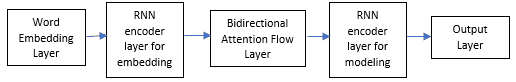

(图 13) BiDAF 架构

***结果:***

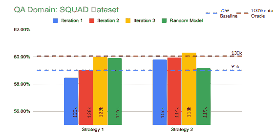

(图 14)班上的主动学习结果。请注意，y 轴是转换为 100 分制的 F1 分数。

上图图例:

> 策略 1:任何两个同意
> 
> 策略 2:3 个人都同意。使用基本事实
> 
> 随机模型:与迭代 3 具有相同样本数的模型，用于比较性能改进

***推论:***

最适合班数据集的策略是策略 2。该方法往往工作良好，因为当所有 3 个模型都一致时，预测往往最接近实际情况(我们发现的时间的 85%)，因此它加强了与输入分布的主要部分的关系。小队数据集中有 30%的未回答问题。在策略 1 中，对于一个给定的问题，模型很有可能在没有答案的域中过度拟合。两个模型可能在无答案问题上过度拟合，并且更多的无答案样本可能最终成为被选择的样本，这可能导致比策略 2 更少的 F1。此外，策略 2 在高维输出空间的情况下效果最好。类别的数量越多，三个自信模型挑选出对训练贡献更大的强样本的可能性就越高。在结果层面上，策略 2 迭代 3 以 100%的数据击败了基线，并且两个最终的第三次迭代 F1 分数都击败了随机模型。以下证据证实了这一点。证据样本是根据最常见的模式选择的。

***证据:***

*格式:*

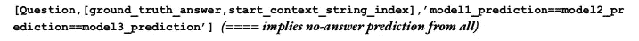

*策略 1 的数据样本【2 个模型一致】:*

在所有三次迭代中

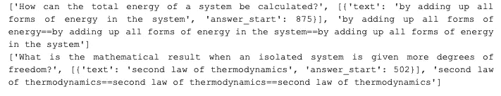

在第一次迭代后立即开发

不断出错，直到 3 次迭代之后

*策略 2 的 QnA 对[3 个模型一致]:*

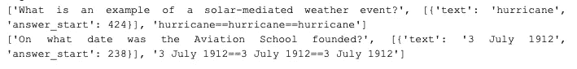

在所有三次迭代中

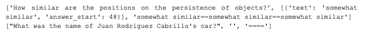

*在第一次迭代后立即开发*

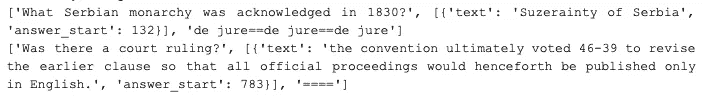

*不断出错，直到 3 次迭代之后*

正如上面解释和观察到的，随着数据的增加，模型发展了回答更难的问题的能力。对于策略 1，即使在三次迭代之后，我们在无答案域上得到一些答案。

***进一步分析的范围:***

我们没有时间对该数据集进行全面研究的另外两个策略如下。由于其多对一映射，这些只能应用于小队。一个是决定一个段落中正确回答问题的最小数量。如果超过这个阈值，则该段落被附加到列车分割，否则它被丢弃。这确保了较少的数据通过拆分，并且在每次迭代之后增加阈值确保了只有最重要的问题答案对被传递给模型。另一个策略是决定轮询预测的调和等式(子串一致性)。然而，这种策略放宽了从池中挑选样本的下限。

## 领域 3:音频分类:

城市声音数据集[7]包含 8732 个标记的声音摘录(<=4s) of urban sounds from 10 classes: air_conditioner, car_horn, children_playing, dog_bark, drilling, enginge_idling, gun_shot, jackhammer, siren, and street_music. The classes are drawn from the urban sound taxonomy. All the audio files of urban sounds are in WAV format. The sampling rate, bit depth, and number of channels are the same as those of the original file uploaded to Freesound (and hence may vary from file to file).

***)基线解释:***

这里使用的模型是一个扩展卷积 DNN 模型，它使用 Librosa 库来分析音频文件。我们能够实现 90.15%的基线准确性，所有 100%的训练数据都包含在模型的训练数据集中。用 70%的数据进行三元训练的模型达到了 88.67%的准确率。

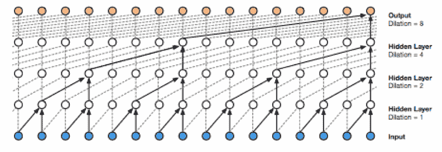

(图 15)音频数据集的架构概述

***结果:***

(图 16)音频域:城市声音数据集主动学习结果。注意，Y 轴代表精度，单位为%

上图图例:

> 策略 1:任何两个同意
> 
> 策略 2:3 个人都同意。使用基本事实
> 
> 策略 3:3 个人都同意。用他们的预测作为标签
> 
> 随机模型:与迭代 3 具有相同样本数的模型，用于比较性能改进

***推论:***

从上面的结果图中我们可以看到，策略 1 (Str1)和策略 2 (Str2)能够超越主动学习迭代 1 本身的 70%基线。此外，我们看到，Str1 和 Str2 的精度随着每次主动学习迭代而进一步提高。在 Str1 和 Str2 中，经过训练的模型能够击败随机采样的数据，这些数据具有与它们各自的迭代 3 模型中的数据相同的样本数量，这表明了该方法的有效性。这里需要注意的一件有趣的事情是，Str1 的主动学习迭代 3 模型甚至能够以明显更少的数据量(3.21k 与 4.34k 样本相比)击败在 100%数据集上训练的模型。这里关于结果的异常是策略 3 (Str3 ),其实际表现比 70%基线差，也比随机采样数据差。这种准确度的降低可归因于假阳性，其标签正被迭代地训练，由于假阳性预测的更多加强，这导致准确度的进一步下降。

***样本证据:***

警笛声在数据集中被最正确地识别出来。然而，这可能是由于过度适应这些声音类别。大多数类似于警笛声的其他声音也被错误地预测为警笛声，比如汽车喇叭声。这是我们的策略 3 中准确性开始下降的原因之一，因为正确的标签被不正确的“警报”预测所取代。此外，街头音乐是误判最少的类别。可能的原因包括它与其他城市的声音非常不同。从样本中可以推断，在这种方法中，彼此接近的声音比彼此非常不同的声音表现得更差。

## 领域 4:图像分类:

我们选择 CIFAR[10]数据集进行图像分类领域的实验，因为它们为研究人员所熟知，易于使用，并且是我们认为适用于任何图像分类网络的基准数据集。CIFAR-10 数据集由 10 类 60000 幅 32x32 彩色图像组成，每类 6000 幅图像。有 50000 个训练图像和 10000 个测试图像。CIFAR-100 有 100 个类，每个类包含 600 个图像。每个类有 500 个训练图像和 100 个测试图像。

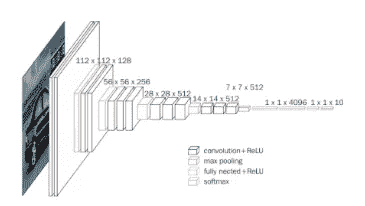

(图 17) VGG-16 体系结构

***基线解释:***

我们对两个影像分类数据集都使用了经典的卷积神经网络模型— VGG16。VGG16[11]是提交给 ILSVRC 2014 的更受欢迎的模型之一，与当时流行的 AlexNet 相比有相当大的改进。我们选择 VGG16 的主要动机是它易于实现，性能可靠，并且可以针对两个数据集进行优化。

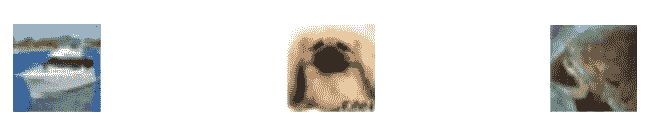

(图 18)策略证据

***策略证据:***

左上角的船只图像(来自 CIFAR-10)就是这样一幅图像，在我们进行的所有实验中，这三个模型都正确地对它进行了分类。这些图像有助于提高(或保持)每次迭代的性能，因为它们不会成为后续迭代的错误示例。另一方面，一只狗的顶部中心图像(来自 CIFAR-10)是一个通常仅由两个模型正确预测的示例，因此当使用策略 1 时，类似这样的示例有助于提高整体模型性能。最后，右上角的青蛙图像通常会被所有模型或其中两个模型错误分类，因此永远无法成功地扩增回标记数据集。

**T5 结果 :**

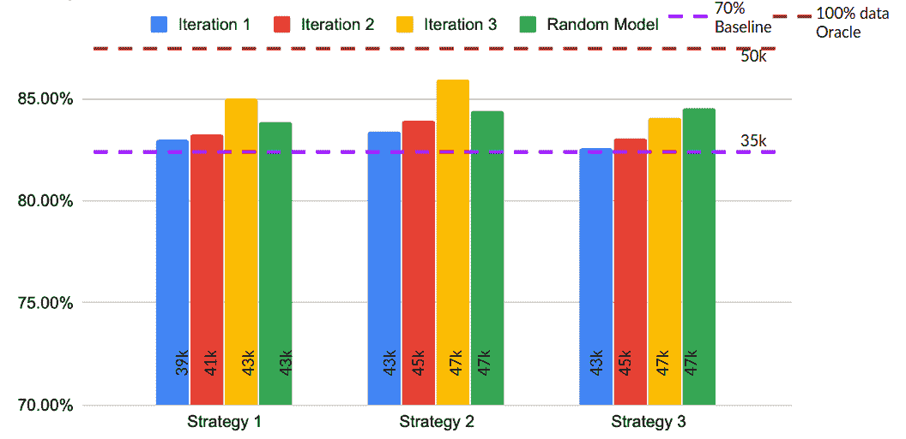

(图 19) CIFAR-10 结果

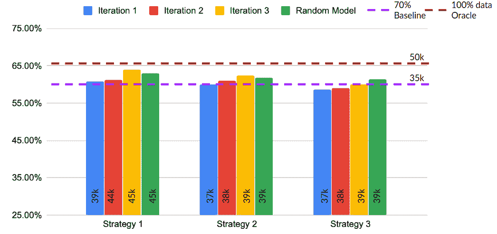

(图 20) CIFAR-100 结果

以上图表的图例:

> 策略 1:任何两个同意
> 
> 策略 2:3 个人都同意。使用基本事实
> 
> 策略 3:3 个人都同意。用他们的预测作为标签
> 
> 随机模型:与迭代 3 具有相同样本数的模型，用于比较性能改进

***推论* :**

对于 CIFAR-10 和 CIFAR-100，在策略 1 中，随着大量(正确标记的数据)的增加，每次迭代后准确度都会增加。这种策略也优于 70%基线和随机基线，因为这种策略有助于选择最有帮助的数据，这些数据可以被扩充回来。对于策略 2，我们也得到了相似的结果。而对于策略 3，精确度在每次迭代中都会增加，但是它不能超过随机基线。原因是，在这种策略中，有可能增加假阳性。所有 3 个模型对图像进行错误分类的例子会用错误的标签进行增强，从而降低整体性能。CIFAR-10 的总赢家是策略 2，因为这三个模型一开始就有不错的性能，因此大多数示例都被正确或错误地分类在一起。这可以从策略 2 中增加的数据量比策略 1 中多得多看出。对于 CIFAR-100，策略 1 是总体赢家，因为 CIFAR-100 是更稀疏的数据集(更多的类)，因此从一开始，每个类的模型看到的示例更少，似乎分歧更大。这导致策略 1 的示例增加了更多，从而极大地提高了性能。

# **结论:**

由于假阳性(tri 训练错误预测的无监督数据),增加 tri 训练生成的预测偶尔会降低迭代的准确性。用真实数据替换模型生成的预测有助于我们消除这些假阳性，并迭代地提高基线准确性。对于 SQuAD 数据集和 urban sounds 数据集，我们的模型在 3 次迭代后击败了 oracle。在几乎所有的领域中，经过 3 次迭代，我们击败了用相同数量的随机采样数据训练的模型。这使我们得出结论，tri 训练从无监督的池中识别重要的例子。因此，半监督的 tri 训练为主动学习过程提供了良好的基础。

# **参考文献:**

[1] Tri-Training:使用三个分类器利用未标记数据【http://citeseerx.ist.psu.edu/viewdoc/download? doi = 10 . 1 . 1 . 487 . 2431&rep = re P1&type = pdf

[2]齐藤，k .，牛池，y .，&原田，T. (2017)。*用于无监督领域适应的非对称三训练*。在 2017 年的 ICML。从 http://arxiv.org/abs/1702.08400[取回](http://arxiv.org/abs/1702.08400)

[3]m .任、r .基罗斯和 r .泽梅尔(2015 年)。*探索图像问答的模型和数据*。从 https://arxiv.org/pdf/1505.02074.pdf[取回](https://arxiv.org/pdf/1505.02074.pdf)

[4]可视化问答数据集。从 https://visualqa.org/download.html[取回](https://visualqa.org/download.html)

[5] K. Simonyan 和 A. Zisserman，*用于大规模图像识别的极深卷积网络*，ICLR，2015。

[6]鲁德，s .，&普兰克，B. (2018)。*域转移下神经半监督学习的强基线*。[在 ACL 2018 的会议录中](https://ruder.io/semi-supervised/index.html#fnref20)

[7] J. Salamon、C. Jacoby 和 J. P. Bello，“城市声音研究的数据集和分类法”，第 22 届 ACM 多媒体国际会议，美国奥兰多，2014 年 11 月。

[8]机器学习理解的双向注意力流[https://arxiv.org/pdf/1611.01603.pdf](https://arxiv.org/pdf/1611.01603.pdf)

[9]林，x .，&帕里克，D. (2017)。视觉问答的主动学习:一项实证研究。从 https://arxiv.org/pdf/1711.01732.pdf[取回](https://arxiv.org/pdf/1711.01732.pdf)

[10] Alex Krizhevsky (2009)，从微小图像中学习多层特征

检索自[https://www . cs . Toronto . edu/~ kriz/learning-features-2009-tr . pdf](https://www.cs.toronto.edu/~kriz/learning-features-2009-TR.pdf)

[11]卡伦·西蒙扬和安德鲁·齐泽曼(2014)，用于大规模图像识别的非常深的卷积网络。从 https://arxiv.org/abs/1409.1556[取回](https://arxiv.org/abs/1409.1556)

[12]小队数据集 2.0，检索自:[https://rajpurkar.github.io/SQuAD-explorer/](https://rajpurkar.github.io/SQuAD-explorer/)

# **团队:**

IVA 团队成员:

1.  阿尤什·沙阿
2.  阿南德·戈库尔·马哈林加姆
3.  阿克谢·古拉提
4.  罗伊斯顿·玛丽安·马斯卡雷尼亚斯
5.  拉克什塔·宾童龙

这项工作是作为 2019 年秋季南加州大学 CSCI-566 级“深度学习及其应用”的课程项目完成的，由 Joseph Lim 教授负责。