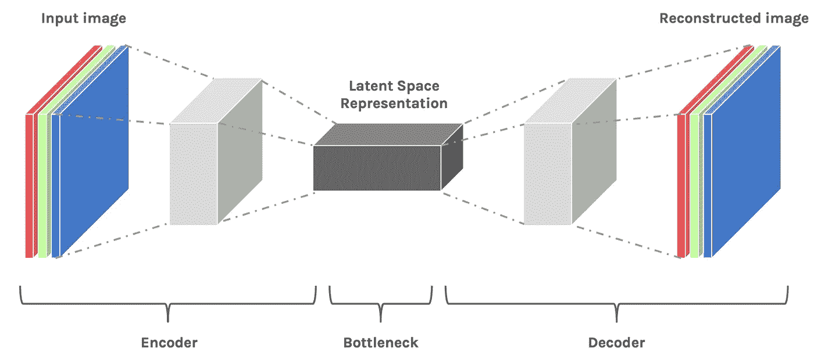
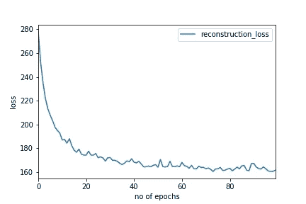
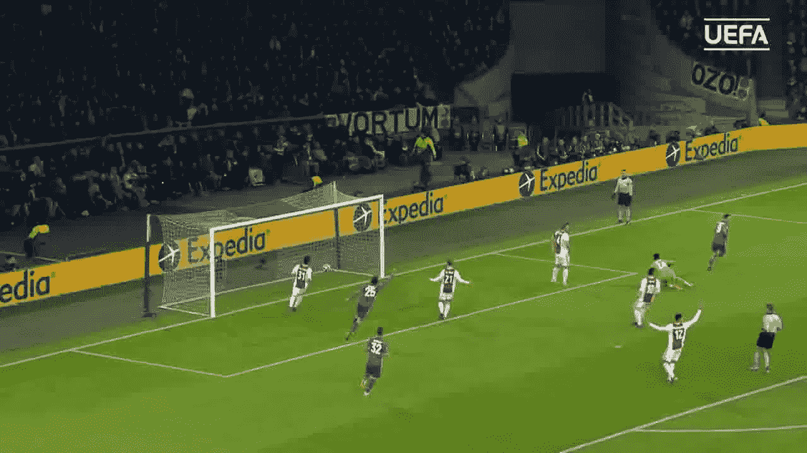
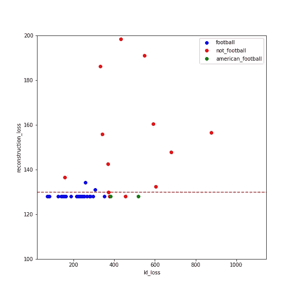

# 使用变分自动编码器的图像分类

> 原文：<https://medium.com/analytics-vidhya/activity-detection-using-the-variational-autoencoder-d2b017da1a88?source=collection_archive---------9----------------------->

前超级鹰队(尼日利亚足球队)教练斯蒂芬·凯希(来源:半岛电视台)

这个项目的代码可以在 [Github](https://github.com/samsonafo/Activity-Detection-using-Variational-Autoencoders) 上找到。

使用神经网络的传统图像识别需要图像标记。图像标注可能是一项单调乏味或者更昂贵的工作。想象一下，运营一家拥有大型图像数据集的公司，每次我们需要为特定图像类型构建图像识别算法时，我们都需要将图像标记为**【实例】**和**【非实例】**。例如，“猫”和“不是猫”或“狗”和“不是狗”。问题是有很多种**‘非实例’。**例如，为了建立一个猫的图像标识符，我们将所有的猫标记为**猫**以及狗、山羊、汽车、人类、飞机等。好像**不是猫。**如果我们想要用相同的数据集构建一个人类图像标识符，那么我们必须将所有的人类图像标记为**人类**而将所有其他图像标记为**非人类。**

这显然既费时又费钱。于是问题就来了——我们能不能建立一个图像识别器，而不必经过严格的图像识别？或者更好地说，我们是否可以建立一个神经网络，可以学习图像来自哪里的具体分布？除了图像识别之外，这种思想可以用于根据图像的分布来分离图像。比如把不道德的图像从视频中分离出来，或者把广告从视频中分离出来。

在这个项目中，我使用变分自动编码器(VAE)来解决这些问题。我对来自特定分布的图像训练了变分自动编码器，以便当来自不同分布的图像被馈送到 VAE 时，重建损失预计会更高。通过重建损失，可以跟踪图像是否属于特定的分布。在这个例子中，我考虑用这个想法将足球图像从广告中分离出来。

**变型自动编码器**

变分自动编码器的结构

VAE 是一个深层次的生成模型，就像生成对抗网络一样。深度生成模型显示出令人难以置信的能力，可以生成高度逼真的内容类图像。变分自动编码器由编码器、潜在空间和解码器组成。编码器和解码器基本上是神经网络。这篇[文章](https://towardsdatascience.com/understanding-variational-autoencoders-vaes-f70510919f73)中也很好地解释了变分自动编码器。

VAE 通过编码器接收输入，并在潜在空间中产生一个更小、更密集的表示(*编码)*，该潜在空间包含足够的信息，供网络的下一部分(解码器)将其处理为所需的输出格式，在最佳情况下，这就是输入到编码器的确切输入。通过训练过程，VAE 的潜在空间被设计为连续的，允许容易的随机采样和插值。

VAE 在两个损失上被优化，kl 损失和重建损失(输入图像和重建图像之间的差异)。kl 损失是潜在空间的分布和具有平均值 0(零)和标准偏差 1(一)的标准高斯分布之间的差异。这是将潜在空间的分布压缩到标准分布。这有助于解码器在解码图像时从潜在空间的每个区域进行映射。

在我的例子中(使用变分自动编码器从广告中分离足球图像)，我必须将视频分成帧(图像)。然后，仅在来自该分布的图像(足球图像)上训练 VAE。重要的是要注意，变分自动编码器是一个运行计算方面非常昂贵的算法，所以我决定在一个 **EC2** 实例上运行它。数据储存在一个 **S3** 桶里。在有序的步骤中，我们有:

1.  我们将足球视频转换成帧。
2.  构建 VAE 的架构，并编写所有必要的函数。
3.  在 AWS EC2 实例上进行培训时，将培训时段移动到 S3 时段
4.  重复任何步骤，直到重建损失显著减少。

用***99872576****参数*重建损失

上图显示了在重复上述步骤后 VAE 的重建损失。我也有下面的重建图像可以展示。**注意**我必须缩小输入编码器的图像尺寸。这是为了提高速度，减少 VAE 的火车时间，同时避免使用太大的 EC2 实例，这对我来说不方便。**输入编码器的图像尺寸为 60 x 80。**

输入图像(非缩小版)—大小为 1280 x 720。(来源:UEFA.com)

重建图像—大小为 60 x 80(损失 139.55)

该算法对于足球图像表现相当好。在广告的情况下，VAE 的重建损失更高。当然，考虑到 VAE 只对足球图像有些熟悉，这是意料之中的。

由于许多足球图像具有包含足球场(绿色草坪)的大面积，我推测该算法也可以学习这一点，因此当具有大面积绿色区域的图像被输入到 VAE 时，即使它们不是足球图像，VAE 也可能将它们作为足球图像。我决定通过尝试来自美式足球的图像来测试这一点，美式足球也有绿色的草坪，正如预期的那样，算法认为它们仍然是足球图像。

不同图像类型的重建损失

从结果来看，VAE 的真实阳性率为 0.93。VAE 很难从美式足球图像中分离出足球图像，同时它也有 0.31 的误报率。总之，可以有把握地得出结论，通过重建损失，我们能够根据它们各自的分布对图像进行分类，而无需事先标记。

在接下来的步骤中，我将在一个更大的 EC2 实例上训练图像。这将允许它用更大的图像进行训练，并且有可能用更多的图像进行训练以减少重建损失。

**致谢**

我非常感谢柏林数据科学静修中心的技术总监 **Adam Green** ，感谢他对这个项目的支持。特别感谢我的甜心， **Olamide** 的情感支持，以及 **Wuraola** 在编辑这篇文章时的帮助。

如有疑问或个人信息，请随时通过 [Linkedin](https://www.linkedin.com/in/samson-afolabi/) 联系我。

**延伸阅读**

1.  理解变分自动编码器。[链接](https://towardsdatascience.com/understanding-variational-autoencoders-vaes-f70510919f73)
2.  直观地理解变化的自动编码器。[链接](https://towardsdatascience.com/intuitively-understanding-variational-autoencoders-1bfe67eb5daf)

如果你喜欢这篇文章，你可以考虑请我喝☕️.咖啡

Vielen Dank😊