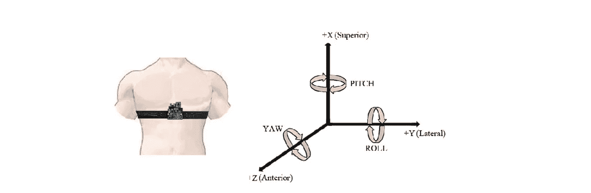

# 基于单个胸装加速度计的活动识别

> 原文：<https://medium.com/analytics-vidhya/activity-recognition-from-single-chest-mounted-accelerometer-b06b42f4f77c?source=collection_archive---------17----------------------->

来自单个胸部安装的加速度计数据集的活动识别主要包括安装在 15 个应答者(用户)身上的未校准的加速度计数据。该实验主要分析了每个回答者进行的 7 项活动。数据集可以从[https://archive . ics . UCI . edu/ml/datasets/Activity+Recognition+from+Single+胸装+加速度计](https://archive.ics.uci.edu/ml/datasets/Activity+Recognition+from+Single+Chest-Mounted+Accelerometer)下载。这些活动…