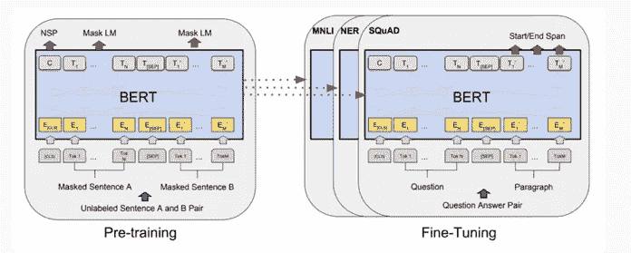
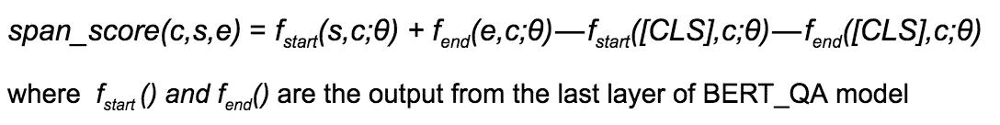
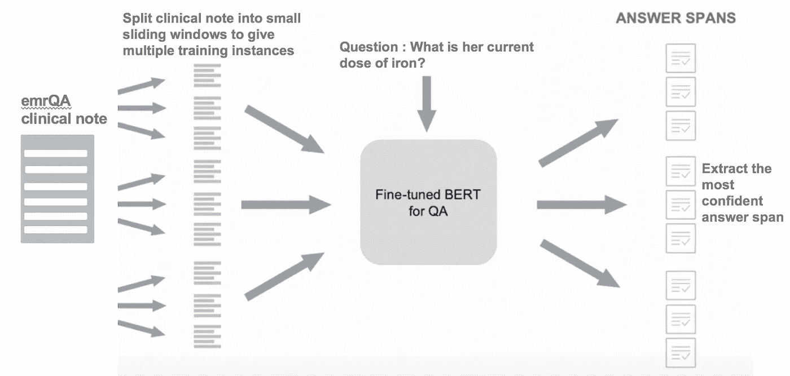
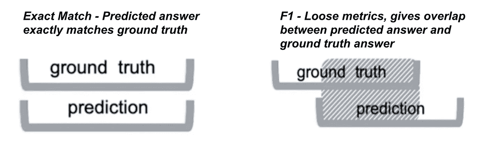
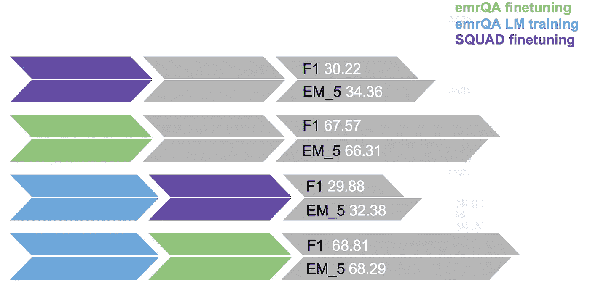
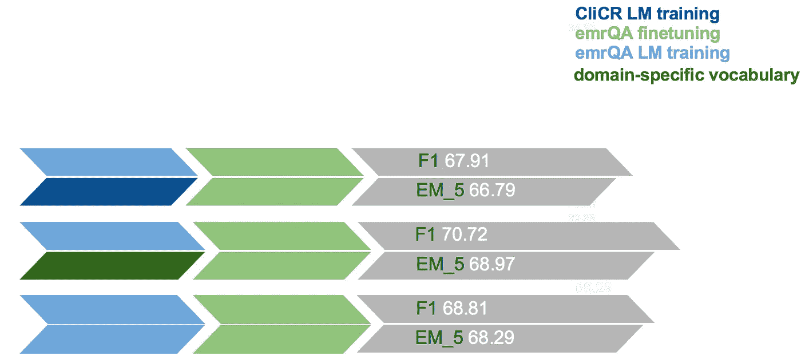
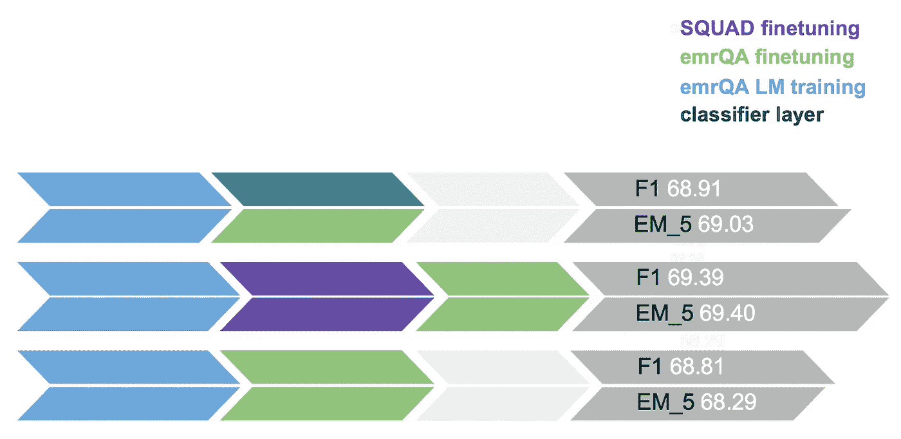
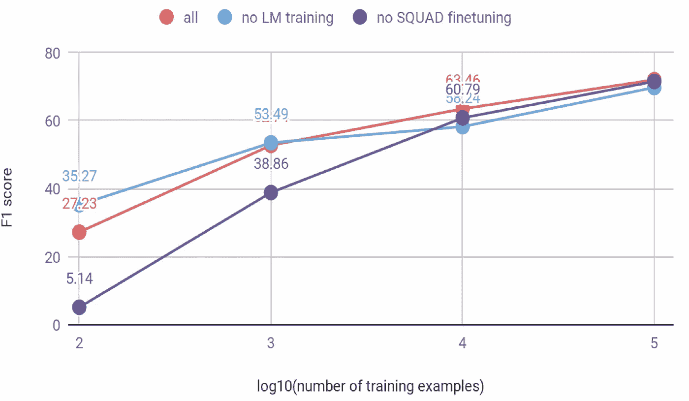

# 将 BERT 问题回答应用于医学领域

> 原文：<https://medium.com/analytics-vidhya/adapting-bert-question-answering-for-the-medical-domain-2085ada8ceb1?source=collection_archive---------0----------------------->

> BERT 是去年自然语言处理领域的突破性模型之一，它改变了我们处理文本数据的方式。尽管它已经超越了大范围自然语言处理任务的最新成果，但是围绕它的领域适应和问答任务扩展的一些问题仍然没有被探索。本文旨在总结在[**pelta rion**](https://peltarion.com/)**暑期实习期间所做的研究，以使 BERT 适应数量有限的特定领域数据集，用于具有长输入上下文的问答任务。**

在许多具有挑战性的 NLP 任务中，BERT 取得了重大进展，问答就是其中之一。在这项任务中表现良好的模型可以在不同的行业中直接应用，例如，Peltarion 的一个客户，一家大型电信公司希望使用深度学习来优化他们的 RFP 流程。一个可以查看产品文档并突出 RFP 中所提问题的相关答案或证据的模型可以显著提升 RFP 流程。来自客户的预期数据将是产品文档、来自 RFP 的问题以及作为从相应产品文档中提取的答案的注释。在我们要求客户执行昂贵的数据收集任务之前，我们从 BERT 开始在 [emrQA](https://github.com/panushri25/emrQA) 数据集上构建概念验证。你可以在[1]和[2]中阅读更多关于 BERT 和[班](https://rajpurkar.github.io/SQuAD-explorer/)数据集的问答模型。假设你对 BERT 模型有一个相当好的理解，这篇博客将带你浏览指导我们实验的研究问题，它们的结果和结论。

来源—伯特纸业

# **研究问题**

今年早些时候，许多论文[3，4]关注于将 BERT 应用于不同的领域，如科学和生物医学。常见的方法是要么用大型特定领域语料库(如科学论文)从头开始训练 BERT，并使用特定领域词汇，要么用大型特定领域语料库微调 BERT 的语言模型，同时使用 BERT 的原始词汇。他们在特定任务的数据集上进一步微调了适应的模型，并在句子分类和 NER 上进行评估，这是比问答相对容易的任务。此外，现有工作中使用的数据集通常具有较小的上下文长度，通常小于 512 个标记。BERT 有 512 个输入令牌的限制，但来自客户的产品文档或来自 emrQA 数据集的临床记录通常比 BERT 可接受的输入长度大得多。在我们为有限数量的特定于领域的数据集构建 QA 模型的过程中，面对这些挑战，我们定义了以下研究问题:

1.  当输入上下文或段落大于 512 的 n 倍时，问答任务的方法是什么？
2.  如何利用有限数量的特定领域语料库(仅产品文档或仅临床笔记)为特定领域问答数据集调整 BERT 模型？
3.  将 BERT 词汇表中的占位符替换为常见的特定于领域的单词有帮助吗？
4.  需要多少训练数据才能达到像样的准确度？

# 处理长上下文

BERT-QA 模型接受以下格式的输入:一个“[CLS]”标记，标记化的问题，一个“[SEP]”标记，来自文档内容的标记，以及一个最终的“[SEP]”标记，将每个实例的总大小限制为 512 个标记。如前所述，临床记录的长度大约是 512 的 5 倍，为了处理这个问题，我们修改了训练数据，以便它可以在不修改其架构的情况下由 BERT 模型使用。诀窍是将临床笔记分成多个子笔记，使得每个子笔记在与输入问题连接时，给出接近 512 个记号。将输入问题与子笔记串联后，有两种可能:1)如果子笔记包含地面真值答案，则在子笔记中标注答案的起始和结束位置 2)如果子笔记不包含地面真值答案，则将起始和结束位置标注为 0(指向【CLS】token)。在推断过程中，我们将输入的临床笔记分解成多个子笔记，方式与训练时相似，并将每个部分与输入的问题连接起来。预测给定问题的临床笔记的所有子笔记上答案的开始和结束位置。它是通过为上下文 *c* 计算 *span_score(c，s，e)* 来完成的，开始于位置 *s* ，结束于 *e* 。

将临床笔记的子部分 *c* 中具有最高 *span_score(c，s，e)* 的答案 span *(s，e)* 预测为答案。这种方法部分受到[5]的启发。

长临床笔记问答的推理阶段

# **实验和结果**

在设计了问答中处理长上下文的方法后，我们做了几个实验来探索剩下的研究问题。对于评估，使用 F1 分数和 EM_5 度量。EM_5 是精确匹配(EM)度量的修改版本，并且可以被定义为多少次预测的开始和结束位置位于地面真实位置的+/-5 个标记的附近。

评估指标

*下图中的实验可以被视为按照从左到右的时间顺序完成的多个训练阶段，其中箭头的颜色表示训练的类型，一个箭头中的两种颜色表示在该训练阶段进行的额外修改。对于所有实验，从预训练的 BERT 基本无壳模型的权重初始化模型。*

所有实验可以大致分为三个部分:

1.  **初步实验**

初步实验是为了找出 SQUAD 微调的 BERT-QA 模型在特定领域数据集(如 emrQA)上的性能。它验证了我们的直觉，即由于缺乏领域知识，该模型将表现不佳。也是为了找出通过使用 emrQA 进行任务驱动的微调可以获得多少领域相关的知识。此外，有趣的是，通过使用有限数量的文本数据(即来自 emrQA 的临床记录)来训练语言模型，可以看出该模型是否可以适应该领域。

初步实验的结果

**2。LM 培训的效果**

正如从初步实验中观察到的，在特定领域数据集上的任务相关的微调是最有希望的步骤，并且即使在有限数量的领域文本上训练 LM 也进一步推动了性能。在 LM 训练期间不使用下一个句子预测任务，因为临床笔记中的两个连续句子即使彼此不相邻，也大多会保持笔记的结构和意图。第一组实验是为了使用 LM 训练来提高适应性而进行的。可以尝试的一件事是将 BERT 原始词汇表中的 1k 占位符替换为最常见的特定领域的单词，以查看它是否有助于模型更好地学习这些单词。另一个想法是通过使用来自另一个名为 CliCR 的数据集的临床记录来扩充领域语料库。CliCR 注释增加的低性能可归因于来自 CliCR(源)和 emrQA 数据集(目标)的临床注释的结构和内容的差异。以下是两种修改的结果:

LM 训练实验的结果

**3。微调的效果**

为了更好地进行任务相关的微调，我探索了两个方向。首先，在 BERT 的基础上添加一个分类器，从临床笔记中筛选出可能有输入问题的潜在答案的相关子部分。简而言之，分类器将采用上下文(来自临床记录的 512 个标记的窗口)和问题来预测上下文是否与给定的问题相关。如果是，那么可以计算开始和结束分数。另一个问题是，在对领域数据集 emrQA 进行微调之前，对大型通用领域 QA 数据集(即 SQUAD)进行微调是否会增加价值？结果如下:

微调实验的结果

> “我们假设，当模型直接针对下游任务进行微调，并且仅使用非常少量的随机初始化的附加参数时，任务特定的模型可以受益于更大的、更具表现力的预训练表示，即使下游任务数据非常小。”*摘自伯特的论文*

**4。训练数据量的影响**

注释数据既费钱又费时，因此了解真正需要多少注释数据是很重要的。来自上述实验的步骤用于在保持测试数据固定的同时，在不同大小的训练数据上训练模型。下图解释了相同的结果:

数据集大小与性能—红色曲线(全部)显示:替换词汇表中的单词，添加分类器层，进行 LM 训练，SQUAD 微调和 emrQA 微调。

# **结论**

*   在通用领域数据集上训练的模型在特定领域数据集上表现不佳。
*   为了适应领域，任务驱动的特定领域问答数据集微调是最重要的步骤之一。
*   利用有限数据(只有来自 QA 数据集的可用段落或临床记录)通过 LM 训练进行的领域适应在性能上给出了边际改进。
*   通过替换原始词汇表中的占位符来添加特定于领域的单词有助于模型更好地学习这些单词。
*   当特定于领域的数据集有限时，在对特定于领域的 QA 数据集进行微调之前，用大型通用领域 QA 数据集对 BERT-QA 模型进行微调可能会有所帮助。

感谢 [Anders](/@anders_9654) 在实习期间的指导以及对本文的宝贵反馈。

附:所有方法的代码都可以在我的 [Github](https://github.com/shipra25jain/BERT_medical_QA) 账号上找到。所有的实验都是在谷歌实验室的免费 TPU 上进行的

**参考文献**

[1][https://ai . Google blog . com/2018/11/open-sourcing-Bert-state-of-art-pre . html](https://ai.googleblog.com/2018/11/open-sourcing-bert-state-of-art-pre.html)

[2][https://medium . com/datadriveninvestor/extending-Google-Bert-as-question-and-answering-model-and-chatbot-e 3e 7b 47 b 721 a](/datadriveninvestor/extending-google-bert-as-question-and-answering-model-and-chatbot-e3e7b47b721a)

[3] SciBERT:科学文本的预训练语言模型，Beltagy 等

[4] BioBERT:用于生物医学文本挖掘的预训练生物医学语言表示模型，Lee 等

[5]自然问题的伯特基线，阿尔贝提等