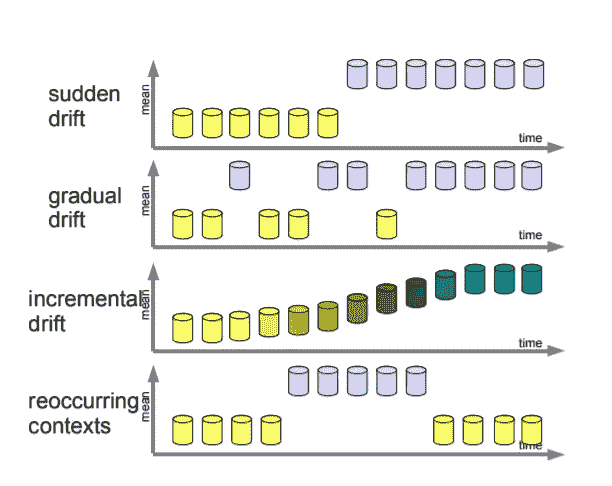
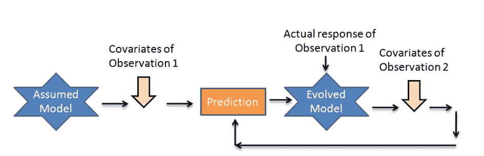
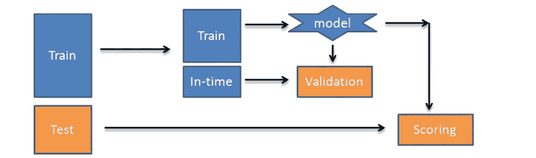
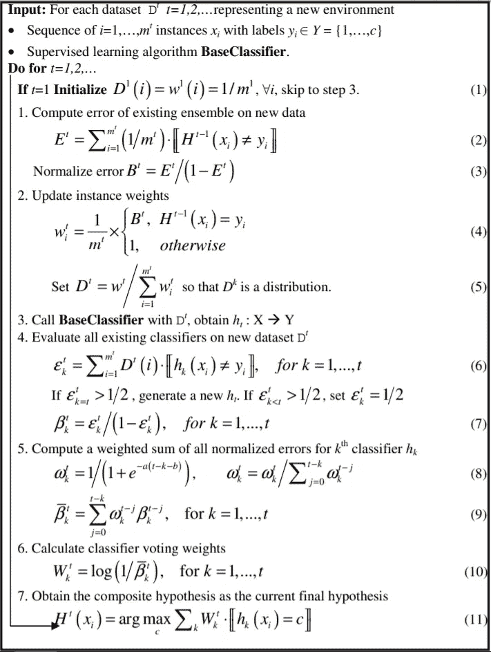

# 自适应机器学习

> 原文：<https://medium.com/analytics-vidhya/adaptive-machine-learning-f4fba2f50bc1?source=collection_archive---------8----------------------->

不同的方法被用于将机器学习模型投入生产。很多时候，模型是在一次性训练后投入生产的(静态模型)。为了使这种模型能够随着时间的推移保持准确的预测，它进行预测的数据必须与模型的定型数据具有相似的分布。然而，分布会随时间漂移。

这种偏差被称为概念漂移。

(“概念漂移”中的一个概念是指输入和输出变量之间未知的、隐藏的关系。概念也称为协变量。)

***图 1:概念漂移的类型***

处理概念随时间变化的技术可以大致分为:

1.在线/增量技术:

它是一种机器学习类型，在假设初始静态模型后利用动态输入(实时输入，例如传感器数据)。输入被逐一处理。

***图 2:线上模型流程图***

然而，纯粹的在线技术受到检测到的概念变化可能只是噪声的影响，因此随后的计算也将变得不准确

> 模型性能只能在多个输入的范围内测量，其中模型必须多次改变行为

2.基于批次的非平稳技术:

基于批处理的模型允许训练和测试样本随着时间的推移而累积，以实现持续的模型增强

***图 3:批量非平稳模型流程图***

**所探索的各种基于批次的技术包括**:

**观察管理**:描述新的数据点如何被合并以更新现有的模型

**适应技术**:强调模型如何从新数据中学习

**遗忘机制**:描述不相关的数据点如何随着时间的推移从模型的学习行为模式中消失

用于非平稳概念的所有机器学习算法可以基于它们各自的学习技术分类为:

**开窗**:想法是让窗口一直增长到没有变化被检测到，当检测到变化时缩小它的尺寸，确保保存在窗口中的观察结果与当前概念相关。窗口不能很好地处理反复出现的概念漂移。

**加权**:在训练模型时，加权算法将较高的权重分配给较新的观察值。加权不适用于反复出现的概念漂移。

**采样**:采样算法通过将根据给定的概率分布选择的观察值保存到存储器中来总结整个流的特征。这种概率分布可能偏向于最近的观测结果，以便考虑漂移。由于与过去的概念相关的观察所带来的信息可能非常少，因此抽样并不奏效。

**集成方法**:将一组模型保存在内存中并组合其预测的集成方法。最终的预测可以通过不同的聚合方法得到。当概念不再出现时，这可能被证明是一个无用的策略。

***下面讨论的是一种算法，它通过结合加权和集成方法进行学习，以在非平稳环境中进行预测。此外，这种算法已经被选中，因为它在理论实践之外也被广泛使用。***

**Learn++ NSE(针对非平稳概念的 Learn++算法)**

它是一种基于集成的非平稳机器学习算法，通过对批量数据进行学习来更新自身。++代表了算法从增量可用批处理数据中学习的能力。这种批量数据将包括标记的数据点以及用于评分的数据点。标记数据集可以进一步分为训练和测试数据集，就像静态 ML 算法一样。

因此，假设训练数据集在特定间隔(可能在时间上不一致)可用，并标记为-D1，D2 … Dt，对应于实例 1，2…t

每个新的数据集都代表了最新概念的快照。自前一数据集以来概念的变化量可能很小/很大，这是通过在最近标记的数据集上的现有集成的性能来跟踪的。

创建 Learn++ NSE 模型集合的步骤可以分解如下:

**基础模型**:基础模型在第一次投产前，根据历史数据进行一次训练和优化

**模型集合:**每个可用数据实例训练一个模型。例如:一个模型将在一审时仅在 D1 上训练，一个模型在二审时仅在 D2 上训练(t)

**模型误差更新**:在 Dt(最近的训练数据集)上评估模型集合中的每个模型，并为其在实例 t 的性能分配误差分数基础

**总误差分数**:对于实例‘t’处的每个模型，它是其所有过去误差率的加权平均值(较高的权重分配给较新的误差分数)

**集合重要性权重**:集合的模型被分配一个与其总错误率成反比的权重(具有较高错误的模型被分配一个较低的权重)

**净集成输出**:净集成输出是由相应的重要性权重加权的每个模型的输出的平均值

**集成性能**:在最近的训练数据集 Dt 上评估模型性能

> 数学上，分类学习++ NSE 算法如下:

***图 4:Learn ++ NSE***的伪代码

**1。** **计算现有集成对最新标注数据的性能:**

等式 2:每个标记为数据点的训练被赋予初始值= 1/mt，其中 mt 是基数 Dt。净误差为 et

Et:净计算误差是所有误分类的总和乘以 1/mt

Bt:它是模型集合的归一化误差，如等式 2 所示。3

等式 4:Dt 中的数据点如图所示进行加权

等式 5:分配的权重然后被归一化以创建 Dt 的误差分布

该误差分布将被用于将误差分配给模型集合中的所有模型。

**2。** **A 仅在 Dt 上被训练以创建最新的模型来添加到模型集合中。**

**3。** **在 Dt 上计算个别车型的性能:**

等式 6:在 Dt 上计算来自模型集合的每个分类器的误差

**4。** **错误阈值:**

最新模型:如果最新模型的计算误差大于阈值，则再次训练模型，直到满足阈值标准

其他模型:如果计算出的误差大于 0.5，则为其分配一个对应于数据集 Dt 的值 0.5，这样，这样的模型在以后的另一次迭代中可能变得不重要(等式 1)。6)

计算出的误差被归一化，如公式。每个型号 7 个。

**5。** **计算每个分类器模型对应的时间加权平均值:**

等式 8:使用 sigmoid 函数计算每个误差的权重并归一化

等式 9:根据等式计算的重量。8 乘以计算误差

**6。** **分类器投票权按照公式计算。10**

**7。** **整体模型输出根据公式 11** 生成

# **参考文献**

1.针对受概念漂移影响的数据流的自适应机器学习算法:[https://tel.archives-ouvertes.fr/tel-01812044v2/document](https://tel.archives-ouvertes.fr/tel-01812044v2/document)

2.用于学生分类的基于实例与基于批量的增量学习方法:

[https://pdfs . semantic scholar . org/f90e/42 ca 8 c 80 c 75 BC 28 a 74d 4419 c 837871679720 . pdf](https://pdfs.semanticscholar.org/f90e/42ca8c80c75bc28a74d4419c837871679720.pdf)

3.适应变化环境的自适应机器学习；

[https://www . turing . AC . uk/research/research-projects/adaptive-machine-learning-changing-environments](https://www.turing.ac.uk/research/research-projects/adaptive-machine-learning-changing-environments)

4.在线机器学习简介:简化版:

[https://www . analyticsvidhya . com/blog/2015/01/简介-在线-机器学习-简化-2/](https://www.analyticsvidhya.com/blog/2015/01/introduction-online-machine-learning-simplified-2/)

5.概念漂移:在流式机器学习应用中监控模型质量:[https://www.youtube.com/watch?v=woRmeGvOaz4](https://www.youtube.com/watch?v=woRmeGvOaz4)

6.将机器学习(ML)模型投入生产的不同方法概述:

[https://medium . com/analytics-and-data/overview-of-the-different-approach-to-put-machine learning-ml-models-in-production-c 699 b 34 abf 86](/analytics-and-data/overview-of-the-different-approaches-to-putting-machinelearning-ml-models-in-production-c699b34abf86)

7.概念漂移适应研究综述；

[http://users.ics.aalto.fi/indre/surv.pdf](http://users.ics.aalto.fi/indre/surv.pdf)

8.非平稳环境中增量学习的集成方法；

[http://users . rowan . edu/~ poli kar/RESEARCH/PUBLICATIONS/MCS 07 b . pdf](http://users.rowan.edu/~polikar/RESEARCH/PUBLICATIONS/mcs07b.pdf)

9.概念漂移数据和软件的资源集合:

[https://github.com/gditzler/ConceptDriftResources](https://github.com/gditzler/ConceptDriftResources)

10.概念漂移下的学习，概述；

[https://arxiv.org/pdf/1010.4784.pdf](https://arxiv.org/pdf/1010.4784.pdf)

11.从示例流中学习灵活的概念:FLORA2:

[https://pdfs . semantic scholar . org/ee21/Fe 39d 99 BD 233 DBF 092 f 5 CD 21 a 50 df 28 c 7 b 04 . pdf？_ ga = 2.2263054-31975](https://pdfs.semanticscholar.org/ee21/fe39d99bd233dbf092f5cd21a50df28c7b04.pdf?_ga=2.226304664.306480498.1567516954-319752636.1567076557)46656.66666666667