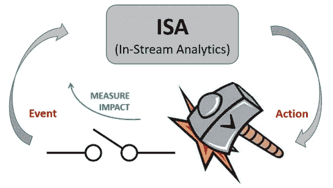

# 用于欺诈检测的自适应机器学习:金融科技的头号通缉犯

> 原文：<https://medium.com/analytics-vidhya/adaptive-machine-learning-for-fraud-detection-fintechs-most-wanted-706dd25bc097?source=collection_archive---------0----------------------->

有时，你会收到银行或信用卡公司的提醒，提醒你购买了或可能没有购买被认为可疑的商品。在极少数情况下，不管你的银行账户里有多少钱，你的购买都会被拒绝。几十年来，银行和信用卡公司一直使用基于规则的欺诈检测系统来补充日常交易的人工审查。这种检测欺诈交易的方式已被证明是低效的，因为欺诈案件的数量每年都在上升。仅美国就占 2016 年全球记录的欺诈交易总数的 42%以上。

有一种新的机器学习方法可以解决或至少最大限度地减少损失，这种方法涉及大量交易数据中的模式识别。这种方法通过为基于规则的系统提供检测欺诈性交易的动态方式来补充基于规则的系统。在某些情况下，基于规则的引擎被完全去掉，代之以根据研究具有更好性能的神经网络引擎。自适应机器学习对消费金融行业有无数好处。这种机器学习技术的当前应用包括使用构造器检测器[框架](https://link.springer.com/content/pdf/10.1023%2FA%3A1009700419189.pdf)的欺诈检测、高频算法交易和零售优化。

*这到底是怎么回事？*

为了使自适应机器学习工作，应该有持续的数据流入所考虑的 ML 模型，并且所考虑的机器学习模块应该是系统工作的“在线模块”。这种实时数据处理使模型能够在需要时微调权重。

图一。用于自适应机器学习的流内分析

根据上面的图 1，ISA 可以被认为是我们预先训练的 ML/DL 模型。由于存在连续的数据流，is a 引擎会在检测到欺诈时以预测的形式采取措施，然后触发事件。ISA 引发的行动的影响可以通过各种系统模型来衡量，如[本福特定律](https://en.m.wikipedia.org/wiki/Benford%27s_law)。

如同每一种 ML 建模方法一样，都有局限性。机器学习工程师面临的主要问题是他们必须处理的不平衡数据。例如在实时交易的欺诈检测的情况下。银行和信用卡公司提供的培训数据严重失真。非欺诈交易与欺诈交易的比率可高达 10000:1。这就需要额外的数据挖掘或数据清理技术，以确保模型接收的数据不那么偏斜，或者调整到足以承受某种形式的数据偏斜。这样做是为了防止它偏向新数据，并防止模型对流内数据输入得出错误的结论。然而，虽然这仍然是一个问题，但是有一些好的采样技术可以在一定程度上帮助解决这个问题。当我在研究中遇到高度不平衡的情况时，我总是使用 [SMOTE](https://arxiv.org/pdf/1106.1813.pdf) (合成少数过采样技术)算法，大多数时候非常有用。自适应机器学习还有很长的路要走，随着数据采样方法变得更好，这种学习方法也会变得更好。

***ML 欺诈检测的未来***

想象一个系统，其中机器学习模块是在每个帐户的基础上训练的。这意味着您的支票账户将有自己的训练模型，不同于您的储蓄账户，储蓄账户也将有自己的训练模型。当然，这将意味着将有成千上万，如果不是数百万的机器学习模块在云服务上运行。我将在后面的文章中详细解释这个相互连接的机器学习模块系统如何有效地工作，不仅保护消费者金融和大幅减少欺诈，而且有助于消除当前基于规则的系统。

随着谷歌最近推出游戏开发平台 [stadia](https://stadia.dev/) ，延迟正在成为过去，特别是当我们进入 5G 超高速数据传输的新时代。对于金融机构的所有用户来说，当前的自适应欺诈检测方法更像是一种通用模型，对于该模型的表现有多好存在严重的问题，因为它在大多数情况下是通用的，以避免错误警报，因此“一个账户一个 ML”模块的引入是非常重要的。

使用机器学习的欺诈检测仍然是机器学习模块由于高度不平衡的数据而变得不太有效的领域，但是随着 ML 算法研究的最新进展，使用 ML 的欺诈检测看起来很有希望。