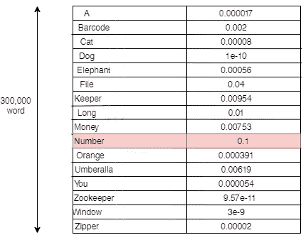
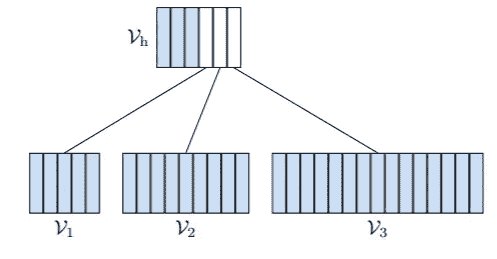
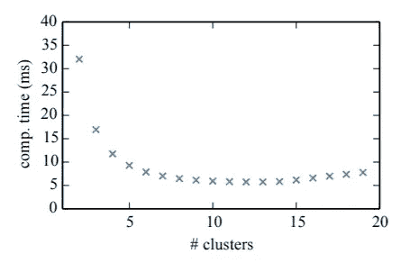
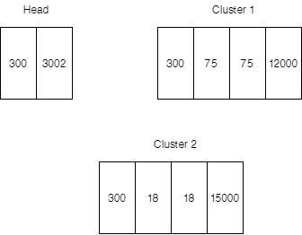
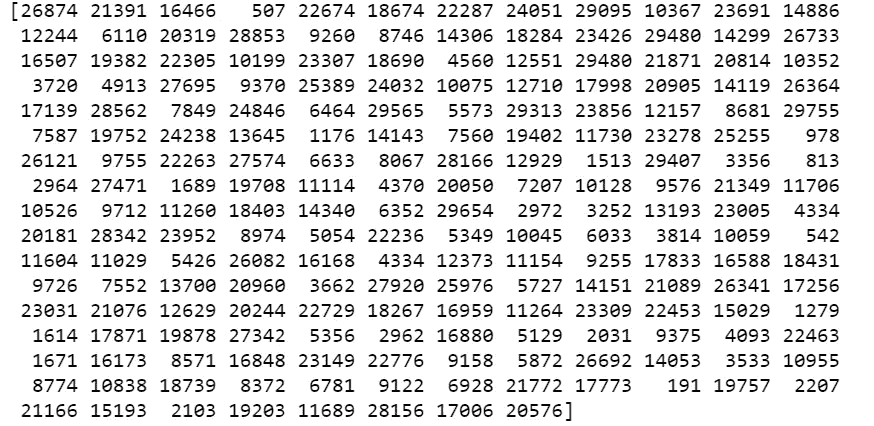
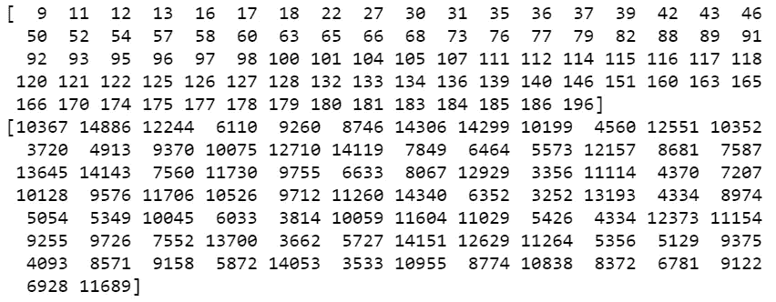
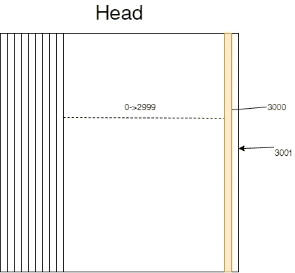

# Numpy 中解释的自适应 Softmax

> 原文：<https://medium.com/analytics-vidhya/adaptive-softmax-explained-in-numpy-941487ac4ba6?source=collection_archive---------11----------------------->

在我们进入主题之前，让我们先定义一下我们要解决的问题。假设我们正在创建一个[语言模型](https://en.wikipedia.org/wiki/Language_model)来生成文本。语言建模的思想是根据先前生成的单词预测最佳的下一个单词，但是我们如何挑选最佳的下一个单词呢？

实际上这比听起来要困难得多。假设我们有 300，000 个独特的单词来选择下一个单词。这是非常昂贵的，可能会超过模型本身的成本。图 1 显示了为句子“13 是我的幸运 _____”挑选最有可能成为下一个单词的候选词的过程。

图 1

每次我们想要使用常规的 [Softmax](https://en.wikipedia.org/wiki/Softmax_function) 来预测下一个单词，以获得归一化的概率分布，从而获得最可能的候选，乘以[批量大小，序列长度，嵌入维度] *[嵌入维度，词汇大小]，如果我们有批量大小 16，序列长度 100 个单词和 128 个长向量，并且 vocab 大小 300，000，这就是= 16*100*128*300，000，接近 615 亿。所以我希望你知道这有多贵，因为实际上这个数字要大得多。

当我们讨论正常 Softmax 的问题时，这篇[论文](https://arxiv.org/abs/1609.04309)提出了一种称为自适应 Softmax 的解决方案来解决这个问题。我推荐先看这几篇论文，再看原文 [1](https://www.aclweb.org/anthology/P14-1129/) 、 [2](https://arxiv.org/abs/1512.04906) 、 [3](http://www.iro.umontreal.ca/~lisa/pointeurs/senecal_aistats2003.pdf) 。

本文的主要思想是将预测的词汇范围划分为不同的簇。图 2 取自原始论文。这里的想法是创建两个级别，第一个级别由最有可能被预测的最频繁的单词和第二个级别的条目组成。白色列对应于指向某个集群的候选列表。例如，如果 Vₕ的 softmax 结果是 4ᵗʰ列，那么所需的单词在第一个簇中。然后我们在 V₁集群上计算 softmax 来得到这个单词。

图 2

我们怎样才能把词汇分成簇呢？答案很简单，根据字数频率。Vₕ最常用的词，然后根据我们的愿望划分其余的词汇。然而，最初的论文显示了这一统计数据。直到 10-15 个集群都没问题。

图 3

所以让我们进入编码部分。首先，我假设词汇表是根据频率排列的，我们只处理两个集群，最后，vocab_size = 30，000，Batch_size = 10，Seq_length = 50，嵌入维数= 300。

接下来，我们需要定义我们的集群的范围。有多少文字将属于 Vₕ、V₁和 V₂.

这意味着 Vₕ的范围将是从 0 到 3000，即 3k 个单词，V₁是 15k-3k = 12k 个单词，V₂是 15k。

此外，该论文提出根据它们的顺序来减小聚类维数的大小，因此聚类 1 将比聚类 2 具有更大的维数，聚类 2 将比聚类 3 具有更大的维数，以此类推。他们认为，随着词汇变得越来越少，模型不会看到那么多，所以没有必要保留太多空间。(我选择除以 4 作为超参数，你可以尝试任何一个)。

然后，我们需要创建对应于每个集群的矩阵。

让我们想象一下，图 4 是我们在上面的代码片段中创建的矩阵。我将解释每个数字对应的含义。因此，在 Head 中，300 是输入维度，3002 由两部分组成，3000 是我们可以预测的下一个单词的候选词汇数量，2 是我们拥有的聚类数量。因此，如果这个词不在 Head 的范围内，我们将进入下一个级别，因此我们还需要计算它是属于第 1 类还是第 2 类的概率。

现在我们将进入正题。

所以棘手的部分来了。现在，我们已经对 softmax 计算进行了划分，并且知道了每个集群的范围。我们通过选择其聚类的范围作为下限和上限来独立地对待每个聚类，并屏蔽目标矩阵。

所以让我们也来看看前面代码片段的输出。考虑我们的目标标签如下:

如前所述，我们的群集范围是:磁头 0->3000，群集 1 3000-> 15000，群集 2 15000-> 30000。因此，更清楚地说，当我们计算第 1 类中的 softmax 时，我们不关心第 2 类或 head 中的索引，因为我们没有它们的范围。因此，仅与聚类 1 相关的索引及其值应为:

第一矩阵对应于目标矩阵中的索引，第二矩阵分别对应于值。

正如我们在第二个矩阵中看到的，单词的 id 在 3000->15000 的范围内。这里有一个棘手的部分，关于真正的标签是在集群 1。那么，我们如何根据输入来计算我们的模型在预测这个正确标签方面有多好呢？如果我们的正确标签在第 1 类中，最大的概率应该是对应第 1 类中的相同 ID。例如，如果目标单词是 5426，则聚类 1 中的最高概率应该是 5426 位置。但是等等，矩阵 cluster1 从 0 索引开始，其中 0 对应 3000。所以我们需要从指数中减去下限。更清楚的是，如果单词索引是属于聚类 2 的 20000，我们需要它在聚类 2 中的相对位置是 20000–15000，因为聚类 2 的范围是从 15000->30000，即 15000 个单词，而 20000 超出了范围。之后，我们需要将我们的输入与相应的聚类矩阵相乘，然而我们只关心目标矩阵中的索引，该目标矩阵是聚类的低边界和高边界的范围。例如，如果 target 中的 3ʳᵈ和 4ᵗʰ单词是 ID 3000 和 24，000。我们只关心 4ᵗʰ词，因为我们只对簇 2 进行计算。

前面代码的输出将是[Batch_size * Sequence_length，Range of Vocabulary]。因此，接下来我们将 log_softmax 用于损失计算，并将此分数放入目标的相应索引中。这就像我们得到了多少正确的答案。

前面的循环看似复杂，但实际上非常简单。记住，cluster_results 的形状是[Batch_size * Sequence_length，Cluster Vocab size],但我们只取了对应于该特定聚类的第一维的条目。所以 cluster_results 的输出是按照它们在目标中的顺序排列的。为了进一步澄清，如果我们的目标矩阵是[100，20000，25000，3000，4000，27000]，并且我们在集群 2 中工作。所以我们只关心值为[20000，25000，27000]的索引[1，2，5]。因为我们只计算了[20000，25000，27000]的输入。所以聚类结果的结果将是[3，15000] (15000 是聚类 2 的范围)。然而，在聚类结果的每个条目中，我们只关心某些位置，它们是[20000，25000，27000]。转换成相对位置就是[5000，10000，12000]。因此，第一个单词我们只需要(1，15000)向量中 5000 的值，第二个单词(2，15000)我们需要 10000，依此类推。然后分别在[1，2，5]中输入这些值。简单对吗？

最后还记得进入矩阵的头项吗？它的范围只有 0->3000。那么它如何处理比这更大的范围呢？这就是我们追加 n 列的原因，其中 n 是集群的数量。那是什么意思？我们与输入的第一次接触是头层。如果单词不在 head 中，那么它一定在其中一个簇中。让我们想象一下这意味着什么。

这意味着我们还需要两个条目来表示我们拥有的集群数量。因为条目 3000 具有最高概率，这意味着预测对应于聚类 1。但是注意，这意味着它只对应于 cluster 1，cluster 1 中的哪个单词？从这个计算中我们无法得知。我们需要之前所做的来计算单词的聚类概率。因此，我们需要将这个条目概率 3000 添加到簇 1 中的预测单词。所以把这看作是两阶段概率。首先我们计算单词在 head 中的概率。如果最大概率的索引大于头部范围(> 3000)，则它属于其中一个聚类。然后我们得到单词在聚类中的相应索引，并计算这个单词出现在第一个聚类中的概率是多少？以及相应的代码，其中我们添加了两个损失:

就是这样。我希望你能读完这篇文章，并完全理解这个伟大的 softmax 近似值。欲了解更多信息，请阅读该文件。链接到完整代码:

资源:
1-[https://arxiv.org/pdf/1609.04309.pdf](https://arxiv.org/pdf/1609.04309.pdf)2-[https://py torch . org/docs/stable/_ modules/torch/nn/modules/adaptive . html # AdaptiveLogSoftmaxWithLoss](https://pytorch.org/docs/stable/_modules/torch/nn/modules/adaptive.html#AdaptiveLogSoftmaxWithLoss)