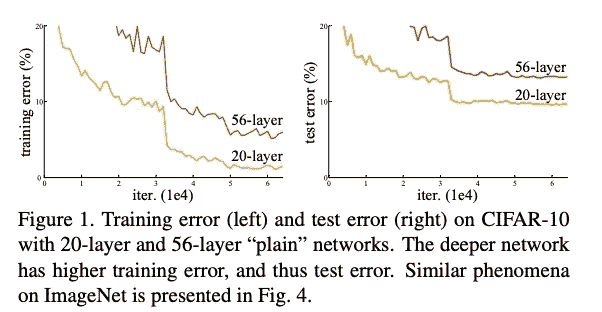
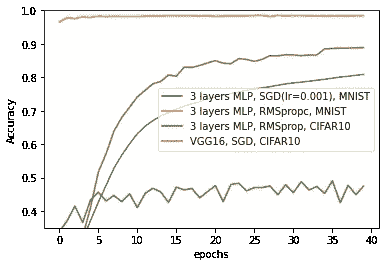
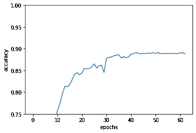
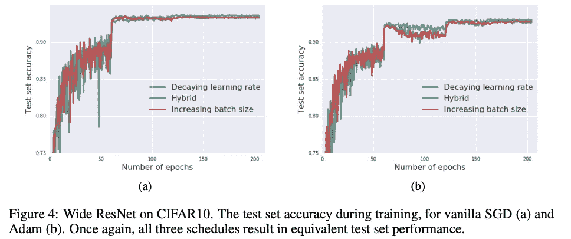
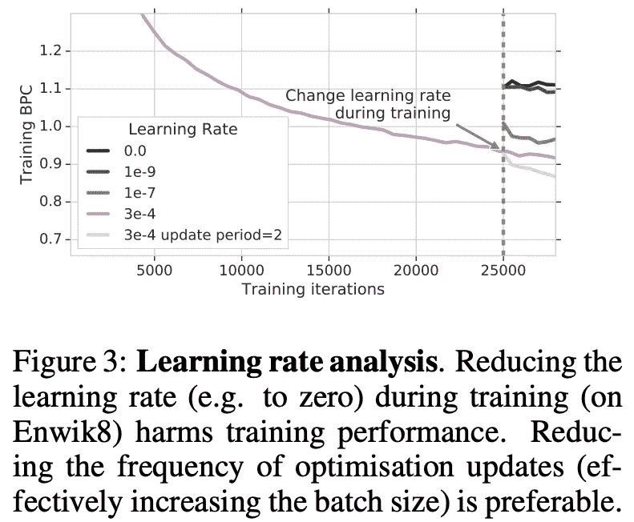
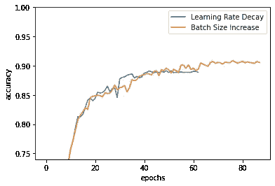

# 使用 Tensorflow 2.x 结合早期停止自适应地改变学习速率

> 原文：<https://medium.com/analytics-vidhya/adaptively-changing-the-learning-rate-in-conjunction-with-early-stopping-using-tensorflow-2-x-642898323505?source=collection_archive---------9----------------------->

# 关于这篇文章

本文将解释如下两个。

*   使用 tensorflow2.x 自适应地改变学习速率并结合早期停止的方法
*   引入结合早期停止的方法，自适应地改变批量大小而不是学习速率，这具有与学习速率衰减相同的效果。以及如何在 tensorflow2.x 中实现

# 什么是“学习率衰减”？

“学习率衰减”是一种常用的技术，用于提高深度学习的总体性能，其中学习率随着学习的进行而降低。

截至 2020 年 7 月，在我看来，学习率往往衰减到损失历史成为平台期时学习率的 1/10 到 1/5。在某些情况下，要衰减的历元数在常用的 CIFAR10 和 ImageNet 中预先指定，因为它们的行为在某种程度上是已知的。

取自[1]，学习率大约在 32，000 步左右衰减。

# 我们应该何时对未知数据集进行衰减？

那么未知数据的情况呢？对于 CIFAR10 和 ImageNet，您非常了解其行为，可以使用特定的纪元编号来指定衰减点。但实际上，在大多数情况下，您应该使用行为未知的数据。在这种情况下，不可能知道学习率应该在什么时候衰减。

随着数据集、网络类型和优化方法的变化，行为会发生显著变化。(下图)在实践中测试各种实验条件时，您需要了解它们的行为，并在每种条件下分别对它们应用学习率衰减。但是手动做不太实际。

所以你需要一种机制，一旦学习收敛，比如提前停止，你可以自动降低学习速度。

# Tensorflow2.x 上的提前停止+学习率衰减

Tensorflow 2.x 推荐你这样一个 train_step 函数来训练网络。

如果我试图只改变优化器的学习率，如下所示，我们会在第 23 行得到一个错误。

所以当我们改变学习率的时候，我们需要重新定义 train_step 函数。这样，我们可以没有任何误差地衰减学习速率。

结合了提前停止和学习率衰减的训练脚本如下。

定义` _max_patience '为精度不提高的允许最大历元数，超过时学习率衰减(第 58~65 行)。完整的代码可以在这里找到。

## 结果

训练结果如下:我用 VGG16 训练过 CIFAR10，优化方法是 SGD momentum。最初的学习率是 0.001，我工作了两次，每提前停止一次，学习率就降低四分之一。

学习率的衰减发生在 29，39 个时期之后。30 个历元的精度提升很大，但是第 40 个历元衰减的影响就没那么大了。

# 增加批量大小而不是降低学习速率

顺便说一句，增加批量而不是降低学习率，效果是一样的。根据这篇论文[2]，降低学习率提高了准确性，因为它与更新的可变性相关。即使你增加批量大小而不是降低学习率，更新的变化也在同样的规模上。因此认为可以达到相同的精度提高效果。

改编自[2]。学习率衰减和批量增加的比较；混合执行两者。

此外，Compressive Transformer 是 Transformer [3]的一种发展，据报道，使用学习率衰减会降低精度，但增加批量大小有助于提高精度。

它的实现如下。

第 60 行使用 tf.data 更改数据加载器的批量大小。注意，在第 4 行中，迭代器的创建是在创建 train_step 函数时重新配置的。(我不知道为什么，但如果你不在这里重新配置，你会得到一个错误。)

结果如下。学习率下降/批量增加都会出现准确度峰值。但是这些时间是不同的，因为我根据提前停车适应性地改变时间。

# 结论

在这篇文章中，我已经展示了学习率衰减的影响和批量增加的等效影响以及那些实现。我们经常遇到需要使用这种适应性方法的情况。希望这样的情况对你有所帮助。

**推特，我贴一句话的论文评论。**

https://twitter.com/AkiraTOSEI

# 参考

1.  何、、、任、。用于图像识别的深度残差学习。CVPR2016
2.  塞缪尔·史密斯，彼得-简·金德曼斯，克里斯·英。不要衰减学习率，增加批量。ICRL2018
3.  Jack W. Rae，Anna Potapenko，Siddhant M. Jayakumar，Timothy P. Lillicrap。

用于长程序列建模的压缩变换器。ICLR2020