# 与 Django 添加好友的分步指南

> 原文：<https://medium.com/analytics-vidhya/add-friends-with-689a2fa4e41d?source=collection_archive---------1----------------------->

想在你的 Django 网站上拥有 ***添加好友、发送好友请求、接受好友请求*** 功能吗？那么请阅读这篇文章:

在 Django 添加朋友非常简单

# 步骤 1:拥有某种配置文件模型或定制用户

为什么我们需要自定义用户模型或概要文件模型？这个配置文件模型或自定义用户模型将有一个朋友字段，我们将存储一个特定用户的所有朋友

我使用的是**定制用户模型**，它有一个*ManyToManyField***friends**引用回这个**用户**模型。

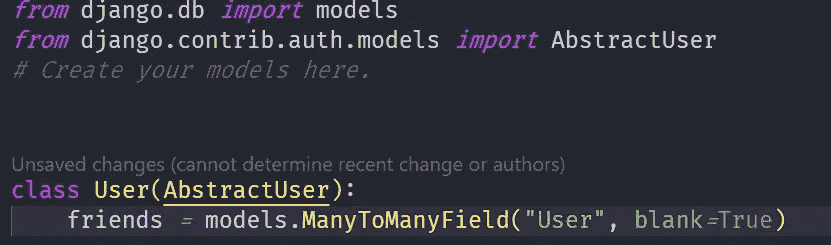

这里最重要的是朋友字段

# 步骤 2:创建朋友请求模型

这个朋友请求模型将存储朋友请求信息，即谁向谁发送请求。

这个朋友请求模型将有两个字段:

*   **来自用户**:它将与发送该请求的用户(*第一用户* ) **有一个*外键*关系，**
*   **到用户**:它还将与另一个用户*第二个用户* ) **有一个*外键*关系，第一个用户向其发送请求**。

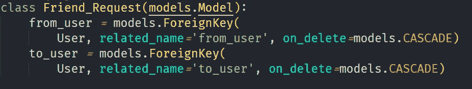

朋友请求模型

**确保字段有相关名称，并且它们有不同的名称。**

## 然后迁移模型。

> **认证用户(可选)**
> 
> 如果你从零开始学习本教程，或者你还没有设置你的认证系统，那么你也可以按照这些步骤来做。
> 
> **我把下面那些步骤都挪了！**

# 步骤 3:为好友请求创建视图

## 1.发送好友请求

*   我们得到用户 id **，我们将向其发送好友请求**
*   创建一个新的朋友请求实例，其中我们将请求将被发送到的用户设置为 _user = **，**
*   from_user 将是发送请求*的**用户，即***请求用户或当前用户

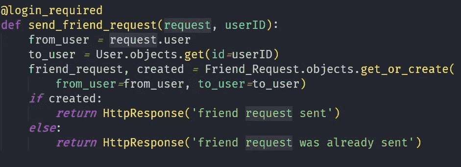

发送好友请求视图

## 2.接受好友请求

*   我们得到我们将要接受的请求的请求 id
*   我们还确保请求的 **to_user** 是当前用户*即* **发送请求的用户**是接受请求的当前用户，
*   然后我们将当前用户添加到***from _ user’***s(**发送** **请求的用户**)好友字段
*   我们还将 from_user 添加到当前用户的朋友字段中

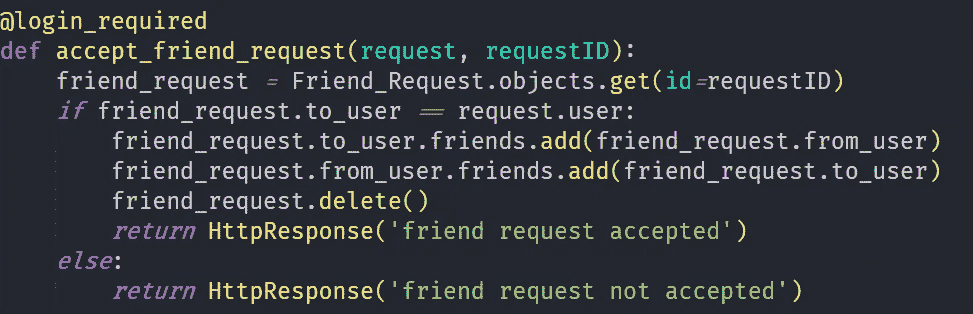

接受好友请求

# 步骤 4:创建 URL

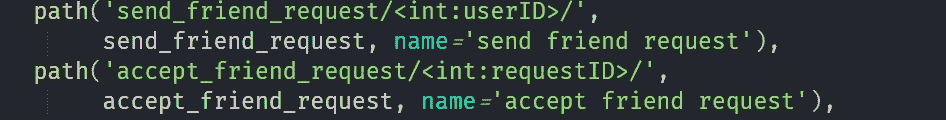

发送和接收视图的 URL

# 第五步:模板

1.  我在一个列表中显示所有用户，每个用户都有一个 *href* ，当点击它时**会向该用户发送一个好友请求。**

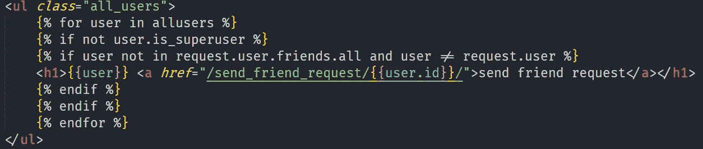

2.我在这里显示了发送给当前用户的所有好友请求，当前用户有一个 *href* ，点击后**将接受好友请求**，两个用户都将成为**好友。**

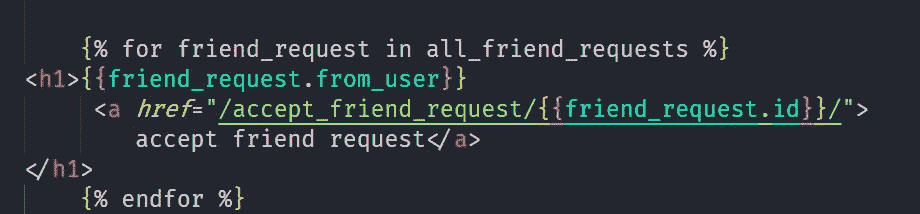

# **就是这样！我们到此为止。**

# 步骤 3 之前的可选步骤:验证用户

> 在 settings.py 中添加 AUTH_USER_MODEL
> 
> 此处**为*用户。用户*** 是指 ***用户*** app 中的 ***用户*** 模型

在 settings.py 中

## 1.创建用户表单:

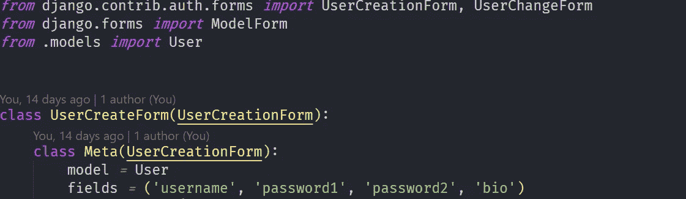

注册的用户创建表单

## 2.创建注册视图:

将这些导入 views.py

必要的进口

然后创建注册视图:*(非常基本的认证)*

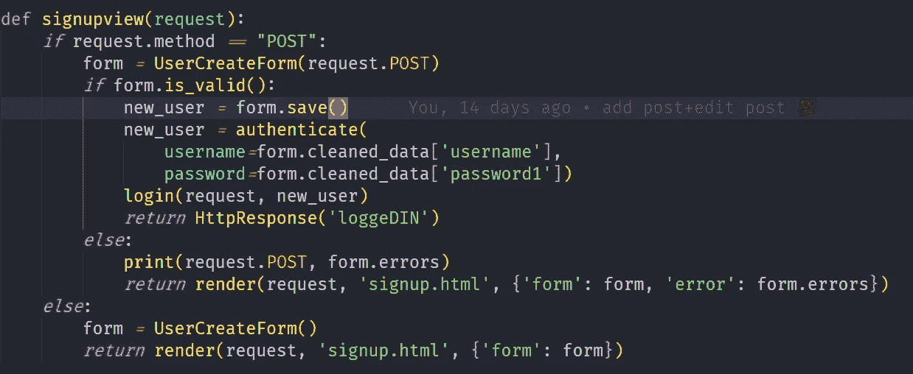

注册视图(忽略打印声明)

## 3.创建登录视图

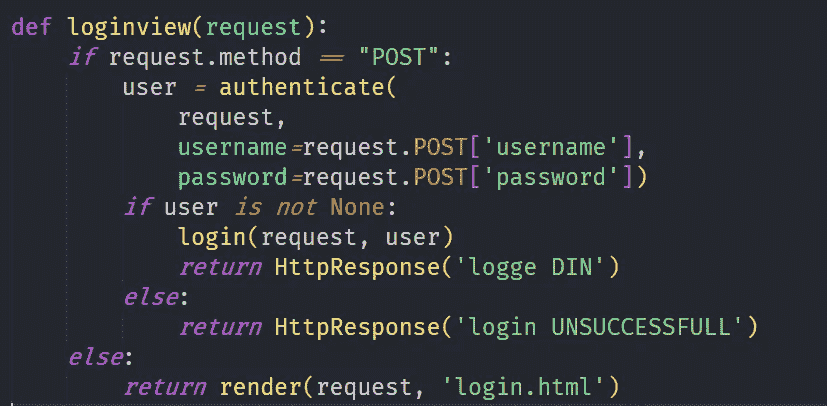

登录视图

## 4.创建 URL

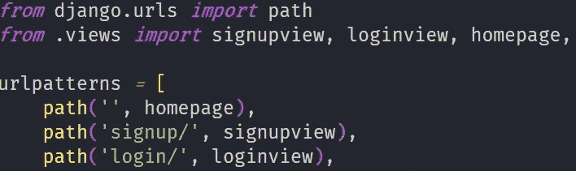

urls.py

## 5.HTML 模板

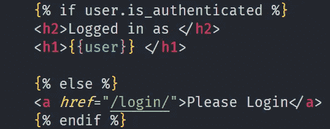

Homepage.html

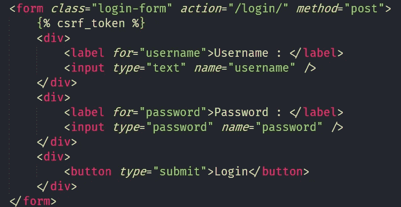

login.html

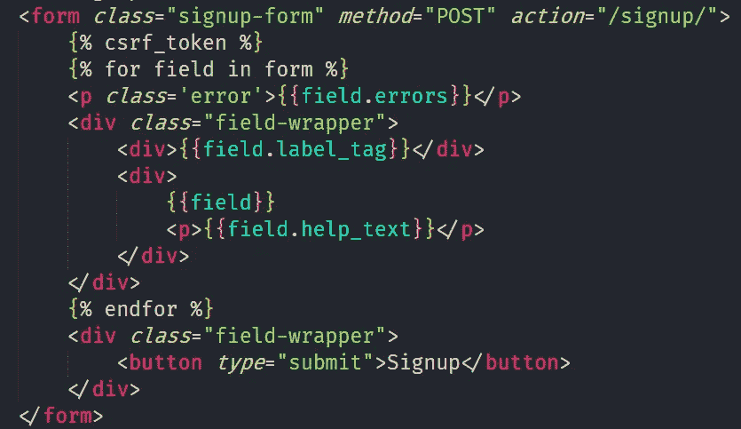

Signup.html

# 希望这有所帮助🎉