# 使用 AdaBoost 算法为您的模型增加动力

> 原文：<https://medium.com/analytics-vidhya/add-power-to-your-model-with-adaboost-algorithm-ff3951c8de0?source=collection_archive---------1----------------------->

由 [Unsplash](https://unsplash.com?utm_source=medium&utm_medium=referral) 上的 [Bulkan Evcimen](https://unsplash.com/@bulkan?utm_source=medium&utm_medium=referral) 拍摄的照片

自适应增强算法通常被称为 ***AdaBoost*** 算法是一种基于决策树的**集成增强学习技术**，或者我们可以说是借助决策树。

因为决策树也用于构建随机森林模型，所以我们需要知道 adaboost 和随机森林模型之间的区别:→

1.  在随机森林中，我们通过将数据集划分为 n 个相等的部分，从数据集的每个子部分生成不同的决策树，其中一些树可能比其他的更大，但是决策树的大小没有预先确定的长度。*相比之下，用 AdaBoost 生成的树的森林，每棵树包含一个父节点和两个叶节点，这种类型的树称为树桩。*
2.  对于随机森林的最终分类，每棵树都有同等的投票权。*然而，在由 adaboost 生成的树桩森林中，一些树桩在最终分类中比其他树桩获得更多发言权或更多投票。*
3.  在随机森林中，每棵树都是独立生成的，不会影响其他树。*相反，以 adaBoost 顺序生成的树桩森林很重要，因为第一棵树生成的错误会影响第二棵树，而第二棵树生成的错误会影响第三棵树，等等。，等等*。

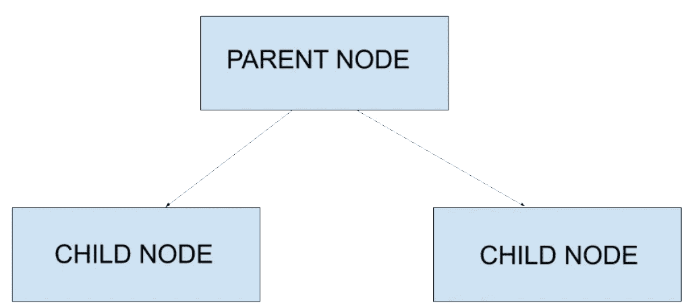

残肢的图示

## AdaBoost 算法在哪里使用？→

AdaBoost 算法用于数据集的各种特征(自变量)与其目标变量(因变量)之间存在复杂关系的地方。

## AdaBoost 算法是如何工作的？→

为了理解这一点，我们将使用该数据集对来自特定地区、具有特定收入并参考其性别的人是否患有心脏病进行分类。

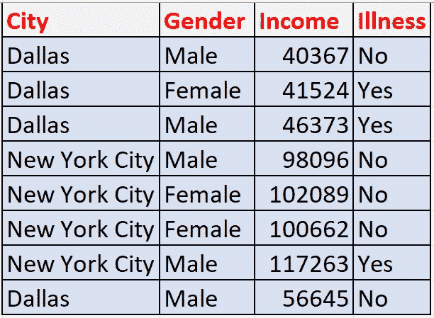

我们要做的第一件事是添加一个与表中每个数据点相对应的“权重”列，该列将指示相应数据点被正确分类与否的重要性。因为我们的数据集中有 8 行，所以我们将在“权重”列中为每个数据点分配 1/8 的权重。因此，每次开始时，我们将为数据集中的每个点分配一个权重 **1/(数据集中的样本总数)**，这表明所有数据点在开始时同等重要。

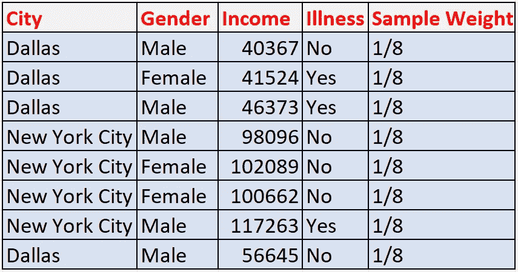

向我们的数据集添加等量的样品重量

现在，我们需要在基尼系数的帮助下构建一个树桩森林，通过构建一串树桩来表示每个独立列的正确和错误分类数据点的数量

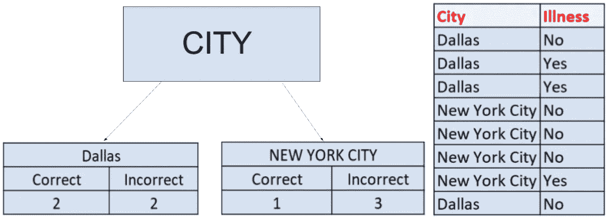

城市圆柱桩

达拉斯市的基尼系数= 1 -(2/(2+2)) -(2/(2+2)) = 0.5

纽约市的基尼系数= 1 -(1/(1+3)) -(3/(1+3)) = 0.375

**城市列基尼系数**= 0.5 *(2+2)/(2+2+1+3))+0.375 *(1+3)/(2+2+1+3))=**0.437**

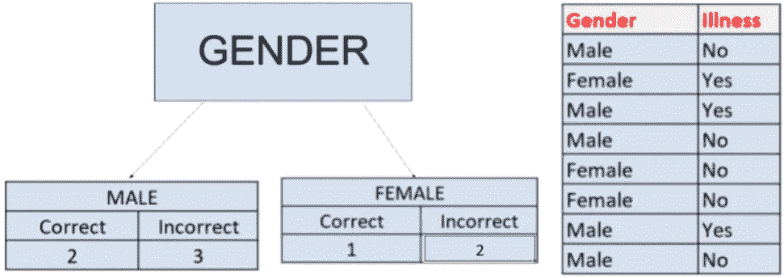

性别栏树桩

同样，根据城市栏显示，性别栏的基尼指数= 0.48 *(2+3)/(2+3+1+2))+0.375 *(1+2)/(2+3+1+2))=**0.44**

对于只有数值的柱，有不同的方法来构造树桩。首先，我们将并排保存独立列和从属列，然后我们将对独立数字列进行排序。

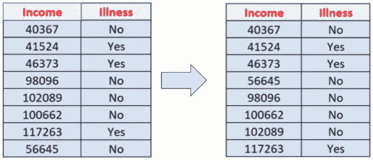

然后，对于该列中每两行独立值，我们必须计算其平均值。得到这些值后，我们必须搜索返回最低基尼指数的值，该值将代表整个列的 stump。

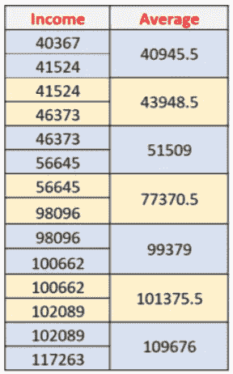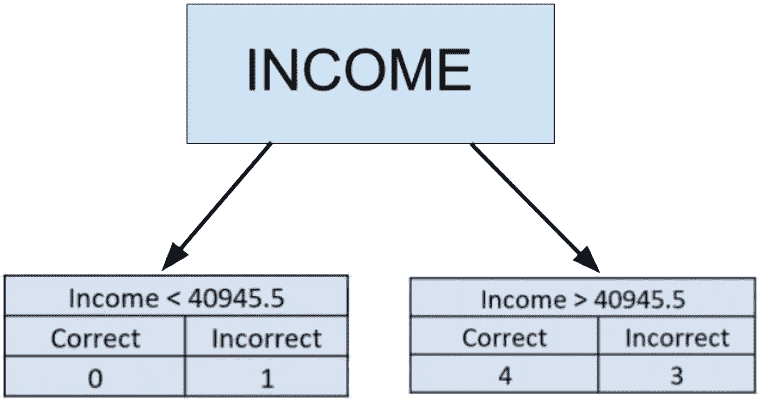

**基尼指数**为 **40945.5** 值= 0.48 *(4+3)/(0+1+4+3)=**0.42**

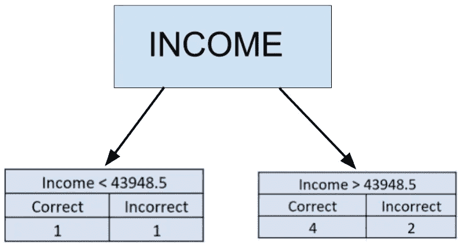

**基尼指数**为 **43948.5** 值= 0.5 *(1+1)/(1+1+2+4))+0.44 *(2+4)/(1+1+2+4))=**0.455**

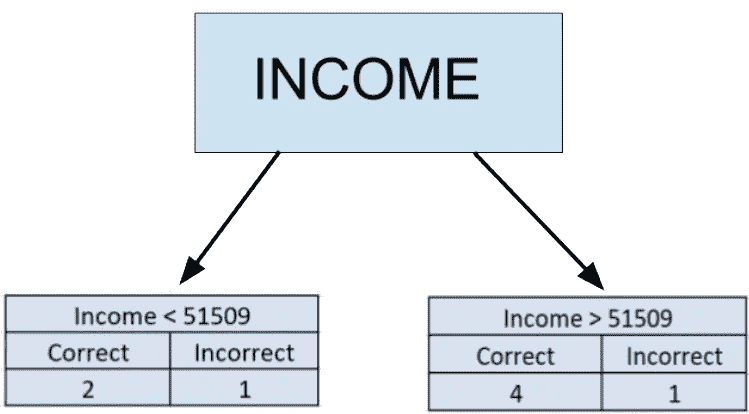

**基尼指数**为 **51509** 值= 0.11 *(2+1)/(2+1+1+4))+0.24125 *(1+4)/(2+1+1+4))=**0.19**

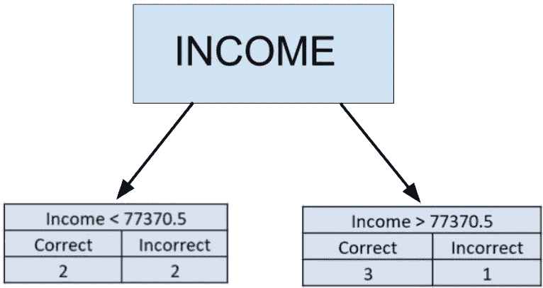

**基尼指数**为 **77370.5** 值= 0.5 *(2+2)/(2+2+1+3))+0.375 *(1+3)/(2+2+1+3))=**0.4375**

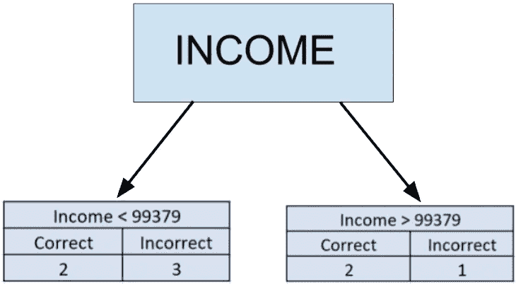

**基尼指数**为 **99379** 值= 0.48 *(2+3)/(2+3+1+2))+0.44 *(1+2)/(2+3+1+2))=**0.465**

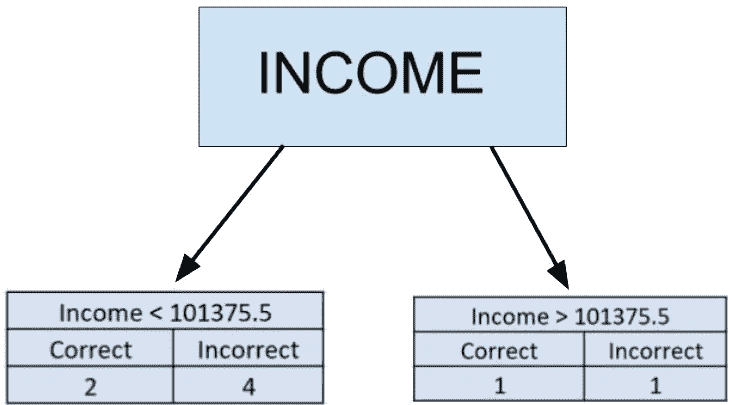

**基尼指数**为 **101375.5** 值= 0.44 *(2+4)/(2+4+1+1))+0.5 *(1+1)/(2+4+1+1))=**0.455**

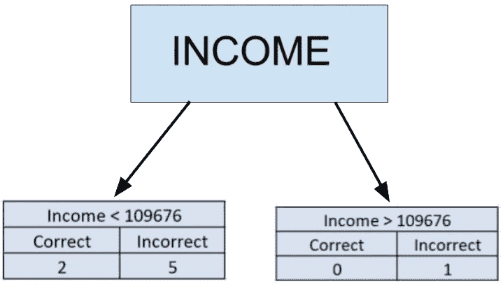

**基尼系数**为 **109676** 值= 0.408 *(2+5)/(2+5+1+0)=**0.357**

我们计算了每一栏的基尼指数后发现， **51509** 的**基尼指数**值为 **0.19，**相对于其他值为**最低的**，使得 **51509 成为收入栏**的划分参数。在那之后，我们将再次计算**的数量，比如说**每个树桩都通过了不正确或错误分类的类别的数量。 ***计算每个树桩的 say 量的公式为*** : →

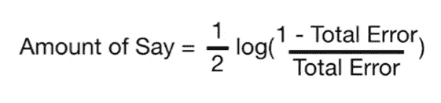

其中，总误差等于**独立列**做出的错误预测数的权重之和，例如城市列的总误差=城市列的错误预测数= 5 =每次错误预测的权重之和= 1/8 + 1/8 + 1/8 + 1/8 + 1/8 = 5/8

***表示城市列的金额为***:(1/2)* log((1-(5/8))/(5/8))=-0.11

***表示性别栏的金额为***:(1/2)* log((1-(5/8))/(5/8))=-0.11

***表示收入栏的金额为***:(1/2)* log((1-(2/8))/(2/8))= 0.23

这样，我们就知道了错误分类的数据点的样本权重是如何被用来确定每个树桩得到的样本量的。现在，我们将开始修改每个样本的权重。因此，**我们将首先修改(即，我们将增加)被具有最低基尼指数的列树桩错误分类为*的数据点的权重，然后减少该列中被正确分类为*****的数据点的权重。我们将使用公式修改权重:→**

**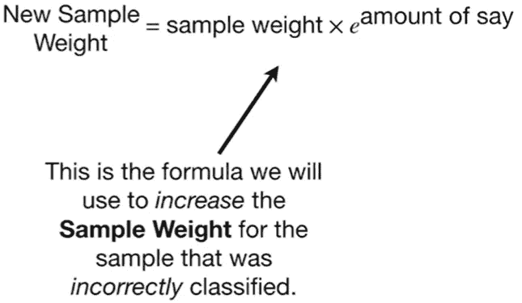****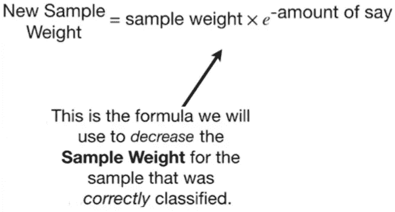**

**因此， ***我们将为数据集“新权重”分配一个新列，它将作为修改后的权重来替换数据集中的“权重”列。*** 然后，我们将开始为表格中的每个数据点分配新的权重。被错误分类的数据点将在修改的权重列中增加，而被正确分类的数据点将在修改的权重列中减少。现在，**我们将通过用整个“新权重”列**的*和*除每个数据点来归一化新的样本权重，并将归一化的样本权重转移到“新权重”列，因为它们将对下一个残端有贡献。**

**因此，在我们的数据集**中，在所有其他特征中具有最低基尼指数 0.19 的 **51509** 值的收入**将用于对患者是否患有心脏病的数据进行分类。**

****

**因为有 2 ( 1 +1)个不正确的预测，所以那些列的权重将增加到(1/2)*e^(0.23) = 0.629，对于 6 ( 2 + 4)个正确的预测，新的权重将减少到(1/2) * e^ -(0.397)，因此新的数据集将是:-**

**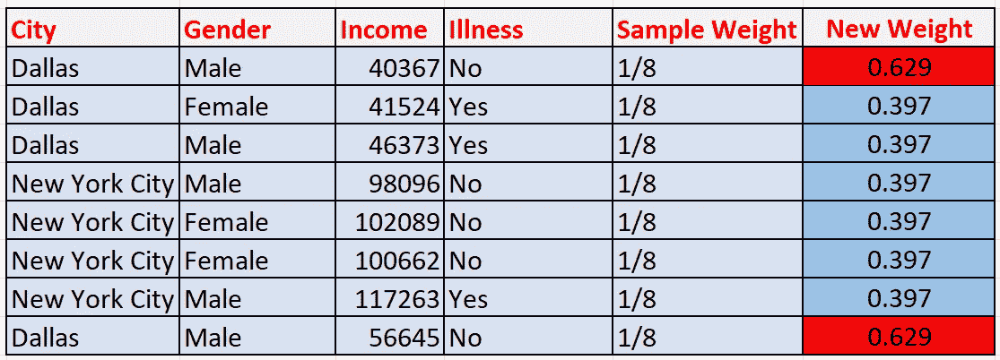**

**现在，我们需要通过将每个新的权重除以整个列的总和来对新的权重进行归一化，这等于(0.629+0.397+0.397+0.397+0.397+0.397+0.397+0.397+0.629)= 3.64。因此，0.629/3.64 = 0.17，0.397/3.64 = 0.10，数据集如下所示:→**

**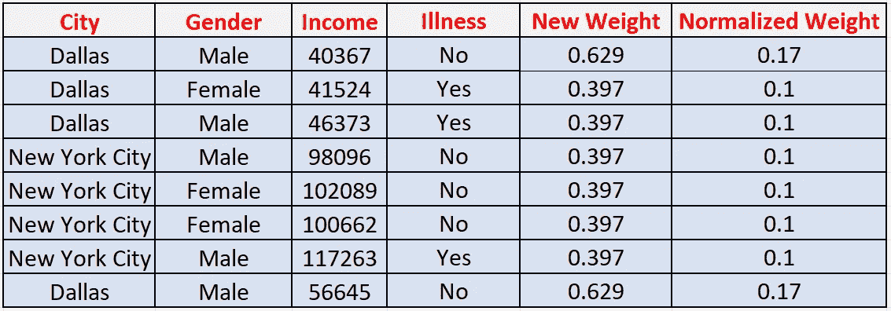**

**之后，是我们开始构建第二个树桩(分类器)的时候了。但是，在 ***之前，我们将创建一个新的空数据集，其大小与具有相同列名*** 的原始数据集相同。**

****

**接下来，我们必须开始将行数据分配给空白数据集，顺序是我们必须取 0 到 1 之间的 8 个随机数。根据我们选择的每个随机数，如果它在 0 到 **0.17(第一行的新权重)**之间，那么第一行将首先被添加到空白数据集中，或者， 如果随机数在 0.17 到 **0.27** ( 0.17 + **0.1(第二行的新权重)**)之间，则将第二行添加到空白数据集中，同样，如果随机数在 0.27 到 **0.37** (0.27 + **0.1(第三行的新权重)**之间，则将第三行添加到空白数据集中，并分别用于其他新权重的新行**

**我们必须注意到，与正确分类的行相比，错误分类的行的范围**更大，即** 0.17(例如 **0 到 0.17** 和 **0.77 到 0.94** ，而正确分类的行的范围**更小，即** 0.1(例如 **0.17 到 0.27** 和 **0.37 到 0.47【1】因此，在新的空白数据集**中，**错误分类的行将比正确分类的行出现更多次，并且具有最低基尼指数的 **51509** 值的**收入树桩**将被视为该数据集**的**第一弱学习者。****

****

**AdaBoost 算法的第一个弱学习器**

**因此，让我们假设，如果我们有新的更新数据集是这样的:→**

**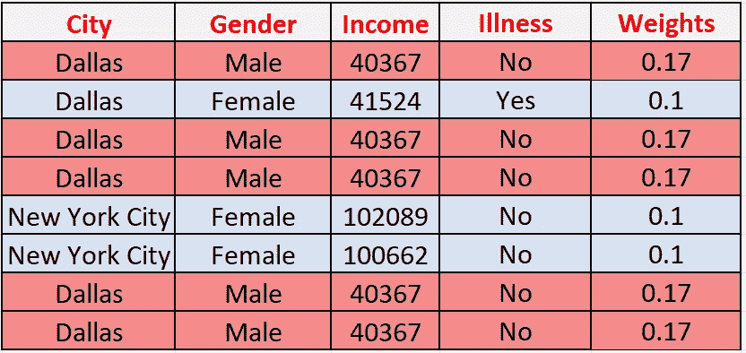**

**新更新的数据集包含更多错误分类的行**

**然后，根据这个新的数据集，我们将不得不再次构建下一个弱分类器，并继续这个过程，直到所有的行都以它们更新的权重被正确分类。**

**当新的测试数据集通过这些弱决策树树桩时，新的测试数据集将被赋予一个值，该值从弱分类器获得关于其测试特征的人是否具有心脏数据集的最多投票，因为我们在这里组合这些弱学习器并使其成为强学习器。**

**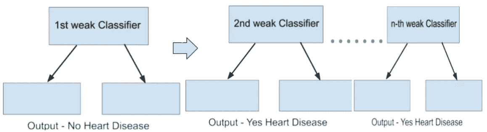**

**AdaBoost 算法中的弱分类器集**

**这就是 AdaBoost 算法的工作原理。我希望你喜欢阅读这篇博客。如果您有任何意见、疑问或问题，请在评论区告诉我。在那之前享受学习。**