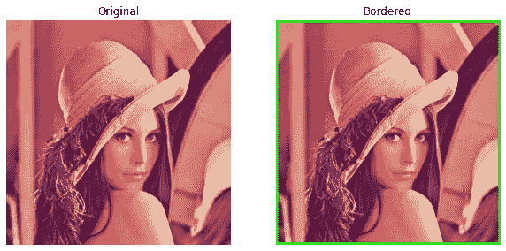
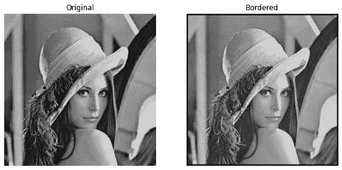
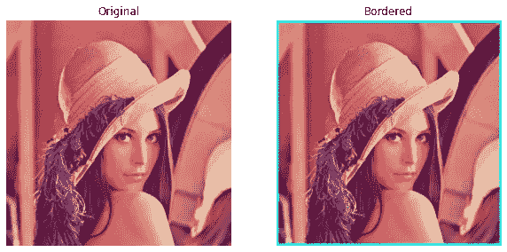

# 使用 NumPy 为图像添加边框

> 原文：<https://medium.com/analytics-vidhya/adding-a-border-to-the-image-using-numpy-efa23f7f1cdf?source=collection_archive---------2----------------------->


卡南·哈斯马多夫在 [Unsplash](https://unsplash.com?utm_source=medium&utm_medium=referral) 上的照片

在这篇文章中，我们将学习如何给图片添加/绘制边框。我们使用 OpenCV 来读取图像。剩下的部分由 NumPy 处理，从头开始编码。我们依靠它来进行矩阵运算，这些运算可以轻而易举地实现。

我们可以从两个方面开始思考:

*   如果图像以**灰度**读取，我们可以简单地保持默认颜色为**黑色**。这是因为图像矩阵形状的长度是 2。因此，我们不能添加一个颜色值为 3 的颜色边框，因此它不容易被映射。
*   如果以 **RGB** 读取图像，我们可以选择边框的颜色。这是因为图像矩阵形状的长度将是 3。因此，我们可以添加一个颜色值大小为 3 的颜色边框，这很容易映射。

在继续之前，我们需要确保我们有足够的颜色(基于用户的选择)。我从[这个网站](https://www.colorhexa.com/color-names)中提取了可能的颜色值。

相同的代码可以在下面看到。结果存储在名为***color _ names _ data . JSON***的 JSON 文件中。

为了像素分离后的映射，需要抓取 R、G 和 B 值。我们使用 NumPy 遵循 **split** 和 **merge** 方法。

颜色数据的结构如下所示。

# 编码时间到了

我们主要使用的软件包有:

*   NumPy
*   Matplotlib
*   OpenCV


作者图片

## 导入包

## 阅读图像

上述函数读取灰度或 RGB 图像，并返回图像矩阵。

## 用库实现代码

对于在图像周围添加/绘制边框，重要的参数可以命名如下:

*   **图像文件** →图像文件位置或图像名称，如果图像存储在同一目录中。
*   **bt** →边框粗细
*   **颜色名称** →默认取 0(黑色)。否则，任何颜色名称都可以。

我们使用 OpenCV 库中可用的方法***copyMakeBorder()***来创建一个指定厚度的新加边图像。在代码中，我们确保将颜色名称转换为我们之前收集的颜色数据的值。

下面的函数对 RGB 图像和灰度图像都有效。

让我们测试一下上面的函数—



作者图片



作者图片

我们可以清楚地看到边界被添加/绘制。对于灰度图像，虽然我们提到了粉红色，但还是画了黑色边框。

## 从头开始代码实现

当我们谈到边界时，它基本上是整个图像周围一种颜色的恒定像素值。重要的是要注意到边界的厚度，以便能够看到。考虑到厚度，我们应该在图像周围添加一个与厚度水平相匹配的常量值。

为了这样做，我们可以使用库 NumPy 中可用的[***【pad()】***](https://numpy.org/doc/stable/reference/generated/numpy.pad.html)方法。该方法附加一个常量值，该常量值与提到的 ***pad_width*** 参数的级别相匹配。

**示例**

```
>>> import numpy as np
>>> m = [[1, 2, 3], [4, 5, 6], [7, 8, 9]]
>>> m = np.array(m)
>>> m
array([[1, 2, 3],
       [4, 5, 6],
       [7, 8, 9]])
>>>
>>> pm = np.pad(array=m, pad_width=1, mode='constant', constant_values=12)
>>> pm
array([[12, 12, 12, 12, 12],
       [12,  1,  2,  3, 12],
       [12,  4,  5,  6, 12],
       [12,  7,  8,  9, 12],
       [12, 12, 12, 12, 12]])
>>>
>>> pmm = np.pad(array=m, pad_width=2, mode='constant', constant_values=24)
>>> pmm
array([[24, 24, 24, 24, 24, 24, 24],
       [24, 24, 24, 24, 24, 24, 24],
       [24, 24,  1,  2,  3, 24, 24],
       [24, 24,  4,  5,  6, 24, 24],
       [24, 24,  7,  8,  9, 24, 24],
       [24, 24, 24, 24, 24, 24, 24],
       [24, 24, 24, 24, 24, 24, 24]])
>>>
```

您可以在[文档](https://numpy.org/doc/stable/reference/generated/numpy.pad.html)中找到更多示例。

我们只需要通过取实际的颜色值来改变***constant _ values***参数。

*   对于灰度图像，我们简单地用黑色填充图像矩阵，即 0。
*   对于 RGB 图像，我们从收集的数据中获取颜色值，将图像分成 3 个矩阵，并用每个颜色值填充每个矩阵。

下面的函数将更清楚地解释这个流程。

让我们测试一下上面的函数—



作者图片


作者图片

耶！我们做到了。除了读取图像文件的部分，我们从头开始对包括颜色选择在内的全部内容进行了编码。我们主要依赖 NumPy，因为它在计算矩阵运算时非常快(如果我们希望代码执行得非常慢，我们可以用 **for loops** 来完成)。

就我个人而言，这对我是很好的学习。我开始思考，对于真正从事开源库工作的人来说，这将是多么的困难和有趣。

你一定要看看我在个人资料中关于同一主题的其他文章。

如果你喜欢，你可以在这里的给我买咖啡。

[](https://www.buymeacoffee.com/msameeruddin)