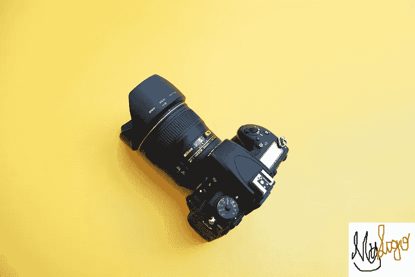

# 使用 Python 向图像添加徽标

> 原文：<https://medium.com/analytics-vidhya/adding-logo-to-images-using-python-7d8946947baa?source=collection_archive---------3----------------------->


带有" **MyLogo** 的猫

这篇文章是我上一篇关于**“使用 Python 进行图像处理”**的文章的延续——在这里阅读[](/analytics-vidhya/image-manipulation-with-python-a689b83dd471)

**在这里，我们将看到如何使用 Python 中的一个简单程序将我们自己的自定义徽标添加到任意数量的图像中。**

**首先确保 Pillow (Python 的图像处理库)已经安装。如果没有，那么现在使用下面的命令安装它。**

```
pip install Pillow
```

****项目概述****

**我们的程序将添加自定义徽标图像到文件夹中所有图像的右下角。下面是该计划将如何工作的总体概述。**

1.  **加载徽标图像**
2.  **循环遍历所有。jpg 和。png 文件**
3.  **检查图像的高度是否合适(我们不希望图像比徽标本身小)**
4.  **将徽标图像粘贴到右下角**
5.  **将更改后的图像保存到新文件夹**

****步骤— 1:打开标志图像****

**创建一个新的 python 文件，保存为“addLogo.py”。**

**将以下代码添加到这个新创建的文件中:**

```
*import* os
*from* PIL *import* Image
sq_fit_size = 300
logo_file = ‘logo.png’
logoIm = Image.open(logo_file)
logoWidth, logoHeight = logoIm.size
```

**从特定目录获取元素需要导入“os”。PIL 是 Python 的“枕头库”。我们使用了变量“sq_fit_size”来确保满足最小图像尺寸要求。我们的 logo 文件名简单来说就是“logo.png”。**

**我们会将我们的图像保存在一个名为“withlogo”的目录中。**

**下面的代码将检查这样的目录是否存在。如果没有，它将创建一个新的。**

```
os.makedirs(‘withlogo’, exist_ok = True)
```

****步骤 2:循环文件并打开图像****

```
*for* filename in os.listdir(‘.’):*if* not (filename.endswith(‘.png’) or filename.endswith(‘.jpg’)) or filename == logo_file: *continue* im = Image.open(filename) width, height = im.size
```

**首先， **os.makedirs()** 调用创建一个“withlogo”文件夹来存储完成的带有 logo 的图像，而不是覆盖原来的图像文件。如果“withlogo”已经存在， **exist_ok=True** 关键字参数将防止 os.makedirs()引发
异常。用 os.listdir(' . '遍历工作目录中的所有文件
)，长 if 语句检查每个文件名是否不以。如果是这样——或者如果文件本身就是徽标图像——那么循环应该跳过它，并使用**继续**转到下一个文件。如果文件名以'结尾。png '或'。jpg '(并且不是 logo 文件)，你可以把它作为图像对象 x 打开，设置宽度和高度。**

****步骤 3:调整图像大小****

**如果图像确实需要调整大小，您需要确定它是宽图像还是高图像。如果宽度大于高度，那么高度应
减少的比例与宽度减少的比例相同。该比例为 **square_fit_size** 值除以当前宽度。新的高度值是该比例乘以当前高度值。**

**因为除法运算符返回一个浮点值，而 resize()要求
维度为整数，所以记得用 int()函数将结果转换为整数
。最后，新的宽度值将简单地设置为
**square_fit_size** 。**

```
*if* width > sq_fit_size and height > sq_fit_size:*if* width > height:
    height = int((sq_fit_size / width) * height)
    width = sq_fit_size*else*:
    width = int((sq_fit_size / height) * width)
    height = sq_fit_size
    print(“Resizing %s”% (filename)) 
    im = im.resize((width, height))
```

****步骤 4:添加徽标并保存更改****

**徽标将粘贴在右下角。下图显示了徽标放置视图。**

****

**徽标位置**

**下面的代码将把徽标文件粘贴到图像上，并将其作为新文件保存在我们之前创建的“withlogo”目录中。**

```
im.paste(logoIm, (width — logoWidth, height — logoHeight), logoIm)im.save(os.path.join(‘withlogo’, filename))
```

****完整代码(图片)****

**下面是完整代码(不要太长)。如果是自己练的请打字。**

****

**“使用 Python 在图像上制作徽标”的完整代码**

****结果****

**下面是两个美丽的图像(礼貌:Unsplash)与我们的“自定义标志”添加在图像的右下角。**

****

**带有标志的房屋照片**

****

**另一个带有我们定制标志的图像**

**就是这样……..**

**非常感谢任何意见/建议。**