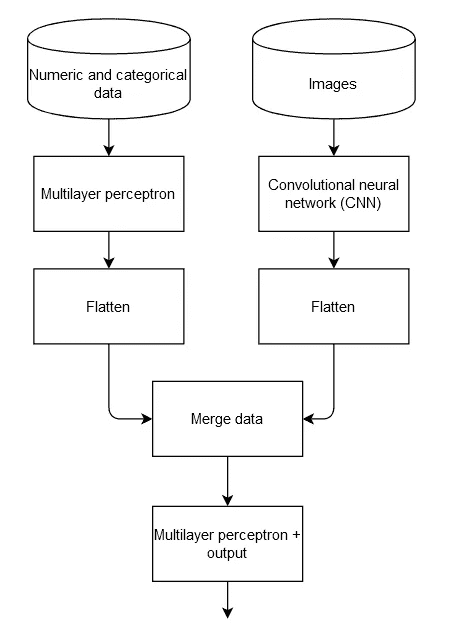
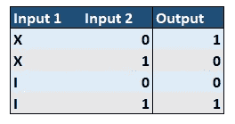
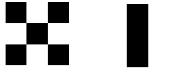
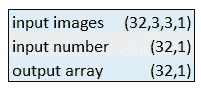
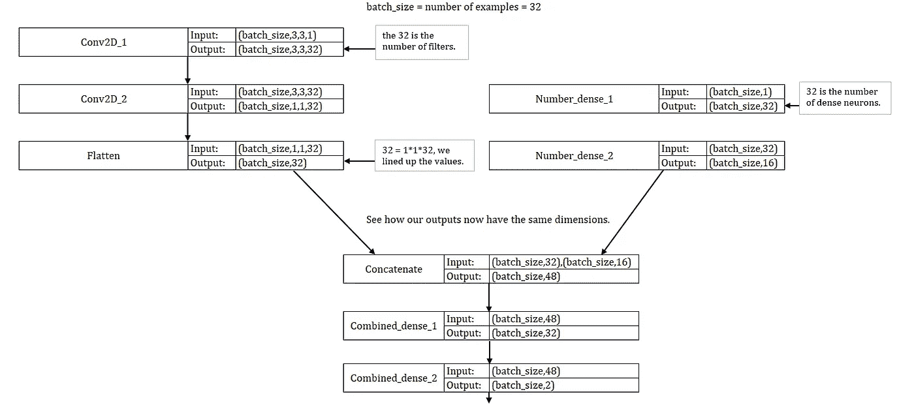
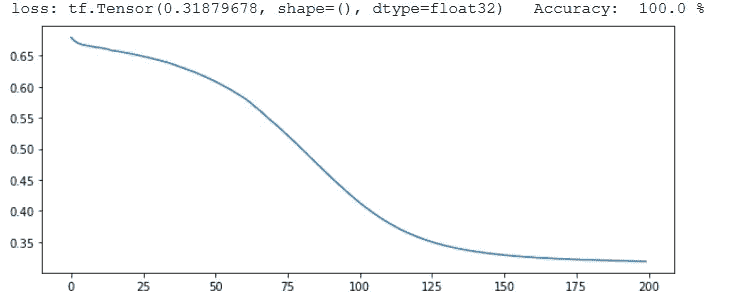

# 向神经网络添加混合形状的输入。

> 原文：<https://medium.com/analytics-vidhya/adding-mixed-shaped-inputs-to-a-neural-network-5bafc58e9476?source=collection_archive---------6----------------------->

## 使用图像和数字通过 Keras 进行预测。


克里斯里德在 [Unsplash](https://unsplash.com?utm_source=medium&utm_medium=referral) 上的照片

在生活中，我们必须处理不同类型的输入；图像、文本、数字等。神经网络也可以。

例如，假设我们想要构建一个使用位置数据、属性和图像来预测房价的网络。这个过程大概是这样的:



图一。神经网络数据流

我们将使用一个简化的示例。我们将输入带有 X 或 I 的图像，以及带有 0 或 1 的数字数据。输出如下表所示:



图二。投入产出表

因此，如果我们添加一个带有 X 和数字 0 的图像，我们得到的输出是 1。

在开始构建我们的网络之前，我们导入所需的库:

```
import numpy as np
import random
import tensorflow as tf
from tensorflow import keras
```

## 构建我们的数据

让我们从构建输入数据开始。我们将创建两个 3x3 的黑白图像。

```
#0 is black, 255 is white.
X_image = [[0,255,0],[255,0,255],[0,255,0]]
I_image = [[255,0,255],[255,0,255],[255,0,255]]
```



图 3。x 和 I，大小增加了 100 倍。

我们现在将创建我们的数据。

我们现在有三个数据集；我们的图像和数字输入和输出数组。它们的形状如下表所示:



图 4。数据形状

## 设计我们的模型

我们现在可以设计模型的数据流了:



图 5。模型数据流

构建我们的模型:

这里，我们使用 TensorFlow *concat* 层来组合我们的输出，并将它们传递给组合的密集层。

还要注意我们如何能够用卷积层处理图像，用密集层处理数字，这提高了我们的网络性能。

## 训练我们的模型

为了训练我们的模型，我们遵循 Keras functional API 方法:

1.  定义我们的优化器和损失函数。
2.  定义培训步骤。
3.  定义训练功能。
4.  火车。

模型训练进度如下图所示:



图 6。时代和损失

万岁！我们的模型可以 100%准确地预测产量。

我们现在已经建立了使用 Keras functional API 向模型添加混合数据类型的基础。对于进一步的阅读，我建议查看 [Keras functional API 指南、](https://keras.io/guides/functional_api/)tensor flow 网站，并查看更多关于使用混合数据的[示例。](https://www.pyimagesearch.com/2019/02/04/keras-multiple-inputs-and-mixed-data/)

本文使用的代码可以在[这里](https://github.com/g-vega-cl/Articles/blob/master/Adding_mixed_shaped_inputs_to_a_neural_network/2020_07_20_MixedInputsCode.ipynb)找到。