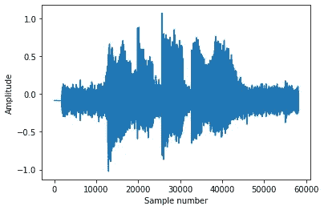

# 给音频片段添加噪声

> 原文：<https://medium.com/analytics-vidhya/adding-noise-to-audio-clips-5d8cee24ccb8?source=collection_archive---------1----------------------->

本文讨论如何向音频数据(或任何其他数据)添加噪声。这对于诸如评估机器学习模型的性能的许多应用来说可能是重要的。

例如，对音频数据进行分类的深度学习模型会受到噪声的影响。因此，我们可以用不同信噪比的噪声改变原始信号样本，并评估模型在这些噪声条件下的性能。

来读取音频。我们可以使用下面的代码。我使用 python 作为这里展示的例子

```
import librosasignal, sr = librosa.load(“path/to/audio.wav”)
```

为了获得我用于这些实验的信号图(我说“别碰我的狗！”)

```
import matplotlib.pyplot as pltplt.plot(signal)
```


信号图

# **信噪比**

信噪比(SNR)可定义如下:


信噪比的定义

其中，均方根信号是信号的均方根值，均方根噪声是噪声的均方根值。log 是 10 的对数

我们可以使用下面的代码来计算信号的均方根值

```
import numpy as npRMS=math.sqrt(np.mean(signal**2))
```

现在是时候给信号添加一些噪声了

我们描述了两种可以添加到音频数据中的噪声

*   加性高斯白噪声(AWGN)
*   真实世界的噪音

代码请参考下面的 GitHub repo

[](https://github.com/sleekEagle/audio_processing) [## sleeke agle/音频处理

### 用于向提供信噪比(SNR)的信号添加噪声。返回加性高斯白噪声的…

github.com](https://github.com/sleekEagle/audio_processing) 

# **加性高斯白噪声(AWGN)**

这种噪声可以添加到信号中(算术元素相加)。它的平均值也为零(从平均值为零的高斯分布中随机采样。标准偏差可以变化)。它以相同的方式包含所有频率分量(因此是“白”噪声)。

AWGN 很重要，因为它更容易为分析建模，也更容易生成。但是对于某些应用来说，它可能不代表真实的噪声条件。

根据 GitHub repo 中的代码，我们可以使用函数 *get_white_noise* 来生成所需信噪比的 AWGN。这具有大约 0.0 的平均值

## **如何生成 AWGN**

从信噪比定义方程，我们可以得到


所需的噪声均方根值

这里，RMS_required 是我们应该产生的噪声的所需均方根值。

还有，


这里 STD_noise 是噪声的标准差。

因为 AWGN 的平均值是零，我们可以看到


为了产生噪声，我们可以从均值=0、标准差= RMS_required 的高斯分布中采样

`noise=np.random.normal(0, STD_n, signal.shape[0])`

如果我们画出我们生成的 AWGN，


噪声图

## **AWGN 的频率分析**

为了分析频率成分，我们使用快速傅立叶变换(参考代码)

```
X=np.fft.rfft(noise)radius,angle=to_polar(X)
```


噪声的频率分布

我们可以看到，我们产生的 AWGN 有着大致相等的频率分布。这满足了 AWGN 的“白色”条件。

最后，我们可以将噪声添加到信号中

```
signal_noise = signal+noise
```

其中 *signal_noise* 是添加噪声的信号


添加噪声的信号(信噪比=10)

# **与真实世界的噪音混合**

这里我们不生成任何数据。相反，我们使用另一个包含噪声的音频剪辑。噪声的确切含义取决于具体的应用。

为此，我们需要计算信号和所提供噪声的均方根值。然后，我们修改噪声(将噪声的每个元素乘以一个常数)，使最终噪声具有所需的均方根值，从而获得所需的信噪比。

如在 AWGN 的情况下，我们可以得到要求的噪声均方根值。然后，我们应该“改变”我们的噪声音频剪辑，使其具有 RMS_required 的 ans RMS 值

如果我们将整个信号(按元素)乘以一个常数(比如“a”)，会发生什么？根据下式，其均方根值也乘以“a”。


更改信号的均方根值

我们可以利用提供的噪声削波来计算均方根噪声。然后我们可以用上面的等式求出常数“a”。之后，我们可以通过在元素上乘以“a”来修改噪声。

我使用的噪音音频剪辑(水从水龙头流出):


流水噪音



添加噪声的信号(信噪比=10)

要收听我使用的信号和噪声，以及通过向信号添加噪声而创建的添加噪声的音频文件，请访问

 [## 向音频数据添加噪声

### 有时我们需要在音频数据中加入噪声。一个例子是当我们评估机器学习模型分类…

sleekeagle.github.io](https://sleekeagle.github.io/2020/02/18/mixing_noise.html) 

感谢阅读！！请留下评论/反馈！！！

在推特上关注我 https://twitter.com/lahirunuwan

【Linkedin:www.linkedin.com/in/lahiru-nuwan-59568a88T4