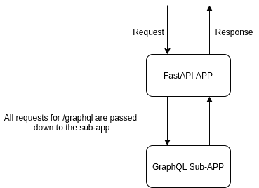
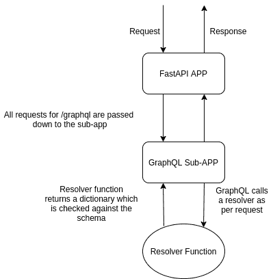
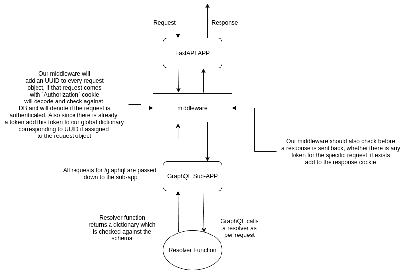

# 为 GraphQL API 添加特定于解析程序的授权

> 原文：<https://medium.com/analytics-vidhya/adding-resolver-specific-auth-for-graphql-api-fbbc348a5ccb?source=collection_archive---------22----------------------->

我使用 Ariadne GraphQL 作为 FastAPI 应用程序的子应用程序，你会在这里找到完整的代码[https://github.com/zero-shubham/friteup-graphql-api](https://github.com/zero-shubham/friteup-graphql-api)

一般来说，使用 RestAPI 时，我们会限制端点，但是使用 GraphQL APIs 时，我们只能向一个端点发出请求。现在，限制这个单个端点(在本例中是`/graphql `)很简单，但是如果您不希望这样，而是希望限制特定的解析器(返回对查询和变异的响应的函数)呢？
将尝试回答这个问题，在此之前，让我们先了解一下我们应用程序的当前设置。

现在尝试回答我们的问题，下一个合乎逻辑的步骤将是在我们的子应用程序中添加身份验证。我们将在响应 cookie 中添加一个 JWT 令牌，这将只保护 cookie。

为此，我们将添加一个具有类似代码的登录解析器，如下所示—[https://pastebin.com/UqEhtF1T](https://pastebin.com/UqEhtF1T)
检查是否存在这样的用户，匹配密码，如果密码匹配，通过将令牌作为 cookie 添加到响应来验证用户。这似乎已经完成，也是一个看似合理的解决方案，但当你尝试这样做时，它将不起作用，我们的 GraphQL 应用程序将抛出一个错误，指出响应与指定的模式不匹配。

我们的 GraphQL 应用程序期望字典的键与定义的模式的键相同，但当我们返回一个响应对象时，却返回了许多键。所有的头文件和 cookies 都在那里，将它们添加到模式中没有意义。所以，目前的情况似乎是-

将 cookie 添加到响应的唯一方法是，如果它是在 GraphQL 子应用程序响应之后添加的，那么从技术上讲，FastAPI 应用程序会将令牌添加到响应 cookie 中。

为此，我们需要将这一点传达给 FastAPI，但是如何传达呢？肯定使用中间件和装饰器(高阶函数)。

因为我们在任何时候都在使用 ASGI 服务器，应用程序实例可能会处理多个请求，所以我们在提出解决方案时必须考虑这一点。我能想到的最佳解决方案是维护一个请求及其对应令牌的字典，稍后在发送回响应时会用到它。

所以，想象一下现在的场景应该是这样的-

如果你可以参考 [application.py](https://github.com/zero-shubham/friteup-graphql-api/blob/master/friteup/application.py) ，我使用了不同的中间件，这样就可以将关注点分开。顾名思义,“cookie_set”中间件做的是后者，即检查请求 id(分配给每个请求对象的 UUID ),是否有任何令牌，如果有，就将其添加到响应中。另一个中间件“BasicAuthBackend”检查每个请求中是否有带有令牌的 cookie 标题“Authorization ”,用它来验证请求。还要向请求对象添加请求 id，并将这些请求 id 和令牌添加到为每个请求维护令牌的字典中。

如果你不明白为什么我们需要为此维护一个字典，因为我们必须在多个函数调用中使用这个字典。例如，在“登录”解析器中，请求对象中不存在令牌，因此这个解析器函数将使用请求 id 为该字典分配一个令牌。参考检查[解析器/用户. py](https://github.com/zero-shubham/friteup-graphql-api/blob/master/friteup/resolvers/user.py)

如果你仔细观察，我在这里还使用了一个装饰符“authentication_required ”,如果你熟悉 Flask 应用程序，这类似于 jwt_required。参考这个 [middleware.py](https://github.com/zero-shubham/friteup-graphql-api/blob/master/friteup/middlewares/authentication.py) 文件，你会在那里找到那个高阶函数。因此，每当我们在任何解析器函数之前添加 decorator 时，就会调用这个函数，如果请求没有通过验证，它就会返回，而不会调用解析器函数。

就是这样，我可能无法解释这一切。因此，请随意提出您的疑问，甚至任何建议，这将使整个设置比它更简单。谢谢！