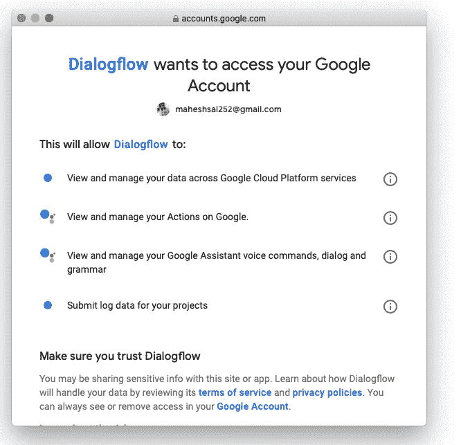
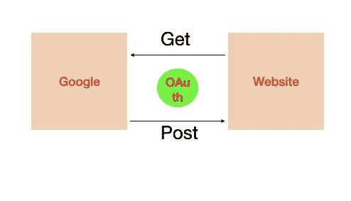
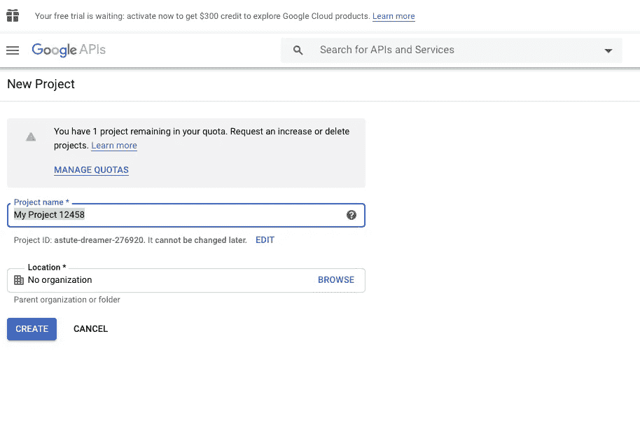
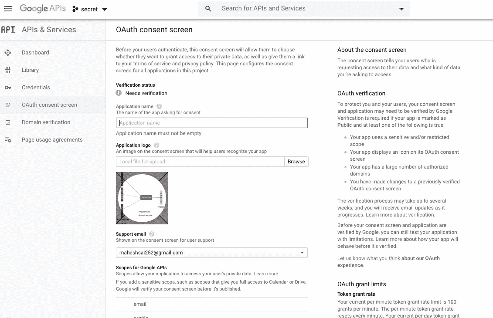
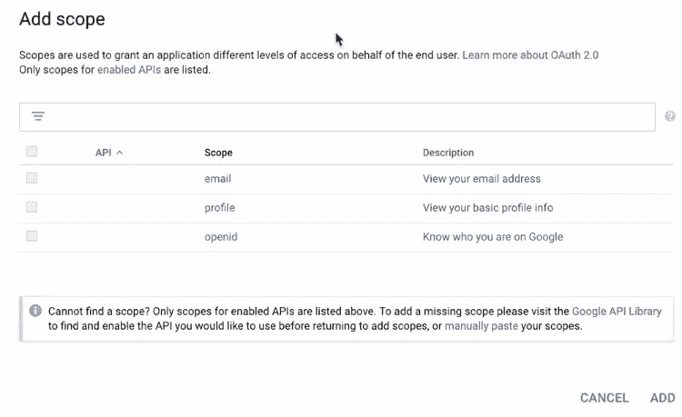
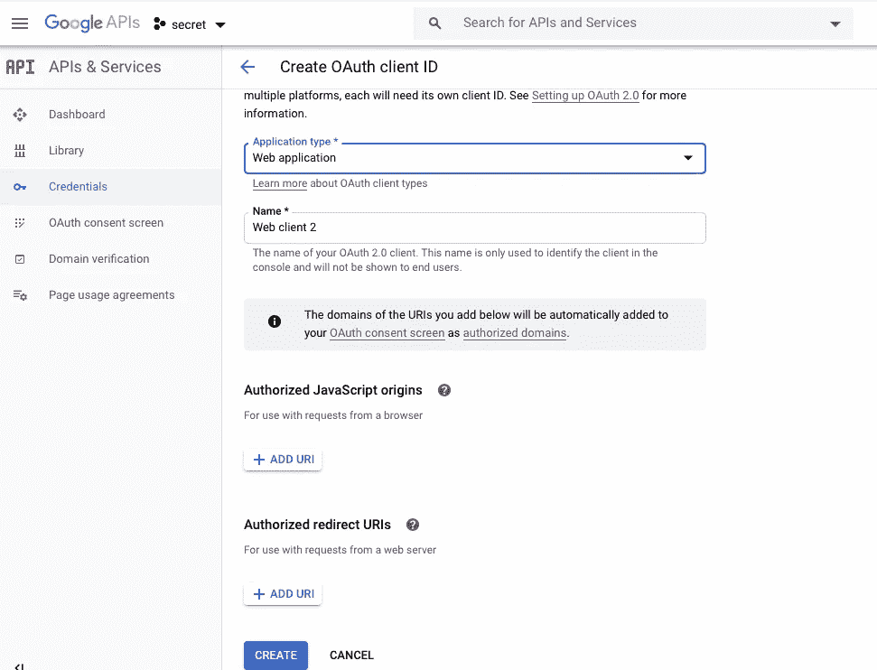

# 在你的网站上添加“登录谷歌”

> 原文：<https://medium.com/analytics-vidhya/adding-sign-in-with-google-to-your-website-b82755b79b31?source=collection_archive---------2----------------------->

你有没有想过在你的网站上增加“登录谷歌”的选项？

这不比用加密标准维护用户信息安全更难。

此外，你是否注意到 LinkedIn 建议你在使用谷歌账户登录时与你的联系人联系？

在本文中，我们将研究 OAuth，并将“使用 google 登录”添加到一个简单的网站中！！

# OAuth-开放授权

在我们的日常生活中，我们经常会看到“XYZ 黑客攻击美国广播公司网站用户详细信息”的文章。

所以，一开始就很难获得用户的信任。因此，Web 开发人员给用户留下了一种熟悉且可信的身份验证方法，如登录 google 和 facebook。

OAuth 是一个标准协议，具有以下特性

## 细粒度的访问级别

当你登录谷歌时，你可以指定允许访问你的哪种信息。

我们通常会遇到这种情况



网站会告诉你你的信息的哪一部分被访问。

## 读/读+写访问权限

网站可能要求只读访问权限或读写访问权限。

当我们通过脸书登录时，我们通常会看到以下内容

“ABC 网站不会发布任何关于脸书的内容”

或者

“XYZ 网站愿意为您发布到脸书”

## 撤销访问权限

用户必须能够撤销授予网站的访问权限。

如果用户通过“Gmail”登录，那么他/她必须能够通过“Gmail”撤销访问。



# 点击“登录谷歌”后的步骤

1.  您将被重定向到 Gmail 登录页面
2.  谷歌将验证你的凭证，并发送验证码到网站。
3.  网站现在将发送回授权代码给谷歌，并将获得访问令牌和存储它。该访问令牌对于获取用户信息是有用的。

理论完毕。我们将为用 node.js 制作的网站实现这一点

## 护照

[Passport](http://www.passportjs.org) 是 [Node.js](https://nodejs.org/) 的认证中间件。极其灵活和模块化，Passport 可以不引人注目地嵌入任何基于 [Express](https://expressjs.com/) 的网络应用程序。一套全面的策略支持使用[用户名和密码](http://www.passportjs.org/docs/username-password/)、[脸书](http://www.passportjs.org/docs/facebook/)、 [Twitter](http://www.passportjs.org/docs/twitter/) 和 [more](http://www.passportjs.org/packages/) 进行身份验证。

我们将在本文中用到“passport-google-oauth20”策略。

# 建立

进入你的项目目录，安装“passport-google-oauth20”。

```
npm install passport-google-oauth20
```

接下来，进入 Google 开发者控制台，创建一个自己命名的项目。



现在转到“OAuth 同意屏幕”



在这里，我们将配置一切。填写所有必要的细节。

我们将在范围部分添加我们将要访问的详细信息



默认情况下，包括这 3 个详细信息。您可以选择 API 来访问其他信息，如联系人等。

省省吧！！

现在创建一个 OAuth 客户端 Id



填写应用程序名称。

Javascript 起源是“https://localhost:5000”

重定向 URL 是用户通过身份验证后将被重定向到的位置。

然后，您将收到客户端 id 和客户端密码。

# 密码

导入包并创建应用程序。

```
const express = require("express");
const bodyParser = require("body-parser");
const ejs = require("ejs");
const mongoose = require("mongoose");
const session = require('express-session');
const passport = require("passport");
const passportLocalMongoose = require("passport-local-mongoose");
const GoogleStrategy = require('passport-google-oauth20').Strategy;
const findOrCreate = require('mongoose-findorcreate');const app = express();app.use(express.static("public"));
```

我们需要序列化和反序列化我们的用户

```
passport.serializeUser(function(user, done) {
  done(null, user.id);
});passport.deserializeUser(function(id, done) {
  User.findById(id, function(err, user) {
    done(err, user);
  });
});
```

制定策略。以下代码取自[这里的](http://www.passportjs.org)。

```
const userSchema = new mongoose.Schema ({

  googleId: String
}); userSchema.plugin(findOrCreate);const User = new mongoose.model("User", userSchema);
passport.use(new GoogleStrategy({
    clientID: process.env.CLIENT_ID,
    clientSecret: process.env.CLIENT_SECRET,
    callbackURL: "[http://localhost:3000/](http://localhost:3000/auth/google/secrets)callback/url",
    userProfileURL: "[https://www.googleapis.com/oauth2/v3/userinfo](https://www.googleapis.com/oauth2/v3/userinfo)"
  },
  function(accessToken, refreshToken, profile, cb) {
    console.log(profile);User.findOrCreate({ googleId: profile.id }, function (err, user) {
      return cb(err, user);
    });
  }
));
```

注意:回叫 url 应该与控制台中给出的重定向 URL 相匹配。

一旦用户被认证，谷歌会给你一个访问令牌来访问信息和个人资料信息。

在策略中的回调内部，我们正在搜索从 google 收到的带有 profile.id 的用户，如果不存在就创建一个。

将以下代码添加到您的登录页面，以启用“向 google 注册”按钮

```
<div class="col-sm-4">
      <div class="card">
        <div class="card-body">
          <a class="btn btn-block btn-social btn-google" href="/auth" role="button">
            <i class="fab fa-google"></i>
            Sign In with Google
          </a>
        </div>
      </div>
    </div>
```

当用户点击按钮时，页面将发出 GET 请求。/auth "

我们将在 app.js 中处理请求

app.get("/auth "，
passport . authenticate(' Google '，{ scope:[" profile "]})
)；

我们还必须处理来自回调 url 的 GET 请求

```
app.get("/callback/url/",
  passport.authenticate('google', { failureRedirect: "/login" }),
  function(req, res) {
    // Successful authentication, redirect to success.
    res.redirect("/success");
  }); 
```

我们将从谷歌收到的个人资料如下

```
{id: 'ID From Google',displayName: 'Sai Durga Mahesh',name: { familyName: 'Mahesh', givenName: 'Sai Durga' },photos: [{value: 'a link'}],provider: 'google',_raw: '{\n' +'  "sub": "id",\n' +'  "name": "Sai Durga Mahesh",\n' +'  "given_name": "Sai Durga",\n' +'  "family_name": "Mahesh",\n' +'  "picture": "link",\n' +'  "locale": "en"\n' +'}',_json: {sub: 'id',name: 'Sai Durga Mahesh',given_name: 'Sai Durga',family_name: 'Mahesh',picture: 'link',locale: 'en'}}
```

我们将在我们的数据库中保存从谷歌收到的 Id。

就是这样！！

# 结论

我们理解 OAuth 标准，并在网站上添加了“使用 Google 登录”。

同样，我们可以在脸书、LinkedIn 和 Twitter 上添加登录选项。

## 参考

[](http://www.passportjs.org) [## Passport.js

### Passport 是 Node.js 的认证中间件。极其灵活和模块化，Passport 可以不引人注目地…

www.passportjs.org](http://www.passportjs.org)