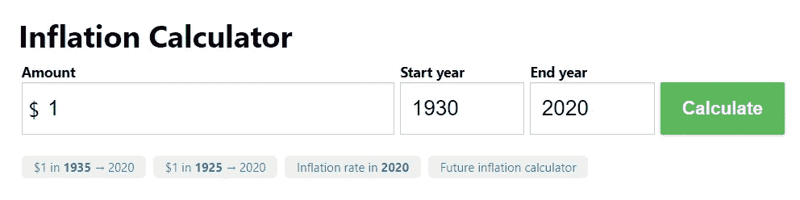
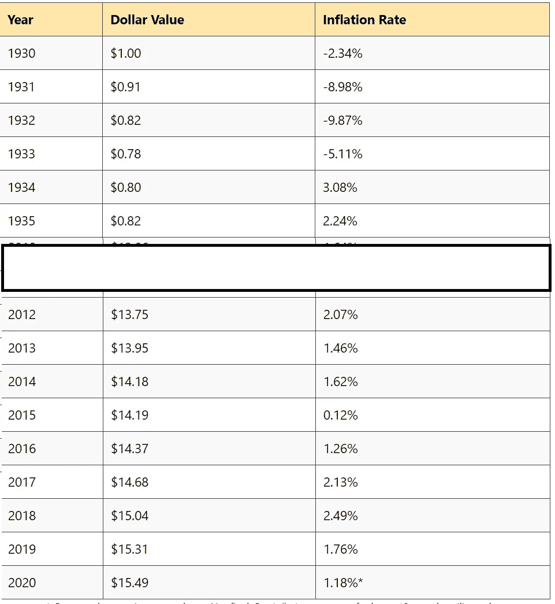
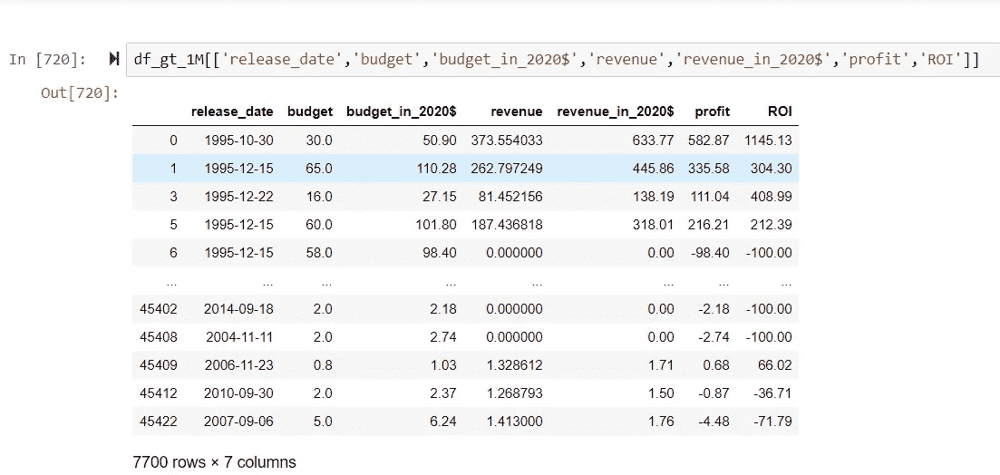

# 通货膨胀调整——一个简单的方法

> 原文：<https://medium.com/analytics-vidhya/adjusting-for-inflation-a-simple-method-a18694169789?source=collection_archive---------20----------------------->

我当时正在做一个项目，在这个项目中，我要确定一部经济上成功的电影的制作需要哪些因素。我想解释一下 1930 年到 2010 年间发行的电影。我知道我必须能够平等地比较所有的电影，不管它们是什么时候发行的。

为了进行公平的比较，我知道我必须考虑每部电影自上映以来的复合通货膨胀。如果不是，这些指标将倾向于最近的电影。想象一下，将 20 世纪 30 年代制作的电影与最近几年制作的电影进行比较。即使旧电影取得了巨大成功，在比较利润时也不会很明显。不过，在基于 ROI 进行比较时，这不是问题，因为我们在这里比较的是一个比率。

所以，我知道我可以安装一个通货膨胀计算器，如 CPI，但我想尝试从头开始写一些东西。我决定创建一个通货膨胀字典，接受发行年份作为关键字，并返回一个乘数——“购买力”。然后你可以用乘数乘以那一年的美元数额，瞧！你会得到通货膨胀调整后的金额。

但是首先我必须为我的字典找到数据。在查看了几个在线通货膨胀计算器后，我选定了 www.in2013dollars.com。

使用该网站很容易。有一个表单，您可以在其中输入金额、起始年份和结束年份。金额是美元金额是要调整到年终金额的数字。

该页面返回了许多非常漂亮的图表和有趣的信息。然而，我们所追求的是 csv 下载，你必须向下滚动。

这张电子表格告诉我们的是，1930 年 1 美元的购买力与 2020 年的 15.49 美元是一样的。继续下跌，1934 年 0.82 美元的购买力在 2020 年将再次达到 15.54 美元。所以，用 15.49 美元除以那一年的金额，你就得到那一年 1 美元的购买力。因此，1934 年 1 美元的购买力相当于今天的 18.89 美元。

𝑏𝑢𝑦𝑖𝑛𝑔𝑃𝑜𝑤𝑒𝑟=$15.49/𝑎𝑚𝑜𝑢𝑛𝑡

这是我编写的生成字典的函数:

在我的例子中，release_date 列包含“年-月-日”格式的日期字符串，所以我需要解析该字符串来检索年份。当然，我也可以使用日期时间。但是我写了这个包装器。

这是我如何应用它的。

让我们看看那看起来像什么。

安:就是这样。

我知道我可以只使用 CPI，但我认为自己写会很有趣。希望你喜欢。