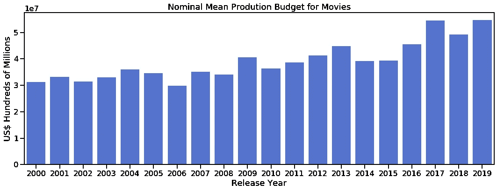
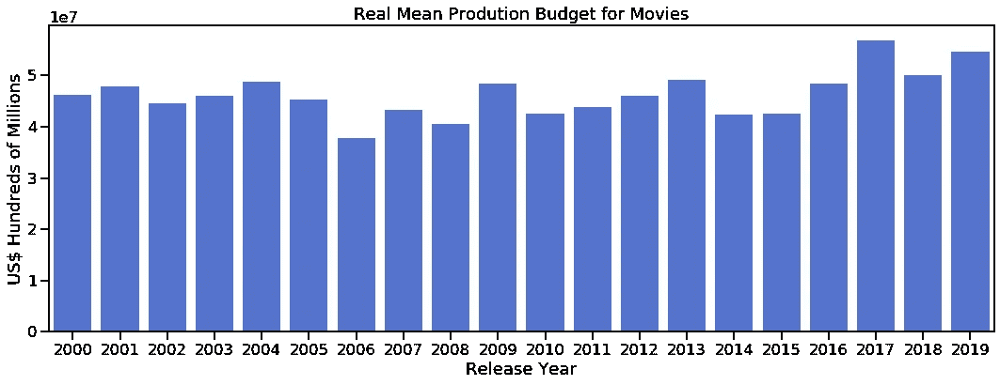
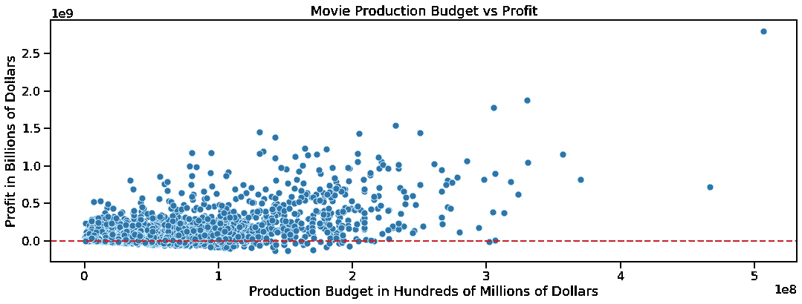

# 使用 Python 分析历史数据时调整通货膨胀

> 原文：<https://medium.com/analytics-vidhya/adjusting-for-inflation-when-analysing-historical-data-with-python-9d69a8dcbc27?source=collection_archive---------3----------------------->


在 [Unsplash](https://unsplash.com?utm_source=medium&utm_medium=referral) 上由 [Carlos Muza](https://unsplash.com/@kmuza?utm_source=medium&utm_medium=referral) 拍摄的照片

我最近完成了一个项目，旨在确定 T4 票房最好的电影是什么，并根据我的发现提出建议。最佳*的定义可以有多种解释，它可能是利润、声望、荣誉、感知的社会利益等等。或者这些属性任意组合。我选择关注利润，因为我相信这是利益相关者的真正利益所在。*

我对电影利润的部分分析涉及到过去 20 年电影的制作预算和利润。

虽然许多数据集不包含货币数据，但如果您发现自己像我一样在分析一个包含历史货币数据的数据集，您会希望根据通货膨胀调整这些值。在我向你展示我是如何根据通货膨胀调整数据的之前，让我们先来看看为什么要费心根据通货膨胀调整这个问题。

# 为什么要根据通货膨胀进行调整？

让我们从定义几个你在处理通货膨胀时需要知道的术语开始。

**通货膨胀**:衡量一段时间内商品和服务集合的平均价格水平的变化率。由于通货膨胀，过去某一时刻的一美元不会和今天的一美元有同样的购买力。

**名义/当前美元**:在发生时记录的未经调整的美元金额。以我们的情况，电影票房的时候。

**实际/不变美元**:已针对通货膨胀进行调整的美元金额，因此我们正在处理的所有历史美元数据在购买力方面处于恒定水平。

您的源数据集可能只包含名义美元数据。为了说明名义数据和真实数据的对比，这里是给定年份所有电影的平均制作成本图。



如果不考虑通货膨胀因素，平均生产成本似乎会逐年增加，而考虑到通货膨胀因素，我们可以看到平均生产成本相当稳定。

# 那么，我们如何调整通货膨胀呢？

既然我们已经了解了为什么调整通货膨胀很重要，那么我们该如何去做呢？

一种常见的方法是使用消费者价格指数(CPI)来调整通货膨胀。基本公式是:

```
adjusted_value = (old_value * cpi_current) / cpi_old
```

以电影数据集为例， *Avatar* 在 2009 年的制作预算为 4.25 亿美元，根据 2019 年的通货膨胀调整后，实际制作预算超过 5.06 亿美元，如下式所示。

```
budget_2009 = 425000000
cpi_2009 = 214.537
cpi_2019 = 255.657budget_2019 = (budget_2009 * cpi_2019) / cpi_2009budget_2019 = 506459142.25
```

接近 1 亿美元的通货膨胀调整非常重要，加强了在比较电影与电影之间的数据时计算实际值的需要。

# CPI 图书馆

既然我们已经了解了调整通货膨胀的必要性以及如何调整通货膨胀，接下来我想我需要做的就是编写一些 Python 代码来进行计算并收集 CPI 数据。但是在我这样做之前，我想知道是否有人已经这样做了，这样可以节省我的时间。所以我在谷歌上搜索了一下，发现有人不仅编写了一些示例代码，还发布了一个名为 CPI Library 的库。

为了使用 CPI 库，首先你需要安装它。github 回购可以在这里找到[。我用 pip 安装了它。](https://github.com/datadesk/cpi)

```
$ pip install cpi
```

在编辑器或笔记本中，导入库

```
import cpi
```

然后得到通货膨胀调整后的(真实)值

```
adjusted_value = cpi.inflate(nominal_value, year_for_nominal_value)
```

使用上面的*头像*的值，它看起来像这样:

```
budget_2009 = 425000000
budget_year = 2009budget_2019 = cpi.inflate(budget_2009, budget_year)budget_2019 = 506459142.25
```

这很简单，时间让我所有的数据进行通货膨胀调整。

在我这样做之前，有几件事需要注意:

您计算机上的 CPI 数据集可能会过期。如果是这样，当你运行`import cpi`时，你会得到一个警告，告诉你更新你的数据。CPI 库具有内置的更新功能。只需运行以更新您的数据，您就一切就绪了。

```
cpi.update()
```

CPI 库默认使用“所有城市消费者”价格指数(CPI-U)来计算通货膨胀，这是我想用于我正在分析的电影数据集的。如果需要使用不同的价格指数，有些是内置在库中的；点击查看自述[。但是美国劳工统计局发布了许多其他的数据，你也许可以利用 CPI 库来增加这个功能，或者想出一个替代的方法来调整通货膨胀。](https://github.com/datadesk/cpi)

# 用熊猫来调整通货膨胀

我需要针对通货膨胀调整数据集中的所有货币值，而我的数据存储在 Pandas 数据框架中，因此我编写了以下代码，将包含通货膨胀调整值的列添加到数据框架中。

首先，我定义了一个函数来进行通货膨胀调整。虽然它只是返回数据集上的 apply()函数的结果，但编写该函数可以使即将到来的通货膨胀调整代码更加清晰，并且代码总体上更易于维护。

```
def inflate_column(data, column):
    """
    Adjust for inflation the series of values in column of the   
    dataframe data
    """
    return data.apply(lambda x: cpi.inflate(x[column], 
                      x.release_year), axis=1)
```

接下来，我在我的数据框架中创建和填充了新的列，其中包含生产预算和全球毛利的通货膨胀调整值。

```
# adjust the production budget 
movies_df['real_production_budget'] = inflate_column(movies_df, 'production_budget')#adjust the worldwide gross profits
movies_df['real_worldwide_gross'] = inflate_column(movies_df, 'worldwide_gross')
```

现在，我已经有了生产预算和毛利的通货膨胀调整值，我可以向我的数据框架添加一列，其中包含我的数据集中电影的实际全球净利润，然后继续我的分析。

```
# calculate the real worldwide net profit
movies_df['real_profit'] = movies_df.apply(lambda x: x.real_worldwide_gross - x.real_production_budget, axis=1)
```

我所有的数据都已经根据通货膨胀进行了调整，我已经准备好继续我的分析了。

# 我使用真实值进行分析的可视化示例



上面的散点图显示了我的数据集中所有电影的实际制作预算和实际净利润。右上角是*头像*，电影数据集中最极端的离群值。可视化的目的是查看生产预算和净利润之间的相关性。结果是，通过观察可视化和计算不同分位数的相关性，只有*化身*和可视化右侧的其他极端异常值显示了两者之间的适度相关性。

# 我的项目

感谢阅读这篇文章，你可以在 github [这里](https://github.com/merb92/movie-industry-eda)查看我的整个项目和它的发现。