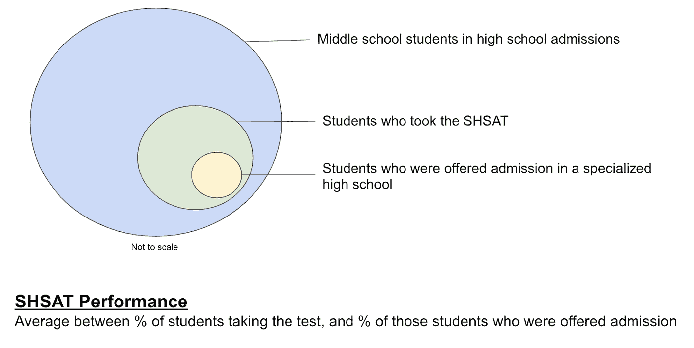

# 纽约市专业高中的录取情况

> 原文：<https://medium.com/analytics-vidhya/admissions-to-specialized-high-schools-in-new-york-city-9fb5fe0ca420?source=collection_archive---------26----------------------->

作者:乔埃尔·米勒和艾伦·帕特森

> 2019 年，纽约市一所专门的公立高中——施托伊弗桑特高中(Stuyvesant High School)共录取了 895 名学生。录取的 895 名学生中；7 名是黑人，33 名是西班牙人。—《纽约时报》

这一信息非常有趣，因为黑人和西班牙裔学生占纽约市公立学校系统的近 70%,纽约市教育部表示，专门高中的目标是:

> “……专业高中的学生反映了纽约市的多样性。”

Stuyvesant 高中的情况没有达到纽约市教育局的目标。为了深入探讨这个问题，我们提出了一个问题:

**在 SHSAT 中成绩好的中学的种族和收入特点是什么？**

# 衡量学校表现

为了了解纽约市中学在 SHSAT 成绩方面的贫困和种族特征，我们提出了一个成绩的定义:我们计算了每所中学参加 SHSAT 考试的高中录取学生百分比和被专业高中录取的学生百分比之间的平均值:因此，该指标考虑了考试成绩和让学生参加考试的成绩。

30 所表现最佳的学校考虑了每所平均表现在 55%以上的学校。我们还选取了一批表现不佳的学校，这些学校考虑到了平均表现低于 2%的学校。155 所学校进入了小组。

# 分析

首先，了解纽约市所有中学的种族分布情况是很重要的。接下来，重要的是要找出表现好的学校和表现差的学校是否遵循相同的种族分布。假设在招生过程中有一个基本的公平水平，两个群体都需要有与所有学校相同的种族分布。

所有 594 所中学的种族分布情况:

最佳表现学校:

这种分析集中在表现最好的学校，因为大多数学校属于表现差的学校，他们的种族分布看起来很像一般的分布。显而易见，表现最好的学校有着不同于其他学校的种族和收入分布。

# 黑人学生的百分比分布

黑人学生比例超过 70%的学校不在表现最好的学校之列。

# 西班牙裔学生的百分比分布

西班牙裔学生比例超过 60%的学校不在表现最好的学校之列。

# 白人学生的百分比分布

在表现最好的一组中，白人学生比例在 20%到 70%之间的学校数量看起来比一般的一组要多。

# 亚洲学生的百分比分布

亚洲学生在最佳表现组的百分比分布看起来与一般组非常相似。

# 贫困学生的百分比分布

表现最佳群体中贫困学生的百分比分布看起来与一般群体相反。

根据纽约市学校人口统计快照[元数据](https://data.cityofnewyork.us/api/views/s52a-8aq6/files/068b0b2a-6b00-4bfd-9c80-26626a34a125?download=true&filename=2013_-_2018_Demographic_Snapshot_District_DD.xlsx)，贫困学生被定义为有资格享受免费或低价午餐的学生，或者有资格享受在所报告的学区和学年注册的人力资源管理福利的学生。

在这张地图上，绿点是纽约市 8 所专业高中的位置，不同颜色的白色、粉色和红色显示了与学校周围环境相关的贫困家庭数量。

当将成绩与贫困学生的百分比进行比较时，我们可以看到这两个变量之间明显的负相关关系。从下面的图表中我们还可以看到，在布朗克斯或斯塔滕岛，没有一所学校的成绩超过 0.55。

# 结论

我们的分析表明，纽约市专业公立高中录取学生的过程对贫困学生、黑人学生、西班牙裔学生比例高的学校以及位于布朗克斯或斯塔滕岛的学校不利。

分布显示，贫困学生比例高的中学在让学生参加考试或让参加考试的学生被录取方面都不成功。

最后，在让学生参加考试和让参加考试的学生被录取方面最成功的中学，黑人和西班牙裔学生的比例最低。

2019 年 8 月 27 日，由纽约市长比尔·白思豪[组成的委员会建议](https://docs.wixstatic.com/ugd/1c478c_0575b25e17ae4c8d8838f1f58f54db0b.pdf)在小学和中学招生中取代筛选过程，以帮助低收入学生获得进入表现最好的学校的机会。

[点击此处](https://colab.research.google.com/drive/18QUkFhx3AjnD8fvN5Zrt9Eir-xF8_GTx)进入谷歌 Colab 笔记本查看分析