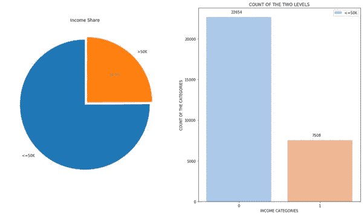
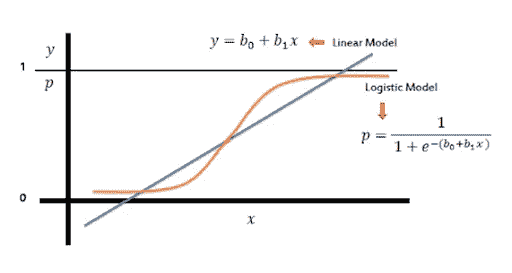

# 成人人口普查收入数据集:使用多种机器学习模型

> 原文：<https://medium.com/analytics-vidhya/adult-census-income-dataset-using-multiple-machine-learning-models-f289c960005d?source=collection_archive---------4----------------------->


亚历山大·密尔斯在 [Unsplash](https://unsplash.com?utm_source=medium&utm_medium=referral) 上拍摄的照片

我们都听说过数据科学是“21 世纪最性感的工作”。因此，同样令人惊讶的是，在数据充斥世界之前，**神经网络的概念是在半个世纪前提出的。甚至在“机器学习”这个词被创造出来之前，唐纳德·赫布就在他 1949 年的著作《行为的组织》中创建了一个基于脑细胞互动的模型。本书介绍了 Hebb 关于神经元兴奋和神经元间通讯的理论。**

赫布写道，“当一个细胞反复协助另一个细胞放电时，第一个细胞的轴突在与第二个细胞的胞体接触时会形成突触旋钮(或扩大它们，如果它们已经存在的话)。”将 Hebb 的概念转化为人工神经网络和人工神经元，他的模型可以被描述为一种改变人工神经元(也称为节点)和单个神经元变化之间关系的方式。IBM 的 Arthur Samuel 在 1952 年首次提出了“机器学习”这个词。

# 分析数据

名为“成人人口普查收入”的数据集可在卡格尔和 UCI 资料库中找到。该数据由 Ronny Kohavi 和 Barry Becker 从 1994 年人口普查局数据库中提取。**预测任务是确定一个人的年收入是否超过 5 万美元。**

*数据集:*[*https://www.kaggle.com/uciml/adult-census-income*](https://www.kaggle.com/uciml/adult-census-income)

使用 python 语言和几种可视化技术，我试图拟合 4 种机器学习模型，并找到描述数据的最佳模型。

使用数据有 3 个步骤——数据、发现和部署

## 数据

```
age workclass  fnlwgt     education  education.num marital.status 0   90         ?   77053       HS-grad              9        Widowed 1   82   Private  132870       HS-grad              9        Widowed 2   66         ?  186061  Some-college             10        Widowed 3   54   Private  140359       7th-8th              4       Divorced 4   41   Private  264663  Some-college             10      Separated   occupation   relationship   race     sex  capital.gain 0                  ?  Not-in-family  White  Female             0 1    Exec-managerial  Not-in-family  White  Female             0 2                  ?      Unmarried  Black  Female             0 3  Machine-op-inspct      Unmarried  White  Female             0 4     Prof-specialty      Own-child  White  Female             0   capital.loss  hours.per.week native.country income 0          4356              40  United-States  <=50K 1          4356              18  United-States  <=50K 2          4356              40  United-States  <=50K 3          3900              40  United-States  <=50K 4          3900              40  United-States  <=50K
```

## 发现

数据预处理


照片由 [Isaac Smith](https://unsplash.com/@isaacmsmith?utm_source=medium&utm_medium=referral) 在 [Unsplash](https://unsplash.com?utm_source=medium&utm_medium=referral) 拍摄

发现阶段是我们试图理解数据的阶段。它可能需要清理、改造、整合。下面的代码片段突出了数据预处理步骤。

数据集包含空值，包括数值和分类值。分类值既有名词性的，也有序数的。数据也有冗余的列。

因为缺少的值用“？”表示，它们被替换为 NAN 值并在检测后被移除。要预测的从属列“收入”已被替换为 0 和 1，因此将问题转换为二分法分类问题。有一个多余的列“education.num ”,它是“education”的序号表示，已在上面删除。

既然已经去除了不必要的数据点和冗余属性，就有必要选择真正有助于收入预测的属性集。

为了检查二元变量和连续变量之间的**相关性，使用了**点双列相关**。在适当应用测试后，“fnlwgt”下降，显示负相关。**

对于功能选择，除了“fnlwgt”之外，所有数字列都被选择。对于分类变量，使用卡方估计。卡方估计用于衡量两个分类变量之间的相关性。

首先，对分类变量进行编码，或者说生成虚拟变量，并将数值进行**归一化**，使其在[0，1]之间。**这只是一个在同一尺度上获取所有数据的简单例子:如果不同特征的尺度大相径庭，这可能会对你的学习能力产生连锁反应**(取决于你使用什么方法来做这件事)。确保标准化的特征值隐含地在所有要素的表示中对其进行同等加权。

包括数字变量在内共有 103 个属性。特征选择后，有 65 个属性。

这个数据集包含了一个**典型的阶级不平衡的例子**。如下图所示。



饼图清楚地表明超过 50%的数据集被一种类型的观察所占据。使用 **SMOTE(合成少数过采样技术)**处理这个问题。

## 部署

如上所述，下面显示了 4 个模型。逻辑和朴素贝叶斯的训练和测试分为 80-20，而决策树和随机森林的训练和测试分为 70-30。

**逻辑回归**



orange 中的 sigmoid 函数

预测二元变量的最重要的模型是逻辑回归。**逻辑函数是一个 sigmoid 函数，它接受任何实数输入 t，并输出一个介于零和一之间的值**。它给出了概率。


拟合模型后，我们发现模型的准确性。我生成了混淆矩阵，它做得还不错。最后我们会对所有的模型进行比较。

**朴素贝叶斯**

给定类变量，**朴素贝叶斯分类器**假设类的特定特征的存在(或不存在)与任何其他特征的存在(或不存在)无关。基本上，它是“**天真的**，因为它做出了**的假设，这些假设可能是正确的，也可能不是。**


**决策树**


**决策树是一个分支流程图**，显示了潜在决策和结果的多种途径。**该树从所谓的决策节点**开始，这意味着必须做出决策。从 decision 节点，为考虑中的每个替代选择创建一个分支。


**随机森林**


随机森林是树预测值的组合，其中每棵树都依赖于随机向量的值，该随机向量对森林中的所有树以相同的分布进行独立采样。**基本原理是一群“弱学习者”可以走到一起形成一个“强学习者”。**


我使用了一个模型精度度量来形成所有模型之间的比较研究。为了构建 ROC 曲线，下面的代码是这样的。

为了更好的决策，一起计算关于准确度、精确度、召回率、ROC 分数的上述模型的比较研究。


从上表可以看出，随机森林给出了最好的准确性和 ROC 得分。

所有的 ROC 曲线如下所示。


**随机森林覆盖的面积最大，因此是更好的模型。**我没有在这个问题上尝试过神经网络，因为只有 30K 以上的数据点，我觉得它会过度拟合数据。为了进一步改进，可以使用更复杂的集成方法。此外，根据奥卡姆剃刀理论，“最简单的解释很可能是正确的”。

关于这个项目的详细报告可以在我的 kaggle 笔记本上找到。

如果你喜欢这个，你可能会喜欢我的其他文章。一定要退房。

如果有什么地方我可以做得更好，请告诉我。

**感谢阅读！！**

[](https://www.kaggle.com/coding16/classify-using-multiple-models) [## 使用多个模型进行分类

### 使用 Kaggle 笔记本探索和运行机器学习代码|使用来自成人人口普查收入的数据

www.kaggle.com](https://www.kaggle.com/coding16/classify-using-multiple-models)