# 高级非线性变量变换

> 原文：<https://medium.com/analytics-vidhya/advance-nonlinear-variable-transformations-ecedf3f8709e?source=collection_archive---------3----------------------->

约翰·莫塞斯·鲍恩在 [Unsplash](https://unsplash.com?utm_source=medium&utm_medium=referral) 上拍摄的照片

# 摘要

**高级非线性变量变换——CCAR(2017)安全模型开发**

逻辑回归假设独立变量和对数比值呈线性。虽然它不要求因变量和自变量线性相关，但它要求自变量与对数概率线性相关。否则，测试会低估关系的强度，并在关系应该很重要的地方轻易地拒绝关系。

有时 Y(对数几率)和一个或多个 Xi 之间的关系是非线性的。非线性模型可以通过适当的变换变成线性的。本文讨论了高级非线性变量变换，例如:

1.阿坦

2.线性样条

3.二次的

4.逆二次型

5.分对数

6.广义逻辑

在执行回归之前，将转换应用于原始模型。这通常足以使回归模型适用于转换后的数据。在模型估计期间，连续变量被分箱。如果系数模式表明基础变量是非线性的，则对入库的变量应用各种变换。为每个参数选择一组初始值，并使用 Solver[【1】](#_ftn1)(Excel 插件)获得参数的最终值，以使 MAPE 最小。基于各种可用选项中的形状和较低 MAPE 来选择变换。

**注:**本文中表示的数据是原始数据的近似值。

# **目录**

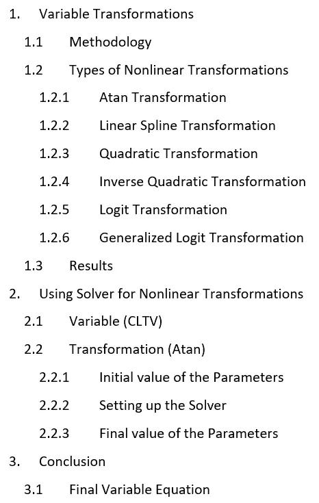

# 1.变量转换

变换变量涉及使用数学运算来改变其可测量的范围。有两种转换:

*   **线性变换:**保持变量之间的线性关系。因此，线性变换后，x 和 y 之间的相关性不会改变。
*   **非线性变换:**改变变量之间的线性关系，从而改变变量之间的相关性。

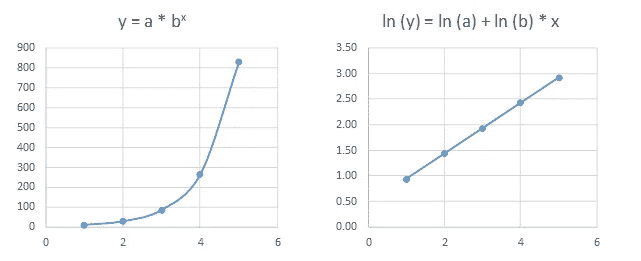

图 1:非线性转换

## 1.1 —方法

在模型估计期间，连续变量被分箱。如果系数模式表明潜在变量是非线性的，则探索一系列用于转换变量的数学函数，以与目标结果具有线性关系。选择变换以合理地拟合观察到的数据，并且在观察到的数据范围之外具有期望的理论属性。下面讨论了选择适当转换的过程:

**步骤 1:** 对连续变量进行分箱，并使用分箱后的数据估计回归模型。宁滨应该具有合理的粒度(通常为 10 个以上的容器)。如果上部或下部箱遮蔽了感兴趣的范围，则可以创建附加箱。

**第二步:**评估参数估计的形状，选择一个最能捕捉总体趋势并具有理论上可防御属性的形状。装箱的模型参数绘制在 Y 轴上，而预测变量的平均值或中值绘制在 X 轴上。

**步骤 3:** 手动选择初始的一组变换函数参数，以便合理地逼近系数中观察到的模式。初始起点通常需要手动选择，因为唯一参数的数量很少。计算拟合度量，如平均误差(偏差)和 MAPE(精度)。

**步骤 4:** 使用步骤 3 中计算的初始值，使用非线性估计程序重新估计参数。模型开发人员评估模型拟合结果和观察数据范围之外的理论属性。

**步骤 5:** 模型开发人员在步骤 3(参数的判断调整)和步骤 4(统计优化)之间交替进行，直到获得满意的解决方案。

## 1.2 —非线性变换的类型

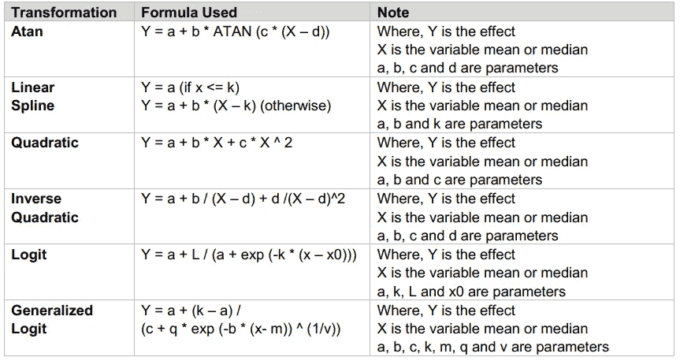

表 1:候选函数转换列表

**1.2.1)阿坦变换**

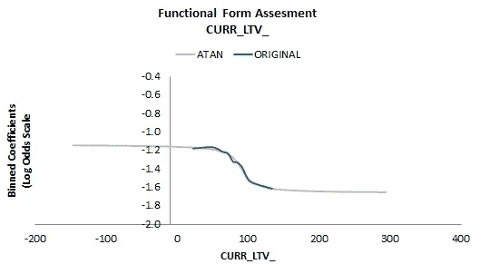

图 2: Atan 转换

*   参数“a”向上或向下移动变换线
*   参数“d”向左或向右移动变换线
*   参数“b”定义了曲线的高度和方向
*   参数“c”定义了曲线的斜率和方向

**1.2.2)线性样条变换**

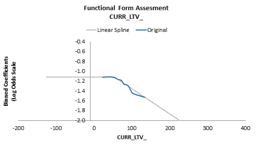

图 3:线性样条变换

*   参数“a”向上或向下移动变换线
*   参数“k”定义了原始序列显示斜率偏移的点
*   参数“b”定义了曲线的斜率和方向

**1.2.3)二次变换**

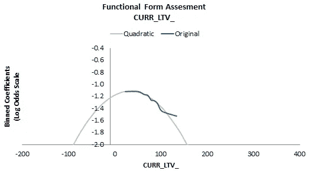

图 4:二次转换

*   参数“a”向上或向下移动变换线
*   参数“d”向左或向右移动变换线
*   参数“b”定义了曲线的斜率和方向
*   参数“c”定义了曲线的方向

**1.2.4)逆二次变换**

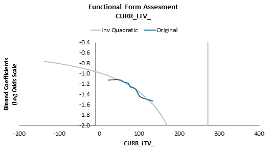

图 5:逆二次转换

*   参数“a”向上或向下移动变换线
*   参数“d”向左或向右移动变换线
*   参数“b”和“c”定义了曲线的方向

**1.2.5) Logit 变换**

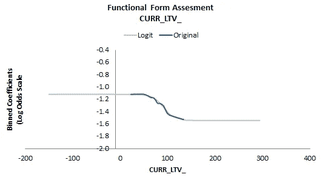

图 6: Logit 转换

*   参数“a”向上或向下移动变换线
*   参数“xo”向左或向右移动变换线
*   参数“L”定义了曲线的高度和方向
*   参数“k”定义了曲线的斜率和方向

**1.2.6)广义 Logit 变换**

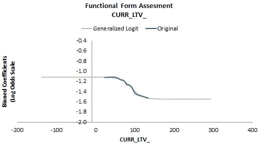

图 7:广义 Logit 转换

*   参数“a”向上或向下移动变换线
*   参数“m”向左或向右移动变换线
*   参数“m”定义了曲线的高度和方向
*   参数“b”、“c”、“k”和“q”定义了曲线的斜率和曲线的方向

## 1.3 —结果

对入库的变量(CLTV[【2】](#_ftn2))应用了各种变换(Atan、线性样条、二次、逆二次、Logit 和广义 Logit)。为每个参数选择一组初始值，并使用求解器(Excel 插件)获得参数的最终值，以使 MAPE[【3】](#_ftn3)最小。在各种可用选项中，根据形状和较低的 MAPE 选择了变换。下表总结了参数的初始值、参数的最终值和误差(偏差和 MAPE)。

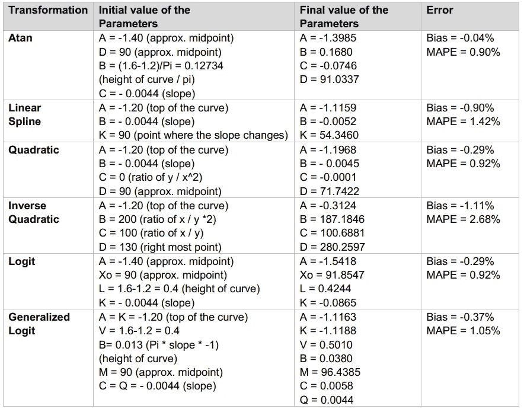

表 2:参数和误差

**ATAN 被选为最终变形:**

*   **MAPE 最低(MAPE = 0.90%)**
*   **形状直观(S 形)**

# 2.使用规划求解进行非线性转换

Excel 包括一个名为“规划求解”的工具，它使用运筹学中的技术来寻找各种决策问题的最佳解决方案。“规划求解”在“数据”选项卡上。要制定线性规划模型供“求解器”求解，必须解决三个问题:

1.需要做出哪些决定？

2.这些决策的制约因素是什么？

3.这些决策的总体绩效衡量标准是什么？

## 2.1 —可变(CLTV)

当前贷款价值比(CLTV)是金融机构使用的一种风险评估比率。它被定义为当前未偿余额(抵押金额)与抵押品(财产)价值的比率。通常，CLTV 比率高的评估通常被视为风险较高。

图 8:当前贷款价值比

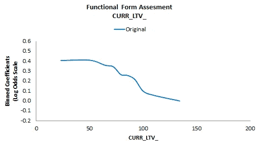

*   该图显示了改进车型[【4】](#_ftn4)的 CLTV 趋势。随着 CLTV 的增加，改善率降低。
*   y 轴表示变量的分级系数(对数优势标度)
*   x 轴表示变量 CLTV 的中值

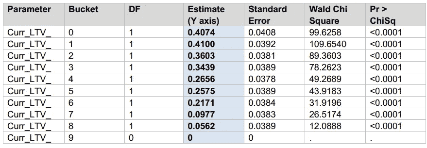

表 3: Y 轴—表示变量的装箱系数

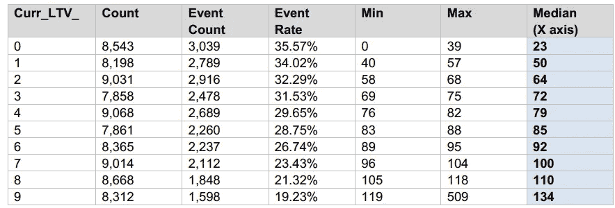

表 4: X 轴—表示变量 CLTV 的中值

## 2.2 —转换(Atan)

ARCTAN (Atan)返回元素 x 的反正切值(Tan-1)。**ARCTAN 是一个 s 形函数，其一般形状如下所示。**Atan 函数操作元素式数组。对于 X 的实元素，Atan (X)返回区间[ -pi/2，pi/2 ]内的值。

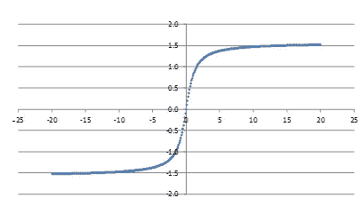

图 9: Atan 转换

*   该函数参数化如下:

Y = a + b * ATAN (c * (X — d))

*   假设:

A = 0，B = 1，C = 1，D = 0

阿坦的规则:

*   X = -∞，Atan (rad) = -π/2
*   X = 0，Atan (rad) = 0
*   X = ∞，Atan (rad) = π/2

**2.2.1)参数初始值**

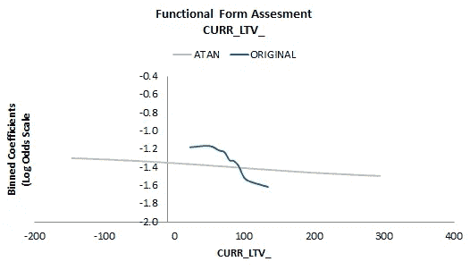

图 10:参数的初始值

*   A = -1.40(大约。中点)，B =(1.6–1.2)/Pi = 0.12734(曲线高度/Pi)，C = — 0.0044(斜率)，D = 90(近似值)。中点)
*   偏差= 4.57%
*   MAPE = 10.19%

**2.2.2)设置解算器**

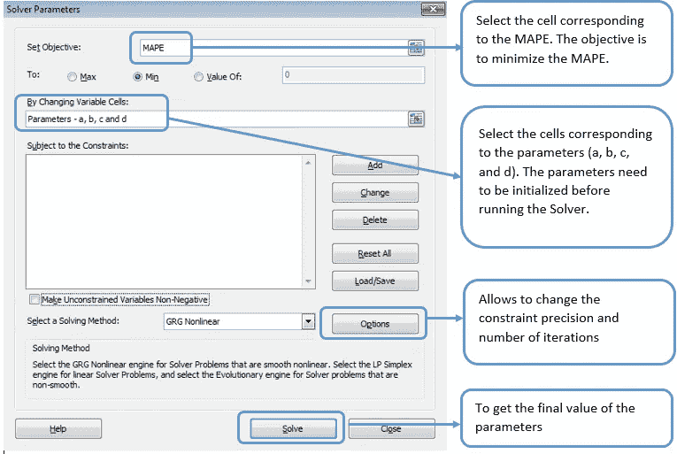

图 11:设置求解器

**2.2.3)参数的最终值**

图 12:参数的最终值

*   A = -1.3985，B = 0.1680，C = -0.0746，D = 91.0337
*   偏差= -0.04%
*   MAPE = 0.90%

# 3.结论

逻辑回归不做任何基于普通最小二乘算法的线性回归模型的关键假设，特别是关于线性、正态性、同方差性和测量水平。然而，逻辑回归假设独立变量和对数优势的线性。虽然它不要求因变量和自变量线性相关，但它要求自变量与对数概率线性相关。否则，测试低估了关系的强度，并在关系应该显著的地方轻易地拒绝了关系(即不显著——拒绝零假设)。

虽然转换可以导致特定建模假设的改进，例如线性或同方差，但它们通常会导致违反其他假设。因此，必须以迭代的方式使用转换，并在进行转换时不断检查其他建模假设。由转换带来的一个模型假设的改进可能导致更严重的违反模型的另一个假设前提。

带转换的规则:

1.因变量的变换会改变模型中误差项的分布。

2.因变量和自变量之间的非线性通常可以通过变换自变量来线性化。

3.模型只能在因变量的原始单位上进行比较，而不能在转换单位上进行比较。

## 3.1-最终变量方程

> Y = a + b * ATAN (c * (X — d))

其中:

y 是变换后的 CLTV

x 是 CLTV 的原作

A = -1.3985，B = 0.1680，C = -0.0746，D = 91.0337

等式 1:最终变量等式

Excel 包括一个叫做规划求解的工具，它使用运筹学中的技术来寻找各种决策问题的最佳解决方案。

[[2]](#_ftnref2) CLTV —当前贷款价值比

[【3】](#_ftnref3)MAPE——平均绝对百分比误差

[【4】](#_ftnref4)改善是指账户从较高的拖欠额到较低的拖欠额的变动(例如，从 60 DPD 到 30 DPD)