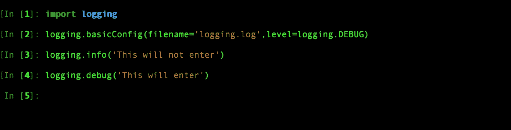

# 高级 Python 日志记录

> 原文：<https://medium.com/analytics-vidhya/advance-python-logging-571912d3275f?source=collection_archive---------8----------------------->


既然你在这里，我希望你已经知道什么是日志记录和它的优势。就像我常说的理解比执行更重要。

日志对于每个开发人员来说都是非常有用的工具。它帮助我们理解应用程序中请求的时间表。它还通过理解事件前的请求状态来帮助我们调试问题。

它还可以帮助分析应用程序，并带来一些关于它的见解，如记录平台(ios、android 或 web)将帮助我们了解我们的大部分流量来自哪个平台，这将使我们了解我们应该更加关注哪个平台。

Python 有一个内置的日志模块，叫做**日志**

我们已经知道，当我们记录事件时，可能会有一些对应用程序至关重要的事件，这些事件不会损害系统，但基本上是警告，如 API 的响应时间，或者是不太重要但记录了一些信息的事件。

类似地，python 日志模块定义了不同的严重性级别

*   **调试 **
*   ***信息***
*   ***警告***
*   ***错误***
*   ***批判***

我们需要记住的一件重要事情是，上述级别是按递增顺序排列的。

现在，在理解它是什么之前，让我们执行它们，看看它是如何工作的


如您所见，前两个级别无法记录消息，因为默认情况下**的严重性级别设置为警告。**

您猜对了，只有当严重级别达到记录器的默认严重级别时，才会记录该消息。

例如，假设日志记录器的严重级别设置为 debug(是的，我们可以设置日志记录级别),所有处于 debug 级别或更高级别的消息都将被记录

但是等待写入控制台在现实应用程序中没有意义，所以让我们将它记录到一个文件中。



在第 2 行，您可以看到我们正在将日志记录设置为一个文件，并将默认的严重级别设置为 debug。因为第一个日志消息级别是 info，所以它不会被写入文件，但是在下一个日志消息中，因为严重性级别符合默认级别，所以它将首先创建日志文件并将日志消息附加到该文件中。

请务必在新启动的 Python 解释器中尝试上述方法，不要只是从第一个示例的会话继续，因为对 **basicConfig()** 的调用应该在任何其他调用之前。因为它的目的是在一个会话中只配置一次，如果我们使用任何其他方法，如 info()、debug()或任何其他日志记录方法，它们将在内部配置日志记录并设置默认值。

但是仅仅记录日志并不能帮助我们调试，我们还应该知道事件是什么时候记录的，所以让我们记录事件的时间以及下面的消息。


由于世界是动态的，我们应该记录动态日志消息，在上面的消息中，您可以看到我们使用 python 格式记录了动态时间戳。

但是你不认为我们必须在每个日志事件中记录时间戳，并且每次在应用程序中计算时间是一种开销吗？不用担心，python 日志模块会通过提供一个选项来设置日志事件格式，我们可以自由选择事件的输出格式。为简单起见，我将继续将事件记录到控制台，这样您也可以看到输出。


记录模块有 4 个组件:

*   **记录器**公开应用程序代码直接使用的接口。
*   **处理程序**将日志记录(由记录器创建)发送到适当的目的地。
*   **过滤器**用于根据某些条件过滤出某些特定的日志记录。
*   **格式化程序**指定日志记录在最终输出中的布局。

在实际的应用程序中，你会有多个模块，你不能一直登录到同一个文件，因为很难理解事件来自哪个模块。因此，对于不同的模块或特性，总是推荐使用不同的记录器。

所以，这就是伐木者出现的原因。日志记录是通过调用 Logger 类实例上的方法来执行的，这些方法被称为 loggers。每个记录器都有一个名称、日志级别、处理程序、格式化程序和过滤器。

所以当我们使用日志记录来记录时(参见第一个例子),它使用了**根**日志记录器。

```
WARNING:root:This is a log event
```

这里 **root 是记录器名称**

让我们创建一个自定义记录器。


**步骤 1** :创建一个记录器实例，您可以使用自定义名称，也可以使用当前模块层次结构作为您的记录器名称。

**步骤 2** :设置记录器级别

**步骤 3** :使用`[StreamHandler](https://docs.python.org/3/library/logging.handlers.html#logging.StreamHandler)`或`[FileHandler](https://docs.python.org/3/library/logging.handlers.html#logging.FileHandler)`创建一个处理程序(也可以有其他类型的处理程序)

**第 4 步**:创建一个格式化程序，使用日志事件所需的输出格式

**步骤 5** :将格式化程序设置为已创建的处理程序以及处理程序日志级别

**第 6 步**:由于处理程序是用格式化程序创建的，下一步是将处理程序添加到创建的记录器中(注:你也可以将多个处理程序添加到一个记录器中，也就是说，如果你创建了一个文件处理程序和一个流处理程序，事件将在两个地方都被记录)

如果我们有几个记录器，以上述方式配置记录器会很好，但如果数量增加，跟踪记录器、它们的级别、处理程序和格式化程序将非常困难。

所以，使用`dictConfig()`有一个更好的方法。你必须定义你的记录器，它使用的处理程序和定义在字典格式中的格式化程序，该格式遵循**配置字典模式**。让我们看一个例子

```
{
"version": 1,
"formatters": {
  "simple":{
    "format": '%(asctime)s - %(name)s - %(levelname)s - %(message)s'
  }
},
"handlers":{
  "console":{
    "class": 'logging.FileHandler',
    "level": 'DEBUG',
    "formatter": 'simple',
    "filename": 'simple.log',
   }
},
"loggers":{
  "sampleLogger":{
    "level": 'DEBUG',
    "handlers": ['console'],
    "propagate": False,
  }
},
"root":{
  "level": 'DEBUG',
  "handlers": ['console'],
}
}
```

以上是用于配置的格式


通过这种方式，您可以使用定义的处理程序、格式化程序和日志级别一次创建多个日志程序，并且如果我们将其存储在配置文件中，我们还可以参考哪些日志程序可用于何种级别、处理程序和格式化程序。

**logger.exception():**

记录器有一个名为 exception 的方法，它主要记录异常跟踪和日志消息，这有助于更好地理解异常。


我希望我们涵盖了从 python 日志记录的基础到高级主题的所有内容。感谢阅读。

## **附言:如果你有任何疑问，请在**[**Linkedin**](https://www.linkedin.com/in/shanmukh-dundigalla-4910b5129/)**上给我留言或在**下方留言