# R — 2 中的高级数据结构

> 原文：<https://medium.com/analytics-vidhya/advanced-data-structures-in-r-2-635cbbedbc8c?source=collection_archive---------14----------------------->

> 如果您还没有阅读 R 基础系列的第 1 部分，请阅读下面的文章，在这篇文章中，我们讨论了从 R-1 开始。本系列涵盖了 R 的基础知识，包括数据类型、控制结构、循环、函数和高级数据结构。
> 
> 如果您已经熟悉这些主题，并且正在使用 r 寻找统计和机器学习中所有重要主题的全面介绍，请从以下系列开始，其中讨论了与数据科学相关的所有必要主题。
> 
> [将数据读入 R — 1 的多种方式](/@viveksrinivasan/many-ways-of-reading-data-into-r-1-52b02825cb27)
> 
> 这篇文章的内容是我在 IIM-B 时代得到介绍的几本书的要点。
> 
> 人人为我——贾里德·p·兰德
> 
> 实用数据科学与 R — Nina Zumel 和 John Mount
> 
> 文中讨论的所有代码块都以 R markdown 的形式出现在 [Github 链接](https://github.com/viveksrinivasanss/Data_Science_Using_R)中。
> 
> 要查看我写的所有文章，请使用链接 [Vivek Srinivasan](/@viveksrinivasan) 。

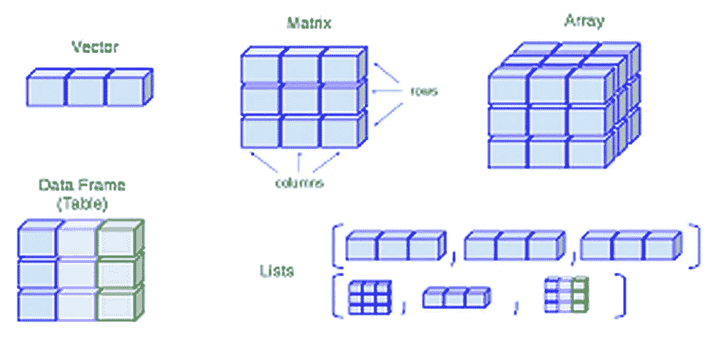

有时数据需要比简单的向量更复杂的存储，幸运的是 R 提供了大量的数据结构。最常见的是`data.frame`、`matrix` 和`list`，其次是`array`。其中，`data.frame`对于使用过电子表格的人来说是最熟悉的，而`matrix` 对于熟悉矩阵数学的人来说是最熟悉的，而`list` 对于程序员来说是最熟悉的。

## 数据.框架

也许 R 最有用的特性之一是`data.frame`。这是 R 易于使用的最常被引用的原因之一。

从表面上看，一个`data.frame`就像一个 Excel 电子表格，因为它有列和行。用统计学术语来说，每一列是一个变量，每一行是一个观察值。就 R 如何组织`data.frames`来说，每一列其实就是一个`vector`，每一列的长度都是一样的。这非常重要，因为它允许每一列保存不同类型的数据。这也意味着在一个列中，每个元素必须是相同的类型，就像向量一样。

构造`data.frame`的方法有很多，最简单的是使用`data.frame`函数。让我们使用一些我们已经介绍过的`vectors` 创建一个基本的`data.frame` ，即`x`、`y`和`q`。

```
x <- 10:1
y <- -4:5
q <- c("Hockey", "Football", "Baseball", "Curling", "Rugby",      "Lacrosse", "Basketball", "Tennis", "Cricket", "Soccer")theDF <- data.frame(x, y, q)
theDF
```

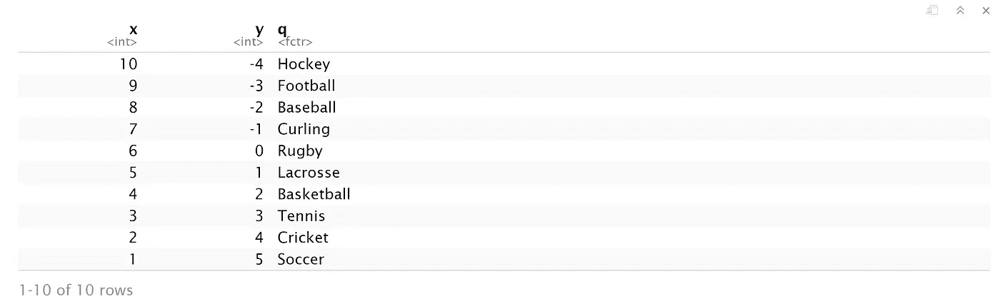

这就创建了一个由这三个向量组成的 10x3 `data.frame` 。注意`theDF`的名字只是变量。我们可以在创建过程中指定名称，这通常是个好主意。

```
theDF <- data.frame(First=x, Second=y, Sport=q)
theDF
```

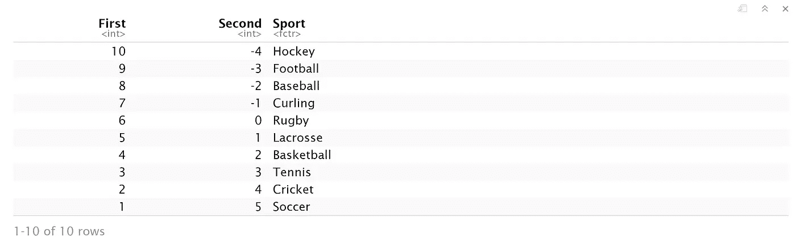

`data.frames`是具有许多属性的复杂对象。最常检查的属性是行数和列数。当然，也有函数为我们做这些:`nrow` 和`ncol`。如果两者同时需要，还有`dim` 功能。

```
nrow(theDF)
ncol(theDF)
dim(theDF)
```

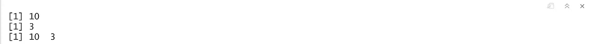

检查`data.frame`的列名就像使用`names` 函数一样简单。这将返回一个列出列的字符`vector` 。因为它是一个向量，我们可以像访问任何其他的`vector`一样访问它的单个元素。我们也可以使用`rownames` 函数检查并分配`data.frame`的行名。

```
names(theDF)
```

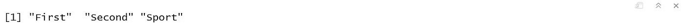

通常情况下，`data.frame`的行数太多，无法全部打印到屏幕上，所以谢天谢地`head` 函数只打印出了前几行。类似于`head`，要打印最后几行，使用 r 中的`tail` 函数

```
head(theDF)
```

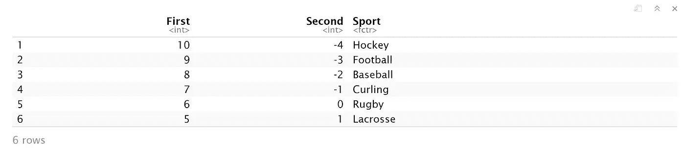

由于 data.frame 的每一列都是一个单独的`vector`，所以可以单独访问，每个列都有自己的类。像`R`的许多其他方面一样，有多种方法可以访问单个列。有`$`操作符，也有方括号。运行`theDF$Sport` 将给出`theDF`中的第三列。这允许我们通过名称指定一个特定的列。

```
theDF$Sport
```

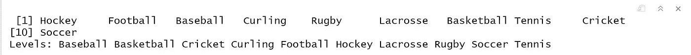

类似于 vectors，`data.frames`允许我们使用方括号通过位置访问单个元素，但是不是只有一个位置，而是指定了两个。第一个是行号，第二个是列号。所以为了从第二列得到第三行，我们使用了`theDF[3, 2]`。

```
theDF[3, 2]
```

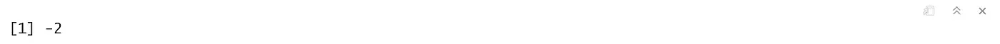

要指定多个`row` 或`column`，请使用索引的`vector` 。以下是访问行`3`和`5`，列`2`到`3`的方法。

```
theDF[c(3, 5), 2:3]
```

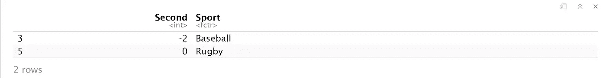

要访问整个`row`，请指定`row` ，而不要指定任何`column`。同样，要访问整个`column`，请指定该`column` ，而不要指定任何`row`。

```
theDF[2, ]
```

我们看到因子是以一种特殊的方式储存的。要查看它们如何在`data.frame`中表示，使用`model.matrix`创建一组指示器(或虚拟)变量。也就是说，一个因子的每个`level` 对应一列，如果一行包含该级别，则对应一个`1` ，否则对应一个`0`。相当于为因子列创建`dummy` 变量。

```
model.matrix(~ theDF$Sport - 1)
```

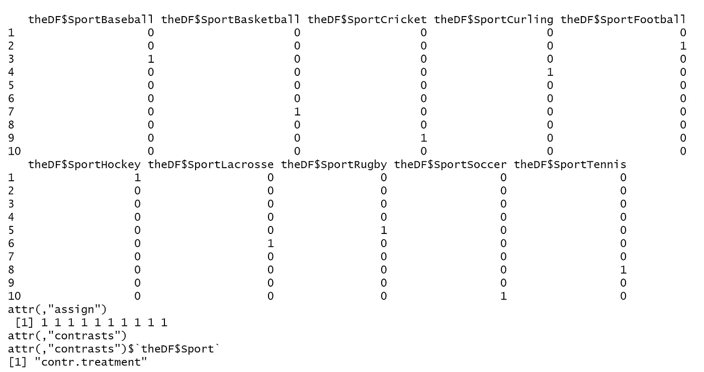

## 列表

通常需要一个容器来存放相同类型或不同类型的任意对象。r 通过`lists`完成这个任务。它们存储任意数量的任意类型的项目。一个列表可以包含所有的数字或字符，或者两者的混合，或者`data.frames`，或者递归地，其他的`lists`。

列表是用`list` 函数创建的，其中函数的每个参数都成为列表的一个元素。

```
list(1, 2, 3)
```

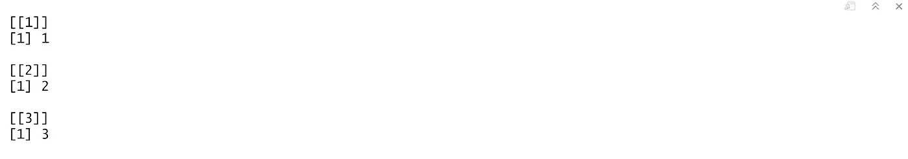

```
list(theDF, 1:10)
```

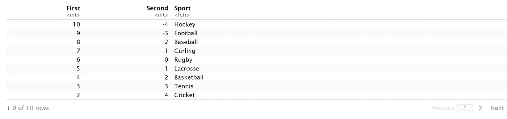

和`data.frames`一样，`lists` 也可以有名字。每个元素都有一个唯一的名称，可以使用`names`查看或分配。

```
a <- list(TheDataFrame=theDF, TheVector=1:10)
a
```

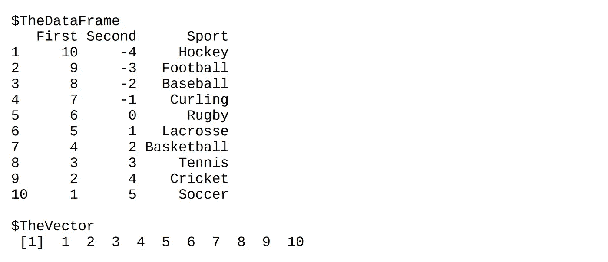

要访问`list`的单个元素，使用双方括号，指定元素编号或名称。请注意，这允许一次只能访问一个元素。一旦访问了一个元素，就可以将它视为正在使用的实际元素，从而允许嵌套索引元素。

```
a[["TheDataFrame"]] or a[[1]]
```

可以简单地通过使用一个不存在的索引(数字的或命名的)将元素添加到列表中。

```
length(a)## adding new element to list
a[[3]] <- "4"length(a)
```

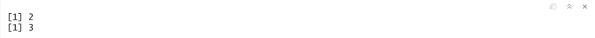

偶尔追加到一个列表——或者 vector 或 data.frame 中——是可以的，但是重复这样做在计算上是很昂贵的。因此，最好创建一个与其最终期望大小一样长的`list` ，然后使用适当的索引填充它。

## 矩阵

对于统计学来说，一个非常常见的数学结构是`matrix`。这类似于一个`data.frame`，它是有行和列的矩形，除了每一个单独的元素，不管`column`，都必须是相同的`type`，通常都是`numerics`。它们也类似于向量，具有逐个元素的加法、乘法、减法、除法和等式。`nrow`、`ncol` 和`dim` 功能的工作方式与`data.frames`相同。

```
# create a 5x2 matrix
A <- matrix(1:10, nrow=5)# create another 5x2 matrix
B <- matrix(21:30, nrow=5)# create another 2x5 matrix
C <- matrix(21:40, nrow=2)
```

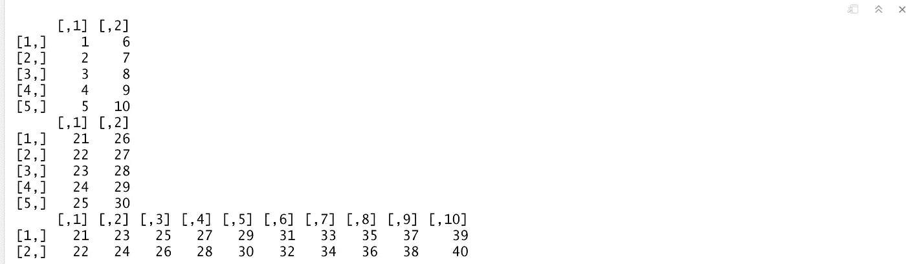

`Matrix` 乘法是数学中常用的运算，要求左边矩阵的列数与右边矩阵的行数相同。`A`和`B`都是`5X2` ，所以我们将`transposeB` 用于右侧。

```
A %*% t(B)
```

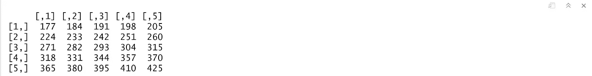

与 data.frames 的另一个相似之处是矩阵也可以有行名和列名。

```
rownames(A) <- c("1st", "2nd", "3rd", "4th", "5th")
colnames(C) <- LETTERS[1:10]A %*% C
```

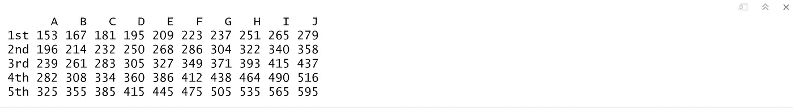

注意当`transposing` 矩阵和`multiplying` 矩阵。转置自然会翻转行名和列名。矩阵乘法保留左矩阵的行名和右矩阵的列名。

## 数组

一个`array` 本质上是一个多维向量。它必须都是相同的`type`，并且使用方括号以相似的方式访问各个元素。第一个元素是`row` 索引，第二个是`column` 索引，其余元素用于外部尺寸。

```
## Creating 3D array
theArray <- array(1:12, dim=c(2, 3, 2))
theArray
```

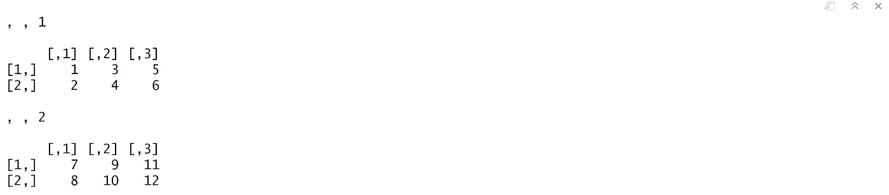

一个`array` 和一个`matrix` 之间的主要区别是矩阵被限制在二维空间，而数组可以有任意数量。

```
## Accessing different dimension of array
theArray[1, , ]
theArray[1, , 1]
theArray[, , 1]
```

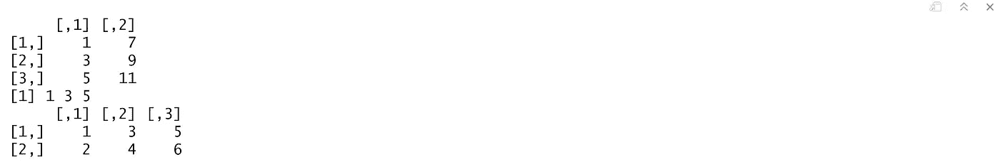

数据有多种类型和结构，这可能会给一些分析环境带来问题，但是`R`沉着地处理它们。最常见的数据结构是一维的`vector`，它构成了`R`中一切的基础。

最强大的结构是`data.frame`—`R`中大多数其他语言没有的特殊之处——它以类似电子表格的格式处理混合数据类型。`Lists` 对于存放物品很有用，比如`Perl`里的`hash` 。在下一篇文章中，我们将讨论如何在 R 中创建定制函数以及与之相关的细微差别。

[*编写 R 函数— 3*](/@viveksrinivasan/writing-r-functions-3-2fe03faecfbe)

> 一定要通过评论和在你的同龄人中分享文章来分享你的想法和支持。