# R-4 中的高级数据争论

> 原文：<https://medium.com/analytics-vidhya/advanced-data-wrangling-in-r-4-f98693b92851?source=collection_archive---------4----------------------->

*如果您还没有阅读 R 数据分析系列的第 3 部分，请阅读下面的文章，其中我们讨论了 R-3**中的* [*组操作。*](/@viveksrinivasan/group-manipulation-in-r-3-5554a0c1b544)

这篇文章的内容是我在 IIM-B 时代得到的几本书的要点。

*人人为我——贾里德·p·兰德*

*实用数据科学与 R —妮娜·祖梅尔&约翰·芒特*

*文中讨论的所有代码块都以 R markdown 的形式出现在* [*Github 链接*](https://github.com/viveksrinivasanss/Data_Science_Using_R) *中。*


如果你是一个速度迷；比起代码的可读性，你更喜欢速度，并且每天都要处理非常大的数据集，那么你就在正确的地方学习正确的工具。在`R`中有一个名为`data.table`的包，它扩展了`data.frames`的功能。语法与常规的`data.frames`有些不同，所以需要时间来适应，这可能是它没有被广泛采用的主要原因。

并且`data.table`并不是唯一有助于数据框操作的软件包。还有一个`Hadley Wickham`的优秀包叫`dplyr`。它有自己的数据操作语法，提供一组一致的动词，帮助您解决最常见的数据操作。

*   `filter()`根据值选择案例。
*   `arrange()`对案例进行重新排序。
*   `select()`和`rename()`根据名称选择变量。
*   `mutate()`和`transmute()`添加新变量，这些变量是现有变量的函数。
*   `summarise()`将多个值浓缩为一个值。
*   `sample_n()`和`sample_frac()`随机抽取样本。

这两个包在可用性、可读性和速度方面一直存在争议。一个[*stack overflow*](https://stackoverflow.com/questions/21435339/data-table-vs-dplyr-can-one-do-something-well-the-other-cant-or-does-poorly)的讨论值得一读，以便更多地了解一个包能做什么，另一个不能做什么。一般来说，如果你在寻找速度，那么`data.tables` 是最优选的，但是代码的可读性是你最关心的，那么`dplyr` 是通向速度的途径

在本文中，我们将重点放在`data.table`上，速度的秘密在于`data.table`有一个类似数据库的索引。这允许更快的访问、分组操作和连接。

创造`data.table`就像创造`data.frames`，两者非常相似。

```
require(data.table)
## Create a regular data.frame
theDf <- data.frame(A=1:10,B=letters[1:10],C=LETTERS[1:10],D=rep(c("One","Two","Three"),length.out=10))## Create a data.table
theDt = data.table(A=1:10,B=letters[1:10],C=LETTERS[1:10],D=rep(c("One","Two","Three"),length.out=10))## Print and compare
theDt
```

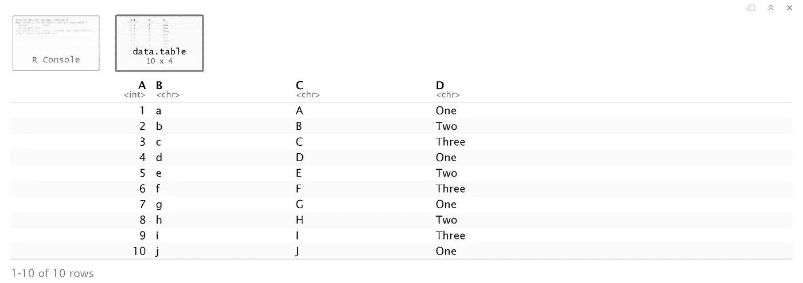

下面可以注意到，默认情况下`data.frame`将`character`数据转化为`factors` ，而`data.table`没有。

```
class(theDf$B)class(theDt$B)
```

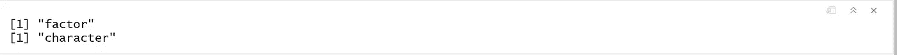

除了`data.frame`把`B`变成了`factor` 而`data.table`没有之外，数据是相同的。

也可以从现有的`data.frame`中创建一个`data.table`，如下所示。

```
require(ggplot2)
diamondsDT <- data.table(diamonds)
diamondsDT
```

现在让我们看看如何使用`data.table`执行一些常见和高级的数据操作。

## 访问行

访问行可以类似于访问`data.frame`中的行来完成。以下代码将数据子集化到前两行。

```
theDt[1:2,]
```

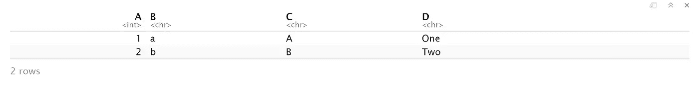

为了根据某种条件过滤行，我们可以使用下面的一行程序。尽管一行程序是有效的语法，但它不一定是有效的语法。该行创建一个由`True` 或`False` 条目组成的长度为`nrow=10`的向量，这是一个向量扫描。在我们为`data.tables`创建一个键之后，我们可以使用不同的语法通过二分搜索法来挑选行，这样会快得多，这将在下一节中介绍。

```
theDt[theDt$A >=7,]
```

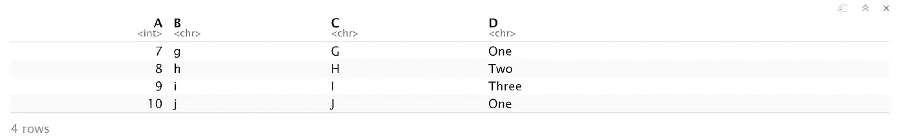

## 访问列

访问单个列的方式必须与访问`data.frames`中的列稍有不同。在`data.frames` to 子集中，多个列名应该被指定为`character` 向量。用`data.tables`应该将列指定为实际名称的列表，而不是字符。

```
theDt[,list(A,C)]
```

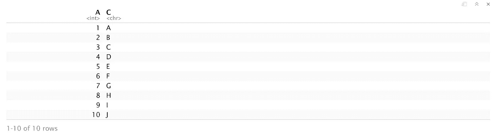

如果我们必须将列名指定为`characters`(可能因为它们是作为参数传递给函数的)，那么`with` 参数应该设置为`FALSE`。

```
theDt[,c("A","C"),with=FALSE]
```

这次我们使用了一个`vector`来保存列名，而不是一个`list`。这些细微差别对`data.table`的正常功能很重要，但会导致大量的挫折。

## 键

既然我们在内存中有一些`data.tables`，我们可能有兴趣看看关于它们的一些信息。

```
## show tables
tables()
```

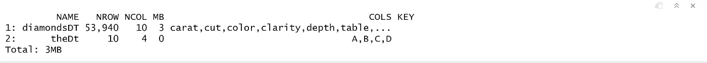

这显示了内存中每个`data.table`的名称、行数、兆字节大小、列名和键。我们没有为任何表分配`keys` ,因此到目前为止该列为空。该键用于索引`data.table`并将提供额外的速度。

我们从给`theDt`添加密钥开始。我们将使用`D`列来索引`data.table`。这是使用`set.key`完成的，它将`data.table`的名称作为第一个参数，将所需列的名称(没有引号，与列部分一致)作为第二个参数。

```
## set the key
setkey(theDt, D)## show the data.table again
theDt
```

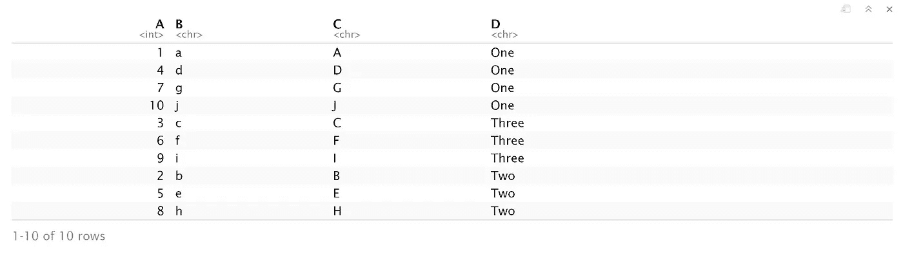

数据已根据按字母顺序排序的列`D`重新排序。我们可以确认该键是用`key` 功能设定的。

```
key(theDt)
```

这为从`data.tables`中选择行添加了一些新功能。除了通过行号或计算结果为`TRUE` 或`FALSE`的表达式选择行之外，还可以指定键列的值。

```
theDt[c("One","Two"),]
```

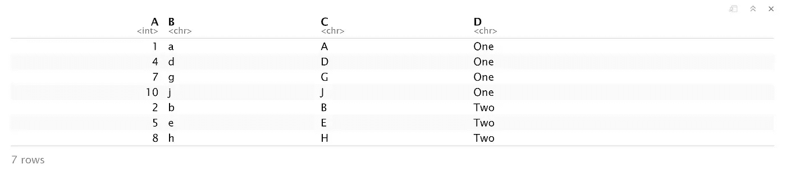

也可以将多列设置为`data.tables`中的`key` ，如下所示。

```
setkey(diamondsDT,cut,color)
```

要按两个键访问行，有一个特殊功能`J`。它需要多个参数，每个参数都是要选择的值的`vector` 。

```
diamondsDT[J("Ideal"),c("E","D")),]
```

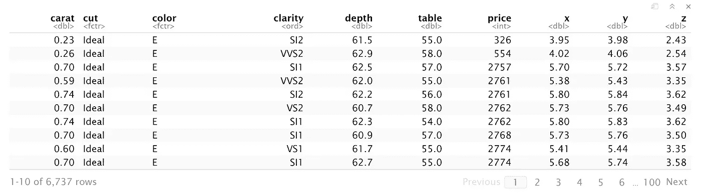

## 聚合

索引的主要好处是聚合速度更快。虽然`aggregate` 和各种 d*ply 功能可以工作，因为`data.table`只是增强了`data.frames`，但它们会比使用`data.tables`的内置`aggregate` 功能慢。让我们快速比较一下内置和外部`aggregate` 功能之间的语法差异。

为了计算每种切割类型的钻石平均价格，让我们使用我们在上一篇文章中使用的`aggregate`函数。

```
aggregate(price~cut,diamonds,mean)
```

为了使用`data.table`聚合功能获得相同的结果，我们使用下面的代码。

```
diamondsDT[,mean(price),by=cut]
```

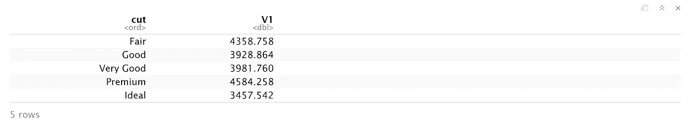

两个结果之间的唯一区别是列的名称不同。在`data.tables`中，默认名称`V1`被分配给聚合列。要指定结果列的名称，请将聚合函数作为命名的`list`进行传递。要在多个列上聚合，请将它们指定为`list()`。

```
diamondsDT[,list(price=mean(price)),by=cut]## Aggreagate on  multiple columns
diamondsDT[,list(price=mean(price)),by=list(cut,color)]
```

为了聚合多个参数，将它们作为`list`传递。与聚合函数不同，可以为每一列测量不同的指标。

```
diamondsDT[,list(price=mean(price), carat=mean(carat), caratSum=sum(carat)),by=list(cut,color)]
```

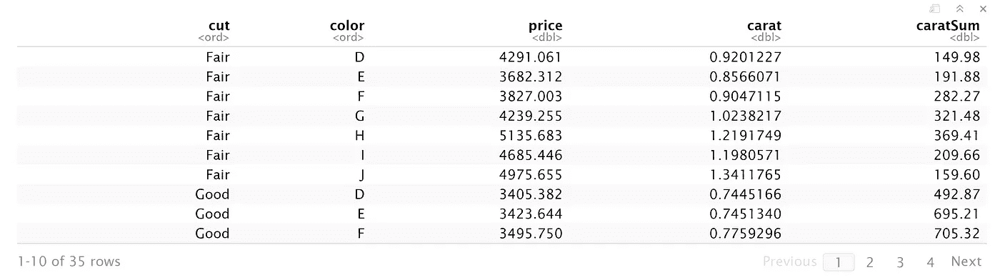

数据争论是任何分析管道中非常重要的一步。有时它是最终目标，有时它是为应用更先进的方法做准备。不管是什么原因，有大量的功能使其成为可能。其中包括 R 中的`aggregate`、`apply` 系列和`data.table`中的按功能分组。

*使用 R-5-的统计简介即将出版*

> 请通过评论和在你的同辈群体中分享这篇文章来分享你的想法和支持。