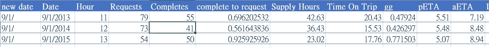
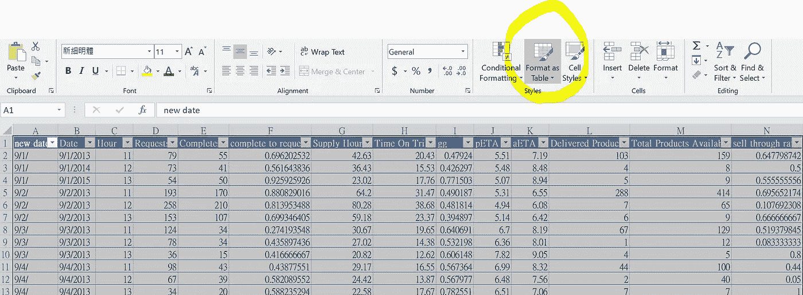
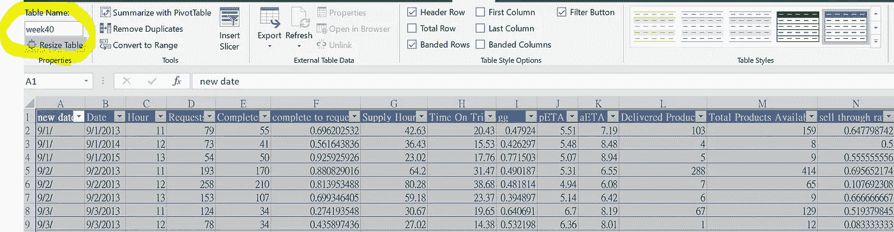
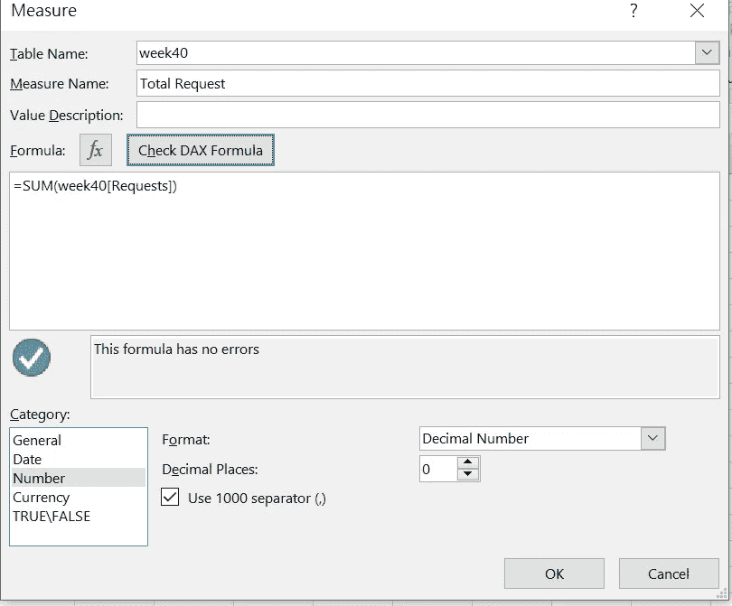
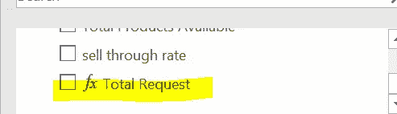
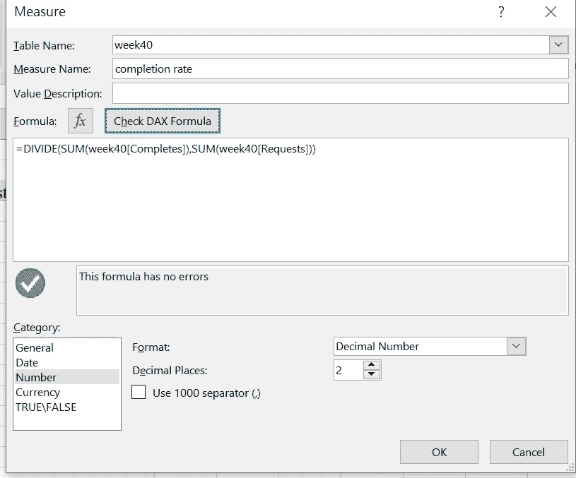
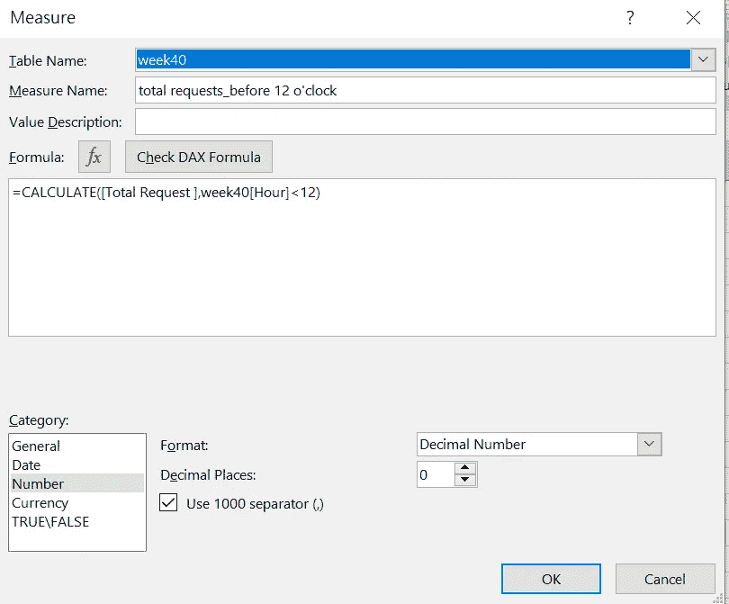
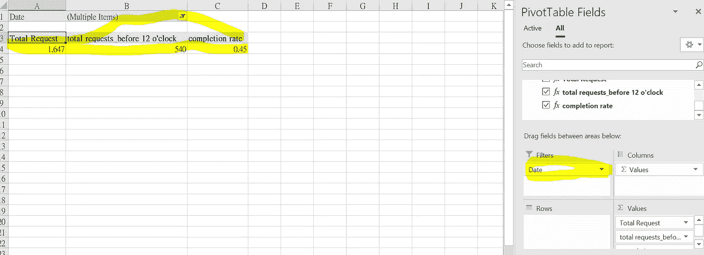

# Excel 中的高级 DAX 应用

> 原文：<https://medium.com/analytics-vidhya/advanced-dax-application-in-excel-4f62965ff248?source=collection_archive---------11----------------------->

DAX 广泛应用于 Power BI、Excel 等微软解决方案中。您可能有在 BI 中使用 DAX 的经验，但事实上，DAX 也是一个非常有用的工具，可以使数据透视表更加强大。DAX 带来的可预见的好处是**自动化、标准化和易于维护。**

在本文中，我将介绍三个函数，**、基于条件的求和、除法和计算函数，**来帮助您构建一个强大的自动化数据透视表。我使用了一个来自优步的小型数据集，这是我从访谈中获得的，这里是模式和前 3 条记录。我们将只使用一些列，所以我不会把所有列都放进去。通常，我们有订单时间、请求数量、完成数量和日期信息。

# 将您的数据集制作成表格

制作数据集表格的好处在于，它可以帮助您更好地管理和操作数据集，例如插入、应用函数、计算。请记住重命名您的表，这将有助于您在准备数据透视表时连接不同的表。

# 在数据透视表中构建 DAX 函数

第一步

第二步

第三步

1.  使用数据集插入数据透视表，右键单击表名并选择“添加度量”。
2.  重命名您的度量，并编写一个简单的汇总公式来计算数据集中的请求总数*。您可以单击“检查 DAX 公式”来查看您是否在此处进行了错误的逻辑设置。*
3.  设置完成后，可以在透视表列窗口中看到该列已经建立

# 达克斯分部

在这个测量中，我同时使用除法和加法。像许多其他编程语言一样，您可以根据请求组合不同的函数来实现您的目标。

# 达克斯条件

我想看看 12 点前提出了多少要求。我们肯定可以在原始数据中使用过滤器来完成这些请求，但关键是当我们有一些高频率的报告时，我们可以节省很多时间。

# 结论

DAX 测量和过滤器

最后，我们将这三个指标放在一个表中，并将日期放在一个过滤器中，我们可以有一个有意义的报告，以在短时间内获得一些关于优步业务的见解。我将介绍更多 DAX 在 BI 和 Excel 上的应用，敬请关注。