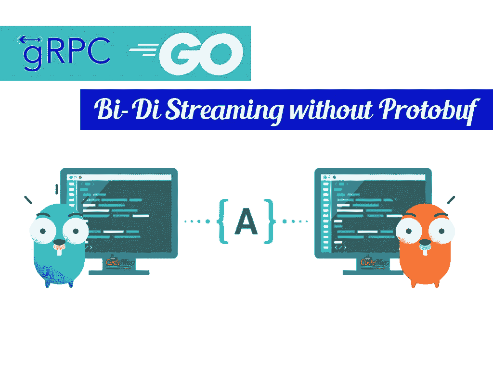

# 高级 Golang 教程:不带 Protobuf 的 gRPC 双向流

> 原文：<https://medium.com/analytics-vidhya/advanced-golang-tutorials-grpc-bi-directional-streaming-without-protobuf-f13ab43de205?source=collection_archive---------11----------------------->



不带 Protobuf 的 gRPC 双向流

在这篇文章中，我将给出一个最近很流行的话题的高级例子: **gRPC。**

gRPC 是一个现代的开源高性能 RPC 框架，可以在任何环境下运行。它可以通过对负载平衡、跟踪、运行状况检查和身份验证的可插拔支持，高效地连接数据中心内和跨数据中心的服务。它也适用于分布式计算的最后一英里，将设备、移动应用程序和浏览器连接到后端服务。 [grpc.io](https://grpc.io/)

gRPC 也很棒，因为它是用不同编程语言编写的微服务之间的通信协议。关于 gRPC 还有很多要说的，但是我不打算深入它的细节，因为我假设你已经熟悉它了。如果你不熟悉，[这里有一篇很棒的文章](/pantomath/how-we-use-grpc-to-build-a-client-server-system-in-go-dd20045fa1c2)详细讲解。

当我开始研究 gRPC 时，我很快意识到它实际上带有一个内置的序列化和反序列化机制，称为 Protobuf(协议缓冲区)。协议缓冲区是 Google 的语言中立、平台中立、可扩展的机制，用于序列化结构化数据——想想 XML，但是更小、更快、更简单。一旦定义了数据的结构化方式，就可以使用专门生成的源代码，使用各种语言轻松地将结构化数据写入各种数据流或从中读取。但是，如果您没有定义的消息类型，您会觉得需要禁用 Protobuf 序列化和反序列化。让我们看看如何在围棋中做到这一点:

下面的 ***main.proto*** 描述了使用双向流*远程过程调用*通信并携带原始**字节**作为消息类型的服务 **Main** 。

```
syntax = “proto3”;package rpc;service Main {
 rpc RPC (stream Payload) returns (stream Payload) {}
}message Payload {
 bytes Data = 1;
}
```

创建原型文件后，我们需要使用该文件为服务器和客户机生成源代码:

```
 protoc -I main/ main.proto — go_out=plugins=grpc:main
```

此命令将生成将在您的项目中使用的必要源代码。下一步是创建一个*有效负载*结构，它将在服务器-客户端对之间传送消息。

```
package rpc// Payload defines the service message format.
type Payload struct {
 data []byte
}// NewPayload creates and returns a new payload with the given byte slice.
func NewPayload(d []byte) *Payload {
 p := new(Payload)
 if d != nil {
 p.Set(d)
 }
 return p
}// Set sets the payload
func (p *Payload) Set(d []byte) {
 p.data = d
}// Get returns the payload
func (p *Payload) Get() []byte {
 return p.data
}
```

现在，我们已经到了需要向 gRPC 库添加自定义编解码器的地步，这样它就不会试图对我们通过网络发送的字节进行序列化和反序列化。这背后的主要原因是为了使通信更快，因为我们不知道 gRPC 服务器和客户端之间的流的大小。

[***阅读更多***](https://www.codemio.com/2019/08/advanced-golang-tutorials-grpc-bidi-streaming-custom-codec.html)