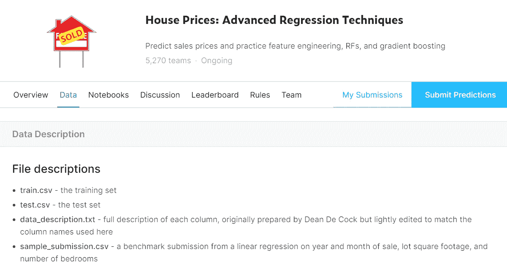

# 高级房价预测卡格尔竞赛

> 原文：<https://medium.com/analytics-vidhya/advanced-house-price-prediction-kaggle-competition-adefb458d201?source=collection_archive---------8----------------------->

阅读这篇文章的每个人都可能听说过 Kaggle，它有广泛的数据集和有大奖的比赛。我也是 Kaggle 竞赛的新手，没有任何使用它的经验，所以我想试一试，于是我前往 Kaggle，在 https://www . ka ggle . com/c/house-prices-advanced-regression-techniques 上试手

首先，我想让你知道这是我的第一个媒体帖子，所以请原谅我的任何错误。如果你不能理解一些步骤或有任何关于代码的问题，我会在帖子底部提供我的邮件 id，你可以通过邮件联系我。

下面是代码的 GitHub 链接

[](https://github.com/kpanwala/Advanced-House-Price-Prediction) [## kpanwala/高级房价预测

### 使用回归技术预测房屋的销售价格-kpanwala/高级房价预测

github.com](https://github.com/kpanwala/Advanced-House-Price-Prediction) 

我用过 **Google colab** 你可以用任何 ide，比如 **Jupyter Notebook。**

## 资料组



以上是本文中使用的数据集

如图所示，使用了包含 4 个文件的**房价:高级回归技术**数据集

1.  train.csv(里面有你的训练数据)。
2.  test.csv(包含您的测试数据)。
3.  data_description.txt(包含数据属性的描述，如特定属性拥有哪些不同的类别)。
4.  sample_submission.csv(这是一个示例提交文件，让您知道您预测的文件应该具有以下格式)。

压缩文件后，这里是火车数据

训练数据中有 80 列，测试数据中有 79 列。我们需要使用回归技术预测**销售价格**，并在 sample_submission.csv 中提交预测值，然后上传到 kaggle 上。

为了解决竞争，我发现了 3 个阶段:

1.  **数据预处理。**
2.  **特征选择**(实际上，特征选择属于数据预处理部分，但只是为了按照步骤执行，我将它作为一个单独的步骤提及)。
3.  **回归的算法选择。**

# **数据预处理**

让我们从数据预处理开始，因为我们需要了解数据及其类型。我们可以通过**获得关于我们数据的信息。info()** 函数。

我们还需要知道我们的数据集中有多少空值，所以我使用了下面的代码，在 ***中有 ***19 列*** ***，在*** ***中有*** *和* ***33 列******

```
***## Count of top 20 Fields of train data having null values*
train_data.isnull().sum().sort_values(ascending=**False**).iloc[:20]*## Count of top 35 Fields of test data having null values*
test_data.isnull().sum().sort_values(ascending=**False**).iloc[:35]**
```

**现在，对于空值，我根据自己的经验遵循一些规则:**

1.  **如果您有大量数据，那么您可能会删除具有空值的行，但是请记住，如果某个要预测的类出现得很少，那么不要删除该行，而是尝试替换空值，如步骤 4 中所定义的。这一步不常用，因为它会导致一些重要数据的删除。**
2.  **如果您看到空值属性(列),并且如果某些属性的空值比例大于实际数据，那么您可以确定一个比率，并删除那些空值与总数据的比率大于预定比率的属性(例如，如果您确定比率为 0.7，并且您有 1000 条记录，其中 800 条记录包含空值，则您可以删除该属性)。(参考下面的 3.ipynb)**
3.  **你也可以制作一个分类器来预测那些空值，[](https://towardsdatascience.com/k-nearest-neighbor-python-2fccc47d2a55)*是 KNN 广泛使用的技术。但这是一个非常累人的过程。***
4.  ***你可能会想如何替换空值，为此我们研究属性的数据类型，如果属性是 int 或 float，那么我们可以用属性的平均值替换空值。***

```
***dataset[col].fillna(dataset[col].mean(),inplace=**True**)***
```

***else 如果是宾语，那么我们可以用最常用的来代替。现在这可以用下面的许多方法来完成，我列举了两种方法。两者输出相同。***

***I)来自 **sklearn_pandas。分类计算器*****

***[](https://github.com/scikit-learn-contrib/sklearn-pandas#categoricalimputer) [## sci kit-learn-contrib/sk learn-pandas

### 这个模块提供了 Scikit-Learn 的机器学习方法和 pandas 风格的数据框架之间的桥梁。在…

github.com](https://github.com/scikit-learn-contrib/sklearn-pandas#categoricalimputer) 

ii)替换为**模式**(参见下面的 4.ipynb)

```
dataset[col].fillna(dataset[col].mode()[0],inplace=**True**)
```

第二点的片段

第 4rd 点的片段

我们可以使用下面的代码得到空值的总数。

```
*## Top 5 Fields of test data having null values*
test_data.isnull().sum().sort_values(ascending=**False**).iloc[:5]*## Top 5 Fields of test data having null values*
train_data.isnull().sum().sort_values(ascending=**False**).iloc[:5] 
```

然后我发现有很多属性在训练数据中有 3 个类，而在测试数据中或多或少有 3 个类。这可能会导致不平衡的分类，因为我们最终会将类分成一个热编码器形式。 **category_onehot_multcols** 函数用于将作为参数提供的数据集中出现的所有分类变量的[变成一个热编码器](https://www.geeksforgeeks.org/ml-one-hot-encoding-of-datasets-in-python/)的形式。另外[虚拟变量陷阱](https://www.geeksforgeeks.org/ml-dummy-variable-trap-in-regression-models/)也被处理。

```
total= pd.concat([train_data.drop(['SalePrice'],axis=1),test_data]
,axis=0) ## func to convert into one hot encoder form
**def** category_onehot_multcols(multcolumns):
    df_final=total
    i=0
    **for** fields **in** multcolumns:

        print(fields)
        df1=pd.get_dummies(total[fields],drop_first=**True**)

        total.drop([fields],axis=1,inplace=**True**)
        **if** i==0:
            df_final=df1.copy()
        **else**:
            df_final=pd.concat([df_final,df1],axis=1)
        i=i+1

    df_final=pd.concat([total,df_final],axis=1) 
    **return** df_final## passing our total Dataframe for one hot encoder
total=category_onehot_multcols(column)save_cols=total.columns
```

现在，当所有分类值都转换为 int 形式时，我们可以执行最重要的步骤，您应该始终记住这一步，即使用[**standard scaler**](https://towardsdatascience.com/scale-standardize-or-normalize-with-scikit-learn-6ccc7d176a02)**from****sk learn . preprocessing****import****standard scaler 缩放数据。它有助于在-1 到 1 之间转换数据，我尝试了使用和不使用**标准缩放器**的预测，发现结果差异很大，所以我建议你在回归问题中强制使用它。******

```
**from** **sklearn.preprocessing** **import** StandardScaler
x = total.values
x = StandardScaler().fit_transform(x)x=pd.DataFrame(x,columns=save_cols) ## naming columns to ease the operations
cols=[]
for i in range(0,233):
    name = "col"+str(i)
    cols.append(str(name))x=pd.DataFrame(x,columns=cols)# splitting scaled total data into train and test data
train = x.iloc[:1460]
test = x.iloc[1460:]# getting predicting values i.e SalePrice into "y" and scaling it .. 
# separately 
y = train_data['SalePrice'].values
sc=StandardScaler()
y = pd.DataFrame(sc.fit_transform(y.reshape(-1,1)))
y.columns=['SalePrice']
train = pd.concat([train,y],axis=1)
```

# ****功能选择****

**我使用关联矩阵来查看属性与销售价格(待预测)的关联程度。**

**[**相关系数**](https://en.wikipedia.org/wiki/Correlation_coefficient) 在统计学中用来衡量两个变量之间的关系有多强。相关系数有几种类型:皮尔逊相关(也叫皮尔逊相关 *R* )是线性回归中常用的一种**相关系数**。使用相关系数有一个限制，因为它们*仅用于连续值，而不用于类*，所以我们实际上创建了一个热编码器表单，它将其转换为连续形式，以便我们可以对其应用相关系数。**

**相关系数公式用于确定数据之间的关系有多强。这些公式返回一个介于-1 和 1 之间的值，其中:**

*   **1 表示强正相关。**
*   **-1 表示强烈的负面关系。**
*   **结果为零表示完全没有关系。**

**您可以通过以下代码获得相关系数:**

```
train.corr().reset_index()[['index','SalePrice']]
```

**我取了任何系数大于+0.15 小于-0.15 的属性。这是从 0.6 到 0.15 的实验，因为它显示了改进的结果。您还可以看到，我将与销售价格更相关的列存储到了*列*中，我将进一步使用这些列。**

**现在是为我们的问题陈述选择回归算法的部分，你几乎完成了这一步，因为数据预处理是一个非常令人厌倦的过程 ***根据一些调查数据，科学家花费他们 90%的时间来预处理数据。*****

**我使用的算法列表:**

> ***1。* ***人工神经网络*** (使用相关性，通过基本数据预处理，1000 个历元，得到 0.21339 左右的误差分数 4800 秩)。在玩了 760 个时期的参数后，我得出 Ann 的分数为 0.18528，相当不错。我注意到在每一层都添加漏失层是不可行的，因为它的误差增加了，所以我只添加了一个漏失层，也就是第一层。**

```
import tensorflow as tf
from tensorflow import keras
from tensorflow.keras.models import Sequential
from tensorflow.keras.layers import Dense
from tensorflow.keras.layers import LeakyReLU,PReLU,ELU
from tensorflow.keras.layers import Dropout# Initialising the ANN
classifier = Sequential()# Adding dropout layer
classifier.add(Dropout(0.2))# Adding the input layer and the first hidden layer
classifier.add(Dense(50, kernel_initializer = 'he_uniform', activation='relu',input_dim = 146))# Adding the second hidden layer
classifier.add(Dense(25, kernel_initializer = 'he_uniform', activation='relu'))# Adding the third hidden layer
classifier.add(Dense(50, kernel_initializer = 'he_uniform', activation='relu'))# Adding the output layer
classifier.add(Dense(1, kernel_initializer = 'he_uniform', use_bias=True))# Compiling the ANN
classifier.compile(loss=root_mean_squared_error, optimizer='Adamax')# Fitting the ANN to the Training set
model_history=classifier.fit(train.values, y.values,validation_split=0.20, batch_size = 10, epochs = 760)
```

> **2.接下来我使用了 [***梯度推进算法***](https://towardsdatascience.com/understanding-gradient-boosting-machines-9be756fe76ab) 但是得到了 0.16394 的分数在 3400 左右排名但是改变参数后分数几乎保持不变。**

```
from sklearn.ensemble import GradientBoostingRegressor
from sklearn.metrics import mean_squared_error
from sklearn.metrics import mean_absolute_errorregressor = GradientBoostingRegressor(
    max_depth=10,
    n_estimators=500,
    learning_rate=1.0
)regressor.fit(X_train, y_train)errors = [root_mean_squared_error(y_train, y_pred) for y_pred in regressor.staged_predict(X_train)]
best_n_estimators = np.argmin(errors)best_regressor = GradientBoostingRegressor(
    max_depth=2,
    n_estimators=best_n_estimators,
    learning_rate=1.0
)
best_regressor.fit(X_train, y_train)y_pred = best_regressor.predict(X_test)
```

> **3.接下来我使用了 [***随机森林回归器***](https://www.geeksforgeeks.org/random-forest-regression-in-python/) ，我获得了 0.16282 的新分数，这是一个微小的进步。**

```
from sklearn.ensemble import RandomForestRegressor 

 # create regressor object 
regressor = RandomForestRegressor(n_estimators = 500, random_state = 0) 

# fit the regressor with x and y data 
regressor.fit(X_train, y_train)y_pred = regressor.predict(X_test)
```

> **4.接下来我尝试了 [***SVR(支持向量回归机)***](https://scikit-learn.org/stable/modules/generated/sklearn.svm.SVR.html) 和[**PCA**](https://scikit-learn.org/stable/modules/generated/sklearn.decomposition.PCA.html)**用 2，5，10，20 个分量，但徒劳无功，它们都是表现最差的模型。****

```
**from sklearn.decomposition import PCApca = PCA(n_components=20)principalComponents = pca.fit_transform(train[columns])Df = pd.DataFrame(data = principalComponents, columns = [‘pc1’, ‘pc2’,’pc3',’pc4',’pc5',’pc6',’pc7',’pc8',’pc9',’pc10',’pc11', ‘pc12’,’pc13',’pc14',’pc15',’pc16',’pc17',’pc18',’pc19',’pc20'])print(‘Explained variation per principal component: {}’.format(pca.explained_variance_ratio_))**
```

> ****5.接下来我尝试了 [**XGBoost 回归**](https://www.datacamp.com/community/tutorials/xgboost-in-python) ，我用 500 个估计量获得了 0.14847 的分数，这是从随机森林回归量的一个巨大飞跃。我得到了大约 2800 分，这也是一个巨大的飞跃。****

```
****import** **xgboost** **as** **xgb**

xg_reg = xgb.XGBRegressor(objective ='reg:linear', colsample_bytree = 0.3, learning_rate = 0.1,max_depth = 5, alpha = 10, n_estimators = 1000)

xg_reg.fit(train[columns],y)

y_pred = xg_reg.predict(test[columns])**
```

****大约 20 次提交后，我得到的分数是 *0.13933* 和*2465*的等级，有 500 个评估者，相关值截止值为(+/-) 0.15。我尝试了各种估计值，你也可以尝试不同的值。你也可以尝试许多其他的回归技术，如多项式回归、逻辑回归、线性回归等。****

****最后，我们需要提交具有 sample_submission.csv 相同格式的提交，这里是它的代码。****

```
**## as we have transformed the prediction price between -1 to 1 we 
## need to inversely transform it back to original values.
pred=pd.DataFrame(sc.inverse_transform(y_pred))sub_df=pd.read_csv('sample_submission.csv')
datasets=pd.concat([sub_df['Id'],pred],axis=1)
datasets.columns=['Id','SalePrice']

datasets.isnull()
datasets.to_csv('sample_submission.csv',index=**False**)

datasets.head()**
``` 

# ********非常感谢**阅读这篇文章，如果你欣赏这篇文章背后的努力，那么一定要为它鼓掌。******

******如果有疑问或需要改进的地方，这里是我的邮箱 id:***kpanwala33@gmail.com***你可以发邮件给我，我会尽快回复你。******

******在**推特**:[*https://twitter.com/PanwalaKalp*](https://twitter.com/PanwalaKalp)上关注我******

******在**LinkedIn**:[https://www.linkedin.com/in/kalp-panwala-72284018a](https://www.linkedin.com/in/kalp-panwala-72284018a/)上联系我******

******跟随我上**Github**:[https://github.com/kpanwala](https://github.com/kpanwala)******