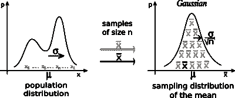
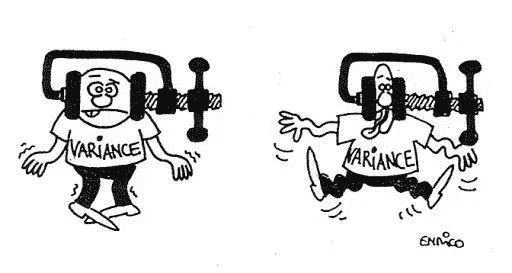
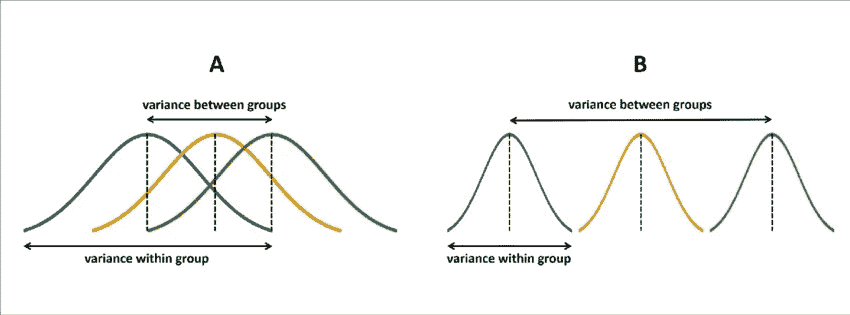
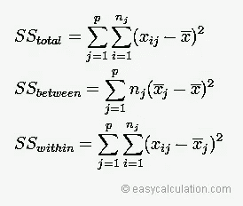
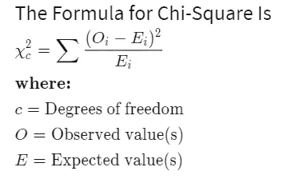

# 高级假设检验

> 原文：<https://medium.com/analytics-vidhya/advanced-hypothesis-testing-b1d4d787a65f?source=collection_archive---------29----------------------->

嘿，大家，让我们来了解一下如何确定假设以及何时应用高级假设检验。对于假设的初步概述，请看看我以前的文章，链接粘贴在下面

 [## 假设检验

### 你好，我的同胞们。每一次开始都是向前迈出的一大步。在此，让我们通过几个初步…

medium.com](/analytics-vidhya/hypothesis-testing-8d1c9aad5314) 

Yapp！我们走吧，

# **中心极限定理:**

它应用于假设检验，以帮助计算概率或机会。它指出**“当样本量足够大时，抽样分布将趋向于正态分布，即使基础总体是非正态的”**

**含义:**如果样本量大于 30 (n > 30)，您可以始终使用正态分布作为您的测试分布。

> 高级假设检验适用于多个样本检验

# **ANOVA 检验(方差分析):**

*   它使用方差来得出关于组均值的结论。
*   它确定独立特征对从属特征的影响，其中特征用于回归目的。

**注:**

> **当从属特征连续，独立特征离散时使用。**

方差分析中计算的方差为:

*   组内方差 **(SSW)**
*   组间方差 **(SSB)**
*   总体差异 **(SST)**

# **方差分析的测试统计:**

> **F -stat = MSB / MSW** 其中，MSB =间均方，MSW =内均方，MSB = SSB /自由度(B)，MSW = SSW /自由度(W)，自由度(B) = k — 1，自由度(B) = n — k

# 数学公式:

其中，**NJ**= j 组样本量，**XJ**= j 组样本均值， **x** =总体均值(所有数据值的均值)， **xij** =第 j 组测量值。

# **方差分析:**

> 零假设是所有的手段都是平等的
> 
> 另一个假设是至少有一对平均值不相等
> 
> **限制:**它会告诉你至少有一对均值不相等，但不会告诉你哪组均值不相似。

# **方差分析的类型:**

*   **单因素方差分析:**用于检验两个不同组的均值是否存在显著性差异。在单向函数中，一个自变量影响一个因变量。

**例子:**

1.  从个体年龄的样本中，我们从具有诸如年轻人、成年人、老年人和新生儿的离散组的特征来研究人的年龄。
2.  从从各种商店获得的酒类价格表的一个样本中，我们从具有诸如威士忌、朗姆酒、伏特加和啤酒之类的离散组的特征中研究酒类的价格。

*   **双向方差分析:**这里，你有两个独立的因素影响一个从属特征。

在双向 anova 中，检验了 2 个无效假设和 1 个替代假设，

*   H01:来自独立因子 1 的所有基团具有相等的平均应力
*   H02:来自独立因子 2 的所有组具有相等的平均应力
*   H03:所有的因素都是独立的，它们之间没有相互作用

**例子:**

1.  从个体身体质量指数(身体质量指数)样本中，我们从体重和身高因素研究了整个人群的身体质量指数比率。其中，体重因素可分为正常、肥胖和超重。身高因子可分为矮、矮和高。
2.  从收入和性别因素来研究人们的焦虑水平。其中，收入因素可分为正常、高和低。性别因素可以分为男性和女性。

# **卡方检验:**

*   使用频率测试差异。
*   **在处理计数或分类数据时，它用于多样本测试。**
*   **限制:**因变量结果是频率计数
*   这是一种不对称的分布。

**注意:**这个想法是检查你在你的样品中看到的和你在你的样品中期望的之间的差异，然后评估完全偶然看到这种差异的可能性。

> 卡方检验使用这些“观察到的”和“预期的”频率来得出关于观察到的差异的统计显著性的结论。

# 卡方公式:

卡方分布取决于样本量，随着样本量的增加，卡方分布趋于正态分布

# **卡方检验的类型:**

1.  **关联检验:**确定两个变量之间是否有关联。零假设是指两个变量不相关，它们是独立的。另一个假设是，两个变量是相关的，它们是依赖的。**示例:**检查对品牌的偏好是否会随着年龄的变化而变化，或者年龄与品牌适合度之间是否存在关联
2.  **拟合优度:**卡方非常常用，用于确定数据是否遵循特定分布(非参数检验)。检查观察值和期望值之间的差异。**例如:**赢款与在赌场游戏中掷骰子得到的数字 6 成正比。

> **注:**总体方差服从卡方分布，总体样本均值服从正态分布

# **结论:**

在这里，我们回顾了初始知识，以确定假设以及何时应用高级假设检验。感谢并祝福阅读这篇文章的人们。感激不尽！