# 缺失值的高级插补

> 原文：<https://medium.com/analytics-vidhya/advanced-imputation-of-missing-values-b7a06538c798?source=collection_archive---------14----------------------->

从 WiDS 2020 竞赛中吸取的关于**不**做什么的教训。

# 挑战

挑战在于创建一个模型，利用重症监护最初 24 小时的数据来预测患者的存活率。麻省理工学院的 GOSSIS community initiative 拥有哈佛隐私实验室的隐私认证，提供了超过 130，000 名医院重症监护病房(ICU)患者的数据集，时间跨度为一年。这些数据是一个不断增长的全球努力和联盟的一部分，该联盟涵盖了阿根廷、澳大利亚、新西兰、斯里兰卡、巴西和美国的 200 多家医院。

# 数据

我们得到的数据真的很乱。有 9 万行，将近 190 列！

大多数色谱柱有高达 80%的缺失值，这使得开始分析变得非常困难。正如下面可以看到的，大多数列有非正态分布和奇怪的偏斜。除此之外，等级不平衡，只有大约 8%的数据是正面等级。

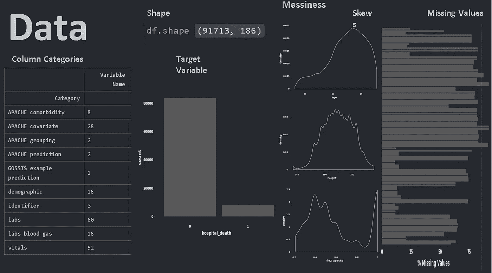

# 电子设计自动化(Electronic Design Automation)

我们的 EDA 开始尝试回答以下问题

*   什么特征对患者的生存影响最大？
*   年龄如何影响患者存活率？
*   不管病情如何，老年患者的风险更高吗？
*   疾病/状况和死亡人数之间是否有很强的相关性？
*   疾病/状况与患者入院和再入院之间是否存在相关性？

我们试图遵循一种思路，即我们手头有什么类型的数据，谁是患者，人口统计数据是什么，哪些患者住院的主要条件是什么，等等。

为了了解我们实际上拥有谁的数据，我们试图沿着人口统计学的路线深入研究。

我们使用**种族和年龄**来钻取数据。从种族饼状图中，我们看到数据集中的大多数人是白种人，其次是非裔美国人。

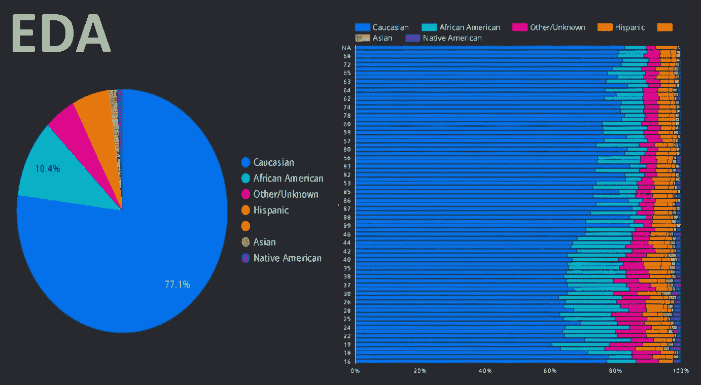

如果我们再增加一个维度——年龄，我们会在柱状图中看到一个有趣的模式。我们看到，特别是对于非裔美国人来说，患者的比例随着年龄的增长而下降。我们看到，年轻的非裔美国患者约占年轻患者总数的 25–30 %,但随着我们在图表中向上移动到老年人口，我们可以看到该比例平均下降到 10%左右。

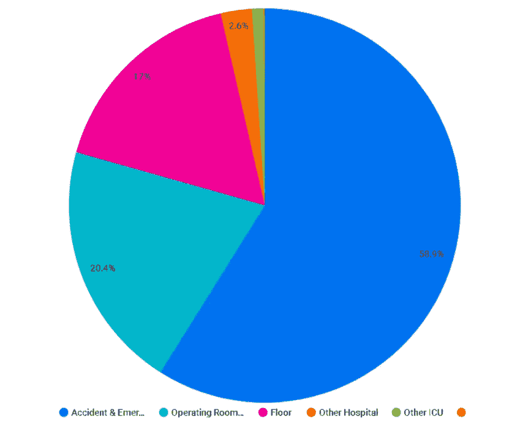

招生来源

看到大多数人因为事故或紧急情况而住进重症监护室。我们想知道在重症监护室通常会看到什么样的病例。为此，我们制作了诊断列的树形图。因为大多数病例是心血管疾病——心脏病发作。我们看到，可能来自车祸或其他事故的神经系统病例、呼吸系统和败血症病例也占了病例的很大一部分

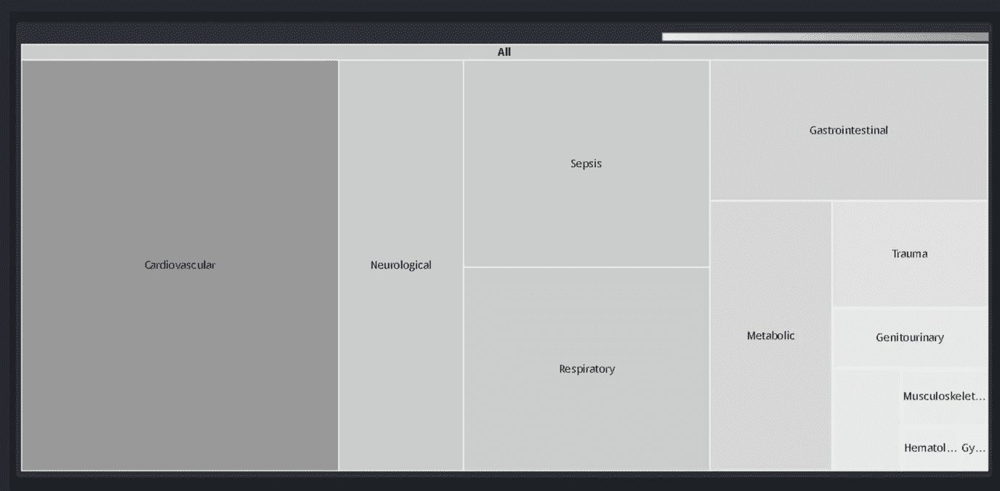

疾病类型

如果我们根据不同的情况进一步分割数据，我们会发现大多数患者患有糖尿病。将致命病例与非致命病例进行比较，我们看到一个有趣的模式——在这两种情况下，疾病的比例不同。尽管糖尿病几乎占非致命病例的 80%,但它仅占致命病例的 60%。肝功能衰竭的比例几乎翻倍，从 5%增加到 10%左右，免疫抑制的比例从 10%左右增加到 15%。

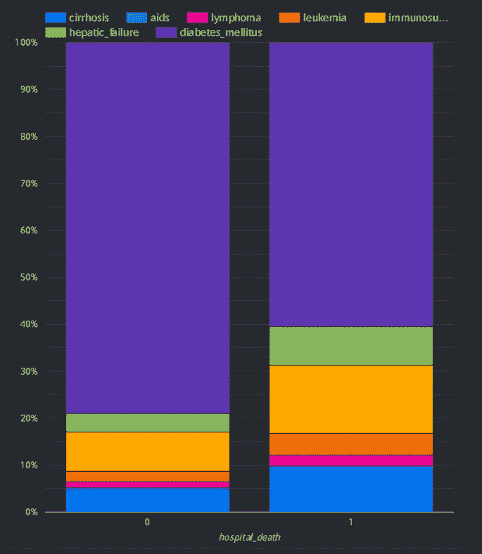

# 数据范围

**箱线图**

使用该图，我们可以比较存活患者(Hospital_death=0)和未存活患者(Hospital_death=1)的各种属性的范围和分布。

**apache_4a_icu_death_prob**

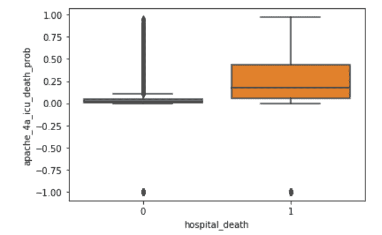

从上面的方框图中，我们可以看到存活和未存活患者的 apache_4a_icu_death_prob 的中位数不同，这意味着住院死亡可能取决于 apache_4a_icu_death_prob

**阿帕奇 _ 4a _ 医院 _ 死亡 _ 问题**

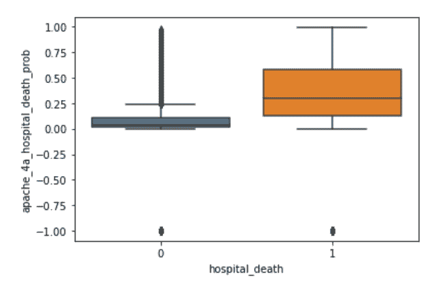

从上面的方框图中，我们可以看到存活和未存活患者的 apache_4a_hospital_death_prob 的中位数不同，这意味着住院死亡可能取决于 apache_4a_hospital_death_prob

# **插补**

由于大部分缺失值属于初始小时观测值(h1 ),并且这些值可以用 d1 中的值来解释，因此 h1_variables 中缺失 50%以上的变量被删除。

我们尝试了许多输入缺失值的方法

**聚类插补**

想法是对观察值进行聚类，然后根据属于同一聚类的观察值，使用指定的聚类来计算值。

clusters = KMeans(n_clusters = 50)。适合(ndf)

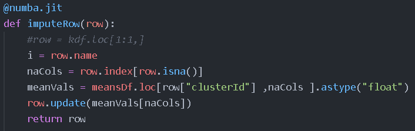

但是这段代码失败了，因为 Sklearn 的 Kmeans 实现都在内存中，因此它需要 13.7 gb 的空间，这是禁止的——因此我们尝试了使用 Dask(并行化)、Numba(编译)和 KD 树(近似)的数字定制实现。还有[小批量方式](https://scikit-learn.org/stable/modules/clustering.html#mini-batch-kmeans)，我们推迟到以后。相反，我们尝试使用 KNN 树和 KD 树进行基于邻居的插补。

**基于邻居的插补**

遵循与集群类似的思路，我们尝试实现 K-nn 实现，但是使用 Dask 和 Numba

**A.** [**Dask 基础**](https://docs.dask.org/en/latest/why.html)

Dask 想出了如何分解大型计算，并有效地将其中的一部分传送到分布式硬件上。Dask 通常运行在千机集群上，在安全的环境中高效地处理数百万亿字节的数据。但更重要的是，Dask 可以让分析师在他们的笔记本电脑上操作 100GB 以上的数据集，或在工作站上操作 1TB 以上的数据集，而完全不需要使用集群。Dask 可以利用多核 CPU 在单台机器上实现高效的并行计算，并从磁盘高效地传输数据

Dask 使用现有的 Python APIs 和数据结构，使得在 Numpy、Pandas、Scikit-learn 和它们基于 Dask 的对等物之间切换变得容易。

在我们的 Dask 应用程序中，想法是允许 Dask 处理分区，并对每个块应用 pairwise_distance 函数。

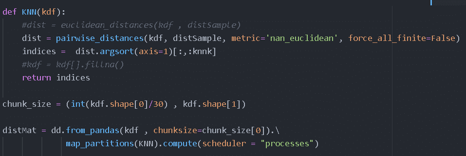

[**B. Numba 基础**](https://github.com/numba/numba)

Numba 是一个针对 Python 的实时编译器，最适合使用 NumPy 数组和函数以及循环的代码。使用 Numba 最常见的方式是通过它的 decoratorss 集合，这些 decorator 可以应用到您的函数中来指示 Numba 编译它们。当一个 Numba 修饰函数被调用时，它会被编译成“实时”执行的机器代码，并且你的全部或部分代码可以以本机代码的速度运行！

在这种方法中，我们希望通过使用 numba 编译来加快每行的计算速度。还尝试使用 [KD 树](https://scikit-learn.org/stable/modules/generated/sklearn.neighbors.KDTree.html)来加速邻居查找，这是近似的，但对于插补来说已经足够好了。

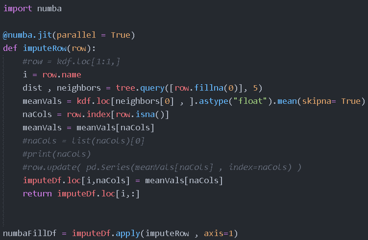

# 吸取的教训

在尝试使用这里提到的先进方法来改善我们的模型 ROC-AUC 评分之前，我们从简单的均值估算开始。

说到底，我们只能说这不值得。我就直接引用 Sklearn 的[关于性能的页面](https://scikit-learn.org/stable/developers/performance.html)

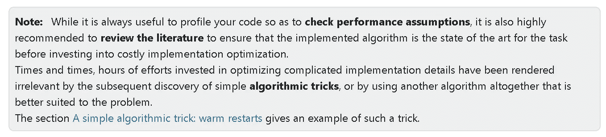

我们尝试的优化并没有真正发挥作用，性能提升也很有限。现在你知道了 3 种方法来处理丢失的值。

最后，我们采用随机森林插补法，并将它们与简单均值和中位数插补法进行对比，总体模型在 ROC-AUC 方面的表现没有太大差异。

有时候简单的事情最终会解决。

如果您有任何建议或反馈，请在 linkedin 上联系我