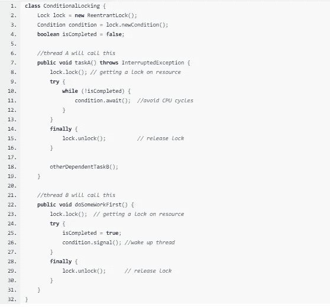
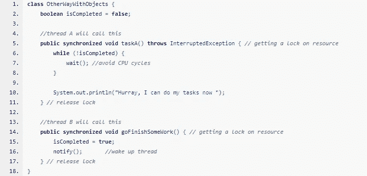

# Java 中的高级锁定:条件锁定、等待、通知和 notifyAll

> 原文：<https://medium.com/analytics-vidhya/advanced-locking-in-java-conditional-locking-wait-notify-and-notifyall-15de8b61edd9?source=collection_archive---------2----------------------->

(使用条件锁定有效控制线程同步)

等待信号

想象一个场景，其中两个线程共享一些资源并执行两个不同的任务。我们希望我们的线程只在另一个线程完成了某项任务 b 之后才执行某项任务 A。
***简而言之，线程在执行任务 A 之前必须检查某些条件是否得到满足。***

# 设计高效的方法:

让我们称我们的线程为信号线程，其他线程为信号线程

## **发出信号的线程:**

1.  需要获取共享资源的锁
2.  等待某个条件满足
    **如果不满足:**
    *a .释放共享资源上的锁
    b .线程必须无限休眠(放弃所有 CPU 周期)直到某个其他线程发出信号让它起床。*
    **如果满足:**
    *a .执行任务
    b .释放共享资源的锁*
3.  如果有其他线程发出信号让它起床。
    T22 a .获取资源的锁
    b .执行任务
    c .释放共享资源的锁

## S信号线程:

获取资源锁
执行前置任务
释放共享资源锁
信号通知其他线程起床

> 似乎太多事要做了？
> Fret Not JAVA 为我们提供了一种优雅的使用条件的方式。

工具

Java 给了我们一些漂亮的方法来实现上面讨论的方法。

# 方法 1:

1.  ***【await():****使当前线程等待，直到它收到信号或被中断，并且与该条件相关联的锁被自动释放。
    同样，当线程返回时，它保证持有这个锁。*
2.  ***signal():****唤醒一个等待线程。(随机选择。)*
3.  ***【signal all():****唤醒所有等待的线程。
    调用 signal 和 signalAll 方法的线程必须锁定资源*

有条件的方法

**预排** *线程 A 连续检查是否满足条件，如果不满足，它将释放资源上的锁，并进入“睡眠”(释放 CPU)[****conditions . await()]****。
当线程 B 命中****condition . signal()****时，它唤醒线程 A(随机)。
现在，如果条件满足，线程 A 可以完成它的工作，否则，对线程 A 重复该过程。*

# 方法 2:

我们可以用对象类的 wait()、notify()和 notifyAll()方法扩展这个思想。由于所有的类都是从对象类派生出来的，我们可以使用上述方法来实现类似的行为。

## 替换语义学

> *锁定- >同步或锁定(此)
> 解锁→ }或解锁(此)
> 等待- >等待
> 信号- >通知
> 通知- >通知全部*

带对象的方法

**预排** *线程 A 连续检查是否满足条件，如果不满足，则释放资源上的锁并进入“睡眠(释放 CPU)****【wait()】****”。
当线程 B 命中****notify()****时，它唤醒线程 A(随机)。
现在，如果条件满足，线程 A 可以完成它的工作，否则，对线程 A 重复该过程。*

你做得很好

## 拿走！！

当线程相互依赖时，条件锁定允许为线程同步创建复杂的锁定契约。

使用条件锁，我们可以根据锁的获取和条件来很好地满足程序的流程。

在这里阅读更多关于并发编程的内容

**Java 中的锁:**[https://medium . com/analytics-vid hya/understanding-Java-thread-synchron ization-with-methods-vs-objects-vs-Locks-5428 e 3342 fee](/analytics-vidhya/understanding-java-thread-synchronization-with-methods-vs-objects-vs-locks-5428e3342fee)

**重入锁:**[https://medium . com/analytics-vid hya/unlock-the-power-of-Reentrant-lock-in-Java-d55ae 9135443](/analytics-vidhya/unlock-the-power-of-reentrant-lock-in-java-d55ae9135443)