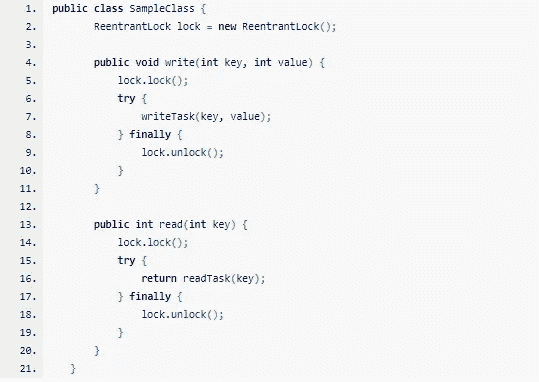
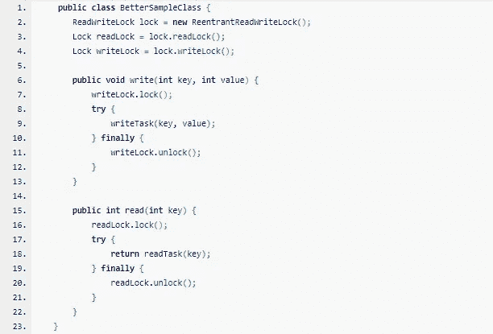

# Java 中的高级锁定:可重入读写锁

> 原文：<https://medium.com/analytics-vidhya/advanced-locking-in-java-reentrant-read-write-lock-b40fce0833de?source=collection_archive---------3----------------------->

(使用读写锁在 Java 中设计高效的分布式数据系统)

锁

# 在一个巨大的数据系统上读写

假设您有一个大型分布式数据库系统，您想在其上执行一些读/写操作。

我们希望事务是原子的和一致的。使用一个线程来执行读写任务将确保系统的稳定性，但速度会受到影响。此外，遍历整个数据库并不容易，需要多次查询才能得到结果。

手术自然需要时间。所以我们将读写任务拆分到多个线程来优化性能。

# 解决这个问题的典型代码

简单溶体

# 简单的 ReentrantLock 方法性能很差

“锁”保护临界区免受并发访问。

*这很好，因为我们不想并行线程进入这个部分，因为它会导致数据不一致。所以我们使用简单的锁来实现多线程之间的并发。*

## 这里什么好？

*这里我们使用一个锁来阻止线程进入临界区。因此，当其中任何一个线程正在写时，它会阻止所有其他线程读取。这种行为没问题。*

## 这里什么不好？

但是当任何一个线程正在读取时，它也阻止所有其他线程读取。
这将导致应用程序变慢，因为大多数读取操作可以共享。

冲突

# 我们能做得更好吗？

*是的，*

*当没有其他线程正在执行写操作时，允许多线程读取。当所有线程都处于读取模式时，没有必要阻塞线程。
但是，当其中一个线程正在写时，阻塞所有其他线程的读写。*

> 在图片中输入 ReentrantReadWriteLock

读写锁

# 一次漫游

我们首先创建一个可重入的读写锁。
然后我们从上面的可重入读写锁创建两个锁对，即读锁和写锁。

## 读取锁定

我们使用读代码的可重入读写锁对中的读锁。之前获取锁，然后在 try 块中调用 read 任务，在 finally 块中释放 read 锁。

当所有同步线程都只使用可重入读写锁对的读锁时，读锁允许多线程在读方法中获取锁。如果任何线程正在使用可重入读写锁对的写锁，则不允许对资源进行读锁。

## 写锁定

我们使用带有写代码的可重入读写锁对中的写锁。之前获取锁，然后在 try 块中调用写任务，在 finally 块中释放写锁。

写锁只允许一个线程在 Write 方法中获取锁。

所有其他同步线程必须等待锁被释放，然后才能获取资源上的读或写锁。

## 拿走！！

ReentrantReadWriteLock 方法确保我们总是拥有共享数据的一致副本。此外，读取和写入既高效又同步。

**在这里阅读更多关于并发编程的内容**

**Java 中的锁:**[https://medium . com/analytics-vid hya/understanding-Java-thread-synchron ization-with-methods-vs-objects-vs-Locks-5428 e 3342 fee](/analytics-vidhya/understanding-java-thread-synchronization-with-methods-vs-objects-vs-locks-5428e3342fee)

**重入锁:**[https://medium . com/analytics-vid hya/unlock-the-power-of-Reentrant-lock-in-Java-d55ae 9135443](/analytics-vidhya/unlock-the-power-of-reentrant-lock-in-java-d55ae9135443)