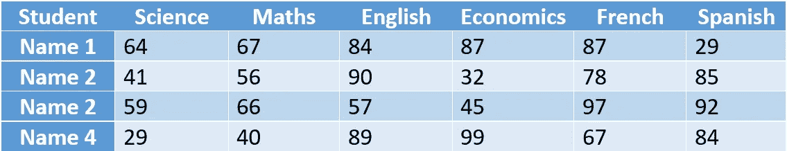

# 数据科学的高级数字

> 原文：<https://medium.com/analytics-vidhya/advanced-numpy-218584c60c63?source=collection_archive---------3----------------------->

## 启动您的数据科学之旅


礼貌-[https://github.com/isabela-pf](https://github.com/isabela-pf)

我们将讨论 NumPy 的一些高级概念，特别是处理实时数据集所需的函数和方法。这里涵盖的概念足以让您开始数据之旅。

要继续下去，你需要知道 NumPy 的基本概念，如果没有，我建议你阅读我的文章“**NumPy-非常基础的**！”第一。你可以在本文末尾找到它的链接。

## 内容

1.  *通用功能*
2.  *聚合*
3.  *广播*
4.  *屏蔽*
5.  *花式索引*
6.  *数组排序*

## NumPy 中的通用函数有哪些？

大多数情况下，我们必须循环遍历数组，对每个数组元素执行简单的计算，如加、减、除等。由于这些都是重复的操作，计算时间会随着相对较大的数据而增加。幸运的是，NumPy 通过使用矢量化运算加快了速度，通常通过 **NumPy 的通用函数(ufuncs)来实现。**我们用一个例子来了解一下。

假设我们有一个 1 到 10 之间的随机整数数组，并且想要得到数组中每个元素的平方。我们用 Python 知识做的是:


这需要大量的时间来编写和计算，尤其是对于真实数据集中的大型数组。让我们看看 ufuncs 是如何让这两种方式都变得更简单的。


只需在数组上执行一个操作，它就会应用到数组中的每个元素。我们注意到**也保留了数据类型**。Ufunc 操作极其灵活。我们也可以在两个数组之间执行操作。


所有这些算术运算都是围绕 NumPy 内置函数的**包装器**。例如，+运算符是 add 函数的包装器。


> 下面是 NumPy 中所有算术运算的汇总表。


NumPy 提供的一些最有用的函数是三角函数、对数函数和指数函数。作为数据科学家，我们应该意识到这一点。这些将在处理真实数据集时派上用场。


## 聚合

作为数据分析师或数据科学家，第一步是探索和理解数据。一种方法是计算汇总统计数据。虽然总结数据最常用的统计方法是**平均值和标准偏差**，但其他总量也是有用的，如总和、乘积、中值、最大值、最小值等。

让我们通过计算总和、最小值和最大值的例子来理解。


对于大多数 NumPy 集合，简化的语法是使用数组对象的方法，而不是函数。上述操作也可以如下所示执行，这在计算上没有区别。


> **重要提示**-Python 集合函数和 NumPy 集合函数的区别

您可以提出的一个问题是，当这些函数已经内置在 Python 中时，为什么还要使用 NumPy 聚合函数(sum()、min()、max()等)。当然，区别在于 NumPy 函数要快得多，但更重要的是 **NumPy 函数知道维度。** Python 函数在多维数组上表现不同。

假设我们想得到一个大小为 2x5 的数组中的所有元素。为了更好地理解，我们将从 0 到 9 取一个简单的数字数组。


我们期望输出是 45 (0+1+2+3+4+5+6+7+8+9 ),但是结果非常出乎意料。这类结果在汇总数据时会花费很多。因此，在处理数组时，一定要确保使用聚合函数的 NumPy 版本。

> 多维聚合体

一种常见的操作类型是沿行和列聚合。因为 NumPy 函数知道维度，所以这样做更容易，例如，每行和每列中的最小值。函数接受一个额外的参数，该参数指定我们希望执行聚合的轴。

假设我们有一个学生分数表，每一列代表一个不同的主题。我们希望找到每个科目的最低和最高分数以及每个学生的总分。**‘axis = 0’指定按列操作，而‘axis = 1’指定按行操作。**结果将是一个一维数组。



> NumPy 的其他聚合函数

np.prod，np.mean，np.std，np.var，np.argmin(查找最小值的索引)，np.argmax(查找最大值的索引)，np.median，np.percentile(计算基于秩的元素统计)。

## 广播

一开始我们已经看到了 NumPy 通用函数。广播是应用 ufuncs 的另一种方式，但是是在不同大小的阵列上。广播只不过是 NumPy 应用于**在不同大小的数组**上执行 unfuncs 的一组规则。

考虑添加两个 3x3 和 1x3 大小的数组。就我们的理解而言，我们可以将这种操作视为拉伸或广播较小的数组以匹配较大数组的大小。这个数组的拉伸实际上并没有发生，这只是为了更好的理解。


当两个阵列都需要广播时，混乱和复杂性增加。


《Python 数据科学手册》一书的作者 Jake VanderPlas 提供了极好的可视化来解释这一过程。浅色框表示拉伸的值。


Source-Python for data science 手册

> 3 广播规则

以上是逻辑想象理解。我们将结合实例探讨理论规律。

示例 1:

```
*m = np.arange(3).reshape((3,1))
n = np.arange(3)
m.shape = (3, 1)
n.shape = (3,)****By rule 1, if two arrays differ in their shape the array with lesser shape should be padded with ‘1’ on its left side. Padding is done only of left side****m.shape => (3, 1)
n.shape => (1, 3)****By rule 2, if still the shape of two arrays do not match then each array whose dimension is equal to 1 should be broadcasted to match the shape of other array.****m.shape => (3, 3)
n.shape => (3, 3)*
```

强调规则 2，它说只有当数组的一个维度的值为 1 时，我们才能拉伸数组。对于 1 以外的维值，我们不能这样做。让我们看一个例子，在应用规则 2 的过程中，数组形状的维数将不同于 1。

示例 2:

```
*m = np.arange(3).reshape((3,2))
n = np.arange(3)
m.shape = (3, 1)
n.shape = (3,)****By rule 1,****m.shape => (3, 2)
n.shape => (1, 3)****By rule 2,****m.shape => (3, 2)
n.shape => (3, 3)* ***Note: we can streatch only when value is 1.******By rule 3, if shapes of both arrays disagree and any dimension of neither array is 1 then an error should be raised.***
```

## 掩饰

屏蔽是数据处理中广泛使用的一种方法。它允许我们提取，计数，修改或操作基于特定标准的数组中的值，这些标准是使用比较运算符和布尔运算符指定的。

假设我们有一个大小为(3，4)的二维数组，我们希望得到数组中值小于 5 的子集。


> 我们来分解一下

我们使用了一个比较运算符'


When we say x[x<5], the above returned boolean values are applied on original array x resulting to return the elements of the array whose indices are True, eventually values less than 5\. Similar way we can use all the comparison or boolean operators available in Python. We can even combine two operations say **x[(x>3)&(x<6)]【T1]来获取 3 和 6 之间的值，只是运算的结果应该是布尔型的。注意，这里我们使用了按位运算符'&'，而不是关键字' and '。**

> **还记得**吗
> 
> 关键字“and”和“or”对整个数组执行单个布尔运算，而按位“&”和“|”对数组的元素执行多个布尔运算。**屏蔽时始终使用逐位运算符。**

## 花式索引

正如我们已经知道的，花式索引类似于普通索引。唯一的区别是我们在这里传递了一个索引数组。这种高级版本的索引允许快速访问和/或修改数组的复杂子集。

假设我们想要访问一个数组的索引 2、5 和 9 处的元素，旧的方法应该是[x[2]，x[5]，x[9]]。这可以用有趣的索引来简化。


同样，我们可以想象索引二维数组。我们来看看花式索引中 x[0，2]，x[1，3]和 x[2，1]的等价运算。


如果行或列值是常数，这可以进一步简化。假设我们想得到索引 x[2，1]，x[2，3]和 x[2，4]处的值。下面的黄色突出显示用于行值，蓝色用于列值。类似地，我们也可以通过赋值操作符' = '使用花哨的索引来修改值。


## 数组排序

np.sort 是一个比 Python 内置排序函数更高效的排序函数。另外， **np.sort 知道维度**。让我们看看 NumPy 排序函数的几种风格。


注意，当我们使用 sort()方法时，它改变了数组 x 本身的值。意思是，数组 x 的原始顺序丢失了。叫做**原地排序**。


由[凯利·西克玛](https://unsplash.com/@kellysikkema?utm_source=medium&utm_medium=referral)在 [Unsplash](https://unsplash.com?utm_source=medium&utm_medium=referral) 上拍摄的照片

虽然这些不是 NumPy 的唯一概念，但我还是设法涵盖了所有关键的和必须知道的概念。这对于数据科学入门来说显然绰绰有余。由于 Python 是开源的，许多函数会定期添加和删减。时刻关注 [NumPy 的官方文档](https://numpy.org/doc/stable/)。我还会确保在需要时不断更新内容。

如果你在理解这些概念时遇到困难，请先阅读下面的文章。

[](/analytics-vidhya/numpy-the-very-basics-6ce19206ee22) [## NumPy -最基本的！

### 这篇文章是为那些对 NumPy 一无所知的人写的，这样他们就可以掌握一些入门知识。

medium.com](/analytics-vidhya/numpy-the-very-basics-6ce19206ee22) 

让我们连接

[](https://www.linkedin.com/in/sujan-shirol/) [## Sujan Shirol -技术作家- Python 开发者| LinkedIn

### 查看 Sujan Shirol 在世界上最大的职业社区 LinkedIn 上的个人资料。Sujan 有两个工作列在他们的…

www.linkedin.com](https://www.linkedin.com/in/sujan-shirol/)