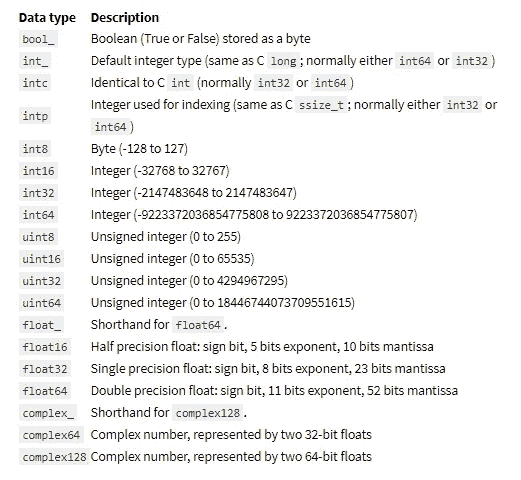
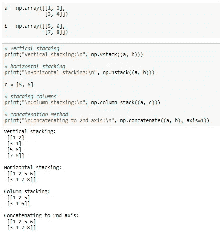
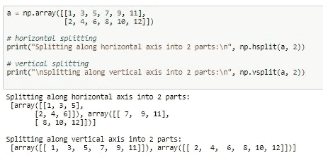
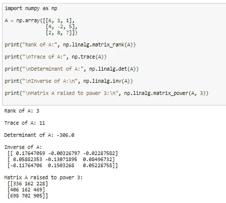
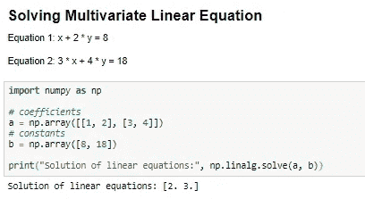

# 先进的 NumPy:为独创性做好准备！

> 原文：<https://medium.com/analytics-vidhya/advanced-numpy-brace-yourself-for-ingenuity-8fc6b879e707?source=collection_archive---------23----------------------->

好奇心是一种传染性极强的精神疾病，它会以一种不可想象的、前所未有的方式打击一颗好奇的心。也许，这正是我们发现新的直观方法来实现神经网络，使数据从业者、科学家、分析师和工程师的生活更容易的原因。我们中的许多人一直在使用其庞大的海洋知识库中的大量 python 包来满足我们日常的数据科学需求。但是，你有没有感觉被困在冰山的一角，从而被你的工作描述的范围所束缚，甚至从来没有费心去探索这些软件包整体提供的功能或属性的未知领域。嗯，我们大多数人都会同意这一点，从来没有努力钻研更深。有趣的是，我发现自己在这些动荡的环境中有充足的时间做一些功课，带着纯粹的乐趣，但无意中发现了一些功利主义的宝石。

礼貌:谷歌

## 到底什么是 **NumPy** :

人们总是建议从基本定义开始，以增加受众，所以这里是:

*NumPy 是一个通用的数组处理包。它提供了一个高性能的多维数组对象，以及处理这些数组的工具。它是使用 Python 进行科学计算的基础包。除了其明显的科学用途，NumPy 还可以用作通用数据的高效多维容器。使用 NumPy 可以定义任意数据类型，这使得 Numpy 可以无缝、快速地与各种数据库集成。* ( [来源](https://www.geeksforgeeks.org/numpy-in-python-set-1-introduction/))

强烈建议事先具备 NumPy 的基本专业知识，以便以最佳方式理解以下内容:

1.  **数据类型转换**

NumPy 默认任何带有“ *int32* ”的整数数组，只要遵守数字范围，用户可以在方便的时候修改。有趣的是，python 支持以下各种数据类型，在处理重要的原始数据集时，这些数据类型可以为我们节省时间。

NumPy 数据类型

一个简单的代码遍历很好地反映了这一点。

数据类型转换

**2。堆叠数字阵列**

我们甚至可以考虑将堆叠作为一种选择，用简单的效用函数在任何给定的维度上扩充我们的 NumPy 数组。

数字堆叠

**3。拆分 NumPy 数组**

这用于将大型多维 NumPy 数组分解成小的组合部分，以便对其组成部分执行线性算术运算。

数字分裂

**4。线性代数解算器**

线性代数是 NumPy 的核心功能之一，统计学家经常使用它来解决大型数组上的复杂任务。有时发现以下情况会很有帮助:

*   秩、行列式、迹等。数组的。
*   矩阵的特征值
*   矩阵和矢量积(点、内、外等。乘积)、矩阵求幂
*   解决线性或张量方程和更多！

线性代数一瞥

**5。求解多元线性方程组**

显然，您甚至可以使用 NumPy 作为 MATLAB 的一个安全、轻量级的替代版本来求解包含多个变量的线性组合的方程。类似的例子如下所示:

求解二元一次方程

# **结论**

这些高级的 NumPy 实用程序可以通过各种方式来服务于我们的数据建模或数据分析目的。对挖掘和深入挖掘的不懈追求仍在继续，更多有趣的发现将在我的技术博客的未来版本中揭示和分享。

用掌声表达你的感激之情，并不断分享，因为学习永无止境。敬请关注我在 [*Medium*](/@Immaculate_sha2nk) *，* [*脸书*](https://www.facebook.com/TheSha2nk) *，*[*Twitter*](https://twitter.com/TheSha2nk)*和*[*GitHub*](https://github.com/Shashank545)*的工作。*

*！！保持好奇！保持专注！继续读！！*