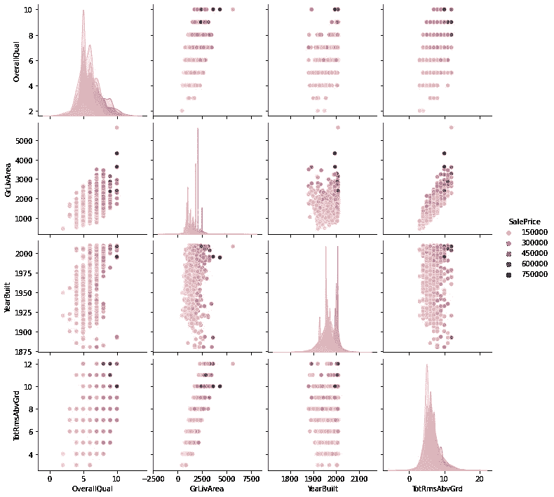
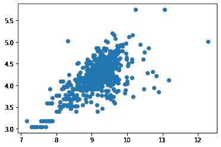
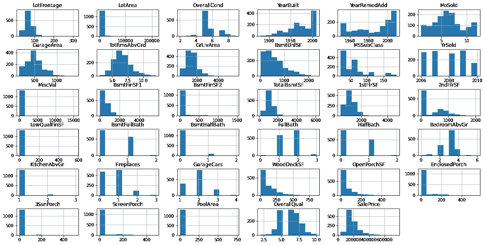
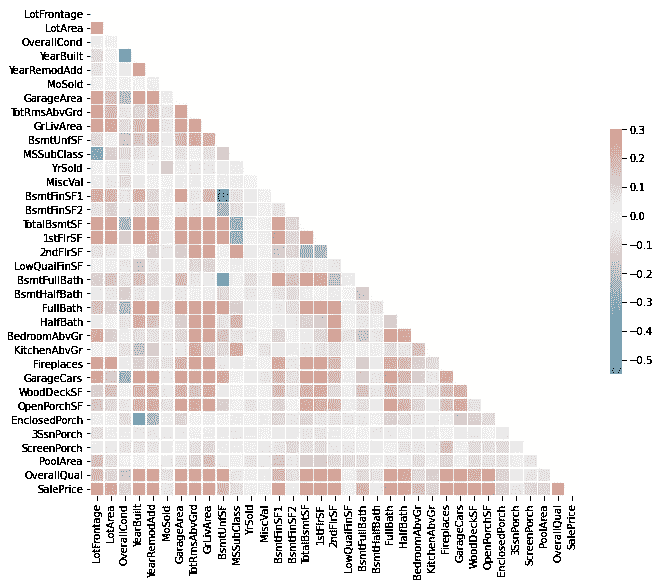
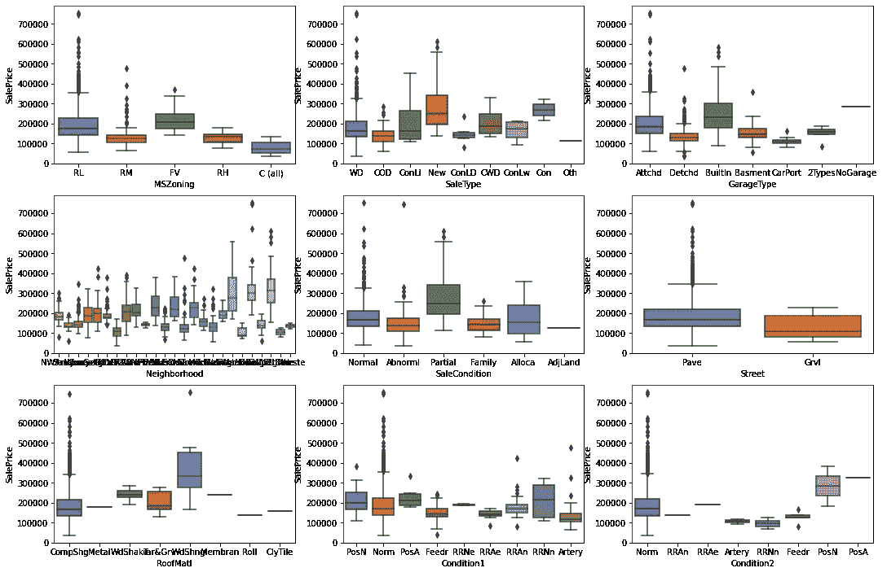
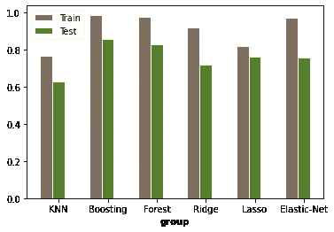

# 用 Python 预测房价的高级回归技术

> 原文：<https://medium.com/analytics-vidhya/advanced-regression-techniques-to-predict-home-prices-with-python-86caa9e0861d?source=collection_archive---------5----------------------->

## 这是一个教程，面向那些对 Python 有一些经验的数据科学学生和房地产经纪人，他们希望了解你所在地区的房价。


房地产经纪人可能需要一辈子的经验才能感觉到房子会卖多少钱。很多时候，经验不足的卖家或买家可能会错过一些对老手来说显而易见的东西。

在这个练习中，我将尝试从描述住宅各个方面的 79 个解释变量中梳理出几个在预测房屋最终销售价格时最重要的变量。



我们的最终产品。销售价格最重要的特点。

在很大程度上，结果正如我们所料，较大的新房子或最近装修的房子卖得更多。但是如果有太多的卧室，或者有一个以上的壁炉有什么关系呢？了解最重要的特征和它们的限制对房地产市场中的任何人都很重要，通过遵循这些步骤，你将能够分析你的财产，看看它应该落在哪里，以避免要求或花费太多。

# 数据集

这个数据集来自爱荷华州[Kaggle Ames](https://www.kaggle.com/c/house-prices-advanced-regression-techniques)竞赛，但是所有的技术同样适用于任何数量的观察或特征。

# I .加载和清理数据

```
# Import packages and load the full dataset%matplotlib inline
import warnings
import numpy as np
import pandas as pd
import seaborn as sea
import matplotlib.pyplot as plt
from sklearn.impute import SimpleImputer
from sklearn import datasets, linear_model
from sklearn.linear_model import LogisticRegression
from sklearn.model_selection import train_test_split, GridSearchCV
from sklearn.linear_model import LinearRegression, Ridge, Lasso, ElasticNet
from sklearn.ensemble import RandomForestRegressor, GradientBoostingRegressor
from sklearn.neighbors import KNeighborsRegressor# Ignore the warnings
warnings.filterwarnings('ignore')# Load the data
train = pd.read_csv('train.csv')
```

# 检查丢失的数据

```
# Check missingness:
missingData = train.isnull().mean(axis=0)# remove is greater than 30%
# index and gives the column names
missingIndex = missingData[missingData>0.3].index
missingIndex# Make a working copy of the data
workingDf = train.copy()
workingDf.isna().sum().loc[workingDf.isna().sum()>0].sort_values()
```

将输出任何缺失数据的要素。

```
Index(['Alley', 'FireplaceQu', 'PoolQC', 'Fence', 'MiscFeature'], dtype='object')Electrical         1
MasVnrType         8
MasVnrArea         8
BsmtQual          37
BsmtCond          37
BsmtFinType1      37
BsmtExposure      38
BsmtFinType2      38
GarageCond        81
GarageQual        81
GarageFinish      81
GarageType        81
GarageYrBlt       81
LotFrontage      259
FireplaceQu      690
Fence           1179
Alley           1369
MiscFeature     1406
PoolQC          1453
dtype: int64
```

许多丢失的数据往往只是因为没有游泳池或壁炉或其他什么东西，所以我们可以用 0 或“没有游泳池”或其他任何特性来替换 NULL。对每个特性都这样做，如下所示:

```
*#Remove NA from PoolQC*workingDf.loc[pd.Series(workingDf.PoolQC.isna()), 'PoolQC'] **=** 'NoPool'
```

某些要素可能高度相关，并具有缺失值。用散点图之类的东西检查与您可能怀疑的特征的相关性。例如，LotFrontage 缺少很多数据，但我猜它与总 LotArea 相关。

```
*# Compare frontage to lot area!*lotFrontageByArea **=** workingDf[['LotFrontage', 'LotArea']]plt.scatter(np.log(workingDf['LotArea']), np.log(workingDf['LotFrontage']))
```



看起来高度相关

现在，要填充相关要素中的缺失数据，我们可以制作两者的模型，将它们分为缺失和非缺失，然后预测缺失值并重新组合！

```
**from** sklearn.impute **import** SimpleImputer
**from** sklearn.linear_model **import** LinearRegression, Ridge, Lasso, ElasticNetlotByAreaModel **=** linear_model.LinearRegression()
lotByAreaModel.fit(lotFrontageNoNa[['LotArea']], lotFrontageNoNa.LotFrontage)*#Spint into missing and not missing* workingDfFrontageNas **=** workingDf[workingDf.LotFrontage.isna()]
workingDfFrontageNoNas **=** workingDf[**~**workingDf.LotFrontage.isna()]*# Must use Data frame* workingDfFrontageNas.LotFrontage **=** lotByAreaModel.predict(workingDfFrontageNas[['LotArea']])*# Must concat a list!!!* workingDfImputedFrontage **=** pd.concat([workingDfFrontageNas, workingDfFrontageNoNas], axis **=** 0)
```

接下来，您需要对分类特征进行虚拟化。在某些情况下，这可能会使我们的数据集非常“宽”，但对于我们将使用的大多数回归来说，这是可以的。

```
*# Now Dummify to, workingDummies* workingDummies **=** workingClean.copy()
workingDummies **=** pd.get_dummies(workingDummies)
print(workingDummies.shape)
workingDummies.head()print(workingDummies.isna().sum().loc[workingDummies.isna().sum()**>**0].sort_values(ascending**=False**))
```

确保您没有 NA 值。

```
*# Replace NAs in Dummies Set with 0*print(workingDummies.isna().sum().loc[workingDummies.isna().sum()**>**0].sort_values(ascending**=False**))
```

将数据分为训练集和测试集:

```
*#split feature and salePrice* salePriceClean **=** workingClean.SalePrice
homeFeaturesClean **=** workingClean.copy().drop("SalePrice",axis**=**1)
salePriceDummies **=** workingDummies.SalePrice
homeFeaturesDummies**=**workingDummies.copy().drop("SalePrice",axis**=**1)
```

现在，对于 EDA，我们将分别可视化连续和分类特征。首先，这里是如何为所有数值制作一个直方图网格。

```
*# Split into contious and Categorical*workingNumeric **=** workingClean[['GarageYrBlt', 'LotFrontage', 'LotArea', 'OverallCond', 'YearBuilt', 'YearRemodAdd',  'MoSold', 'GarageArea', 'TotRmsAbvGrd', 'GrLivArea', 'BsmtUnfSF', 'MSSubClass', 'YrSold', 'MiscVal', 'BsmtFinSF1', 'BsmtFinSF2', 'TotalBsmtSF', '1stFlrSF', '2ndFlrSF', 'LowQualFinSF', 'BsmtFullBath','BsmtHalfBath', 'FullBath', 'HalfBath', 'BedroomAbvGr', 'KitchenAbvGr', 'Fireplaces', 'GarageCars', 'WoodDeckSF', 'OpenPorchSF','EnclosedPorch', '3SsnPorch', 'ScreenPorch', 'PoolArea', 'OverallQual', 'MasVnrArea']]
workingNumeric['SalePrice'] **=** salePriceClean
```

现在，用 plt 绘图。

```
​fig **=** plt.figure(figsize**=**[20,10])*# get current axis = gca* ax **=** fig.gca()*# We here will apply to the last one described...* workingNumeric.hist(ax **=** ax)plt.subplots_adjust(hspace**=**0.5)
```



然后，我们可以查看这些相同特征的关联热图:

```
rs **=** workingNumeric
d **=** pd.DataFrame(data**=**workingNumeric, columns**=**list(workingNumeric.columns))*# Compute the correlation matrix* corr **=** d.corr()*# Generate a mask for the upper triangle* mask **=** np.triu(np.ones_like(corr, dtype**=**bool))*# Set up the matplotlib figure* f, ax **=** plt.subplots(figsize**=**(11, 9))*# Generate a custom diverging colormap* cmap **=** sea.diverging_palette(230, 20, as_cmap**=True**)*# Draw the heatmap with the mask and correct aspect ratio* sea.heatmap(corr, mask**=**mask, cmap**=**cmap, vmax**=**.3, center**=**0,
square**=True**, linewidths**=**.5, cbar_kws**=**{"shrink": .5})
```



接下来，我们用 Python 为所有分类特征生成一个条形图网格。不幸的是，我们不像 boxplot 代码，我们需要单独生成每个图，并将它们放在图中，我在这里只显示前几个图的代码。

```
fig, axes **=** plt.subplots(13, 3, figsize**=**(18, 55))sea.boxplot(ax**=**axes[0, 0], data**=**workingCategorical, x**=**'MSZoning', y**=**'SalePrice')sea.boxplot(ax**=**axes[0, 1], data**=**workingCategorical, x**=**'SaleType', y**=**'SalePrice')sea.boxplot(ax**=**axes[0, 2], data**=**workingCategorical, x**=**'GarageType', y**=**'SalePrice')
```



最后，到我们的模型建筑。在这里，我将展示如何用虚拟数据集做几个回归模型，哪一个的结果是最好的，以及我们如何使用这些信息。

第一，KNN 模型使用网格搜索寻找最佳参数(α):

1

```
*#KNN* knn_model **=** KNeighborsRegressor()
param_grid **=** {'n_neighbors':np.arange(5, 200, 5)}
gsModelTrain **=** GridSearchCV(estimator **=** knn_model, param_grid **=** param_grid, cv**=**2)
gsModelTrain.fit(featuresDummiesTrain, priceDummiesTrain)
knn_model.set_params(******gsModelTrain.best_params_)*#fit to train data* knn_model.fit(featuresDummiesTrain, priceDummiesTrain)*#Get scores comparing real house prices and predicted house prices from the test dataset.* print("r2 Test score:", r2_score(priceDummiesTest, knn_model.predict(featuresDummiesTest)))print("r2 Train score:", r2_score(priceDummiesTrain, knn_model.predict(featuresDummiesTrain)))trainRMSE **=** np.sqrt(mean_squared_error(y_true**=**priceDummiesTrain, y_pred**=**knn_model.predict(featuresDummiesTrain)))testRMSE **=** np.sqrt(mean_squared_error(y_true**=**priceDummiesTest, y_pred**=**knn_model.predict(featuresDummiesTest)))print("Train RMSE:", trainRMSE)
print("Test RMSE:", testRMSE)
```

结果！

```
​r2 Test score: 0.6307760069201898
r2 Train score: 0.7662448448900541
Train RMSE: 37918.53459536937
Test RMSE: 48967.481488778656
```

现在，对 Ridge()、Lasso、RandomForrest 做同样的事情，但是改变优化的参数。以下是我的最终结果:



我们看到随机森林或 boosting 模型是最好的，因此接下来我们从该模型中获取最重要的特征，如下所示:

```
rfModel.feature_importances_
feature_importances **=** pd.DataFrame(rfModel.feature_importances_,
index **=** featuresDummiesTrain.columns,
columns**=**['importance']).sort_values('importance',ascending**=False**)pd.set_option("display.max_rows",**None**,"display.max_columns",**None**)print(feature_importances)feature_importances.index[:10]
```

这就是我们如何使用 Python 获得该模型中最重要特性的列表！

```
​importance
OverallQual              5.559609e-01
GrLivArea                9.929112e-02
TotalBsmtSF              4.050054e-02
1stFlrSF                 3.604577e-02
TotRmsAbvGrd             2.772576e-02
FullBath                 2.693519e-02
BsmtFinSF1               2.064975e-02
GarageCars               1.915783e-02
2ndFlrSF                 1.753713e-02
GarageArea               1.748563e-02
LotArea                  1.219073e-02
YearBuilt                1.075511e-02
LotFrontage              7.270100e-03
YearRemodAdd             7.038709e-03
BsmtQual_Ex              5.726935e-03
OpenPorchSF              4.677578e-03
BsmtUnfSF                4.245650e-03
MoSold                   3.397142e-03
OverallCond              3.180477e-03
WoodDeckSF               2.865491e-03
KitchenQual_Gd           2.692117e-03
ExterQual_Ex             2.253200e-03
GarageType_Detchd        1.832978e-03
MSSubClass               1.808349e-03
BsmtFullBath             1.791505e-03
MSZoning_RM              1.781576e-03
ScreenPorch              1.679301e-03
YrSold                   1.664580e-03
BsmtExposure_No          1.533721e-03
GarageFinish_Unf         1.514469e-03
MasVnrArea_1170.0        1.431316e-03
```

所以现在我们知道房子的整体质量和大小是非常重要的，但是我们基本上可以忽略一些东西，比如一个完工的车库，或者它是否在门廊上安装了纱窗！

您可以使用同一系统评估具有任意数量特征的任何本国数据。我们在这里的大收获是，列表底部的所有特征都可以安全地忽略，所以如果你在出售或定价房屋，大多数时候甚至没有理由考虑它们。

> 快乐找房子，谢谢你！