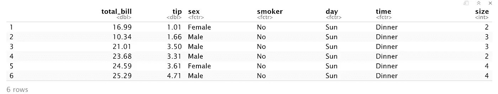
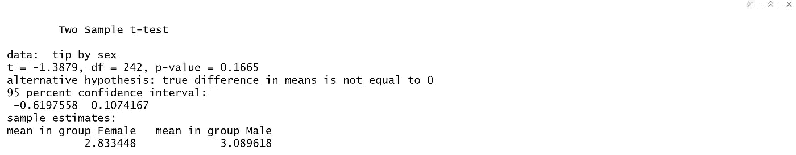

# 使用 R-6 的高级统计

> 原文：<https://medium.com/analytics-vidhya/advanced-statistics-using-r-6-2789539a0167?source=collection_archive---------10----------------------->

> *如果您还没有阅读 R 数据分析系列的第 5 部分，请阅读下面的文章，其中我们讨论了* [*使用 R-5*](/analytics-vidhya/introduction-to-statistics-using-r-5-4c049ff7abf3)*进行统计的介绍。*
> 
> 这篇文章的内容是我在 IIM-B 时代得到的几本书的要点。
> 
> *人人有责——贾里德·p·兰德*
> 
> *实用数据科学与 R —妮娜·祖梅尔&约翰·芒特*
> 
> *文中讨论的所有代码块都以 R markdown 的形式出现在* [*Github 链接*](https://github.com/viveksrinivasanss/Data_Science_Using_R) *中。*
> 
> *要看我写的所有文章请使用链接，*[*Vivek Srinivasan*](/@viveksrinivasan)*。*


在传统的统计课上，威廉·戈塞特在吉尼斯啤酒厂工作时发明的“T0”被用来测试数据的平均值或比较两组数据。为了说明这一点，我们继续使用来自`ggplot2`的`tips` 数据。

```
data(tips,package="reshape2")
head(tips)
```



## 单样本 T 检验

首先，我们对平均小费是否等于`$2.50`进行单样本 t 检验。这种测试本质上是计算数据的平均值并建立一个置信区间。如果我们测试的值落在置信区间内，那么我们可以得出结论，它是数据平均值的真实值；否则，我们断定它不是真实的意思。

```
t.test(tips$tip, alternative="two.sided", mu=2.50)
```


零假设被认为是真的；在这种情况下，平均值等于`$2.50`。输出非常好地显示了均值是否等于`$2.50`的假设测试的设置和结果。它打印出`t-statistic`，自由度和`p-value`。它还为感兴趣的变量提供了 95%的`confidence interval`和`mean` 。`p-value`表示应该拒绝零假设，我们得出均值不等于`$2.50`的结论。

我们在这里遇到了一些新概念。`t-statistic`是比率，其中分子是估计平均值和假设平均值之间的差值，分母是估计平均值的标准误差。它在等式中定义


如果假设的平均值是正确的，那么我们期望 t 统计量落在中间的某个地方，大约是平均值的两个标准差。在下图中，我们看到代表估计平均值的黑色粗线远远落在分布之外，因此我们必须得出平均值不等于`$2.50`的结论。

```
## build a t distribution
randT <- rt(30000, df=NROW(tips)-1)## get t-statistic and other information
tipTTest <- t.test(tips$tip, alternative="two.sided", mu=2.50)## Plot it
library(ggplot2)
ggplot(data.frame(x=randT)) +
     geom_density(aes(x=x), fill="grey", color="grey") +
     geom_vline(xintercept=tipTTest$statistic) +
     geom_vline(xintercept=mean(randT) + c(-2, 2)*sd(randT), linetype=2)
```


tip 数据的 t 分布和 t 统计。虚线是两个方向平均值的标准偏差。粗黑线，t 统计量，远远超出了分布，我们必须拒绝零假设，并得出结论，真正的平均值不是 2.50 美元。

`p-value`是一个经常被误解的概念。尽管有所有的误解，如果零假设是正确的，一个`p-value`是一个概率，得到一个极端的，或者更极端的结果。这是对统计数据(在这种情况下是估计平均值)极端程度的一种度量。如果统计数据过于极端，我们的结论是应该拒绝零假设。

然而，`p-values`的主要问题是确定什么应该被认为是过于极端。现代统计学之父罗纳德·a·费舍尔(Ronald A. Fisher)认为，我们应该认为小于 0.10、0.05 或 0.01 的`p-value`过于极端。虽然那些`p-values` 已经是几十年来的标准，但它们是随意选择的，导致一些现代数据科学家质疑它们的实用性。在本例中，p 值为 5.0799885×108；这小于 0.01，所以我们拒绝零假设。

`Degrees of freedom`是另一个难以理解的概念，但在整个统计中普遍存在。它代表有效的观察次数。通常，某些统计或分布的`degrees of freedom` 是观察值的数量减去被估计的参数的数量。在`t-distribution`的情况下，正在估计一个参数，即标准误差。在这个例子中，有`nrow(tips)-1=243`个自由度。

接下来，我们进行单侧 t 检验，看看平均值是否大于 2.50 美元。

```
t.test(tips$tip, alternative="greater", mu=2.50)
```


p 值再次表明，我们应该拒绝零假设，并得出均值大于 2.50 美元的结论，这与置信区间非常吻合。

## 双样本 T 检验

t 检验通常用于比较两个样本。继续小费的数据，我们比较女性和男性食客如何给小费。然而，在运行 t 检验之前，我们首先需要检查每个样本的方差。传统的 t 检验要求两组具有相同的方差，而 Welch 双样本 t 检验可以处理具有不同方差的组。

为了检查两组是否有相同的方差，我们可以使用标准的 `F-test`(通过`var.test`函数)或`Bartlett test`(通过`bartlett.test`函数)。但是数据应该遵循一个`normal`分布来执行上述测试。我们将探究两组在数字和视觉上有相同的差异。

```
## Normality test
shapiro.test(tips$tip)## Normality test for female
shapiro.test(tips$tip[tips$sex == "Female"])## Normality test for male
shapiro.test(tips$tip[tips$sex == "Male"])
```


所有的数值试验清楚地表明，数据不是正态分布的。所以我们不能用`standard F-test or Bartlett-test`来检验方差的相等性。我们还可以直观地检查数据是否呈正态分布，如下所示。即使目测也表明数据不是正态分布的。

```
# all the tests fail so inspect visually
ggplot(tips, aes(x=tip, fill=sex)) + geom_histogram(binwidth=.5, alpha=1/2)
```


由于数据不是正态分布的，我们可以使用非参数的`Ansari-Bradley`检验来检验方差的相等性。


这个测试表明方差相等，这意味着我们可以使用标准的`two-sample t-test`。

```
t.test(tip ~ sex, data=tips, var.equal=TRUE)
```



根据这个测试，结果并不显著，我们可以得出结论，男女食客给的小费大致相等。虽然所有这些统计上的严格性很好，但一个简单的经验法则是看这两个平均值是否在彼此的两个标准差之内。像往常一样，我们更喜欢可视化的结果，而不是比较数值。这需要对数据进行一点改造。

```
library(plyr)
tipSummary <- ddply(tips, "sex", summarize,
          tip.mean=mean(tip), tip.sd=sd(tip),
          Lower=tip.mean - 2*tip.sd/sqrt(NROW(tip)),
          Upper=tip.mean + 2*tip.sd/sqrt(NROW(tip)))
tipSummary
```


这段代码中发生了很多事情。首先，`ddply`用于根据性别水平分割数据。然后，它将 summarize 函数应用于数据的每个子集。该函数将指定的函数应用于数据，创建一个新的`data.frame`。

```
ggplot(tipSummary, aes(x=tip.mean, y=sex)) + geom_point() +          geom_errorbarh(aes(xmin=Lower, xmax=Upper), height=.2)
```


结果清楚地显示置信区间重叠，表明两种性别的平均值大致相等。

## 配对双样本 T 检验

对于检验配对数据(例如，双胞胎的测量值、治疗前后的效果、父子比较)，应使用配对 t 检验。这很简单，只需将`t.test`中的成对参数设置为`TRUE`即可。为了说明这一点，我们使用了卡尔·皮尔逊收集的位于`UsingR`包中的父亲和儿子的身高数据。身高通常是分布的，所以我们将放弃正态性和等方差的测试。

```
data(father.son, package='UsingR')
head(father.son)
```


```
t.test(father.son$fheight, father.son$sheight, paired=TRUE)
```


这个测试表明，我们应该拒绝零假设，并得出结论，父亲和儿子(至少对于这个数据集)有不同的高度。我们使用差异的密度图来显示这些数据，如图所示。我们看到一个均值不为零的分布和一个几乎不排除零的置信区间，这与测试结果一致。

```
heightDiff <- father.son$fheight - father.son$sheight
ggplot(father.son, aes(x=fheight - sheight)) +
    geom_density() +
    geom_vline(xintercept=mean(heightDiff)) +
    geom_vline(xintercept=mean(heightDiff) + 2*c(-1, 1)*sd(heightDiff)/sqrt(nrow(father.son)),linetype=2)
```


## 方差分析

在比较了两组之后，下一步自然是比较多组。每年，有太多的统计学导论课的学生被迫学习`ANOVA`(方差分析)测试并记住它的公式


这不仅是一个费力的公式，常常使许多学生对统计学失去兴趣；这也是一种比较群体的老式方法。尽管如此，还是有一个 R 函数——尽管很少使用——来进行`ANOVA` 测试。这也使用公式界面，其中左侧是感兴趣的变量，右侧包含控制分组的变量。为了看到这一点，我们用级别`Fri, Sat, Sun, Thur`来比较一周中每一天的提示。

```
tipAnova <- aov(tip ~ day - 1, tips)
tipAnova
```


`ANOVA`测试任何组是否不同于任何其他组，但它不指定哪个组不同。所以打印测试的总结只会返回一个`p-value`。由于测试有一个显著的`p-value`，我们想看看哪个组与其他组不同。

```
tipsByDay <- ddply(tips, "day", plyr::summarize,
                    tip.mean=mean(tip), tip.sd=sd(tip),
                    Length=NROW(tip),
                    tfrac=qt(p=.90, df=Length-1),
                    Lower=tip.mean - tfrac*tip.sd/sqrt(Length),
                    Upper=tip.mean + tfrac*tip.sd/sqrt(Length)
                    )ggplot(tipsByDay, aes(x=tip.mean, y=day)) + geom_point() +
     geom_errorbarh(aes(xmin=Lower, xmax=Upper), height=.3)
```


每日小费的均值和置信区间。这表明周日的小费不同于周四和周五的小费。

该图显示，周日的提示与周四和周五有所不同(在 90%的信心水平下，差异很小)。为了确认来自`ANOVA`的结果，可以对每一对组进行单独的 t 检验。

无论是计算简单的数字汇总还是进行假设检验，R 都有适合它们的函数。分别用`mean`、`var` 和`sd`计算均值、方差和标准差。用`cor` 和`cov`计算相关性和协方差。对于 t 检验，使用`t.test`，而`aov` 用于`ANOVA`。

到目前为止，在`data science series using R` 中，我们已经讨论了如何使用`R`进行数据准备、构建统计图表以及执行基本到高级水平的统计测试。从下一篇文章开始，我们将把讨论转向使用`R`理解机器学习算法。

> [使用 R-6 的简单线性回归](/@viveksrinivasan/simple-linear-regression-7-655537eee4c5)
> 
> 一定要通过评论和分享文章来分享你的想法和支持。