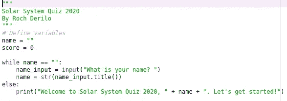
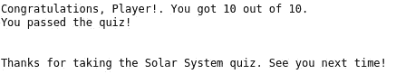
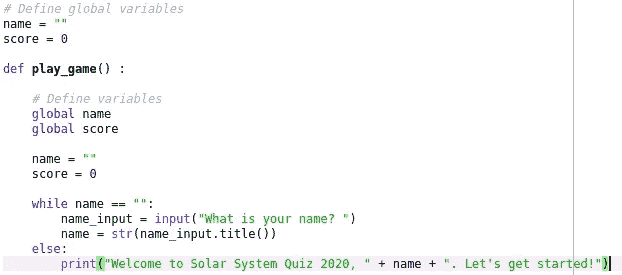
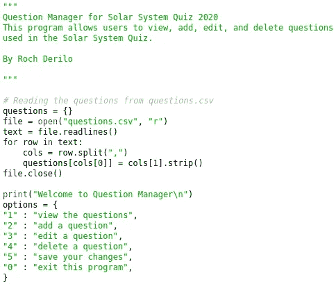
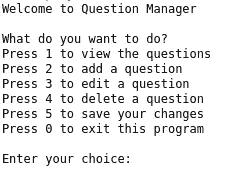
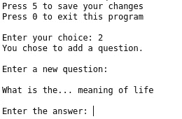

# Python 中的冒险:创建具有奇特功能的问答游戏

> 原文：<https://medium.com/analytics-vidhya/adventures-in-python-creating-a-quiz-game-with-fancy-features-16837259ad1a?source=collection_archive---------11----------------------->

这是我的第一个 Python 3 项目！

在学习 Python 的斜坡上徒步旅行一开始可能会很难，但每一步都是值得的！

J 就像第一次爬山一样，创建你的第一个 Python 程序看起来像是一次艰难的爬山。对于你目前的知识和技能是否足以完成它，有一种不确定的感觉。如果你甚至能开始制作一个，也可能有这种怀疑！

作为一个初露头角的皮托尼斯塔，我知道我必须迈出最初的几步。我做到了。而且也不是没有困难。最后，我终于能爬一点了，而且我开始喜欢这里的风景了！

## 创建基本测验

我也对天文学感兴趣，所以我决定写一个关于太阳系行星的小测验。我把这个游戏叫做“太阳系问答 2020”。我在一张*纸上写了基础测试。使用 Spyder 的 py* 文件。

我将变量名称设置为空字符串，得分为零。

我使用了一个**字典**，这样问题就以键-值对的形式对应于答案。我还应用了一个 **for 循环**来解析字典并将每个键作为一个问题打印出来。

为了获得玩家的名字作为输入，计算分数，并显示玩家是否通过了测验——我应用了一些**条件语句**。我用 70%作为通过率。

这就是分数在控制台中的显示方式。我得了满分，哈哈。

## 功能#1:跟踪最佳得分者

能够完成基本测验并让它按预期运行已经建立了我的信心。然后我继续给游戏增加了一些新的功能。

我创建了另一个文件，它将调用原始的测验文件。我称之为“游戏文件”。在意识到我可能需要对测验文件进行重大更改后，我决定备份它并将其另存为另一个文件。 *py* 文件。感觉棒极了，我不仅编写了我的第二个 Python 脚本，还让这些脚本相互交互。

我修改了原来的测验脚本，这样我就可以使用相同的变量并调用测验函数。

我对原来的测验文件做了一些更改:我定义了函数 ***play_game()*** 来运行测验；我还定义了一些可以在两个脚本中使用的局部和全局变量。

为了跟踪玩家和他们的分数，我创建了一个空字典，随着更多的玩家继续参加测试，这个字典将被填满。最后，我使用了 ***sorted()*** 和 ***len()*** 函数来显示前十名的得分者。

## 功能#2:查看、添加、编辑和删除问题

更进一步就是 CRUD 在 Python 中的应用。就像我的游戏脚本里一样，我创造了另一个*。py* 文件能够在单独的*上创建、读取、更新和删除条目。csv* 文件。这些条目是成对的问题和答案，用逗号分隔。

原来的十个问题是预先写入*的前十项。csv* 文件。该脚本的大部分是一个 while 循环，带有几个能够执行任何 CRUD 操作的条件。

我自己对“使用 Python 进行 CRUD”的理解。

根据用户使用的选项，将运行不同的条件，它会显示自己的唯一消息，并运行涉及外部问题文件的请求操作。

我决定让用户参与 CRUD 过程，让它变得更有趣。

我使用了一些策略消息来提示用户以我想要的格式键入问题。我还意识到，显示一些消息字符串可以告知用户在运行程序时发生了什么。

这就是当我要求用户添加一对问题和答案时的样子。

将学习 Python 的整个冒险提升到一个新的水平！接下来，我们将探索对我从事数据科学有帮助的 Python 包，比如 NumPy、pandas 和 Matplotlib。

在 GitHub 上查看我的[脚本](https://github.com/rochderilo/FTW-Py-Quiz)。收听我接下来的 Python 冒险！

(*这是我系列的第二篇文章。先检查出***。*)*