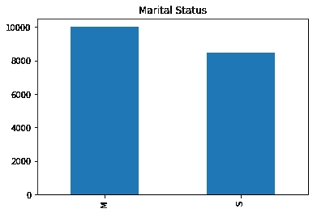
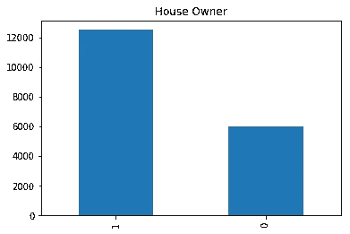
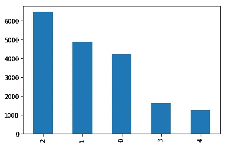
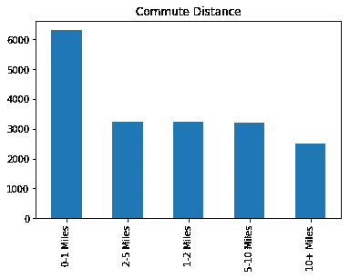
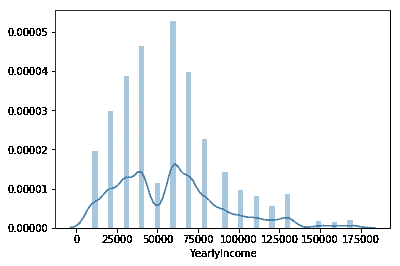
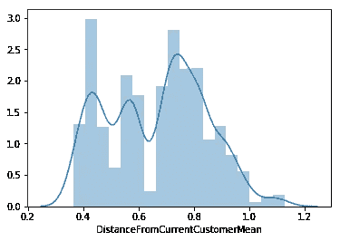

# 冒险作品#1

> 原文：<https://medium.com/analytics-vidhya/adventures-w-adventure-works-1-b498e025e536?source=collection_archive---------19----------------------->


在 [Unsplash](https://unsplash.com?utm_source=medium&utm_medium=referral) 上由 [Austin Distel](https://unsplash.com/@austindistel?utm_source=medium&utm_medium=referral) 拍摄的照片

如今，数据无处不在，它让精明的企业主能够对营销、销售和运营做出更好的决策。由于数据是由各种工具和功能产生的，因此很难有效地跟踪。如果您是一家致力于从数据中提取信息的企业，使用生产数据库最终会降低交易速度，并且可能需要复杂的查询来回答您感兴趣的问题。如果数据是由外部工具生成的，您可能不得不依赖于某种格式的数据转储，这种格式可能不便于分析。

这就是为什么对于许多公司来说，他们的商业智能计划的支柱是数据仓库。现代数据管道使用预定的 ETL 作业从生产数据库和第三方工具中提取数据，并以易于查询的格式存储在数据仓库中。

在这个系列中，我们将探索一个流行的数据仓库样本，微软的 Adventure Works，看看该公司可以做些什么来提高其销售额。对于这个分析，我们将使用 SQLServer 和 Python。为了更好地理解本文，您应该下载 [Anaconda](https://www.anaconda.com/) 发行版、 [SQLServer](https://www.microsoft.com/en-us/sql-server/sql-server-downloads) 、[SQL Server Management Studio](https://docs.microsoft.com/en-us/sql/ssms/download-sql-server-management-studio-ssms?view=sql-server-ver15)和 [AdventureWorks2017.bak](http://AdventureWorksDW2017.bak) 文件。

完成这些后，请遵循本指南中关于将备份恢复到 SQL Server 的内容。

## 连接到我们的数据仓库

一旦您安装了。包含 AdventureWorks 数据仓库的 bak 文件。你应该已经准备好访问数据库了。继续前进，启动 Jupyter 笔记本，跟随教程。

在第一个牢房区。让我们继续导入必要的库进行分析。

```
import pyodbc
import pandas as pd
import matplotlib.pyplot as plt
import seaborn as sns
import numpy as np
import math
from sklearn.preprocessing import MinMaxScaler
```

从这里，我们继续运行连接字符串来连接到 SQLServer。

```
credentials = {
 “username”:”sa”,
 “password”:”password”,
 “server”:’tcp:localhost.database.windows.net’,
 “database”:”AdventureWorksDW2017"
}conn = pyodbc.connect(
 ‘DRIVER={ODBC Driver 17 for SQL Server};SERVER=.;DATABASE=’+credentials[“database”]+’;UID=’+credentials[“username”]+’;PWD=’+ credentials[“password”]
 )
```

现在我们已经连接了我们的数据库，我们可以继续针对我们的数据库编写查询，这些查询将直接移植到 Pandas 数据帧中。让我们继续将客户数据加载到数据框架中进行分析。

```
customer_df = pd.read_sql(‘’’SELECT * FROM dbo.DimCustomer’’’, conn)
```

## 谁是我们的客户？

我们想问的第一个问题是谁是我们的客户。他们是什么样的？

他们倾向于结婚吗？

```
customer_df[‘MaritalStatus’].value_counts().plot(kind = ‘bar’, title = “Marital Status”)
```



婚姻状况

他们有自己的房子吗？

```
customer_df[‘HouseOwnerFlag’].value_counts().plot(kind = ‘bar’, title = “House Owner”)
```



客户之间的房屋所有权

他们拥有多少辆汽车？

```
customer_df[‘NumberCarsOwned’].value_counts().plot(kind = ‘bar’, title = “Cars Owned”)
```



拥有的汽车

他们的通勤情况如何？

```
customer_df[‘CommuteDistance’].value_counts().plot(kind = ‘bar’, title = “Commute Distance”)
```



到商店的距离

他们的收入是多少？

```
customer_df[‘YearlyIncome’].plot(kind = ‘hist’)
```



客户年收入

## 这对我们有什么帮助？

描述我们的数据固然很好，但数据计划的最终目标是使用这些数据来修改和/或告知我们经营业务的方式。我们如何利用我们对客户的了解来改善我们的经营方式？

我们的数据仓库中还有一个包含潜在客户的表。营销是任何企业成本的主要驱动因素之一，有效的目标定位可以降低获得客户的成本，增加实际销售额。

利用我们对现有客户和潜在客户的了解，我们可以建立一个简单的模型，通过比较潜在客户与现有客户的相似程度，对潜在客户转换的可能性进行排序。

让我们把潜在客户的数据输入数据框架。我们可以看到存储的数据有一些重叠。可以有把握地假设，年收入、房屋所有权、家里孩子的数量、拥有的汽车和婚姻状况对你成为顾客的决定有切实的影响。

```
prospect_df = pd.read_sql(‘’’SELECT * FROM ProspectiveBuyer’’’, conn)
```

我们可以把我们的潜在客户和他们的属性想象成超维空间中的点。最好的潜在客户是那些“最接近”我们当前客户的客户。我们可以将这种密切程度建模为我们的潜在客户和“平均”当前客户之间的欧几里德距离。

构建模型时，我们需要做的第一件事是预处理数据。我们有一些分类变量，它们是序数，我们需要用数字来表示，以便对它们执行任何有意义的操作。我们可以通过对熊猫系列使用 apply 方法来完成。

定义将就业类别转换为相应数值的函数。

```
def profession_to_numeric(profession):

    if profession == 'Manual':

        return 0

    elif profession == 'Skilled Manual':
        return 1

    elif profession == 'Clerical':

        return 2
    elif profession == 'Professional':

        return 3
    elif profession == 'Management':

        return 4
```

转换数据。

```
customer_df[‘EnglishOccupation’] = customer_df[‘EnglishOccupation’].apply(profession_to_numeric)prospect_df[‘Occupation’] = prospect_df[‘Occupation’].apply(profession_to_numeric)
```

让我们重命名前景数据框架中的“职业”变量，使其与客户数据框架相匹配。

```
prospect_df.rename(columns = {
 “Occupation”:”EnglishOccupation”
}, inplace = True)
```

我们遇到的下一个问题是扩展问题。与其他变量相比，收入的值是如此之大，以至于当你计算距离时，它是唯一对分数有实际影响的变量。因为我们**假设**其他变量也同样重要，所以我们需要确保所有变量都在相同的范围内。我们可以通过使用我们的 MinMaxScaler 来缩放我们的变量，使它们在 0 和 1 之间。

```
prospect_df[[‘EnglishOccupation’, ‘YearlyIncome’, ‘NumberCarsOwned’, ‘HouseOwnerFlag’]] = MinMaxScaler().fit_transform(prospect_df[[‘EnglishOccupation’, ‘YearlyIncome’, ‘NumberCarsOwned’, ‘HouseOwnerFlag’]])
customer_df[[‘EnglishOccupation’, ‘YearlyIncome’, ‘NumberCarsOwned’, ‘HouseOwnerFlag’]] = MinMaxScaler().fit_transform(customer_df[[‘EnglishOccupation’, ‘YearlyIncome’, ‘NumberCarsOwned’, ‘HouseOwnerFlag’]])
```

将“HouseOwnerFlag”转换为整数数据类型。

```
customer_df[‘HouseOwnerFlag’] = customer_df[‘HouseOwnerFlag’].astype(np.int64)
prospect_df[‘HouseOwnerFlag’] = prospect_df[‘HouseOwnerFlag’].astype(np.int64)
```

计算不同变量的客户平均值。

```
mean_customers = customer_df[[‘EnglishOccupation’, ‘YearlyIncome’, ‘NumberCarsOwned’, ‘HouseOwnerFlag’]].mean()
```

从前景中减去平均元素。

```
diff_customers = prospect_df[[‘EnglishOccupation’, ‘YearlyIncome’, ‘NumberCarsOwned’, ‘HouseOwnerFlag’]] — mean_customers
```

消除分歧。

```
squared_diffs = diff_customers ** 2
```

对平方求和。

```
sum_diffs = squared_diffs.sum(axis = 1)
```

取总和的平方根，得到我们所有潜在客户与“平均”客户之间的距离。

```
distances = sum_diffs.apply(math.sqrt)
```

我们的前景如何？

```
sns.distplot(distances)
```



距离直方图

这是一个具有 3 种不同模式的多模式分布。我们可以将这些模式解释为代表热门潜在客户、温和潜在客户和冷门潜在客户的聚类，这取决于它们与我们的普通客户的距离。我们可以根据业绩向销售人员分配销售线索，并根据潜在客户转化的可能性来调整他们的营销支出和努力。

像所有的模型一样，这个模型是错误的，但是在现实世界中经过检验后，可能会发现它是有用的。在本系列的下一篇文章中，我们将使用数据来判断我们的哪些促销活动是最有效的。

下次见。