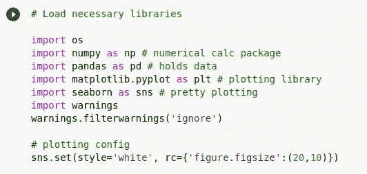
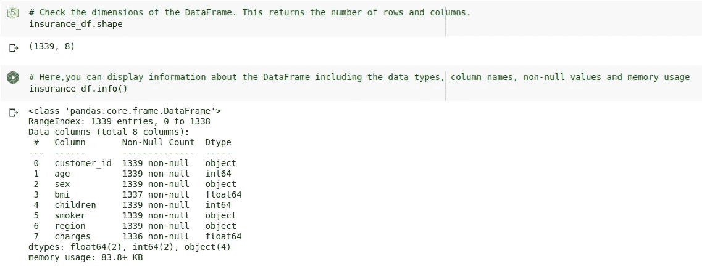
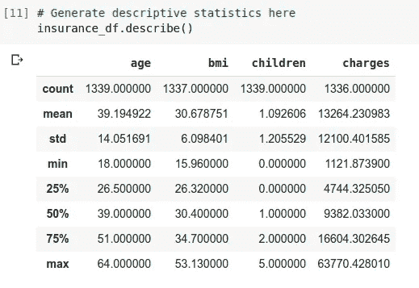
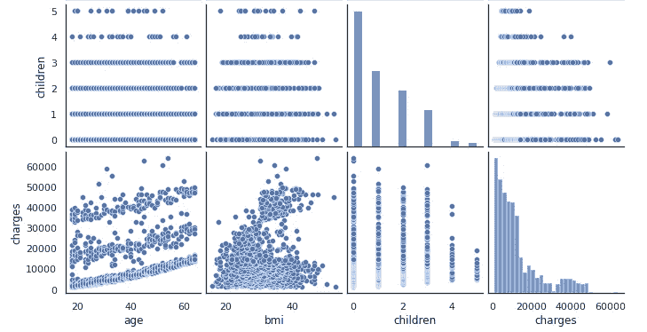
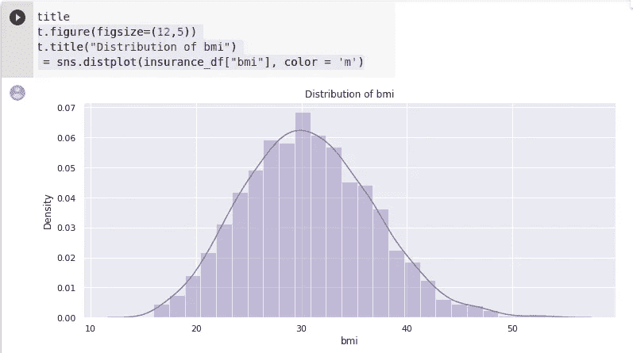
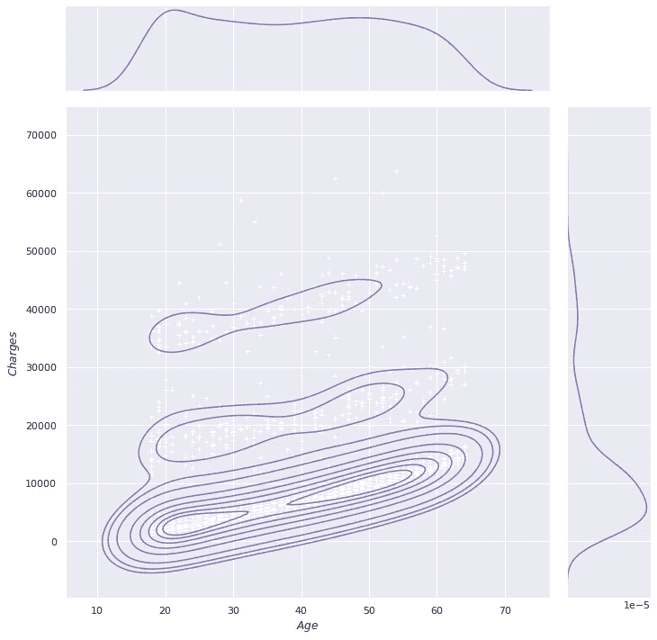

# 用 Python 冒险:用熊猫和 Matplotlib 讲故事。Seaborn)

> 原文：<https://medium.com/analytics-vidhya/adventures-with-python-storytelling-with-pandas-and-matplotlib-ft-seaborn-64161e3f1431?source=collection_archive---------10----------------------->

数据科学家是魔术师。你给他们数据，他们把数据变成故事。包括视觉效果。

在我成为一名数据科学的 Python 爱好者的旅程中，一个至关重要的部分是结识新朋友 Python 库。一个**库**是一个强大脚本的集合，可以让你的工作变得更加容易。有用于一般目的的库，也有用于更特殊需要的库。每个库都作为**包**下载，并导入到脚本中，这样我们就可以调用它并在我们的程序中使用它的内容。

## 准备故事大纲

名为 **pandas** 的库是一个 Python 包，它提供数据结构，对于结构化和时序数据非常有用。它主要处理序列(一维)和数据帧(二维)。在对我们的数据进行初步分析时，使用熊猫是非常有效的。

我们总是先导入所需的库，这样以后就可以很容易地调用它们。

我们最初可以使用 **df** 对象下的许多方法来检查我们正在处理的数据量和数据类型。

根据输出，我们正在处理的文件有 1339 行和 8 列，包含字符串、整数和浮点值作为数据类型。

接下来，我们为数据生成描述性统计数据，以便我们可以检查平均值、极值以及数据点的分布情况。这很容易通过使用 ***describe()*** 来实现。

显示数据集的描述性统计数据。

您可以选择更深入，对数据进行一些更具体的统计测试。熊猫网站有全面的文档，可以帮助任何人开始。

## 构建故事情节

情节是故事中最重要的部分。这是我们了解和看到角色之间关系的地方。这是我们观看所有活动的地方。它拨动了我们的心弦。它让我们快乐、悲伤、惊讶，以及其他各种情绪。

这是我们希望与观众交流的方式。作为数据科学家，我们不想向人们扔数组和数字表。我们通过引人注目的视觉效果向他们展示趋势和关系，希望他们也能从我们的数据中获得洞察力。

这就是 Matplotlib 和 Seaborn 与 T21 的关系。这些漂亮的数据可视化包将您的分析提升到了一个新的水平。让我们看看下面的一些例子，并了解他们讲述的故事。

散点图对于探索变量之间的关系非常有用。

我在这个练习中使用了一个保险数据集。它可用于根据几个因素预测客户的保费。根据这些图，我们可以说年龄和保险费用有正相关关系，我们可以进一步探索。这是一个很好的起点。

直方图可以让我们快速了解我们的数据点是如何分布的。看看下面的图片。请注意，在我们的数据中，哪个身体质量指数的保险客户密度最高？

不同种类的图表显示不同的因素之间的关系。尝试不同的可视化效果，以便更好地理解您的数据。

上面的核密度估计(kde)图是使用下面的代码生成的:

> g = sns.jointplot(x="bmi "，y="charges "，data = insurance_df，kind="kde "，color="r "，height=10，aspect=1)
> 
> g.plot_joint(plt.scatter，c="w "，s=30，linewidth=1，marker="+")
> 
> g.ax_joint.collections[0]。set_alpha(0)
> 
> g . set _ axis _ labels(" $身体质量指数$ "，" $费用$ ")

这些论点可能看起来令人生畏，但是熟悉这些图形的属性并接触这些库可以帮助某人掌握用 Python 创建令人惊叹的可视化效果的诀窍。收听我的下一次 Python 冒险！

(*这是我系列的第三篇文章。检查出第一个***[*第二个*](/@roch.derilo/adventures-in-python-creating-a-quiz-game-with-fancy-features-16837259ad1a) *。*)**