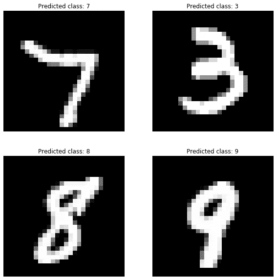
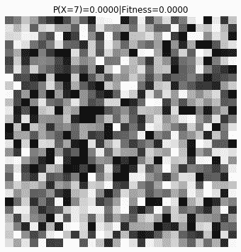
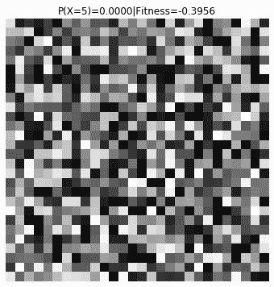
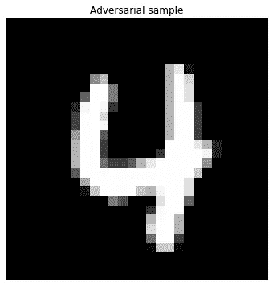
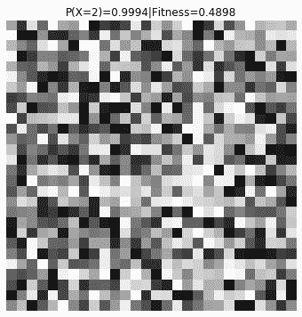

# 基于遗传算法的对抗性攻击

> 原文：<https://medium.com/analytics-vidhya/adversarial-attack-using-genetic-algorithm-90beba13b6cb?source=collection_archive---------4----------------------->

丹尼尔·利维斯·佩鲁西在 Unsplash 上的照片

对机器学习模型的对抗性攻击是去年的一个研究热点。虽然许多团队都在努力理解对抗性方法的含义，但这仍然是一个新的领域。

有两种主要的方法:**白盒优化**需要访问经过训练的模型架构和权重，并使用其可微性来生成对立样本。**黑盒优化**将模型视为一个隐藏状态未知的对象，只有一些 I\O 接口。虽然它通常涉及更多的计算，但黑盒场景更接近现实生活中的事件。

在这篇文章中，我将解释如何使用遗传编程生成对立的例子。

想象一下，通过在你的社交资料图片中添加不引人注意的噪声，你的身份被窃取了。或者通过使用特殊的措辞或对内容进行其他细微的修改，让垃圾邮件通过提供商的过滤。这是典型的对抗性攻击的样子。

# 建立模型

事不宜迟，我们将采用 MNIST 数据集。它包含 60000 幅手写数字的灰度图像，每幅图像为 28x28，包含一个数字。

我将使用 PyTorch，因为它是高度灵活的库，允许快速原型化，并且是这种实验的理想选择。该架构是小型神经网络的典型架构——三个[卷积->池化->激活]块之后是全连接的“头”,以 softmax 层结束，以输出图像属于每个类的概率。

经过几个时期的训练，模型在维持数据集上达到 95%的准确率。以下是对测试图像的一些预测——它非常有效。

# 遗传算法

为了生成对立的例子，我们需要定义最优化问题。给定任何输入图像，我们的模型输出每一类的概率。假设，我们想让它相信图像包含高置信度的 7。然后，我们需要生成这样的图像，它被分类为 7 的概率是**最大化**。

遗传算法是一种通用方法，它需要预先定义几件事情:

*   基因——问题解决方案的单一实例。在我们的例子中，它是 28×28 的矩阵，代表一幅图像
*   群体——基因列表
*   适应度函数——评估每个候选人的能力。在我们的设置中，它是概率(候选人= 7)
*   变异——增加候选解随机性的函数。在我们的例子中，随机改变像素强度
*   交叉——组合几个候选解决方案的例行程序。在我们的例子中，我们从一幅图像中随机选择一半的像素，剩下的一半从另一幅图像中选择

一旦我们定义了这个，算法就很简单了:

1.  随机初始化群体
2.  对于`n`时代:

*   使用适应度函数对每个候选人进行评分
*   选择前 *k* 个候选者，其他的很有可能被丢弃
*   随机变异其中的一部分(除了最好的一个)
*   对于剩余的位置，添加随机交叉，直到群体大小恢复

我不会深入讨论实现细节，因为您可以在存储库中检查代码。可以说，我们有一个`GeneticSolver`类，它需要图像大小来进行初始化。`solve`方法以优化为切入点，以适应度函数为自变量。它也接受`n_generations`——运行的代数。

# 对抗性攻击

## 类别概率

我们从简单的目标开始:最大化敌对目标`adv_target`的概率。我们以`adv_target=7`为例。

结果相当令人印象深刻:经过 1400 个纪元后，我们说服了模型，图像上有 99%的概率是 7。这是优化过程的可视化:

## 具有非零内容惩罚的类概率

现在让我们做一些更有趣的事情。例如，让我们不仅说服模型图像上的噪声是某个数字，而且让我们用最小数量的有效像素来做这件事。将其转化为健身功能:

让我们把`adv_target=5`作为我们的下一个目标标签。为了获得良好的视觉效果，我将种群大小从默认的 100 增加到 300。超过 1800 个时代的进化:

## 在内容变化最小的情况下更改类别

接下来，让我们从抵制数据集中提取一些对立样本，并说服神经网络使用错误的标签，比如`adv_target=2`。

将其正式化为适应度函数，我们得到:

# 结论

正如您所看到的，给定适当的优化函数，您可以将模型“愚弄”成几乎任何您想要的输出。这种行为有几个原因:

## 分布式表示

使神经网络特别容易受到这种攻击的是分布式表示——从训练数据集中提取的知识在所有节点上以分层的方式共享。因此，输入的微小变化都会对输出产生类似雪崩的影响。

## 糟糕的建筑

在我选择的设置中，没有办法包含关于输入看起来有多“真实”的信息。使模型更健壮的一种方法是增加对手样本检测的第二个任务。另一种方法是为无效输入添加虚拟类。如果体系结构的改变代价很高，假设输入分布是稳定的，可以增加使用训练数据进行异常检测的预处理步骤。

## 问题不可约性

不难认为，即使采取了预防措施，在黑盒攻击中也总是存在固有的易感性。与信息安全类似，新的利用和对策将以军备竞赛的方式发展。

## 密码

我已经为你建立了一个[库](https://github.com/ptyshevs/ga_adv)来重现和增强这个例子。

## 文献学

有几篇关于这个主题的论文，我觉得很有趣，也很有启发性:

*   [基于群体进化算法的神经网络黑盒攻击](https://arxiv.org/abs/1901.09892)
*   [POBA 遗传算法:通过遗传算法进行扰动优化的黑盒对抗攻击](https://arxiv.org/abs/1906.03181)