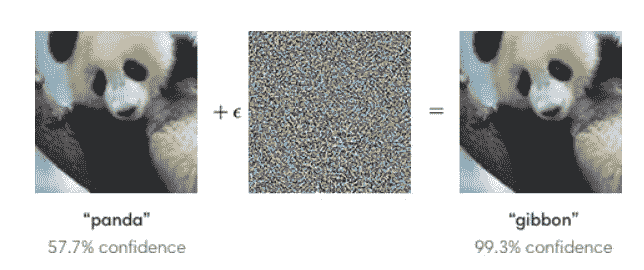

# 对抗性攻击和数据增强

> 原文：<https://medium.com/analytics-vidhya/adversarial-attacks-and-data-augmentation-1d97296b2d0c?source=collection_archive---------20----------------------->

几周前，有人向我介绍了对抗性攻击，我努力寻找对抗性攻击和数据增强之间的明显区别。

我的困惑始于这两个原因:

1.  两者都对应数据转换。
2.  目的是使神经网络在这两种情况下都是健壮的。

考虑应用于两种情况的高斯分布。我的主管给了我一个很好的解释

当我们在数据扩充的情况下向图像添加高斯时，它可以是任何高斯，就像图像的噪声一样。但是，当我们在一幅图像中添加一个高斯模型以应对敌对攻击时，它将是“特定的”高斯模型，该模型已经被裁剪，因此神经网络可能会失败。

如果你没有得到它，不要担心，让我们一个接一个地去。

**数据扩充**也是数据转换，但它用于获得更多数据并训练一个稳健的模型。

叠加在典型图像上的对抗性输入会导致分类器将熊猫误归类为长臂猿。Pic 鸣谢:开放人工智能研究

**对立的例子**是那些输入，其中输入图像受到最坏情况扰动的攻击(或变换),使得扰动的输入导致训练模型以高置信度输出不正确的答案。这项技术显示了恶意对手如何操纵输入数据，从而危及机器学习系统的安全性。

简而言之，在训练时应用数据扩充以使模型稳健。然而，对抗性攻击(精心定制)应用于图像，然后通过一个经过训练的模型发送，以检查其鲁棒性和安全性。

***参考文献***

1.  [https://openai.com/blog/adversarial-example-research/](https://openai.com/blog/adversarial-example-research/)
2.  [https://en.wikipedia.org/wiki/Data_preparation](https://en.wikipedia.org/wiki/Data_preparation)
3.  [https://en.wikipedia.org/wiki/Adversarial_machine_learning](https://en.wikipedia.org/wiki/Adversarial_machine_learning)