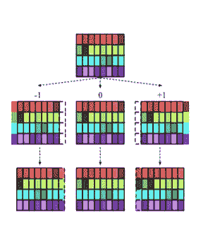
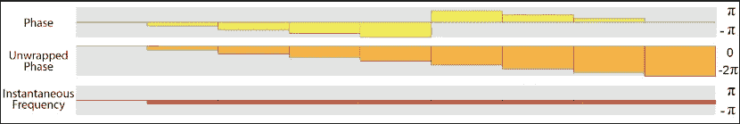
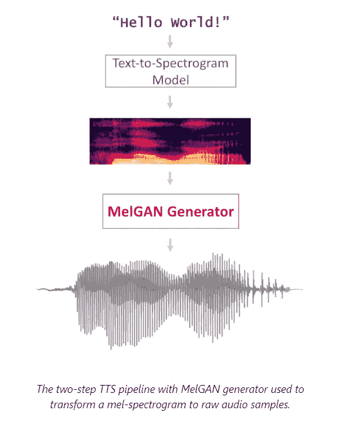

# 对抗性音频合成

> 原文：<https://medium.com/analytics-vidhya/adversarial-audio-synthesis-6250e297d4b2?source=collection_archive---------13----------------------->

很久以来，GANs 一直用于生成高质量的图像和视频。

随着一个又一个最新模型的出现，它们在听觉数据方面的适用性已经成为最近研究的焦点。

虽然这一过程需要大量的培训，但结果是值得注意的。

所有这些过程都是无人监管的，可以用来生成类似人类的语音或音乐。

我将解释以下三篇论文。

1.  (WaveGAN)对抗性音频合成-ICLR 2019
2.  甘辛斯-ICLR 2019
3.  MelGAN-neur IPS 2019

# 韦弗根

1.  该论文基于新颖的 DCGAN 基础设施(生成图像)。
2.  它将迎合图像数据的模型的属性改变为音频波的属性。
3.  因为图像可以被认为是 2D 矩阵，音频可以被认为是 1D 阵列，所有的操作都相应地改变了。
4.  所有的 5×5 2D 卷积运算都变成了 25 个 1D 滤波器。
5.  **相位混洗**:避免了标准转置卷积，因为它导致发生器学习丢弃人工频率的琐碎策略，并使优化更加困难。在替换中引入了相位混洗。

在 WaveGAN 鉴频器的每一层，相位混洗操作通过均匀的{[ n，n]样本扰动每个特征图的相位，通过反射填充缺失的样本(虚线轮廓)。在这里，我们描绘了一个具有四个要素地图(n = 1)的图层的所有可能结果。来源:https://arxiv.org/pdf/1802.04208.pdf

> 相位混洗在输入到下一层之前，通过 n 至 n 个样本随机扰动各层激活的相位。这使得鉴频器的工作更加困难，因为它要求与输入波形的相位不一致。

该论文使用最近邻方法和上采样层，在鉴别器和发生器中都应用了因子 4x。

我亲自在特斯拉 K80 上训练模型。该模型需要至少 20，000 个步骤来产生可识别的结果，但是，由于重音变化太高而无法收敛，所以仍然存在一些噪声。

# 甘辛斯

1.  这个建筑被用来制作音乐和类似的声音。
2.  GANsynth 以并行方式生成整个音频序列，比标准 WaveNet 快大约 50，000 倍。
3.  GANSynth 从单个潜在向量生成整个音频片段，从而更容易理清音高和音色等全局特征。
4.  GANSynth 使用[渐进式 GAN](https://arxiv.org/abs/1710.10196) 架构，通过卷积从单个矢量到完整声音进行增量上采样。
5.  该论文指出，卷积上采样的标准方法很困难，因为它没有很好地对准相位。
6.  这篇论文使用的是瞬时频率。

来源:https://magenta.tensorflow.org/gansynth

> 它是帧步距和信号周期之间的角度差的导数。

结果产生了高保真音频。

# 梅尔根

1.  Lyrebird AI 制作的非自回归模型。
2.  该模型非常轻，速度快得令人难以置信。
3.  这可能是文本到语音转换系统中最接近的模型。
4.  这是**第一篇**在没有任何感知损失函数的情况下成功将频谱图转换为语音的论文。
5.  他们把问题分成两步。

来源:[https://www . descript . com/post/ultra-fast-audio-synthesis-with-melgan](https://www.descript.com/post/ultra-fast-audio-synthesis-with-melgan)

1.  以文本为条件对较低分辨率的表示建模，例如 mel 谱图序列
2.  根据 mel 频谱图序列(或另一种中间表示)对原始音频波形进行建模

*Mel-GAN 是非自回归的意味着它不局限于一次产生一个音频，并且对先前的音频块没有因果依赖性。*

1.  他们使用[扩展卷积模块](https://towardsdatascience.com/review-dilated-convolution-semantic-segmentation-9d5a5bd768f5)，使过程完全并行。
2.  他们使用基于窗口的三个鉴别器的方案。

> *基于窗口的鉴别器学习在小音频块的分布之间进行分类。*

# 梅尔根显然重新定义了 SOTA 标准。

希望 2020 年能看到更多的论文！

参考文献—文字、图片均已转载。：

[https://magenta.tensorflow.org/gansynth](https://magenta.tensorflow.org/gansynth)

[https://arxiv.org/pdf/1902.08710.pdf](https://arxiv.org/pdf/1902.08710.pdf)

[https://arxiv.org/pdf/1910.06711.pdf](https://arxiv.org/pdf/1910.06711.pdf)

 [## 利用 MelGAN 实现超快速音频合成

### 在这篇文章中，我们介绍 MelGAN，一个由 Lyrebird 团队创建的新的原始音频波形生成模型，它是…

www.descript.com](https://www.descript.com/post/ultra-fast-audio-synthesis-with-melgan) 

[https://towards data science . com/synthesizing-audio-with-generative-adversarial-networks-8e 0308184 edd](https://towardsdatascience.com/synthesizing-audio-with-generative-adversarial-networks-8e0308184edd)