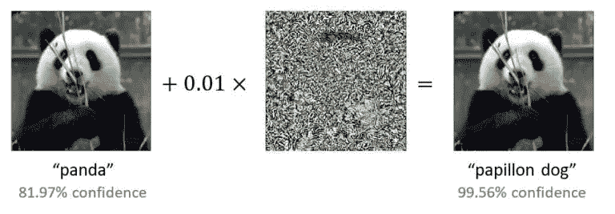
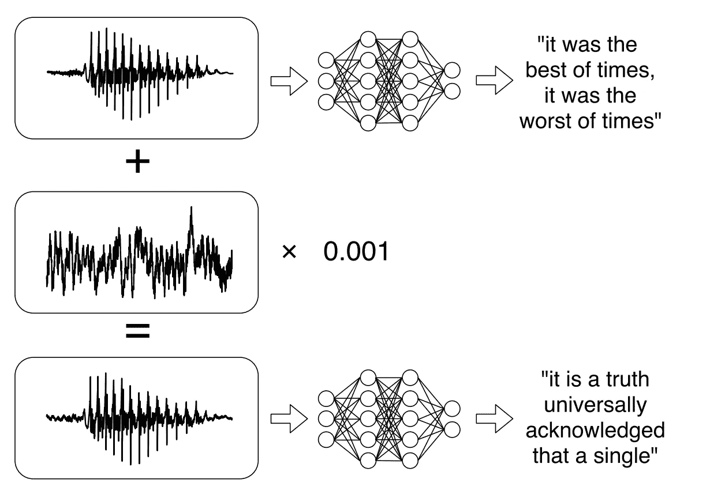
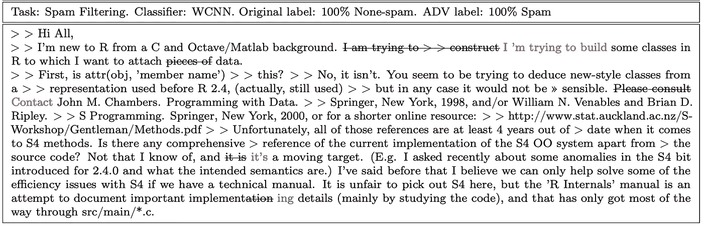
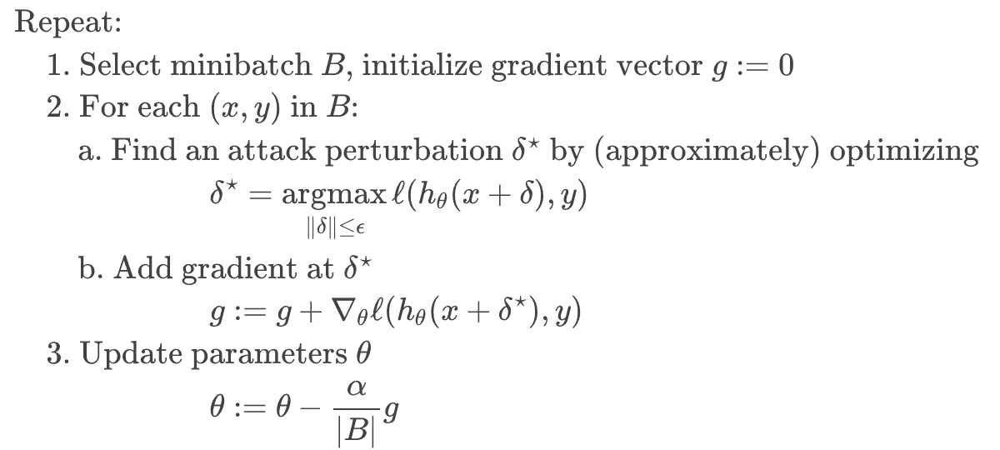
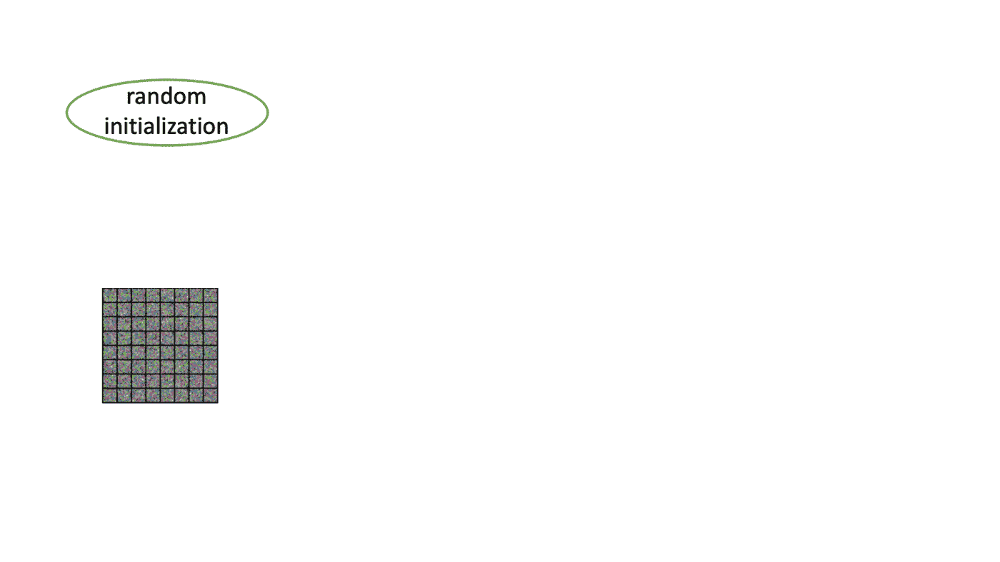

# 对抗性机器学习

> 原文：<https://medium.com/analytics-vidhya/adversarial-machine-learning-87c3d9756dd7?source=collection_archive---------14----------------------->

# 介绍

在真实系统中使用机器学习，需要鲁棒性和可靠性。虽然存在许多鲁棒性和可靠性的概念，但对抗性鲁棒性的主题非常有趣，因为最近在机器学习应用中发现了许多对抗性的例子，引起了公众对人工智能应用安全性的关注。下面是几个例子，说明对输入(图像、音频&文本)的微小干扰如何欺骗机器学习系统产生不正确的输出。

图像的小扰动导致熊猫被归类为 papillon 狗。图片来源:哈迪·萨尔曼，微软研究工程师

对音频的小扰动使得结果被转录成任何期望的目标短语。图片来源:【https://arxiv.org/pdf/1801.01944.pdf 

对文本进行释义攻击，将垃圾邮件分类器的标签从无垃圾邮件改为垃圾邮件。图片来源:【https://arxiv.org/pdf/1812.00151.pdf 

为了解决对抗性攻击的问题，对抗性训练过程用于增加模型的鲁棒性。

## 对抗训练

基本思想是通过在训练过程中包含对抗性的例子，使机器学习系统对这些对抗性攻击具有鲁棒性。这里的问题是我们应该训练哪些对立的例子，以及如何概括。实现这种对抗鲁棒性的最显著的技术依赖于 min(max(f(x)))目标，即无论对手使用什么攻击，我们都希望有一个性能良好的模型。

使用基于局部梯度的搜索、精确组合优化和凸关系来实现最小-最大目标的内部最大化。精确的组合优化方法是不合理的，由于复杂性，留给我们两个选择。在这两种被忽略方法之间存在折衷，但是结果是局部搜索创建了经验上强的模型。

基于局部梯度的搜索。https://adversarial-ml-tutorial.org/adversarial_training/

关于**(即将推出)**的实际代码和示例，如何使用投影梯度下降(PGD)训练健壮的机器学习模型，这是对快速梯度符号方法(FGSM)的迭代。FGSM 是深度学习社区中的第一个方法，由 [Goodfellow](https://arxiv.org/pdf/1412.6572.pdf) 发明，用于构造对立的例子。FGSM 使用底层模型的梯度符号，通过增加或减去小误差来扰动原始输入。

对抗性鲁棒性工具箱是一个很好的机器学习库，支持 FGSM 和 PGD，也兼容所有的机器学习库(Tensorflow，PyTorch，MXNet，scikit-learn，XGBoost，LightGBM，…)。

当前机器学习领域的研究热点有

1.  训练大规模对手模型(实现比他们的纯对手相似的性能)。
2.  对立模型学习背后的理论与解释。

在理论和解释方面，最近微软研究发现了一个“特征纯化”原则，以解释为什么纯模型(没有对抗例子)对对手没有足够的弹性，以及对抗训练如何帮助实现它。

对抗性训练如何执行稳健的机器学习。ImageCredit: [2](https://www.microsoft.com/en-us/research/blog/newly-discovered-principle-reveals-how-adversarial-training-can-perform-robust-deep-learning/)

答分布式机器学习是为真实系统部署机器学习的一个最重要的方面，如自动驾驶汽车、防止虚假媒体、防止欺诈、推荐系统等等。

在 Viu，我们还使用类似的技术，通过干扰输入特征并结合成本敏感学习来提高我们内部欺诈激活检测模型的稳健性，并在我们的内部欺诈激活数据集上获得 90+ F1 分。欺诈激活检测模型的输入特征源自设备属性、用户代理、http 报头、平台上的用户活动等。最终模型是使用谷歌云人工智能部署的。

# 参考

1.  【https://adversarial-ml-tutorial.org/ 
2.  [https://aaai18adversarial.github.io/](https://aaai18adversarial.github.io/)
3.  [https://www . Microsoft . com/en-us/research/blog/new-discovered-principle-reveals-how-adversarial-training-can-perform-robust-deep-learning/](https://www.microsoft.com/en-us/research/blog/newly-discovered-principle-reveals-how-adversarial-training-can-perform-robust-deep-learning/)
4.  [https://spectrum . IEEE . org/cars-that-think/transportation/self-driving/three-small-sticker-on-road-can-steer-Tesla-auto pilot-into-迎面而来的车道](https://spectrum.ieee.org/cars-that-think/transportation/self-driving/three-small-stickers-on-road-can-steer-tesla-autopilot-into-oncoming-lane)
5.  [https://research . FB . com/downloads/adversarial-image-defenses/](https://research.fb.com/downloads/adversarial-image-defenses/)
6.  [http://www . clever Hans . io/security/privacy/ml/2017/02/15/why-attack-machine-learning-is-easy-than-defense-it . html](http://www.cleverhans.io/security/privacy/ml/2017/02/15/why-attacking-machine-learning-is-easier-than-defending-it.html)
7.  [https://github . com/Trusted-AI/adversarial-robustness-工具箱](https://github.com/Trusted-AI/adversarial-robustness-toolbox)