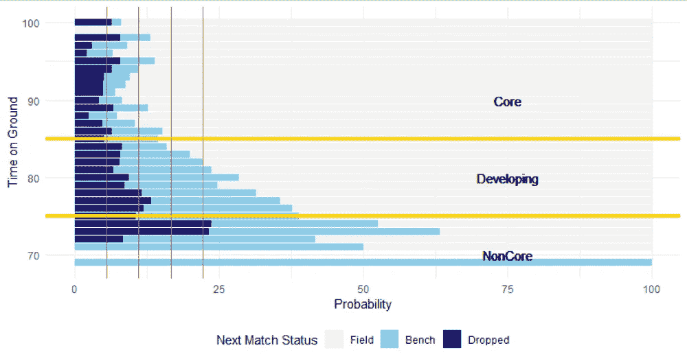

# AFL 球员的重要性和影响

> 原文：<https://medium.com/analytics-vidhya/afl-player-importance-and-impact-d20acf754f9d?source=collection_archive---------28----------------------->

## 在自己球队的背景下审视 AFL 球员

[Jimmy Harris](https://www.flickr.com/photos/50216172@N00)的《鹰洒印记》由[CC 2.0](https://creativecommons.org/licenses/by/2.0/?ref=ccsearch&atype=rich)授权

本文使用数据可视化来检查球员在自己球队中的影响和重要性，以此来理解球队的建设，并为 AFL fantasy 提供一些帮助。

## 数据

公开的统计数据是从 2019 赛季 [Footywire](https://www.footywire.com/) 的每场比赛的个人页面上刮下来的。原始数据集包括玩家统计数据，并被匹配回各个玩家位置。我们的完整数据集包括 2019 年常规赛的 656 名球员。

## 玩家重要性

假设我们根据球员在球场上花费的时间来考虑他们在自己球队中的重要性，既包括每场比赛的时间，也包括整个赛季的时间。这让我们可以通过他们在比赛时间的主动选择来“阅读”教练的想法。在这个练习中，为每个球员定义三个类别:( 1)比赛状态;( 2)核心状态;( 3)赛季状态。

**比赛状态**在缺乏球队阵容的可用数据的情况下，我们根据球员在场上的时间(TG)相对于其他球员在自己球队中的排名来创建自己的球员比赛状态。“现场”玩家是排名前 18 位的玩家，“板凳”玩家是下 4 位，“放弃”表示他们没有玩游戏。

有很多原因可能导致球员不能入选接下来的比赛——受伤、停赛、休息、表现不佳或者仅仅是正常的球员轮换。

球员离队轮换的频率

在赛季中的每场比赛中，平均有 3 到 4 名球员被轮换出场——要么坐冷板凳，要么被替换下场。球队表现出一些变化——球队之间的最高变化是科林伍德 vs 埃森登和墨尔本；我们将使用这些团队来了解教练在团队组成方面的想法。

**核心状态**下图比较了 2019 赛季连续几场比赛的球员比赛状态，每条垂直线代表一名球员。

该图表表明，教练正在对球员在比赛过程中的表现做出动态决策，并随着比赛的进展分配他们或多或少的上场时间。

在给定时间内进行下一场比赛的概率

我们用这个来定义球员在特定比赛中的重要性，根据他们的上场时间(1)核心球员——上场时间超过 85%的球员(2)非核心球员——上场时间少于 75%的球员(3)发展中球员——上场时间在 75%到 85%之间的球员。

**赛季状态**根据赛季期间的比赛次数定义。从数据中我们观察到，前四分之一的人在赛季中至少会打 18 场比赛，而前一半的人在赛季中至少会打 10 场比赛。

通过根据每场比赛以及本赛季的上场时间对球员的重要性进行分类，我们现在可以比较埃森登 vs 科林伍德的球队结构，并确定感兴趣的球员。

科林伍德 vs 埃森登 2019:按地面时间划分的团队结构

*   **科林伍德的核心球员**比埃森登有更多的上场时间，这可以从深蓝色的基地看出。在其他条件相同的情况下，这意味着埃森登玩家的幻想分数会更低。
*   **球队结构**埃森登的核心团队由更多后卫组成；科林伍德的核心团队由中锋和前锋组成。进一步调查这是否是有意为之会很有意思；埃森登赛季开始时排名第 18，结束时排名第 7，而科林伍德赛季开始时排名第 11，结束时排名第 5。
*   **连续**场比赛未打，特别是核心球员，这使得识别是否是由于不表现、轮换或其他原因更容易。
*   我们可以看到在一个给定的赛季中被提供上场机会的平均数量，也可以看到下一代发展中的球员。科林伍德的新秀平均比埃森登的新秀在场上的时间要少。
*   **赛季比赛**金线描绘了赛季中的比赛次数；最上面的一个是至少 10 场比赛的标记——当考虑一个球员是否会在 AFL Fantasy 的下一个赛季以“折扣”价格出场时，知道它是很有用的。

当我之前讨论涅槃图表的想法时，它简洁地结合了球员和球队的信息，这种“平铺格式”非常接近它。

## 玩家影响

为了让我们的分析更进一步，我们现在考虑一个球员在自己球队中的价值或影响。在之前的一篇文章中，我们看了关于幻想点数的统计数据。

 [## AFL 玩家在这里赚取他们的梦幻积分

### 利用主成分分析探讨玩家位置与幻想分数之间的关系

medium.com](/analytics-vidhya/where-afl-players-earn-their-fantasy-points-f587d259877f) 

我们着眼于两个关键的统计数据——控球率和控球率——来理解每个球员位置给球队带来的优势。对于这些统计数据中的每一项，我们将根据玩家在给定回合中相对于自己团队的表现，用给定的彩色方块对玩家进行排名。这使得我们可以更容易地考虑球员的影响和技能，即使是在低得分比赛中。

**处置排名**这占了 AFL fantasy 得分的大部分；正如上一篇文章所强调的，这是中场球员的特点。

2019 年处置排名:科林伍德 vs 埃森登

*   **每支球队中的精英球员**(蓝色条纹)通常是中场球员——斯科特·彭德尔伯里、亚当·特雷罗亚尔、汤姆·菲利普斯、斯蒂尔·西德博特姆、扎克·梅里特、迪伦·谢尔和大卫·扎哈拉基斯。后卫杰克·克里斯普也在这一组中。
*   **新秀**来自埃森登的戴森·赫佩尔和迈克尔·赫利在赛季初都表现不错，尽管他们在下半场没有那么多比赛。
*   在赛季中进步的新秀——科林伍德的戴恩·梁、埃森登的德文·史密斯和马丁·格里森。
*   **前锋**在这一指标中表现不佳——安东尼·麦克唐纳-蒂蓬武蒂、乔丹·拉夫黑德和布罗迪·米霍切克是他们球队的核心球员，但在这一指标中的排名低于平均水平。
*   **团队实力**相对于埃森登，科林伍德似乎拥有更强的顶级球员(>本赛季有 16 场比赛)和更弱的二线球员(本赛季有 10 到 16 场比赛)，当我们查看各组瓷砖颜色的分布时。

**持球排名**这个指标是得分和铲球的总和。请注意，在这个指标上，球队之间的球员等级差异较小，尽管偏向于科林伍德更强。

2019 年拥有量排名:科林伍德 vs 埃森登

## 未来研究方向

这是一次卓有成效的练习，将球员的重要性和影响力可视化，并从 AFL 的幻想视角提供了一些启示。

下面的附录列出了 2019 年每个团队的成对图表。

*如果你觉得这个分析有用，请给我一两下掌声，表示你支持开发一个免费的动态 web 应用程序，该应用程序可以对所有球队和球员的 AFL 统计数据进行比较。*

## **附录:球员重要性和团队影响**

在 2019 赛季第一轮结束时，球队根据他们的阶梯位置进行组织。(点击下面的任何图像放大)

排名第一的 GWS 巨人和排名第二的弗里曼特尔码头工人

#3 布里斯班雄狮和#4 山楂鹰

5 号里士满老虎队和 6 号阿德莱德港电力公司

#7 西部牛头犬和#8 吉朗猫

#9 圣基尔达天鹅队和#10 黄金海岸太阳队

#11 科林伍德喜鹊和#12 悉尼天鹅

#13 墨尔本恶魔和#14 卡尔顿布鲁斯

#15 阿德莱德乌鸦和#16 西海岸鹰

#17 北墨尔本袋鼠和#18 埃森登轰炸机