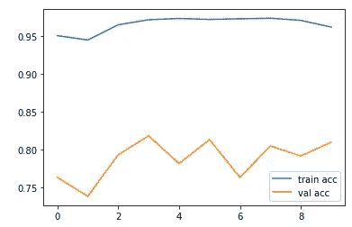

# 使用深度学习检测印度演员的年龄

> 原文：<https://medium.com/analytics-vidhya/age-detection-of-indian-actors-using-deep-learning-b4c24e39e36e?source=collection_archive---------3----------------------->


# **问题陈述**

印度电影人脸数据库(IMFDB)是一个大型的无约束人脸数据库，由从 100 多个视频中收集的 100 名印度演员的 34512 张图像组成。这项任务是根据一个人的面部特征来预测他或她的年龄。这个问题已经转化为一个多阶级问题，阶级分为青年、中年和老年。(*这是一个来自 Analytics Vidhya 的竞争问题)*


**数据集**

数据集经过清理和格式化，总共有 26742 幅图像，其中 19906 幅图像在训练中，6636 幅图像在测试中。
数据的属性如下:
ID —图像的唯一 ID
Class—图像中人的年龄层

# **加载数据**

我们将使用 keras，因为它对用户友好，并且类似于 scikit-learn。

```
#---- Reading file
train_csv = pd.read_csv("train.csv")
train_csv["Class"].unique()train_csv.head()
```


train.csv 文件

现在所有的阶级形象都是混合的，根据 3 个阶级来划分，即青年、中年、老年。我们将所有 3 类图像存储在 3 个不同的文件夹中。python 中的 Shutil 方法有助于做到这一点。

```
#--- Separating images in 3 classes
for index, row in train_csv.iterrows():
    shutil.copy2("Train/"+row["ID"],row["Class"])
```

现在，下图显示了训练数据集中的 3 个类。


年轻|中年|老年

```
##inspecting the distribution of classesplt.figure(figsize = (16,6))
plt.style.use("fivethirtyeight")
train_csv['Class'].value_counts(dropna = False).plot(kind = 'bar',grid = True)
plt.title("Distribtuion of class counts")
plt.xticks(rotation = 0)
```


班级人数条形图

从上图我们可以看出，中年演员较多，老年人演员最少。

为了分类，我们将使用以下技术:
-基本卷积神经网络(CNN)
- Resnet50

# **准备列车测试数据**

我们将使用 keras 的 ImageDataGenerator API 来分割数据，这里是直接从文件夹中分割图像。 *flow_from_directory* 方法有助于这样做。ImageDataGenerator 也有助于增强。
**图像增强**通过不同的处理方式或多种处理方式的组合，如随机旋转、平移、剪切、翻转等，人工创建训练图像。
图像增强很好地改善了模型性能，因为测试图像可能与训练图像不同。

```
batch_size=32# To handle image loading problem
from PIL import Image, ImageFile
ImageFile.LOAD_TRUNCATED_IMAGES = Truetrain_datagen = ImageDataGenerator(rescale = 1./255,
                                   shear_range = 0.2,
                                   zoom_range = 0.2,
                                   horizontal_flip = True)test_datagen = ImageDataGenerator(rescale = 1./255)training_set = 
train_datagen.flow_from_directory('dataset/training',
                                   target_size = (64, 64),
                                   batch_size = batch_size,
                                   class_mode = 'categorical')validation_set = test_datagen.flow_from_directory('dataset/validation_set',
                                  target_size = (64, 64),
                                  batch_size = batch_size,
                                  class_mode = 'categorical')print(training_set.class_indices)
```

# 基本 CNN

在神经网络中，卷积神经网络(ConvNets 或 CNN)是进行图像识别、图像分类的主要类别之一。物体检测、人脸识别等。，是 CNN 被广泛使用的一些领域。

卷积是从输入图像中提取特征的第一层。卷积通过使用输入数据的小方块学习图像特征来保持像素之间的关系。这是一种数学运算，需要两个输入，如图像矩阵和过滤器或内核

Python 中的 Keras 库使得构建 CNN 变得非常简单。我们使用 keras 的顺序模型，因为顺序 API 允许我们为大多数问题逐层创建模型。

此外，我们使用了最大池，批量正常化，辍学和一个简单的黑客，即泄漏 relu 作为激活。

```
model = Sequential()
model.add(Conv2D(64, (3, 3), input_shape = (64, 64, 3)))
model.add(Conv2D(32, (3, 3), input_shape = (64, 64, 3)))
model.add(LeakyReLU(alpha=0.3))model.add(BatchNormalization())
model.add(MaxPooling2D(pool_size = (2, 2)))# Dropout
model.add(Dropout(0.4))#Max Poolingmodel.add(Conv2D(32, (3, 3)))
model.add(MaxPooling2D(pool_size = (2, 2)))
model.add(LeakyReLU(alpha=0.3))
model.add(BatchNormalization())# Dropout
model.add(Dropout(0.3))#Flatten
model.add(Flatten())
model.add(Dense(128))
model.add(LeakyReLU(alpha=0.3))
model.add(Dense(64))model.add(Dropout(0.5))
model.add(Dense(3, activation = 'softmax'))
```

我们将准确性作为衡量标准，将 adam 作为优化工具。我们运行该模型 30 个时期。

```
# compiling the model
model.compile(optimizer = 'adam', loss = 'categorical_crossentropy', metrics = ['accuracy'])#fitting model
history = model.fit_generator(training_set,
                         steps_per_epoch = len(training_set),
                         epochs = 30,
                         validation_data = validation_set,
                         validation_steps = len(validation_set),
                         callbacks=[tensorboard1],
                         verbose=2)
```


模型精度和损耗图

在基本 CNN 顺序模式下，我们的准确率为 77%，损耗为 0.55。从上面的图表中，我们可以说，增加历元大小可以进一步减少损失。
但是这次失利也让我的**竞技成绩**为 **0.77** 和**当时排名 149** 。这里的主要技巧是使用 leaky relu 作为激活，但是使用像 max-pooling 和 batch normalization 这样的层也有助于提高准确性。

批量标准化减少了隐藏单元值的移动量(协方差移动),最大池使用前一层每个神经元集群的最大值。

# ResNet50

我们现在将使用迁移学习模型，即来自 keras 的 ResNet50 API。ResNet 是残差网络的缩写，是一种经典的神经网络，用作许多计算机视觉任务的主干。在 ResNet 训练之前，由于梯度消失的问题，非常深的神经网络是困难的。ResNet 首先引入了跳过连接的概念。下图说明了跳过连接。


从 keras 获取 Resnet50 模型，对 imagenet 数据进行预处理。因此，我们不改变他们的权重，我们削减了最后一层，因为我们必须对 3 类进行分类。我们用 RGB 通道保持图像大小为 64x64。

```
# loading resnet model
Rsnt_model = ResNet50(weights='imagenet', include_top=False, input_shape=(64, 64, 3))
```

这里的主要技巧是微调最后一层，即 resnet 模型的输出。我们不直接将密集层连接到 resnet 输出。相反，我们添加了一些层，如 GlobalAveragePooling2D，BatchNormalization。这里，批量标准化也有助于缩放来自上面层的输出。辍学也总是有助于减少联系。

```
av1 = GlobalAveragePooling2D()(Rsnt_model.output)
fc1 = Dense(256, activation='relu')(av1)drp1=Dropout(0.35)(fc1)
fc2 = Dense(128, activation='relu')(drp1)
drp2=Dropout(0.4)(fc2)
bat_norm=BatchNormalization()(drp2)
fc3 = Dense(68, activation='relu')(bat_norm)
drp3=Dropout(0.25)(fc3)
fc4 = Dense(34, activation='relu')(drp3)out = Dense(3, activation='softmax')(fc3)tl_model = Model(inputs=Rsnt_model.input,outputs=out)
tl_model.summary()
```

我们将准确性作为衡量标准，将 adam 作为优化工具。我们运行该模型 10 个时期。

```
# compiling the model
tl_model.compile(loss='categorical_crossentropy', optimizer="adam", metrics=['accuracy'])# fitting the model
history = tl_model.fit_generator(training_set,
                         steps_per_epoch = len(training_set),
                         epochs = 10,
                         validation_data = validation_set,
                         validation_steps = len(validation_set),
                         callbacks=[tensorboard3],
                         verbose =2)
```



模型损失和精确度图表

在具有最后一层调整的 Resnet 模型上，我们的准确度是 96%,损耗是 0.11。
但是这次输了，我的**竞技成绩**是 **0.847** 当时**排名 45** 。这里还有一个技巧，就是使用像池化和批量标准化这样的层也有助于提高准确性。从图中我们可以看出，模型略有过度拟合，但这可以通过改变密集层之间的辍学率来改善。在这里，我们已经观察到，我们需要更少的历元来获得这种精度和损失，事实上，我们可以看到我们的损失在第 4 和第 6 个历元之间甚至减少到小于 0.1。

## **所有型号对比:**

```
from prettytable import PrettyTable

x = PrettyTable()x.field_names = ["Model", "Loss", "train Accuracy", "Validation Accuracy","epochs"]x.add_row(["Basic CNN", 0.55, 75, 71.5,30])
x.add_row(["VGG19", 0.71, 68, 58.4,10])
x.add_row(["Resnet V1", 0.186, 93, 80,30])
x.add_row(["Resnet  V2", 0.114, 96, 81,10])
x.add_row(["Inceptionnet", 0.333, 86, 76,25])print(x)
```


所有型号比较

这里我们可以看到，像 VGG19 这样的迁移学习模型表现不佳，因为它是 19 层的深度网络，没有任何跳跃层，Resnet 在这方面有优势。所以 Resnet 表现不错。
但是在 Resnet 中也存在时段差异，即在 V1 使用了 30 个时段，而在 V2 仅使用了 10 个时段，因此它显示了调整最后一层如何显著改变性能、损耗和精度。

# 结论

Resnet 模型在所有模型中表现较好。在迁移学习中，最后几层的调整是非常重要的，以便在更短的时间内获得有效的结果，就像在上面的 Resnet 中，V1 用了 30 个周期，而 V2 只用了 10 个周期就获得了更好的准确性。像池化和批处理规范化这样的层在减少损失方面起着重要的作用。因此，增加时期的数量可能会增加过度拟合的机会，但通过调整迁移学习模型的最后几层，我们可以用更少的时期来减少过度拟合。

**分析 Vidhya 排名**


# 未来的工作

*   改变密集层之间的漏失率可以进一步降低损耗。
*   对训练图像进行更严格的图像增强。
*   用不同的优化器试验密集层的大小和调整学习率。

# 资源:

原数据集及竞赛规则:
[https://data hack . analyticsvidhya . com/contest/practice-problem-age-detection/](https://datahack.analyticsvidhya.com/contest/practice-problem-age-detection/)

**感谢您的关注和阅读我的作品**

如果你喜欢这个故事，与你的朋友和同事分享吧！

还有，**跟着我上**

 [## 阿迪蒂亚·博斯勒

### 查看 Aditya Bhosle 在世界上最大的职业社区 LinkedIn 上的个人资料。Aditya 的教育列在…

www.linkedin.com](https://www.linkedin.com/in/aditya-bhosle-07b0a9146)