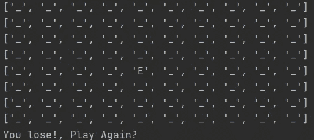
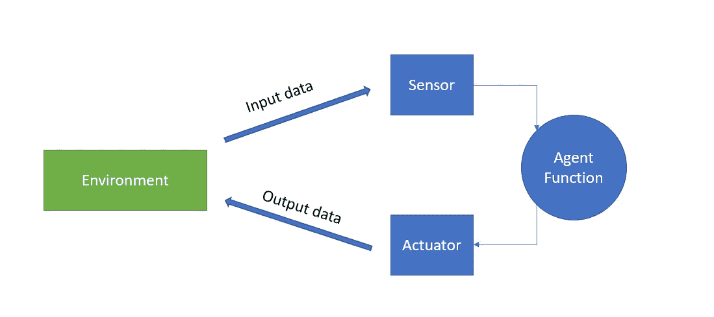
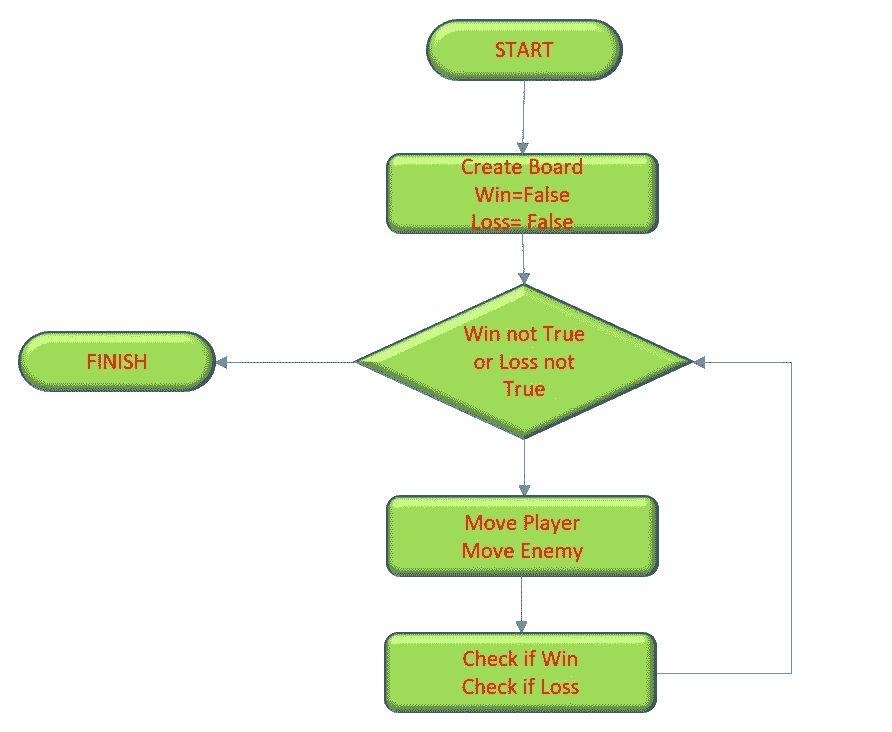

# 探员们。它们是如何工作的？

> 原文：<https://medium.com/analytics-vidhya/agents-how-do-they-work-a6192ee35b58?source=collection_archive---------21----------------------->

*敌人如何找到我们*



我已经离开了几个星期，为我能为这个博客带来的新材料做了大量的研究，并考虑如何最好地组织它们。此外，我一直在设计一项研究和项目计划，与社区分享我的人工智能、数据科学和开发者之旅，我相信。经过深思熟虑，我决定将博客分成三大类:

1.  开发:我们将在这里处理创建新软件项目的细节，这些文章将是代码密集型的，并将涉及软件项目、算法、设计模式以及开发工具和框架等主题。
2.  数据科学理论和趋势:这些文章将更多地关注数据科学、机器学习和人工智能的理论方面，并简要讨论实施以及在该学科实践中可能使用的最新工具。这些文章不会像开发文章那样代码密集，但可能会包含一些代码示例，或者可能是密集的数学。
3.  观点部分:简单的文章给出了我对特定数据科学或开发主题的看法，这将是简短扼要的，不是很详细，可能不会包含任何沉重的数学解释或代码片段。这些文章旨在展示我对一个非常具体的主题的思考。

从现在开始，这将是我的出版物的方向，当然研究和开发需要大量的时间，所以不要期望每隔一天就有一篇开发文章，但是，对于观点文章，我假装能够更经常地发表，而 de R+D 在后台进行。

人工智能最有趣的应用之一是策略游戏:敌人如何知道去哪里和打哪里？，本文通过创建一个简单的 Python 文本视频游戏来说明寻路的一个最基本的原则。

# **游戏** —过马路，躲避危险！

这个游戏的前提非常简单。我们的玩家必须在敌人追击时穿过棋盘地图。玩家每走一步，敌人就在它的位置上靠近，直到玩家设法穿过整个棋盘，在这种情况下他会赢，或者敌人抓住他，在这种情况下玩家会输。

这个游戏由三个物体组成:棋盘、玩家和敌人

在我们深入这三个对象如何相互作用的细节之前，我们需要简要地讨论一下计算机代理是如何构思的

# **代理设计要素**

一般来说，智能体是能够通过传感器感知环境并通过执行器对环境做出反应的任何东西。在计算机代理的情况下，代理可以检测诸如击键、特定数据值、文件或网络数据包之类的东西。

代理决定如何通过它的执行器用一个被称为代理函数的决策函数来行动，它把通过它的传感器感知到的任何信息作为输入。然后，代理能够对其环境进行操作。



基本代理结构

在我们的游戏中，棋盘充当环境，玩家和敌人是主要角色。其中，唯一的敌人是一个自主代理，除了玩家的移动之外，没有任何提示，它的唯一目的是在棋盘上追逐玩家。根据我们的代理定义，敌人具有以下结构:

1.  传感器:敌人可以看到玩家在棋盘上的位置，随时识别玩家的位置。
2.  功能:通过 A*寻路算法，敌人决定如何移动来追逐玩家
3.  致动器:敌人更新了它在棋盘上的位置，越来越靠近玩家

玩家也是一个代理，但不是一个自主的代理，因为玩家依赖于人类的命令才能运行。玩家还可以看到敌人的位置，它后面的人类决定如何移动，以便躲避敌人并向目标移动。

现在这一点很清楚了，让我们深入研究代码

# **程序设计**

## 类别:

**棋盘**

Board 是程序中最复杂的类，它的功能实际上分为两个独立的数据结构:

1.  为了显示棋盘，一个嵌套列表(10x10)将玩家的敌人显示为字符串元素(“P”、“E”)

```
def __init__(self, player=None, enemy=None):
self.main_board =[["_", "_", "_", "_", "_", "_", "_", "_", "_","_"],
                  ["_", "_", "_", "_", "_", "_", "_", "_", "_","_"],
                  ["_", "_", "_", "_", "_", "_", "_", "_", "_","_"],
                  ["_", "_", "_", "_", "_", "_", "_", "_", "_","_"],
                  ["_", "_", "_", "_", "_", "_", "_", "_", "_","_"],
                  ["_", "_", "_", "_", "_", "_", "_", "_", "_","_"],
                  ["_", "_", "_", "_", "_", "_", "_", "_", "_","_"],
                  ["_", "_", "_", "_", "_", "_", "_", "_", "_","_"],
                  ["_", "_", "_", "_", "_", "_", "_", "_", "_","_"],
                  ["_", "_", "_", "_", "_", "_", "_", "_", "_","_"]]
```

2.后台的图形数据结构，将电路板存储为互连节点对象的集合。该图存储每个节点的位置以及图中每个节点的邻居位置，该信息是*实现的基础

```
"""
Node Class stores node information for each node in the board
"""

class Node():
    def __init__(self, coordinates):
        self.coordinates = coordinates
        self.neighbors = []
"""
Create neighbors creates and stores the neigbhor information for all the elements in the board 
"""
    def create_neighbors(self, board_nodes):
        directions = [(1, 0), [0, 1], [-1, 0], [0, -1]]
        for direction in directions:
            neighbor_coordinates = (self.coordinates[0]+direction[0], self.coordinates[1]+direction[1])
            for j in board_nodes:
                if j.coordinates == neighbor_coordinates:
                    self.neighbors.append(j)
```

棋盘保存对玩家和敌人对象的引用，以及为每个棋盘位置创建的所有节点的列表。请注意，节点存储了节点在电路板中的坐标，因此我们只需要一个引用来获取和更新环境中代理的位置

```
self.nodes = []
self.player = player
self.enemy = enemy
```

最后，棋盘确定初始玩家和敌人的位置(玩家总是从一个固定的位置开始，敌人从一个随机的位置开始)，创建棋盘中的所有节点及其邻居连接，并显示游戏状态

```
def place_player(self):
    player_row_index = 9
    player_column_index = 5
    for i in self.nodes:
        if i.coordinates == (player_row_index, player_column_index):
            player_node = i
    player = Agent.Player(player_row_index, player_column_index, player_node)
    player.node = player_node
    self.player = player
    self.main_board[player.row][player.column] = player.tag

def place_enemy(self):
    enemy_row_index = random.randint(0, 9)
    enemy_column_index = random.randint(0, 9)
    for i in self.nodes:
        if i.coordinates == (enemy_row_index, enemy_column_index):
            enemy_node = i
    enemy = Agent.Enemy(enemy_row_index, enemy_column_index, enemy_node)
    self.main_board[enemy.row][enemy.column] = enemy.tag
    self.enemy = enemy

def create_nodes(self):
    board_height = len(self.main_board)
    board_width = len(self.main_board[0])
    for x in range(board_width):
        for y in range(board_height):
            node = Node((x, y))
            self.nodes.append(node)

def create_node_neighbors(self):
    for node in self.nodes:
        node.create_neighbors(self.nodes)

def display_board(self):
    for i in self.main_board:
        print(i)
```

**经纪人**

代理类相当简单，它只需要一个标签，将它指定为玩家(“P”)或敌人(“E”)。它还需要一个对图的节点的引用，就是这样！

```
class Agent():
    def __init__(self, row_index=None, column_index=None, tag="", node=None):
        self.position = [row_index, column_index]
        self.node = node
        self.tag = tag
```

## 游戏循环

游戏的基本操作用这个循环来概括



游戏循环

其中，最令人感兴趣的方法是移动敌人的方法。这就是 A*算法和图形实现发挥作用的地方。

我不想详细解释 A*是如何实现的，这里有一个很好的解释:

[](https://www.redblobgames.com/pathfinding/a-star/introduction.html) [## 红色斑点游戏:A*简介

### 创建于 2014 年 5 月 26 日，更新于 2014 年 8 月，2016 年 2 月，2016 年 6 月，2020 年 6 月在游戏中，我们经常想从一个…

www.redblobgames.com](https://www.redblobgames.com/pathfinding/a-star/introduction.html) 

我的实现几乎与 Red Blob Games 给出的 A*的基本形式相同，关于算法如何工作的概括解释是:

1.  从敌人的起始位置开始，遍历整个图，记录每个节点相对于敌人的位置，这样图中的所有节点都有记录到敌人位置的路径
2.  知道了玩家的位置，就从已知玩家所在的节点构造了一条路径，将它连接到敌人的位置。生成节点列表，形成连接两个位置的路径。
3.  然后敌人移动到构建的路径中的一个节点，更新他的位置以更靠近玩家。

整个过程是一个相对较短的程序，请注意队列的实现，当我们遍历图形时，它将相邻节点加入队列和从队列中取出

```
def move_enemy(board):
    player_node = board.player.node
    enemy_node = board.enemy.node
    """
    Enemy agent scans the board 
    """
    frontier = Queue.Queue()
    frontier.enqueue(enemy_node)
    came_from={}
    came_from[enemy_node] = None
    while not frontier.is_empty():
        current = frontier.dequeue()
        for nxt in current.neighbors:
            if nxt not in came_from:
                frontier.enqueue(nxt)
                came_from[nxt] = current
    """
    Enemy Agent builds the path towards the player 
    """
    current = player_node
    path = []
    while current != enemy_node:
        path.append(current)
        current = came_from[current]
    path.append(enemy_node)
    path.reverse()
    for i in path:
        print(i.coordinates)
    """
    Updates the enemy position in the board based on the constructed path towards the player
    """
    board.main_board[board.enemy.node.coordinates[0]][board.enemy.node.coordinates[1]] = "_"
    board.enemy.node = path[2]
    board.main_board[board.enemy.node.coordinates[0]][board.enemy.node.coordinates[1]] = "E"
    board.display_board()
    return board
```

# 最后的想法

我们已经看到了一个简单的代理实现，它允许计算机程序给出一些智能的假象。从这个核心逻辑出发，我希望开发一个更有趣的模拟游戏，目前我正在研究它的主要特性和结构。

路径寻找算法在很大程度上依赖于图，除了游戏，图还有许多其他应用(它们在深度学习算法中占据突出地位)，因此对这些结构以及如何使用它们的研究对于任何机器学习从业者来说也是有价值的。

您可以在这里找到这个实现的完整代码

[](https://github.com/Rhaegar2012/Cross_The_Street) [## rhaegar 2012/穿过街道

### 一个简单的面向对象的游戏，展示了游戏代理 GitHub 中 A*算法的实现，GitHub 拥有超过 5000 万…

github.com](https://github.com/Rhaegar2012/Cross_The_Street) 

特别感谢 Red Blob Games，这个网站是理解许多游戏算法及其实现的必经之路，我从钻研它的材料中获得了很多乐趣

[](https://www.redblobgames.com/) [## 红色斑点小游戏

### 嗨！我使用电脑游戏中的激励性例子，对数学和算法进行互动的可视化解释。我…

www.redblobgames.com](https://www.redblobgames.com/) 

最后，如果你想更深入地研究现代人工智能技术，可以推荐的是:

拉塞尔 s 和诺维格 P *。《人工智能，现代方法》*第三版，普伦蒂斯霍尔上马鞍河，新泽西州 2010 年