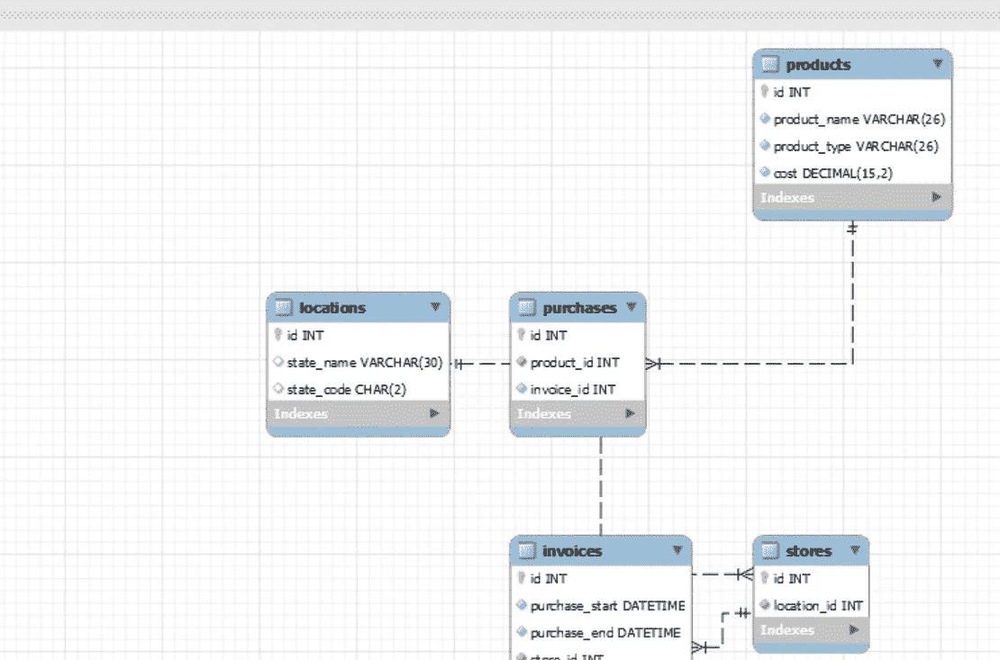

# 汇总数据，加快汇总速度

> 原文：<https://medium.com/analytics-vidhya/aggregating-data-for-quicker-summaries-6ba8fdbc146?source=collection_archive---------34----------------------->

下面是一个正在进行的练习，看看如何预汇总数据，以快速总结它。我之前使用了一个我生成的数据库，如下所示。

测试数据的实体关系图

这样做的最初目的是找到一种快速汇总购买和相关商店的销售数据的方法。我之前发布了一个类似的问题，说使用‘purchase _ start’有一些问题…